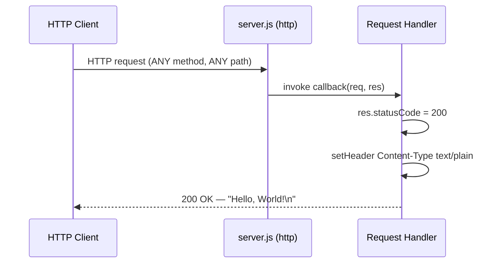
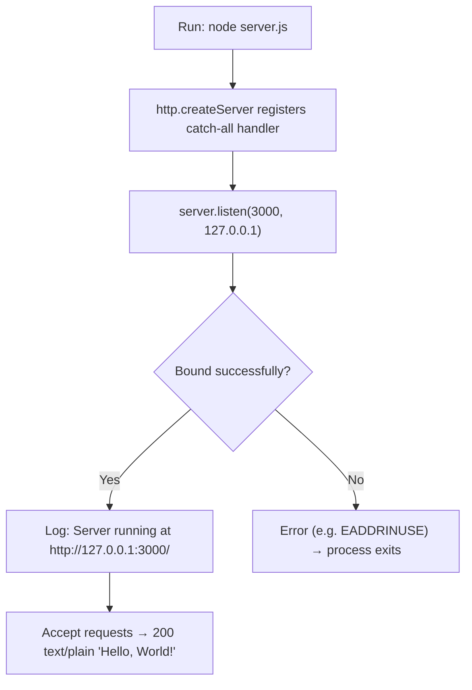

# hao-backprop-test

A minimal Node.js **"Hello, World!"** HTTP server used as a Backprop integration test fixture. It is built exclusively on the Node.js core `http` module with **zero third-party dependencies** and answers every request with an identical plain-text greeting. `Source: server.js:22, package-lock.json:6-12`

> **Repository name vs. package name.** This repository/README is named **`hao-backprop-test`**, while the npm package declared in the manifest is named **`hello_world`**. Both names refer to the same project and are reconciled here to prevent confusion. `Source: README.md:1, package.json:2`
>
> _This project is a stable Backprop test fixture. The original README carried a "Do not touch!" note, which is intentionally superseded by the explicit request to author comprehensive documentation. Nothing about the server's runtime behavior has changed — this is a documentation-only effort._

## Table of Contents

- [Overview](#overview)
- [Prerequisites](#prerequisites)
- [Installation](#installation)
- [Usage / Quick Start](#usage--quick-start)
- [API Documentation](#api-documentation)
- [Configuration](#configuration)
- [Deployment Guide](#deployment-guide)
- [Project Structure](#project-structure)
- [Troubleshooting](#troubleshooting)
- [License](#license)

## Overview

`hao-backprop-test` is a deliberately minimal, single-file **"Hello, World!"** HTTP responder that serves as a Backprop integration test fixture. Its entire implementation lives in [`server.js`](server.js) and relies solely on the Node.js built-in `http` module. `Source: server.js:22`

The server provides a single **catch-all response**: **every** HTTP method (`GET`, `POST`, `PUT`, `DELETE`, …) sent to **any** URL path receives the exact same reply — HTTP status `200`, header `Content-Type: text/plain`, and the body `Hello, World!\n`. The request handler inspects neither the HTTP method nor the URL path, so there is **no routing, no query/body parsing, no authentication, no HTTPS, and no persistence**. `Source: server.js:42-46`

The project has **zero third-party dependencies**; it requires nothing beyond a Node.js runtime. `Source: package-lock.json:6-12`

## Prerequisites

| Requirement | Recommended minimum | Verified on | Notes |
|-------------|---------------------|-------------|-------|
| Node.js | 14.x or newer | 22.23.1 | Executes `server.js` via the core `http` module. No `engines` field is pinned, so any modern release works. `Source: server.js:22` |
| npm | 7.x or newer | 11.18.0 | Package manager. `lockfileVersion: 3` is produced by npm 7 and later. `Source: package-lock.json:4` |

- **Node.js 14.x or newer** is required to run `server.js` (which uses the core `http` module). The environment was verified on **Node.js 22.23.1**. `Source: server.js:22`
- **npm 7.x or newer** is the package manager. The lockfile uses `lockfileVersion: 3`, which implies npm 7+; verified on **npm 11.18.0**. `Source: package-lock.json:4`
- **No other prerequisites** — there are no databases, environment variables, or external services to configure. `Source: package-lock.json:6-12`

## Installation

Obtain the repository, then run `npm install`:

```bash
# 1. Clone (or otherwise obtain) the repository
git clone <repository-url>
cd hao-backprop-test

# 2. Install dependencies
npm install
```

> **`npm install` installs nothing.** The manifest declares no `dependencies` or `devDependencies`, so `npm install` downloads **no packages** — it only validates (or creates) the `package-lock.json`. The server runs without any install step. `Source: package-lock.json:6-12`

## Usage / Quick Start

Start the server directly with Node.js:

```bash
node server.js
```

On a successful start it prints the following line to **stdout** and then waits for connections: `Source: server.js:56-58`

```text
Server running at http://127.0.0.1:3000/
```

In a second terminal, verify the response: `Source: server.js:42-46`

```bash
curl http://127.0.0.1:3000/
```

```text
Hello, World!
```

> **Do not use `npm start`.** No `start` script is defined, and the manifest's `main` field points to a non-existent `index.js`, so `npm start` fails. Always run `node server.js` instead — see [Troubleshooting](#troubleshooting). `Source: package.json:5`

## API Documentation

The server exposes a single, implicit **catch-all endpoint**. It does not examine the request method or URL path — every request receives an identical reply (the **catch-all response**). `Source: server.js:42-46`

### Endpoint contract

| Aspect | Value |
|--------|-------|
| Method | **ANY** (`GET`, `POST`, `PUT`, `DELETE`, …) — not inspected |
| Path | **ANY** (`/`, `/anything`, …) — not inspected |
| Request body | Ignored |
| Response status | `200 OK` |
| Response `Content-Type` | `text/plain` |
| Response body | `Hello, World!\n` (14 bytes, trailing newline) |

`Source: server.js:42-46`

### Examples

**Request — `GET /`:**

```bash
curl -i http://127.0.0.1:3000/
```

**Response** (the `Date` value varies per request):

```text
HTTP/1.1 200 OK
Content-Type: text/plain
Date: Fri, 24 Jul 2026 10:14:07 GMT
Connection: keep-alive
Keep-Alive: timeout=5
Content-Length: 14

Hello, World!
```

**Request — a different method and path (`POST /anything`)** returns the **identical** response, demonstrating the catch-all behavior: `Source: server.js:42-46`

```bash
curl -i -X POST http://127.0.0.1:3000/anything
```

```text
HTTP/1.1 200 OK
Content-Type: text/plain
Date: Fri, 24 Jul 2026 10:14:07 GMT
Connection: keep-alive
Keep-Alive: timeout=5
Content-Length: 14

Hello, World!
```

### Request/response flow



## Configuration

All runtime values are **hardcoded** as module-level constants in `server.js`. There is **no environment-variable or configuration-file support** — changing the host or port requires editing the source constants directly and restarting the process. `Source: server.js:24-25`

| Constant | Value | Source |
|----------|-------|--------|
| `hostname` | `127.0.0.1` | `server.js:24` |
| `port` | `3000` | `server.js:25` |

- The server uses **loopback binding** (`127.0.0.1`), so it is reachable only from the local machine. To change the bind address or port, edit the corresponding constant in `server.js` and restart. `Source: server.js:24-25`

## Deployment Guide

Run the server with a single command; it binds to `127.0.0.1:3000` and logs its URL once it is listening. `Source: server.js:24-25, server.js:56-58`

```bash
node server.js
```

**Loopback caveat.** The server is bound to `127.0.0.1` (loopback binding), so it is **unreachable from other machines**. Exposing it externally requires editing the `hostname` constant in the source (for example, to `0.0.0.0`) and restarting; this is a **source edit**, not a runtime setting, and is intentionally left unchanged in this repository. `Source: server.js:24`

**Process lifecycle:**

- **Start:** `node server.js`. `Source: server.js:56-58`
- **Stop:** send a terminal signal — press `Ctrl+C` (SIGINT) when running in the foreground, or send `SIGTERM` to the process.
- **Optional:** for long-running operation you may supervise the process with an external process manager (for example, `systemd` or `pm2`). This is purely operational and adds **no dependency** to the project itself. `Source: package-lock.json:6-12`



## Project Structure

The indexed project consists of the following files. `Source: server.js:1-58, package.json:1-11, package-lock.json:1-13, BaseTest.java:1-32`

| Path | Role |
|------|------|
| `server.js` | **Primary** — the minimal HTTP server; the documented subject of this README. `Source: server.js:1-58` |
| `package.json` | npm manifest: project metadata and `scripts`. `Source: package.json:1-11` |
| `package-lock.json` | Dependency lockfile confirming the zero-dependency state. `Source: package-lock.json:1-13` |
| `README.md` | This documentation. |
| `BaseTest.java` | **Secondary** — an independent Java/TestNG/Appium base class (Appium `AndroidDriver` targeting `http://127.0.0.1:4723/wd/hub`); **unrelated** to the Node HTTP server and listed here for acknowledgment only. `Source: BaseTest.java:1-32` |

> **Note:** the manifest declares `main: index.js`, but `index.js` does **not** exist on disk — the real entry point is `server.js`. `Source: package.json:5`

## Troubleshooting

| Symptom | Cause | Resolution |
|---------|-------|------------|
| `npm start` fails | There is no `start` script, and `main` points to a non-existent `index.js`. `Source: package.json:5` | Run the server directly with `node server.js`. |
| Port `3000` already in use (`EADDRINUSE`) | Another process is already bound to port 3000. `Source: server.js:25` | Stop the conflicting process, or change the `port` constant in `server.js` and restart. |
| `npm test` fails | The `test` script is an intentional placeholder that echoes an error and exits with code `1`. `Source: package.json:6-8` | Expected behavior — there is no test suite to run. |
| Not reachable from another host | The server uses loopback binding (`127.0.0.1`). `Source: server.js:24` | Edit the `hostname` constant in `server.js` (for example, to `0.0.0.0`) and restart — see [Deployment Guide](#deployment-guide). |

## License

This project is licensed under the **MIT License**. `Source: package.json:10`

There is no separate `LICENSE` file in the repository; the license is declared solely through the `license` field in `package.json`. `Source: package.json:10`
