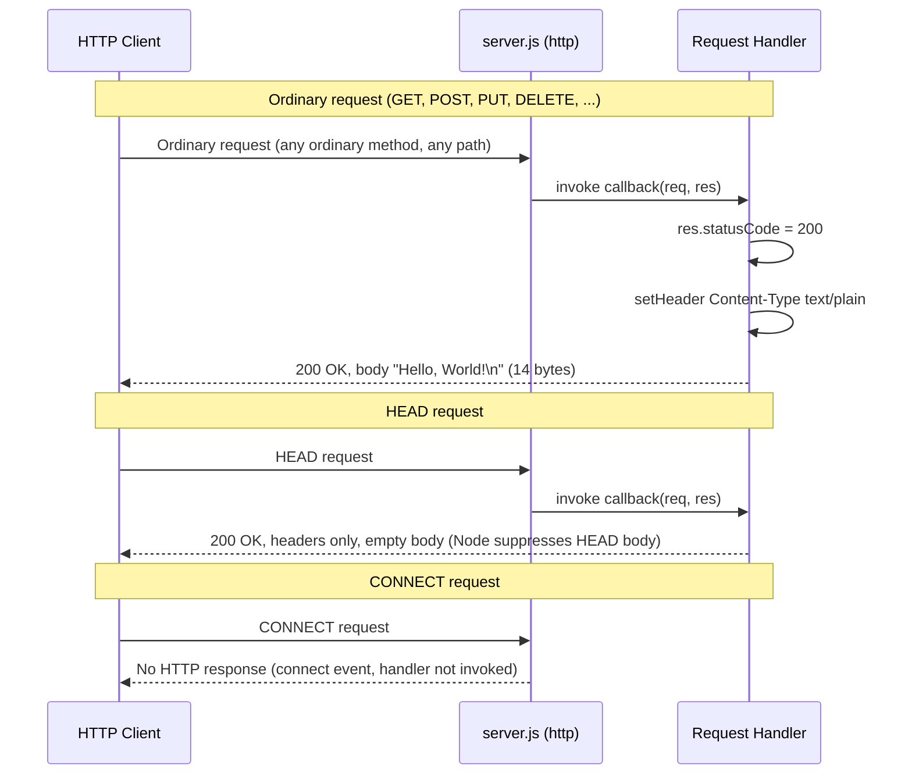
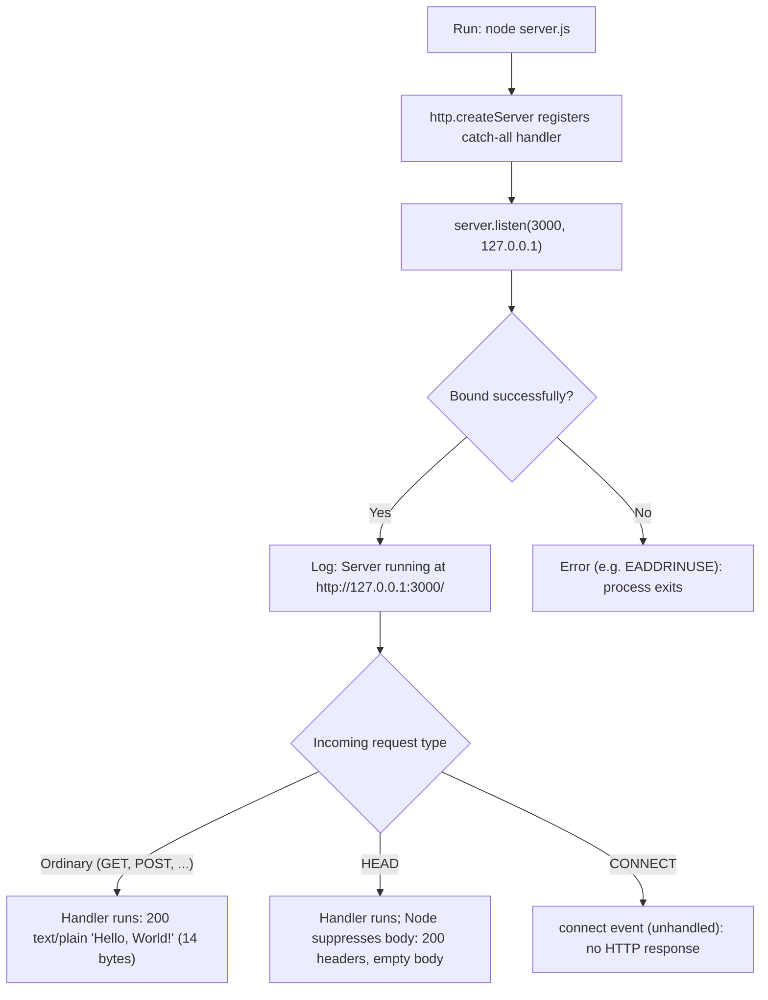

# hao-backprop-test

A minimal Node.js **"Hello, World!"** HTTP server used as a Backprop integration test fixture. It is built exclusively on the Node.js core `http` module `Source: server.js:22` with **zero third-party dependencies** `Source: package-lock.json:6-12`, and answers every **ordinary** HTTP request with an identical plain-text greeting. `Source: server.js:42-46`

> **Repository name vs. package name.** This repository/README is named **`hao-backprop-test`**, while the npm package declared in the manifest is named **`hello_world`**. Both names refer to the same project and are reconciled here to prevent confusion. `Source: README.md:1, package.json:2`
>
> _This project is a stable Backprop test fixture. The original README carried a "Do not touch!" note, which is intentionally superseded by the explicit request to author comprehensive documentation. Nothing about the server's runtime behavior has changed — this is a documentation-only effort._

## Table of Contents

- [Overview](#overview)
- [Prerequisites](#prerequisites)
- [Installation](#installation)
- [Usage / Quick Start](#usage--quick-start)
- [API Documentation](#api-documentation)
- [Configuration](#configuration)
- [Deployment Guide](#deployment-guide)
- [Project Structure](#project-structure)
- [Troubleshooting](#troubleshooting)
- [License](#license)

## Overview

`hao-backprop-test` is a deliberately minimal, single-file **"Hello, World!"** HTTP responder that serves as a Backprop integration test fixture. Its entire implementation lives in [`server.js`](server.js) and relies solely on the Node.js built-in `http` module. `Source: server.js:1-58, server.js:22, package.json:2-4, package-lock.json:6-12`

The server provides a single **catch-all response**: for every **ordinary** HTTP request (`GET`, `POST`, `PUT`, `DELETE`, … sent to any URL path) the request handler ignores both the method and the path and returns the exact same reply — HTTP status `200`, header `Content-Type: text/plain`, and the body `Hello, World!\n` (14 bytes). Because the handler inspects neither the method nor the path, there is **no routing, no query/body parsing, no authentication, no HTTPS, and no persistence**. `Source: server.js:42-46`

Two protocol-level behaviors are governed by Node.js itself and are **not** overridden by this handler:

- **`HEAD` requests** receive the same `200` status and `Content-Type: text/plain` header but an **empty body** — Node.js automatically suppresses the response body (and omits `Content-Length`) for `HEAD`. `Source: server.js:28-35` `Verified: HEAD / → 200, text/plain, empty body, no Content-Length`
- **`CONNECT` requests** never reach this handler: Node.js emits them on the server's `connect` event, which this server does not handle, so a raw `CONNECT` receives **no HTTP response** and the connection is closed. `Source: server.js:28-35` `Verified: raw CONNECT → 0 response bytes, connection closed`

The project has **zero third-party dependencies**; it requires nothing beyond a Node.js runtime. `Source: package-lock.json:6-12`

### Project metadata

The following facts are declared in the npm manifest (`package.json`) and confirmed by the lockfile (`package-lock.json`):

| Field | Value |
|-------|-------|
| Package name | `hello_world` `Source: package.json:2` |
| Repository name | `hao-backprop-test` `Source: README.md:1` |
| Version | `1.0.0` `Source: package.json:3` |
| Description | "Hello world in Node.js" `Source: package.json:4` |
| Author | `hxu` `Source: package.json:9` |
| Declared entry point (`main`) | `index.js` — absent on disk; the real entry point is `server.js` `Source: package.json:5` |
| License | MIT `Source: package.json:10` |
| Dependencies | None (zero third-party) `Source: package-lock.json:6-12` |

## Prerequisites

| Requirement | Recommended | Verified on | Notes |
|-------------|-------------|-------------|-------|
| Node.js | Any actively maintained release | v22.23.1 | Runs `server.js`, which uses only the core `http` module. The manifest declares no `engines` field, so the project enforces no version floor. `Source: server.js:22, package.json:1-11` `Verified: node --version → v22.23.1` |
| npm | Any npm bundled with a supported Node.js | 10.9.8 | Package manager for the setup commands. The lockfile is `lockfileVersion: 3`. `Source: package-lock.json:4` `Verified: npm --version → 10.9.8` |

- **Node.js** — the server uses only the built-in `http` module, and `package.json` declares no `engines` field, so no minimum version is enforced by the project. Any actively maintained Node.js release is suitable; this environment was verified on **Node.js v22.23.1**. `Source: server.js:22, package.json:1-11` `Verified: node --version → v22.23.1`
- **npm** — npm is the package manager used for the setup commands below. The lockfile uses `lockfileVersion: 3`, which is the format **generated by npm 9 and later** and is **read-compatible with npm 7+** (per npm's `package-lock.json` documentation); this environment was verified on **npm 10.9.8**. `Source: package-lock.json:4` `Verified: npm --version → 10.9.8`
- **No other prerequisites** — there are no databases, environment variables, or external services to configure. The server reads no environment variables (its host and port are hardcoded constants) and imports only the Node.js core `http` module, so nothing external needs provisioning. `Source: server.js:22, server.js:24-25, package-lock.json:6-12`

## Installation

Obtain the repository, then run `npm install`:

```bash
# 1. Clone the repository (or otherwise obtain the project files)
git clone https://github.com/Sandeep01Kumar/existing-projects-qa-test-02-dec.git
cd existing-projects-qa-test-02-dec

# 2. Install dependencies
npm install
```

> **`npm install` installs nothing.** The manifest declares no `dependencies` or `devDependencies`, so `npm install` downloads **no packages** — it only validates (or creates) the `package-lock.json`. The server runs without any install step. `Source: package.json:1-11, package-lock.json:6-12` `Verified: npm install → "up to date", exit 0, no node_modules created`

## Usage / Quick Start

Start the server directly with Node.js:

```bash
node server.js
```

On a successful start it prints the following line to **stdout** and then waits for connections: `Source: server.js:56-58`

```text
Server running at http://127.0.0.1:3000/
```

In a second terminal, verify the response: `Source: server.js:42-46`

```bash
curl http://127.0.0.1:3000/
```

```text
Hello, World!
```

> **`npm start` also works.** No explicit `start` script is defined (the `scripts` block declares only `test`), so npm falls back to its built-in default and runs `node server.js` — printing the same startup line and serving the same response. What does **not** work is running the declared entry point directly: the manifest's `main` field points to `index.js`, which is **absent** from the repository, so `node index.js` (or any consumer that resolves the package's `main`) fails with `MODULE_NOT_FOUND`. See [Troubleshooting](#troubleshooting). `Source: package.json:5-8` `Verified: npm start → runs "node server.js" (no explicit start script); node index.js → MODULE_NOT_FOUND (no index.js on disk)`

## API Documentation

The server exposes a single, implicit **catch-all endpoint**. For every **ordinary** request it does not examine the HTTP method or URL path — the request handler returns an identical reply (the **catch-all response**). Two lower-level protocols (`HEAD` and `CONNECT`) are handled specially by Node.js itself, as noted below the table. `Source: server.js:42-46`

### Endpoint contract

The following contract applies to **ordinary requests** — `GET`, `POST`, `PUT`, `DELETE`, and any other method that carries a normal request/response body:

| Aspect | Value |
|--------|-------|
| Method | Any ordinary method (`GET`, `POST`, `PUT`, `DELETE`, …) — not inspected |
| Path | **ANY** (`/`, `/anything`, …) — not inspected |
| Request body | Ignored |
| Response status | `200 OK` |
| Response `Content-Type` | `text/plain` |
| Response body | `Hello, World!\n` (14 bytes, trailing newline) |

`Source: server.js:42-46`

#### Protocol-level exceptions

Two behaviors are governed by Node.js core and are **not** produced by the request handler:

| Request type | Behavior |
|--------------|----------|
| `HEAD` | Same `200` status and `Content-Type: text/plain` header, but an **empty body** and **no `Content-Length`** — Node.js suppresses the body for `HEAD`. `Verified: HEAD / → 200, text/plain, empty body` |
| `CONNECT` | Emitted on the server's `connect` event, which is not handled, so the request **never reaches the handler** and receives **no HTTP response** (the connection is closed). `Verified: raw CONNECT → 0 response bytes` |

`Source: server.js:28-35`

### Examples

**Request — `GET /`:**

```bash
curl -i http://127.0.0.1:3000/
```

**Response** (the `Date` value varies per request):

```text
HTTP/1.1 200 OK
Content-Type: text/plain
Date: Fri, 24 Jul 2026 10:14:07 GMT
Connection: keep-alive
Keep-Alive: timeout=5
Content-Length: 14

Hello, World!
```

**Request — a different ordinary method and path (`POST /anything`)** returns the **identical** response, demonstrating the catch-all behavior for ordinary requests: `Source: server.js:42-46`

```bash
curl -i -X POST http://127.0.0.1:3000/anything
```

```text
HTTP/1.1 200 OK
Content-Type: text/plain
Date: Fri, 24 Jul 2026 10:14:07 GMT
Connection: keep-alive
Keep-Alive: timeout=5
Content-Length: 14

Hello, World!
```

### Request/response flow



## Configuration

All runtime values are **hardcoded** as module-level constants in `server.js`. There is **no environment-variable or configuration-file support** — changing the host or port requires editing the source constants directly and restarting the process. `Source: server.js:24-25`

| Constant | Value | Source |
|----------|-------|--------|
| `hostname` | `127.0.0.1` | `server.js:24` |
| `port` | `3000` | `server.js:25` |

- The server uses **loopback binding** (`127.0.0.1`), so it is reachable only from the local machine. To change the bind address or port, edit the corresponding constant in `server.js` and restart. `Source: server.js:24-25`

## Deployment Guide

Run the server with a single command; it binds to `127.0.0.1:3000` and logs its URL once it is listening. `Source: server.js:24-25, server.js:56-58`

```bash
node server.js
```

**Loopback caveat.** The server is bound to `127.0.0.1` (loopback binding), so it is **unreachable from other machines**. Exposing it externally requires editing the `hostname` constant in the source (for example, to `0.0.0.0`) and restarting; this is a **source edit**, not a runtime setting, and is intentionally left unchanged in this repository. `Source: server.js:24`

**Process lifecycle:**

- **Start:** `node server.js`. `Source: server.js:56-58`
- **Stop:** the process runs in the foreground and installs no custom signal handlers, so it is stopped with standard operating-system process control — press `Ctrl+C` (which delivers `SIGINT`) in the foreground terminal, or send `SIGTERM` to the process. `Source: server.js:1-58`
- **Optional:** for long-running operation you may supervise the process with an external process manager (for example, `systemd` or `pm2`). Using such a tool is a purely operational, external choice; it adds **no dependency** to this project, which remains dependency-free. `Source: package-lock.json:6-12`



## Project Structure

The documentation-relevant project files are listed below. Other files tracked in the repository's working tree (binary artifacts) are outside this README's documentation scope. `Source: server.js:1-58, package.json:1-11, package-lock.json:1-13, BaseTest.java:1-32` `Verified: git ls-files → 8 tracked paths (5 documentation-relevant, listed below; 3 binary artifacts out of documentation scope)`

| Path | Role |
|------|------|
| `server.js` | **Primary** — the minimal HTTP server; the documented subject of this README. `Source: server.js:1-58` |
| `package.json` | npm manifest: project metadata and `scripts`. `Source: package.json:1-11` |
| `package-lock.json` | Dependency lockfile confirming the zero-dependency state. `Source: package-lock.json:1-13` |
| `README.md` | This documentation. |
| `BaseTest.java` | **Secondary** — an independent Java/TestNG/Appium base class (Appium `AndroidDriver` targeting `http://127.0.0.1:4723/wd/hub`); **unrelated** to the Node HTTP server and listed here for acknowledgment only. `Source: BaseTest.java:1-32` |

> **Note:** the manifest declares `main: index.js` `Source: package.json:5`, but `index.js` does **not** exist on disk — the real entry point is `server.js`. `Verified: filesystem — no index.js present; node index.js → MODULE_NOT_FOUND`

## Troubleshooting

| Symptom | Cause | Resolution |
|---------|-------|------------|
| `node index.js` fails with `MODULE_NOT_FOUND` | The manifest's `main` is `index.js`, but that file is absent; the real entry point is `server.js`. `Source: package.json:5` `Verified: filesystem — no index.js; node index.js → MODULE_NOT_FOUND` | Run the server with `node server.js` — or `npm start`, which (having no explicit `start` script) falls back to `node server.js`. |
| Port `3000` already in use (`EADDRINUSE`) | Another process is already bound to port 3000. `Source: server.js:25` | Stop the conflicting process, or change the `port` constant in `server.js` and restart. |
| `npm test` fails | The `test` script is an intentional placeholder that echoes an error and exits with code `1`. `Source: package.json:6-8` `Verified: npm test → exit 1, "Error: no test specified"` | Expected behavior — there is no test suite to run. |
| Not reachable from another host | The server uses loopback binding (`127.0.0.1`). `Source: server.js:24` | Edit the `hostname` constant in `server.js` (for example, to `0.0.0.0`) and restart — see [Deployment Guide](#deployment-guide). |

## License

This project is licensed under the **MIT License**. `Source: package.json:10`

There is no separate `LICENSE` file in the repository; the license is declared solely through the `license` field in `package.json`. `Source: package.json:10` `Verified: filesystem — no LICENSE file present`
