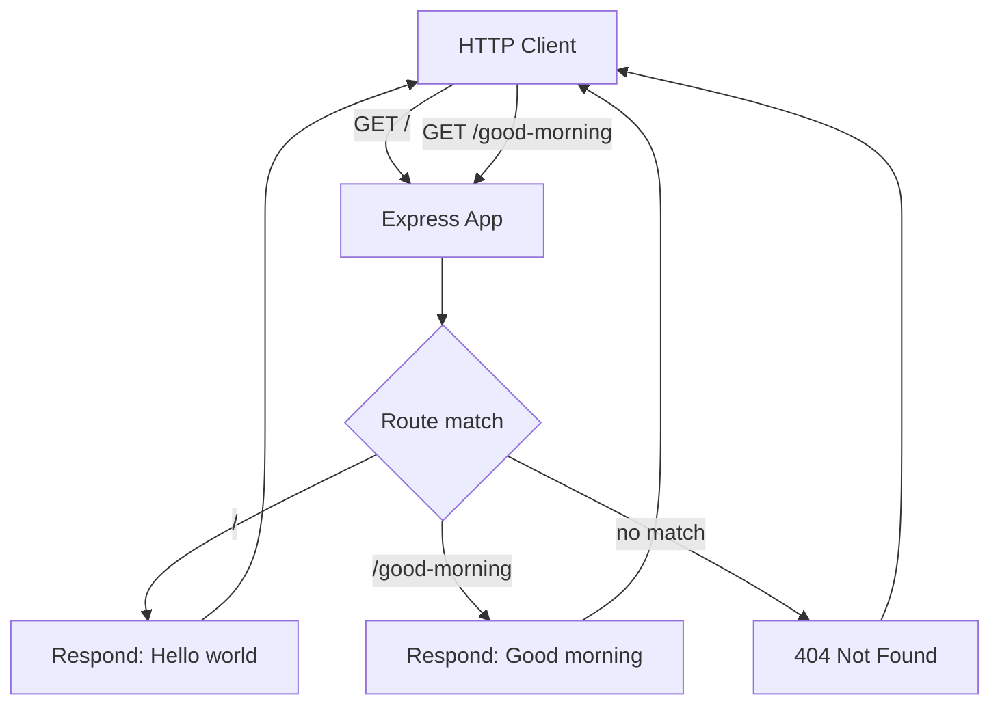

# hello_world

A minimal Node.js tutorial server built with the [Express](https://expressjs.com/) web framework. It exposes two plain-text `GET` endpoints — `GET /` returns `Hello world` and `GET /good-morning` returns `Good morning` — served from the base URL `http://127.0.0.1:3000`. This README is the single, end-to-end guide for the tutorial: install the dependencies, start the server, and call each endpoint. (`Source: server.js:L34-L36`, `Source: server.js:L47-L49`)

> **Project name:** this project is named **`hello_world`**, matching the `"name"` field in `package.json` (`Source: package.json:L2`). An earlier stub titled the repository `hao-backprop-test`; **`hello_world` is the canonical name** used consistently throughout this document.

## Table of Contents

- [Prerequisites](#prerequisites)
- [Installation](#installation)
- [Running the Server](#running-the-server)
- [Endpoints](#endpoints)
- [Examples](#examples)
- [Architecture](#architecture)
- [Project Structure](#project-structure)

## Prerequisites

- **Node.js** — any modern LTS release. The reference environment used **Node v22.x**. No specific version is pinned by the project: there is no `engines` field in `package.json` (`Source: package.json:L1-L15`) and no `.nvmrc`, so any current Node LTS runs this CommonJS code.
- **npm** — installed alongside Node.js. It is used to install dependencies and to run the `start` script (`Source: package.json:L7`).

## Installation

From the repository root, install the project's dependencies:

```bash
npm install
```

This installs **Express 5.2.1**, declared as `"express": "^5.2.1"` in `package.json` (`Source: package.json:L12-L14`), and regenerates `package-lock.json` so that Express and its transitive dependencies are captured for reproducible installs (`Source: package-lock.json:L4`, `Source: package-lock.json:L243-L244`).

## Running the Server

Start the server with either of the following equivalent commands. The `npm start` script simply runs `node server.js` (`Source: package.json:L7`):

```bash
node server.js
```

```bash
npm start
```

The server binds to host `127.0.0.1` (`Source: server.js:L22`) and listens on port `3000` (`Source: server.js:L23`), so its base URL is **`http://127.0.0.1:3000`**. Once it is listening, it logs the following line (`Source: server.js:L64`):

```text
Server running at http://127.0.0.1:3000/
```

## Endpoints

The Express app registers two `GET` routes. Each handler sets the response content type to plain text via `res.type('text/plain')` (`Source: server.js:L35`, `Source: server.js:L48`). The endpoint table below lists this media type as `text/plain`; on the wire, Express appends a charset, so the actual HTTP `Content-Type` header is `text/plain; charset=utf-8`.

| Method | Path | Status | Content-Type | Response body |
| ------ | ------------- | ------ | ------------ | ------------- |
| `GET` | `/` | `200` | `text/plain` | `Hello world` |
| `GET` | `/good-morning` | `200` | `text/plain` | `Good morning` |

Route definitions: `GET /` is handled at `Source: server.js:L34-L36` and `GET /good-morning` at `Source: server.js:L47-L49`.

> **Unmatched paths:** any request whose path does not match `/` or `/good-morning` returns `404 Not Found` from Express's built-in default handler (`Source: server.js:L13-L14`, `Source: server.js:L34-L49`).
>
> **Precision note:** the documented response body for `GET /` is `Hello world`, matching the wording used throughout this tutorial. For historical accuracy, the original, pre-Express implementation used Node's built-in `http` module and returned the literal `'Hello, World!\n'` — with a comma, an exclamation mark, and a trailing newline — for *every* request (`Source: commit 9328b9f, server.js:L9`, before the Express migration). The current Express version returns the exact body `Hello world` (`Source: server.js:L35`).

## Examples

With the server running (via `node server.js` or `npm start`), call each endpoint at the base URL `http://127.0.0.1:3000` (`Source: server.js:L22-L23`) using `curl`.

`GET /` returns `Hello world` (`Source: server.js:L34-L36`):

```bash
curl http://127.0.0.1:3000/
```

Expected output:

```text
Hello world
```

`GET /good-morning` returns `Good morning` (`Source: server.js:L47-L49`):

```bash
curl http://127.0.0.1:3000/good-morning
```

Expected output:

```text
Good morning
```

## Architecture

Every request first reaches the Express application, which matches the request path against its registered routes and dispatches to the corresponding handler. Requests that match no route fall through to Express's built-in `404` handler (`Source: server.js:L34-L36`, `Source: server.js:L47-L49`, `Source: server.js:L13-L14`).



## Project Structure

```text
.
├── server.js           # Express app: GET / -> "Hello world", GET /good-morning -> "Good morning"
├── package.json        # Project metadata, the "start" script, and the express dependency
├── package-lock.json   # Locked dependency tree (regenerated by `npm install`)
└── README.md           # This tutorial
```

- **`server.js`** is the application's entry point. The `"main"` field in `package.json` now points to `server.js` (`Source: package.json:L5`); it previously pointed to `index.js`, a file that never existed in this repository, so the value was corrected to reference the real entry point.
- **`package.json`** declares the project metadata, the `start` script (`Source: package.json:L7`), and the single runtime dependency, `express` (`Source: package.json:L12-L14`).
- **`package-lock.json`** records the exact resolved dependency tree (`Source: package-lock.json:L4`, `Source: package-lock.json:L243-L244`) and is regenerated by `npm install`.
