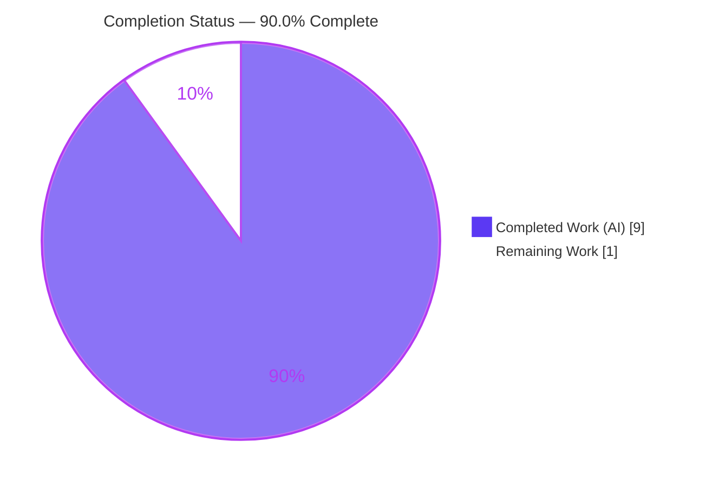
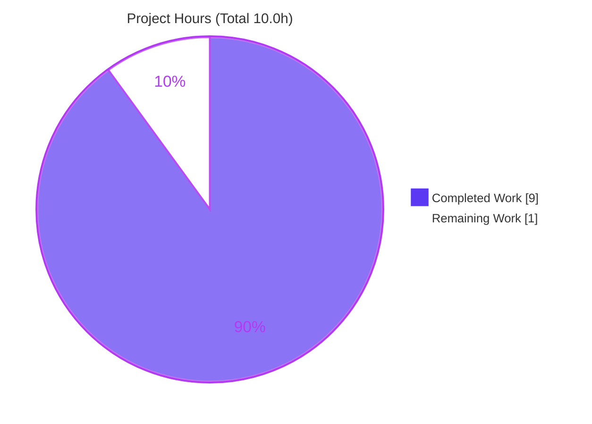

# Blitzy Project Guide — hao-backprop-test: Express.js Migration & `/good-evening` Endpoint

> **Branch:** `blitzy-cc873798-654c-482c-86e7-8ea74af98a90` · **HEAD:** `33747f3` · **Runtime:** Node.js v20.20.2 / npm 11.1.0
> **Color Legend:** ⬛ Completed / AI Work = Dark Blue `#5B39F3` · ⬜ Remaining = White `#FFFFFF` · Accents = Violet-Black `#B23AF2` · Highlight = Mint `#A8FDD9`

---

## 1. Executive Summary

### 1.1 Project Overview

The `hao-backprop-test` fixture is a minimal Node.js tutorial HTTP server (npm package `hello_world`). This project migrates it from Node's native `http` module to the **Express.js** web framework and adds a second endpoint. `GET /` preserves the original `Hello, World!` response; a new `GET /good-evening` returns `Good evening`. Target users are developers using this fixture for backprop integration testing. Business impact is low (a test fixture), but the change introduces the project's **first-ever external dependency** (`express ^5.2.1`). Technical scope is four in-scope files — `server.js`, `package.json`, `package-lock.json`, `README.md`. The server remains localhost-only (`127.0.0.1:3000`), plain-text, with no database or external integrations.

### 1.2 Completion Status



| Metric | Hours |
| --- | --- |
| **Total Hours** | **10.0** |
| Completed Hours (AI + Manual) | 9.0 (AI 9.0 + Manual 0.0) |
| Remaining Hours | 1.0 |
| **Percent Complete** | **90.0%** |

> **Calculation (PA1, AAP-scoped):** `Completion % = Completed ÷ (Completed + Remaining) × 100 = 9.0 ÷ 10.0 × 100 = 90.0%`. All AAP feature requirements are 100% delivered and validated; the 10% gap is exclusively path-to-production human governance and optional hardening (never claim 100% before human review).

### 1.3 Key Accomplishments

- ✅ **Express.js introduced** — `express ^5.2.1` declared, installed, and pinned (project's first external dependency).
- ✅ **`server.js` migrated** from `http.createServer` to an Express app (`const app = express()`), preserving host `127.0.0.1`, port `3000`, and the verbatim startup log.
- ✅ **`GET /` preserved** — returns byte-exact `Hello, World!\n` (`text/plain`, 200).
- ✅ **`GET /good-evening` added** — returns byte-exact `Good evening\n` (`text/plain`, 200).
- ✅ **User rule "Sk-29-Rule" satisfied** — every executable line of `server.js` (7/7) carries a comment.
- ✅ **`package-lock.json` regenerated** — lockfileVersion 3, 68 entries pinning the full Express tree.
- ✅ **`README.md` updated** — endpoints table, dependency, Node ≥18 requirement, and run/usage steps.
- ✅ **Optional fix applied** — corrected `package.json` `main` from the non-existent `index.js` to `server.js`.
- ✅ **Validated end-to-end & 0 vulnerabilities** — `npm install`, `node --check`, and runtime `curl` of both endpoints independently reproduced.

### 1.4 Critical Unresolved Issues

| Issue | Impact | Owner | ETA |
| --- | --- | --- | --- |
| _None._ No compilation, dependency, or runtime errors exist in any in-scope file. | — | — | — |

> There are **no critical unresolved issues**. All five autonomous production-readiness gates passed and were independently corroborated on disk.

### 1.5 Access Issues

| System/Resource | Type of Access | Issue Description | Resolution Status | Owner |
| --- | --- | --- | --- | --- |
| — | — | **No access issues identified.** Repository, git history, npm registry cache, and runtime were all fully accessible; `npm install` succeeded offline against the pinned lockfile. | N/A | — |

### 1.6 Recommended Next Steps

1. **[High]** Code-review the Express migration diff and approve/merge the PR into the target branch (includes a quick local smoke test).
2. **[Low]** _(Optional hygiene)_ Add a `.gitignore` entry for `node_modules/` to prevent accidental commits of the dependency tree.
3. **[Low]** _(Optional, future)_ Consider a minimal endpoint test (e.g., `supertest`) if this fixture graduates beyond tutorial use — currently out of AAP scope.

---

## 2. Project Hours Breakdown

### 2.1 Completed Work Detail

| Component | Hours | Description |
| --- | --- | --- |
| `server.js` — Express migration & dual-route implementation | 3.0 | Replace native `http` with Express app; `GET /` (FR-3) and `GET /good-evening` (FR-4); path-scoped routing (IR-2); exact `text/plain` + trailing `\n` fidelity via `res.type()` (IR-3); preserve host/port/startup log (FR-2). |
| Sk-29-Rule — per-line comment compliance | 0.5 | Author an explanatory comment on every executable line of `server.js` (7/7 verified). |
| `package.json` — dependency declaration + `main` fix | 1.0 | Add `dependencies.express ^5.2.1` (FR-1); correct `main` `index.js`→`server.js`; preserve all other fields. |
| `package-lock.json` — regeneration & pinning | 1.0 | `npm install` regenerated lockfile (lockfileVersion 3, 68 entries) deterministically pinning the Express tree (IR-1). |
| Express version research & compatibility validation | 1.0 | Confirm `express@5.2.1` (`latest`), MIT license, `engines.node >= 18`; validate approach against target runtime (web-search requirement). |
| `README.md` — documentation rewrite | 1.0 | Endpoints table, dependency, Node ≥18 requirement, install/run/usage steps; supersede obsolete "zero-dependency / Do not touch!" note (IR-4). |
| End-to-end validation & runtime verification | 1.0 | Five production-readiness gates: install, compile, tests, runtime (byte-exact `curl` of both endpoints + 404), zero-error sweep. |
| Scope discipline & rework | 0.5 | Add-then-revert of out-of-scope `.gitignore` and premature lockfile; proper lockfile regeneration (commits `4b5dee3`, `2dd09d7`). |
| **Total Completed** | **9.0** | **Matches Section 1.2 Completed Hours.** |

### 2.2 Remaining Work Detail

| Category | Hours | Priority |
| --- | --- | --- |
| Human code review + PR approval/merge (incl. local smoke test) | 0.5 | High |
| _(Optional)_ Add `.gitignore` for `node_modules/` (production hygiene) | 0.5 | Low |
| **Total Remaining** | **1.0** | **Matches Section 1.2 Remaining Hours & Section 7 pie.** |

> **Note:** No AAP feature work remains — FR-1..FR-4, IR-1..IR-4, and Sk-29-Rule are all complete. The remaining 1.0h is purely path-to-production (human governance + optional hardening). There are **no** blocking fixes, configuration, integration, or in-scope deployment tasks.

---

## 3. Test Results

All results below originate from Blitzy's autonomous validation logs and were **independently reproduced** during this assessment.

| Test Category | Framework | Total Tests | Passed | Failed | Coverage % | Notes |
| --- | --- | --- | --- | --- | --- | --- |
| Automated Unit / Integration / E2E | None | 0 | 0 | 0 | N/A | No test framework present. AAP §0.2.3 & §0.5.2 place automated tests **out of scope**. `npm test` is the npm-init placeholder (`echo "Error: no test specified" && exit 1`) — its exit 1 is designed behavior, not a failure. |
| Runtime Behavioral Validation | `node` + `curl` (autonomous gate) | 3 | 3 | 0 | N/A | `GET /` → 200 byte-exact `Hello, World!\n`; `GET /good-evening` → 200 byte-exact `Good evening\n`; `GET /nonexistent` → 404. |
| Syntax / Compilation | `node --check` | 1 | 1 | 0 | N/A | `node --check server.js` → exit 0; `package.json` & `package-lock.json` valid JSON. |
| Dependency Audit | `npm audit` | 1 | 1 | 0 | N/A | `found 0 vulnerabilities` across the 68-package tree. |

> **Integrity note:** The in-scope automated test count is **0 by AAP design**; the 100% pass criterion is vacuously satisfied. Correctness was instead confirmed via autonomous runtime, compilation, and audit checks (rows above).

---

## 4. Runtime Validation & UI Verification

**UI Verification:** Not applicable — this is a backend HTTP server returning `text/plain`. There is no frontend, rendered UI, or design system.

**Runtime Health (independently reproduced on Node v20.20.2):**

- ✅ **Server startup** — `node server.js` logs exactly `Server running at http://127.0.0.1:3000/`; binds `127.0.0.1:3000`.
- ✅ **`GET /`** — HTTP 200 · `Content-Type: text/plain; charset=utf-8` · `X-Powered-By: Express` · `Content-Length: 14` · body byte-exact `Hello, World!\n` (verified via `od -c`).
- ✅ **`GET /good-evening`** — HTTP 200 · `Content-Type: text/plain; charset=utf-8` · `Content-Length: 13` · body byte-exact `Good evening\n`.
- ✅ **`GET /nonexistent`** — HTTP 404 (Express default handler; sane behavior).
- ✅ **Dependency resolution** — `require('express')` resolves; `express@5.2.1` installed; `npm ls express` clean.
- ✅ **Clean lifecycle** — server started/stopped via exact PID; port 3000 released; no leftover processes.

**API Integration Outcomes:** No external APIs, databases, caches, or credentials are involved — nothing to integrate or misconfigure. ✅ Operational.

---

## 5. Compliance & Quality Review

| AAP Deliverable / Benchmark | Requirement | Status | Progress |
| --- | --- | --- | --- |
| FR-1 — Add Express.js | `express ^5.2.1` declared, installed, pinned | ✅ Pass | 100% |
| FR-2 — Serve via Express | `const app = express()`; host/port preserved | ✅ Pass | 100% |
| FR-3 — Preserve `GET /` | Byte-exact `Hello, World!\n`, `text/plain`, 200 | ✅ Pass | 100% |
| FR-4 — Add `GET /good-evening` | Byte-exact `Good evening\n`, `text/plain`, 200 | ✅ Pass | 100% |
| IR-1 — Regenerate lockfile | lockfileVersion 3, 68 entries | ✅ Pass | 100% |
| IR-2 — Path-scoped routing | Two `app.get` routes replace catch-all | ✅ Pass | 100% |
| IR-3 — Response fidelity | Trailing `\n` + explicit `text/plain` | ✅ Pass | 100% |
| IR-4 — README update | Endpoints, dependency, run steps documented | ✅ Pass | 100% |
| Sk-29-Rule — comment per line | 7/7 executable lines of `server.js` commented | ✅ Pass | 100% |
| Constraint — network binding | `127.0.0.1:3000` + startup log preserved | ✅ Pass | 100% |
| Optional — `main` field fix | `index.js` → `server.js` | ✅ Pass | 100% |
| Scope control — out-of-scope files | `BaseTest.java` + 3 binaries untouched | ✅ Pass | 100% |
| Dependency security | `npm audit` → 0 vulnerabilities | ✅ Pass | 100% |
| Governance sign-off | Human PR review & merge | ⬜ Pending | 0% |

**Fixes applied during autonomous validation:** The feature was already correctly implemented by prior agents; validation confirmed correctness with **no code fixes required**. The only cleanup was removal of a stray untracked artifact (`final_server.log`). An out-of-scope `.gitignore` introduced in `43368ad` was intentionally reverted in `4b5dee3` to preserve AAP scope.

**Outstanding compliance items:** Human governance sign-off only (see Section 2.2 / Section 1.6).

---

## 6. Risk Assessment

Overall risk posture: **LOW** across all categories (localhost-only, no data/secrets, no external integrations, 0 audited vulnerabilities).

| Risk | Category | Severity | Probability | Mitigation | Status |
| --- | --- | --- | --- | --- | --- |
| R1 — No automated test suite (future-regression risk) | Technical | Low | Low–Medium | Runtime validated end-to-end; automated tests explicitly out of AAP scope | Accepted (by design) |
| R2 — Express 5.x major-version semantics vs v4 | Technical | Low | Low | Validated on Node 20; trivial two-route surface unaffected | Mitigated |
| R3 — No auth/TLS (plain HTTP) | Security | Low | Low | Localhost-only `127.0.0.1` binding preserved; no secrets/data | Accepted (by design) |
| R4 — `X-Powered-By: Express` header disclosure | Security | Low | Low | Optional `app.disable('x-powered-by')`; out of scope | Noted |
| R5 — Supply chain (67 transitive deps introduced) | Security | Low–Medium | Low | `npm audit` = 0 vulnerabilities; lockfile pinned; recommend periodic audits | Mitigated |
| R6 — No process manager / health check / restart policy | Operational | Low | Low | Acceptable for tutorial fixture; out of scope | Accepted |
| R7 — `node_modules/` untracked without `.gitignore` | Operational | Low | Low | Add `.gitignore` (Section 2.2 remaining) | Open (Low) |
| R8 — Runtime parity (validated Node v20.20.2; AAP cited v22.23.1) | Integration | Low | Low | `express` `engines.node >= 18`; README documents Node ≥18 | Mitigated |
| R9 — No external service integrations | Integration | None | — | Nothing to integrate (no DB/cache/API/creds) | N/A |

---

## 7. Visual Project Status

**Project Hours Breakdown**



**Remaining Hours by Priority (from Section 2.2)**

| Priority | Category | Hours |
| --- | --- | --- |
| High | Human code review + PR approval/merge | 0.5 |
| Low | Optional `.gitignore` hygiene | 0.5 |
| **Total** | | **1.0** |

> **Integrity check:** "Remaining Work" = **1.0h** in the pie chart equals Section 1.2 Remaining Hours (1.0h) and the Section 2.2 Hours total (1.0h). "Completed Work" = **9.0h** equals Section 1.2 Completed Hours and Section 2.1 total.

---

## 8. Summary & Recommendations

**Achievements.** The Express.js migration is **complete and validated**. All AAP feature requirements (FR-1..FR-4), implicit requirements (IR-1..IR-4), the user's "Sk-29-Rule" comment mandate, and the optional `main`-field fix are delivered. The server preserves its original contract (`127.0.0.1:3000`, verbatim startup log, byte-exact `Hello, World!\n`) and adds the new `GET /good-evening` → `Good evening\n` route. Dependency install reports **0 vulnerabilities**.

**Remaining gaps.** Only **1.0 hour** of path-to-production work remains: a High-priority human PR review/merge (the sole unavoidable governance gate) and an optional Low-priority `.gitignore` for `node_modules/`. No AAP feature work, blocking fixes, configuration, or integration tasks remain.

**Critical path to production.** Review the four-file diff → run the smoke test (`npm install`, `node server.js`, `curl` both endpoints) → merge. Estimated developer effort: **~0.5h**.

**Success metrics (all met):** both endpoints return byte-exact bodies with `text/plain`; startup log preserved; `node --check` exit 0; `npm audit` 0 vulnerabilities; out-of-scope files untouched; working tree clean (except reconstructible `node_modules/`).

**Production readiness assessment.** **90.0% complete.** The AAP feature is production-ready as a localhost tutorial fixture; the residual 10% reflects standard human governance and optional hardening rather than any functional deficiency. **Confidence: High** — scope is small, fully enumerable, and independently verified.

| Metric | Value |
| --- | --- |
| Total Hours | 10.0 |
| Completed (AI) | 9.0 |
| Remaining | 1.0 |
| Completion | 90.0% |
| Overall Risk | Low |
| Confidence | High |

---

## 9. Development Guide

Every command below was executed and verified during this assessment on Node.js **v20.20.2** / npm **11.1.0**. Run all commands from the repository root.

### 9.1 System Prerequisites

- **Node.js `>= 18`** (validated on v20.20.2) — required by `express@5`.
- **npm** (validated on 11.1.0) — bundled with Node.
- **OS:** any (Linux/macOS/Windows). **Hardware:** negligible (single-process, in-memory server).
- **curl** (optional) — for endpoint verification.

```bash
node --version   # -> v20.20.2 (any >= v18 works)
npm --version    # -> 11.1.0
```

### 9.2 Environment Setup

No environment variables, config files, or external services are required. Host (`127.0.0.1`) and port (`3000`) are hardcoded by design. Simply obtain the repository and change into its root directory.

### 9.3 Dependency Installation

```bash
npm install
```

Expected output (tail):

```text
25 packages are looking for funding
  run `npm fund` for details

found 0 vulnerabilities
```

> Installs `express@5.2.1` and its tree (68 lockfile entries) into `node_modules/`. `node_modules/` is untracked and fully reconstructible from `package-lock.json`.

### 9.4 Verify Compilation & Security (optional but recommended)

```bash
node --check server.js   # -> exit 0 (no output on success)
npm audit                # -> found 0 vulnerabilities
```

### 9.5 Application Startup

```bash
node server.js
```

Expected startup log:

```text
Server running at http://127.0.0.1:3000/
```

The server binds `127.0.0.1:3000` and runs in the foreground (Ctrl+C to stop).

### 9.6 Verification & Example Usage

In a second terminal (with the server running):

```bash
curl http://127.0.0.1:3000/
# -> Hello, World!

curl http://127.0.0.1:3000/good-evening
# -> Good evening

# Inspect headers / status:
curl -i http://127.0.0.1:3000/            # 200, Content-Type: text/plain; charset=utf-8
curl -o /dev/null -w "%{http_code}\n" http://127.0.0.1:3000/nonexistent   # -> 404
```

### 9.7 Clean Shutdown

If running in the foreground, press **Ctrl+C**. If started in the background, stop it by its **exact PID** (never use `pkill`/`killall`):

```bash
node server.js &          # start in background
SRV_PID=$!                # capture the exact PID
# ... use the server ...
kill "$SRV_PID"           # stop precisely this process
ss -ltnp | grep :3000 || echo "port released"
```

### 9.8 Troubleshooting

- **`EADDRINUSE: address already in use :::3000`** — another process holds port 3000. Identify it with `ss -ltnp | grep :3000` (or `lsof -i :3000`) and stop that exact PID.
- **`Error: Cannot find module 'express'`** — dependencies not installed; run `npm install` first (`node_modules/` is untracked).
- **`SyntaxError` / engine warning on startup** — Node version too old; upgrade to **Node ≥ 18**.
- **`npm test` prints `Error: no test specified` and exits 1** — this is the expected npm-init placeholder, not a failure; automated tests are out of AAP scope.

---

## 10. Appendices

### A. Command Reference

| Command | Purpose | Verified Result |
| --- | --- | --- |
| `npm install` | Install the Express dependency tree | 0 vulnerabilities, exit 0 |
| `node --check server.js` | Syntax-only compile check | exit 0 |
| `npm audit` | Security audit of dependencies | 0 vulnerabilities |
| `node server.js` | Start the server | Logs `Server running at http://127.0.0.1:3000/` |
| `curl http://127.0.0.1:3000/` | Test original endpoint | `Hello, World!` |
| `curl http://127.0.0.1:3000/good-evening` | Test new endpoint | `Good evening` |
| `npm ls express` | Confirm resolved version | `express@5.2.1` |

### B. Port Reference

| Port | Bind Address | Protocol | Purpose |
| --- | --- | --- | --- |
| 3000 | 127.0.0.1 (loopback) | HTTP | Express application (both endpoints) |

### C. Key File Locations

| File | Role | Status |
| --- | --- | --- |
| `server.js` | Express app + two routes (7 lines, per-line comments) | UPDATED |
| `package.json` | Manifest; declares `express ^5.2.1`; `main = server.js` | UPDATED |
| `package-lock.json` | Pinned dependency tree (lockfileVersion 3, 68 entries) | UPDATED (regenerated) |
| `README.md` | Endpoints, dependency, run/usage docs | UPDATED |
| `node_modules/` | Installed dependencies (~4.3M) | Untracked (reconstructible) |
| `BaseTest.java`, `100Pages.pdf`, `sample.doc`, `shared image.jpeg` | Unrelated pre-existing files | OUT OF SCOPE (untouched) |

### D. Technology Versions

| Component | Version | Notes |
| --- | --- | --- |
| Node.js | v20.20.2 | Satisfies `express` `engines.node >= 18` |
| npm | 11.1.0 | Bundled |
| express | 5.2.1 | `latest` dist-tag; MIT license |
| package-lock.json | lockfileVersion 3 | 68 total entries |

### E. Environment Variable Reference

_None._ The application requires no environment variables; host and port are hardcoded (`127.0.0.1:3000`) by AAP design.

### F. Developer Tools Guide

| Tool | Usage |
| --- | --- |
| `node --check <file>` | Fast syntax validation without executing |
| `npm ls <pkg>` | Inspect the resolved dependency tree |
| `npm audit` | Check for known vulnerabilities |
| `curl -i <url>` | Inspect HTTP status + headers |
| `od -c` | Byte-exact response body verification (e.g., trailing `\n`) |
| `ss -ltnp` / `lsof -i :3000` | Identify the process holding a port |

### G. Glossary

| Term | Definition |
| --- | --- |
| **AAP** | Agent Action Plan — the authoritative specification of project scope and requirements. |
| **FR / IR** | Feature Requirement / Implicit Requirement, as enumerated in the AAP. |
| **Sk-29-Rule** | User rule requiring a comment on every executable line of `server.js`. |
| **Path-to-production** | Standard activities (review, merge, hardening) needed to deploy AAP deliverables. |
| **lockfileVersion 3** | npm lockfile schema pinning the exact resolved dependency tree. |
| **Byte-exact** | Response body matches the expected bytes precisely, including the trailing newline. |
