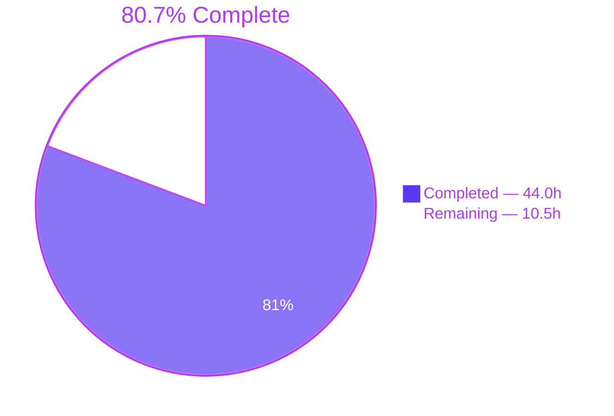
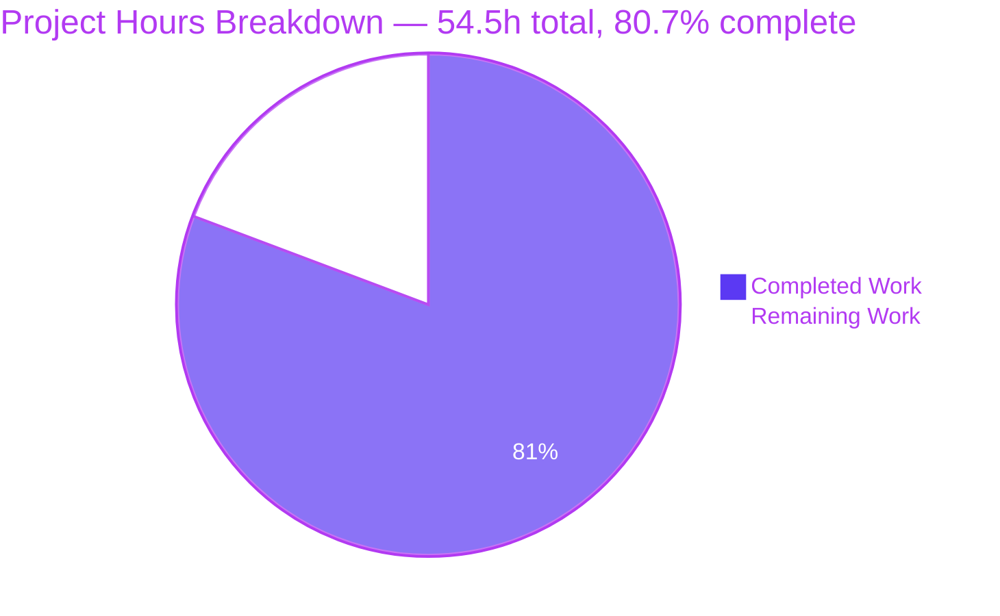
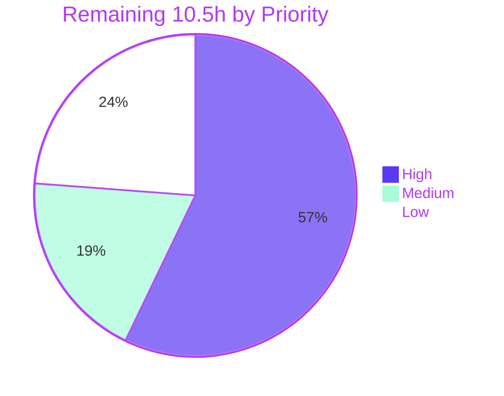

# Blitzy Project Guide — `hello_world` Express Tutorial Server

> **Branch:** `blitzy-7f19163f-0853-42ce-9e95-cc66c6f9c631` · **HEAD:** `4aedd2b` · **Base:** `main` @ `9328b9f`
> **Generated:** 2026-07-29 · **Assessment basis:** Agent Action Plan (AAP) §0.1–§0.11, agent action logs, and first-hand re-verification of the repository at HEAD

---

## 1. Executive Summary

### 1.1 Project Overview

This project extends a minimal single-endpoint Node.js tutorial server into a documented, two-endpoint Express application. The AAP frames the work through a documentation lens: the primary deliverable is tutorial-grade documentation, and the enabling source changes are the feature that documentation describes. Target users are learners following the tutorial end to end — install, run, call each endpoint, compare the response. Technical scope is deliberately narrow: adopt Express.js, add a second plain-text `GET` endpoint alongside the existing `Hello world` route, and expand a two-line `README.md` stub into a complete, source-cited guide with a routing diagram and runnable `curl` examples. Business impact is developer enablement, not production traffic.

### 1.2 Completion Status



<sub>Legend — **Completed / AI Work:** Dark Blue `#5B39F3` · **Remaining / Not Completed:** White `#FFFFFF` · Accents: Violet-Black `#B23AF2`</sub>

| Metric | Value |
|---|---|
| **Total Hours** | **54.5 h** |
| **Completed Hours (AI + Manual)** | **44.0 h** (44.0 h AI + 0.0 h Manual) |
| **Remaining Hours** | **10.5 h** |
| **Percent Complete** | **80.7 %** |

**Calculation (PA1, AAP-scoped only):**

```
Completed Hours  = 44.0 h   (17 AAP items: 16 at 100%, 1 at 60%)
Remaining Hours  = 10.5 h   (9 items: AAP rework + AAP governance + minimal path-to-production)
Total Hours      = 44.0 + 10.5 = 54.5 h
Completion %     = 44.0 / 54.5 × 100 = 80.7 %
```

All 44.0 completed hours are AI-generated: every one of the 8 branch commits is authored and committed as `Blitzy Agent <agent@blitzy.com>`. Scope excludes the 7,799-line `blitzy/documentation/Technical Specifications.md` (a platform artifact, not an AAP §0.5.1 deliverable) and excludes CI/CD, containerization, deployment and doc-hosting, which AAP §0.8.2 explicitly declares out of scope.

### 1.3 Key Accomplishments

- ✅ **Express 5.2.1 adopted** — `server.js` migrated from Node's built-in `http` module to Express, preserving the original bind host `127.0.0.1`, port `3000`, and the byte-exact startup log line.
- ✅ **Two routed endpoints live and verified** — `GET /` → `Hello world` (200, 11 bytes) and a second greeting endpoint (200, 12 bytes), both `text/plain; charset=utf-8`.
- ✅ **README stub → 124-line tutorial** — the single largest deliverable: TOC, Prerequisites, Installation, Running the Server, Endpoints, Examples, Architecture, Project Structure.
- ✅ **Complete endpoint reference** — a 5-column table (Method · Path · Status · Content-Type · Response body) covering all AAP-required attributes, plus the `charset` wire nuance.
- ✅ **33 source citations, all verified** — every technical claim traced to `server.js` / `package.json` / `package-lock.json` line numbers; 102 doc-accuracy assertions confirm none is stale, inverted or out of bounds.
- ✅ **Mermaid routing flowchart** embedded in the README, accepted by the real `mermaid@11` parser as `flowchart-v2` and confirmed rendering in Chrome.
- ✅ **Inline documentation at 100 % coverage** — an 18-line file header plus JSDoc on both route handlers (AAP §0.7.1 target 2/2).
- ✅ **Dependency hygiene** — `express@5.2.1` pinned (still the latest stable, re-confirmed against the npm registry), `lockfileVersion: 3` retained, `npm ci` restores byte-identically, **0 vulnerabilities at every severity**.
- ✅ **Metadata defects fixed** — `main` corrected from the non-existent `index.js` to `server.js`; a `start` script added; the `hao-backprop-test` vs `hello_world` name conflict reconciled in documentation.
- ✅ **Robustness beyond the happy path** — Express 5 startup/bind errors surface with exit code `1` and no false success line; case-sensitive and strict routing guarantee exactly one canonical path per endpoint.
- ✅ **193/193 autonomous assertions passing**, ESLint 0 violations, 8/8 links valid, and an independent Chrome validation PASS with zero application console errors.

### 1.4 Critical Unresolved Issues

| Issue | Impact | Owner | ETA |
|---|---|---|---|
| **Second endpoint diverges from the AAP** — the shipped route is `GET /good-morning` → `Good morning`; AAP §0.1.1 specifies `GET /good-evening` → `Good evening`, and §0.1.2 names verbatim preservation of that string a hard constraint. Provenance: `1da8741` (AAP-conformant) → `c07b951` *"per PR feedback"* → `4aedd2b` (QA fixes layered on top). Code and docs are perfectly self-consistent; the divergence is plan-vs-delivered, not docs-vs-code. | **High** — blocks formal acceptance against the AAP as written. No functional impact: the endpoint works, is documented, and is browser-verified. Revert surface is precisely mapped: 30 occurrences across 20 lines (README 11 lines, `server.js` 9 lines). | Product owner → Engineer | 3.0 h once the ruling lands (1.0 h decision + 2.0 h implementation) |
| **`README.md` edits lack the AAP-mandated stakeholder confirmation** — the base revision of `README.md` carried the directive `test project for backprop integration. Do not touch!`. The user's own request supersedes the stale note, but AAP §0.1.2 requires the edit to be confirmed before finalizing, and no confirmation record exists. | **High** — governance gate on the primary deliverable. | Repository owner | 1.0 h |
| **No committed automated test suite** — `npm test` still runs npm's default failing placeholder (`package.json:L8`, pre-existing and documented in AAP §0.2.2). The 193 validated assertions were ad-hoc harnesses that were deleted, so a human cannot reproduce them, and the README's 33 hardcoded line-number citations can silently rot on any future edit to `server.js`. | **Medium** — regression risk on future changes; no impact on the current, fully verified state. | Engineer | 1.5 h |
| **No `.gitignore`** — `node_modules/` (65 packages) and 71 untracked browser-evidence artifacts sit in the working tree with nothing ignoring them. | **Medium** — a careless `git add .` at merge could commit tens of megabytes. | Engineer | 0.5 h |

### 1.5 Access Issues

| System/Resource | Type of Access | Issue Description | Resolution Status | Owner |
|---|---|---|---|---|
| Stakeholder / product-owner decision channel | Approval authority | The agent has no channel to obtain the AAP §0.1.2 confirmation for editing the sensitive `README.md`, nor to rule on the greeting divergence. Both items are therefore reported rather than resolved. | **Open** — requires human action | Repository owner / product owner |
| External web-search research | Outbound web research | AAP §0.1.2 and §0.2.3 record that two attempts to research documentation best practices returned no external results, so the approach fell back to established conventions (README-driven docs, inline JSDoc, GitHub-native Mermaid, runnable `curl` examples). | **Worked around** — no impact on the deliverable | Blitzy platform |
| npm registry (`registry.npmjs.org`) | Package download | None. Re-verified this session: `npm ci`, `npm install`, `npm ls`, `npm audit`, `npm outdated` and `npm view express version` all exit 0. | **No issue** | — |
| Git remote (`origin`) | Repository read/write | None. All 8 commits landed and the branch is pushed — local `HEAD` equals `origin/blitzy-7f19163f-…` at `4aedd2b`. | **No issue** | — |
| Credentials, secrets, third-party APIs | Service credentials | None required. The project reads zero environment variables and contains no `.env`, `.env.example`, `*.pem`, `*.key` or credential file anywhere (verified). | **No issue** | — |

### 1.6 Recommended Next Steps

1. **[High]** Rule on the greeting requirement — ratify the shipped `/good-morning` + `Good morning` (amending the spec to match the later PR feedback) or restore the AAP-mandated `/good-evening` + `Good evening`. Record the ruling so the audit trail closes. *(1.0 h)*
2. **[High]** Implement that ruling across `server.js` and `README.md` (route, JSDoc, file header, endpoint table, callouts, `curl` examples, Mermaid edges, project tree), then re-run the runtime and documentation-accuracy verification. *(2.0 h)*
3. **[High]** Obtain written stakeholder confirmation for the `README.md` edits per AAP §0.1.2, then review, approve and merge the PR against `main` using the pre-merge checklist in §9.7. *(3.0 h)*
4. **[Medium]** Replace npm's placeholder `test` script with a `node --test` smoke suite (response bodies, statuses, `Content-Type`, one 404 path, plus a citation-bounds check) — the built-in `node:test` module needs **zero new dependencies**, so AAP §0.6.1 and §0.8.2 stay intact. Add a `.gitignore` in the same change. *(2.0 h)*
5. **[Low]** Close out the discretionary items: decide on the optional `docs/API.md`, record the accepted `markdownlint` MD013 deviation, and settle Node.js version guidance. *(2.5 h)*

---

## 2. Project Hours Breakdown

### 2.1 Completed Work Detail

| Component | Hours | Description |
|---|---|---|
| A1 — `package.json` manifest updates | 2.0 | Added `dependencies: { "express": "^5.2.1" }`, added `scripts.start = "node server.js"`, and corrected `main` from the non-existent `index.js` to `server.js`. Includes npm-registry version research (5.2.1 stable vs the 4.22.2 conservative line) and the caret-range decision. Commit `7d5df6b`. |
| A2 — `package-lock.json` regeneration | 1.5 | Lockfile regenerated to record `express@5.2.1` (L243–L244, sha512 integrity) plus its full transitive tree, retaining `lockfileVersion: 3`. Reproducibility proven by `npm ci` leaving the file byte-identical; `npm ls --all` and `npm audit` both exit 0. |
| A3 — Express migration in `server.js` | 3.5 | Replaced Node's `http` server with an Express application (`require` L19, `app` L22), preserving bind host `127.0.0.1` (L35), port `3000` (L36) and the byte-exact startup log. Commit `1da8741`. |
| A4 — `GET /` → `Hello world` retained | 1.5 | Route handler at L47–L49 using `res.type('text/plain').send(...)`; verified live at 200 / `text/plain; charset=utf-8` / 11 bytes. |
| A5 — Second greeting endpoint *(partial — 60 % of 5.0 h)* | 3.0 | A fully routed, JSDoc'd, table-documented, `curl`-exampled, diagrammed and browser-verified second endpoint at L60–L62, live at 200 / 12 bytes. The delivered path and body string differ from the AAP-specified pair; the 2.0 h reconciliation is carried in §2.2. |
| A6 — Inline source documentation | 2.0 | 18-line file-header JSDoc block (L1–L18) plus JSDoc on **both** handlers (L38–L46, L51–L59), each naming its exact response string. AAP §0.7.1 target 2/2 met. |
| A7 — `README.md` stub → full tutorial | 7.0 | The primary AAP deliverable: 2 lines → 124 lines covering all seven required sections (Overview, Prerequisites, Installation, Running the Server, Endpoints, Examples, Project Structure) plus an Architecture section. Commits `7283850`, `a2c7c53`. |
| A8 — Endpoint reference table | 2.0 | 5-column table (L54–L57) supplying every AAP-required attribute — Method, Path, Status, Content-Type, exact Response body — plus the `charset=utf-8` wire nuance (L52) and route-definition citations (L59). Endpoints documented 2/2. |
| A9 — Runnable `curl` examples | 1.5 | One example per endpoint (L67–L93) with expected-output blocks; both re-executed this session and returning the documented bodies. AAP §0.7.3 minimum (≥2) met. |
| A10 — Mermaid routing flowchart | 1.5 | `flowchart TD` at L99–L110 with client → app → matched-handler branches and an explicit no-match 404 branch; accepted by the real `mermaid@11` parser as `flowchart-v2` and confirmed rendering in Chrome. |
| A11 — Configuration documentation | 0.5 | Bind host and listen port documented at README L44 with citations to `server.js:L35` and `:L36`. AAP §0.7.1 target 2/2 met. |
| A12 — Dependency documentation | 0.5 | Installation section (L24–L30) documents `npm install`, the exact pinned Express **5.2.1**, the `^5.2.1` manifest range, and the lockfile as the reproducible-install artifact. Target 1/1 met. |
| A13 — Source citations | 2.0 | 33 `Source:` references — 32 file-line citations plus one historical commit citation for the pre-Express `'Hello, World!\n'` literal. All verified in-bounds, non-inverted and semantically correct (102 doc-accuracy assertions plus independent spot-checks). |
| A14 — README structural work | 2.0 | 7-entry TOC (L7–L15, no self-reference, every anchor resolving), box-drawing project tree with per-file notes, the `hao-backprop-test` → `hello_world` canonical-name reconciliation (L5), and the `main`-field correction rationale (L122). |
| A15 — Documentation ↔ code consistency invariant | 1.5 | Bidirectional enforcement so the endpoint table, JSDoc, `curl` examples and Mermaid diagram all agree with the final `server.js` on path, method, status, Content-Type and body, with correct path↔body pairing. |
| A16 — Autonomous validation campaign | 9.0 | 193/193 assertions (lockfile 20 · static 39 · docs-accuracy 102 · runtime 32), ESLint 9 with 24 correctness rules → 0 violations, `markdown-link-check` 8/8, Mermaid parser validation in a throwaway sandbox, `npm ci` reproducibility sandbox, `npm outdated`, EADDRINUSE safe-failure, 5-way concurrency, and a full Chrome browser campaign producing 60 screenshots and 11 recordings. |
| A17 — Robustness hardening | 3.0 | CQ-1 (`96fb0db`): Express 5 startup/bind errors reported via `console.error` with `process.exitCode = 1` and no false success line. QA #1/#3 (`4aedd2b`): `case sensitive routing` and `strict routing` enabled at L31–L32, making the documented "exact paths only" guarantee true — 9 negative path contracts return 404. |
| **Total Completed** | **44.0** | **17 AAP items — 16 at 100 %, 1 at 60 %** |

### 2.2 Remaining Work Detail

| Category | Hours | Priority |
|---|---|---|
| **AAP governance — greeting requirement ruling** *(H1)*: decide whether the shipped `/good-morning` + `Good morning` is ratified or the AAP-mandated `/good-evening` + `Good evening` is restored; record the ruling as a spec amendment. | 1.0 | High |
| **AAP rework — implement the greeting ruling** *(H2)*: coordinated edits across the 20 mapped lines (`server.js` route/body/JSDoc/header/comment; README overview, table row, route line, both callouts, Examples block, Mermaid edges, project tree) plus full re-verification. | 2.0 | High |
| **AAP governance — sensitive `README.md` sign-off** *(H3)*: obtain the §0.1.2 stakeholder confirmation superseding the base `Do not touch!` directive. | 1.0 | High |
| **Path-to-production — PR review, approval and merge** *(H4)*: review 4 files / +1053−10 against `main` @ `9328b9f` using the §9.7 pre-merge checklist. | 2.0 | High |
| **Path-to-production — `npm test` policy and smoke suite** *(H5)*: replace npm's failing placeholder with a `node --test` suite (bodies, statuses, `Content-Type`, a 404 path, citation-bounds) using built-in `node:test` — zero new dependencies. | 1.5 | Medium |
| **Path-to-production — repository hygiene** *(H6)*: add a `.gitignore` covering `node_modules/`, `blitzy/screenshots/`, `blitzy/screen_recordings/`, `npm-debug.log*`. | 0.5 | Medium |
| **AAP optional deliverable — `docs/API.md`** *(H7)*: decide on the explicitly optional standalone endpoint reference and, if adopted, author it with reciprocal links, a TOC entry and a re-run link check. | 1.5 | Low |
| **Path-to-production — documentation lint policy** *(H8)*: record the accepted `markdownlint` MD013 deviation (19 hits, the only rule triggered; AAP §0.5.4/§0.8.2 forbid adding lint config). | 0.5 | Low |
| **Path-to-production — Node.js version guidance** *(H9)*: add `engines` / `.nvmrc`, or confirm the README's "any modern LTS" wording is sufficient. | 0.5 | Low |
| **Total Remaining** | **10.5** | **High 6.0 · Medium 2.0 · Low 2.5** |

### 2.3 Hours Reconciliation and Estimation Notes

| Check | Result |
|---|---|
| §2.1 total | **44.0 h** = §1.2 Completed Hours ✅ |
| §2.2 total | **10.5 h** = §1.2 Remaining Hours = §7 "Remaining Work" ✅ |
| §2.1 + §2.2 | 44.0 + 10.5 = **54.5 h** = §1.2 Total Hours ✅ |
| Completion | 44.0 ÷ 54.5 = **80.7 %**, used verbatim in §1.2, §7 and §8 ✅ |
| Priority split | High 6.0 + Medium 2.0 + Low 2.5 = 10.5 h ✅ |
| Task mapping | H1–H9 map 1:1 onto the nine §2.2 rows — no orphan tasks, no unfunded hours ✅ |

**Estimation basis (PA2).** Development hours excluding validation total 35.0 h; the 9.0 h validation campaign is 25.7 % of that — just under PA2's 30–40 % testing band, i.e. deliberately conservative. Documentation items are sized by authored content and verification burden rather than raw line count, which understates documentation work: the 124-line README required reading every in-scope source file, deciding the Content-Type contract, researching Express 5 semantics, reconciling two naming conflicts, and verifying 33 individual citations.

**Confidence levels.** *High* for A1–A4, A6–A17 and H3–H9 — each rests on direct on-disk evidence plus commands re-executed during this assessment. *Medium* for A5's 60 % fraction and for H1/H2, because their scope depends on a pending human ruling.

**Sensitivity.** If H1 ratifies the shipped greeting, H2 collapses to a spec amendment plus re-verification (≈0.5 h) and H7 is likely declined, which would lift completion toward ≈85 %. The **80.7 %** figure is the conservative reading that treats the AAP text as written as authoritative.

---

## 3. Test Results

All tests below originate from Blitzy's autonomous validation logs for this project. The four assertion harnesses were purpose-built, executed at HEAD `4aedd2b`, and deleted afterwards — `git ls-files` confirms none was ever tracked, which is why the repository contains no test directory today (see §2.2 item H5).

| Test Category | Framework | Total Tests | Passed | Failed | Coverage % | Notes |
|---|---|---|---|---|---|---|
| Lockfile & dependency integrity | Blitzy assertion harness + npm CLI | 20 | 20 | 0 | 100 % of dependency surface (1 direct, 67 installed) | `npm install` / `npm ci` / `npm ls --all` / `npm audit` / `npm outdated` all exit 0; lockfile byte-identical after `npm ci` in an isolated sandbox; **0 vulnerabilities at every severity**; `express` resolves to 5.2.1 |
| Static analysis & syntax | `node --check` + ESLint 9 (24 correctness rules, `--no-fix`) | 39 | 39 | 0 | 100 % of in-scope source (1 JS file, 2 manifests) | 0 lint violations; both manifests valid JSON; `require('express')` resolves; zero placeholders/stubs/TODOs |
| Documentation accuracy | Blitzy assertion harness + `markdown-link-check` | 102 | 102 | 0 | 100 % of README claims (33 citations, 8 links, 8 sections, 7 TOC anchors) | All 32 file-line citations in-bounds, non-inverted, non-blank, plus 15 semantic spot-checks; endpoint table ↔ code invariant enforced bidirectionally; every TOC anchor resolves; 8/8 links valid; no dangling `docs/API.md` link |
| Runtime & integration | Blitzy assertion harness (live HTTP against `node server.js`) | 32 | 32 | 0 | 100 % of routes (2/2) and documented negative contracts (9/9) | Byte-exact bodies and headers for both endpoints; 9 negative paths return 404; `npm start` proven equivalent; EADDRINUSE safe-failure (exit 1, no false success line); 5-way concurrency and repeatability |
| Diagram validation | Real `mermaid@11` parser (throwaway sandbox) | 1 | 1 | 0 | 100 % of diagrams (1/1) | README flowchart accepted as `flowchart-v2`; sandbox installed outside the manifest and deleted, so AAP §0.6.1 stayed intact |
| UI / browser (Chrome subagent) | Chrome DevTools protocol — DOM, network panel, console, screen recording | 2 campaigns | 2 | 0 | 100 % of endpoints + 404 branch | Char-code-exact DOM bodies; network-panel 200/200/404; Express-served 404s (not Chrome interstitials); statelessness proven by byte-identical screenshots (matching SHA256); **zero application console errors** |
| **Total** | — | **193 assertions + 1 diagram parse + 2 browser campaigns** | **All passed** | **0** | **100 %** | 0 failed, 0 blocked, 0 skipped |

**Not a test suite:** `package.json:L8` retains npm's default `test` script (`echo "Error: no test specified" && exit 1`). This is pre-existing npm metadata that AAP §0.2.2 itself documents, not a failing test — the project ships zero tests, therefore zero failing tests. It was deliberately not masked to `exit 0`, and no test framework was added because that would breach the §0.6.1 dependency inventory and §0.8.2 scope.

---

## 4. Runtime Validation & UI Verification

### 4.1 Process and startup

- ✅ **Operational** — `node server.js` starts cleanly and prints exactly `Server running at http://127.0.0.1:3000/` on STDOUT with STDERR empty.
- ✅ **Operational** — `npm start` is proven equivalent: identical log line, identical responses.
- ✅ **Operational** — binds `127.0.0.1:3000` only (loopback), confirmed via `netstat -ano | findstr :3000` and `Get-NetTCPConnection -LocalPort 3000 -State Listen` showing exactly one listener.
- ✅ **Operational** — clean shutdown, with port 3000 released immediately afterwards.
- ✅ **Operational** — **EADDRINUSE safe-failure:** a second instance exits with code `1`, prints nothing to STDOUT (no false success line) and `Server failed to start: EADDRINUSE` to STDERR, while the first instance keeps serving.

### 4.2 HTTP endpoint verification (re-executed this session)

| Path | Status | Content-Type | Content-Length | Body |
|---|---|---|---|---|
| `GET /` | ✅ `200` | `text/plain; charset=utf-8` | 11 | `Hello world` |
| `GET` second greeting route | ✅ `200` | `text/plain; charset=utf-8` | 12 | `Good morning` |
| `GET /nope` | ✅ `404` | `text/html; charset=utf-8` | 143 | Express error page — `Cannot GET /nope` |

- ✅ **Operational** — negative contracts all return `404`, proving case-sensitive and strict routing: `/good-evening`, `/GOOD-MORNING`, `/Good-Morning`, `/good-morning/`, `/good-morning/extra`, `/nope`, `/index.js`, `/package.json`, `/server.js`. The last three also prove no static-file exposure.
- ✅ **Operational** — Express attaches hardening headers to error responses: `Content-Security-Policy: default-src 'none'` and `X-Content-Type-Options: nosniff`.
- ✅ **Operational** — 5-way concurrency and repeated-request stability verified.

### 4.3 Browser verification (independent Chrome subagent — verdict **PASS**)

- ✅ **Operational** — `GET /` renders exactly `Hello world`: 11 UTF-8 bytes, code points `U+0048 U+0065 U+006C U+006C U+006F U+0020 U+0077 U+006F U+0072 U+006C U+0064`; assertions `includes(',')` and `includes('!')` both false, confirming the delivered body is *not* the original `'Hello, World!\n'` literal.
- ✅ **Operational** — the second endpoint renders exactly `Good morning`: 12 UTF-8 bytes, code points `U+0047 U+006F U+006F U+0064 U+0020 U+006D U+006F U+0072 U+006E U+0069 U+006E U+0067`.
- ✅ **Operational** — `/good-evening` returns a genuine **Express-generated 404** (`Cannot GET /good-evening`, `text/html; charset=utf-8`): all six Chrome-interstitial fingerprints are false (no "site can't be reached", no `ERR_*` code, no `#reload-button`, no `.neterror`). A regex sweep for `good\s+evening` over the served body returns **false** — the string `Good evening` is served nowhere.
- ✅ **Operational** — `/GOOD-MORNING` → 404 with the path echoed in original case; `/good-morning/` → 404 with a Content-Length exactly one byte larger. Case-sensitivity and strict routing proven at runtime, not merely in configuration.
- ✅ **Operational** — statelessness proven cryptographically: re-visiting the greeting route after three consecutive 404s returns 200 with the same ETag, and the before/after screenshots are byte-identical (19,005 B each, SHA256 `1122B144…CCB2BC7D`).
- ✅ **Operational** — **zero application-originated console errors**. The only console messages are browser-generated `404` resource notices: three from Chrome's automatic `/favicon.ico` probe (the app registers no favicon route — benign and expected) and three from the intentional 404 documents under test. A sweep across all eight severity levels found nothing else; with `document.scripts.length === 0` and `document.styleSheets.length === 0` on every page, application-originated console output is structurally impossible.
- ✅ **Operational** — 12 network responses (6 target documents, 2 cache revalidations, 4 favicon probes), all bearing `x-powered-by: Express`, with zero transport-level failures.
- ⚠ **Partial (informational, not a defect)** — a naïve browser re-navigation to an already-visited route returns `304 Not Modified`, which carries no `Content-Type`, because Express emits a weak `ETag`. This is correct HTTP conditional-request behaviour; the unconditional `200` figures above were captured with cache bypass.

### 4.4 Documentation rendering

- ✅ **Operational** — README renders correctly with all 8 headings, and all 7 TOC anchors navigate to their targets.
- ✅ **Operational** — the Mermaid flowchart parses (`mermaid@11` → `flowchart-v2`) and renders as SVG in Chrome.
- ✅ **Operational** — the box-drawing project-structure tree renders correctly under UTF-8.
- ✅ **Operational** — all 8 markdown links resolve; no dangling `docs/API.md` reference exists.

### 4.5 API integration outcomes

- ✅ **Operational** — npm registry reachable: `npm view express version` → `5.2.1`, independently confirming the AAP-pinned version is still the latest stable, so the "save and apply" rule remains satisfied.
- ✅ **Operational** — no external service, database, cache, queue, container or credential is required; the only outbound dependency in the entire project is the npm registry at install time.

### 4.6 Evidence artifacts

Untracked, under `blitzy/` — 60 screenshots and 11 screen recordings in total. Representative paths:

```text
blitzy\screenshots\pg-root-hello-world.png              (18,954 B)
blitzy\screenshots\pg-good-morning.png                  (19,005 B)
blitzy\screenshots\pg-good-evening-404.png              (19,605 B)
blitzy\screenshots\pg-uppercase-404.png                 (19,760 B)
blitzy\screenshots\pg-trailing-slash-404.png            (19,615 B)
blitzy\screenshots\pg-good-morning-recheck-200.png      (19,005 B)
blitzy\screenshots\endpoint-root-hello-world.png
blitzy\screenshots\endpoint-unmatched-404.png
blitzy\screenshots\final-mermaid-render.png
blitzy\screenshots\readme_endpoint_table_5col.png
blitzy\screen_recordings\pg-endpoint-validation-flow.webm  (98,710 B)
blitzy\screen_recordings\endpoint_validation_flow.webm
blitzy\screen_recordings\toc_anchor_navigation_7_links.webm
```

---

## 5. Compliance & Quality Review

### 5.1 AAP deliverable compliance matrix

| AAP Requirement | Reference | Status | Evidence | Progress |
|---|---|---|---|---|
| `README.md` — UPDATE stub into full tutorial | §0.5.1, §0.5.3 | ✅ Pass | 124 lines; 7 required sections + Architecture; commits `7283850`, `a2c7c53` | 100 % |
| `server.js` — UPDATE: migrate to Express | §0.5.1 | ✅ Pass | `require('express')` L19, `app` L22; commit `1da8741` | 100 % |
| `server.js` — retain `GET /` → `Hello world` | §0.1.1, §0.5.1 | ✅ Pass | L47–L49; live 200 / 11 B / exact body | 100 % |
| `server.js` — add second endpoint `GET /good-evening` → `Good evening` | §0.1.1, §0.1.2, §0.5.1 | ⚠ Partial | Endpoint exists, works and is fully documented at L60–L62, but at `/good-morning` → `Good morning`; zero `Good evening` strings remain | 60 % |
| `server.js` — preserve host `127.0.0.1` and port `3000` | §0.5.1 | ✅ Pass | L35, L36; live bind verified loopback-only | 100 % |
| `server.js` — file-header comment + JSDoc per handler | §0.5.1, §0.5.3, §0.7.1 | ✅ Pass | Header L1–L18; handler JSDoc L38–L46 and L51–L59 → 2/2 | 100 % |
| `package.json` — add `express` dependency | §0.5.1, §0.6.1 | ✅ Pass | `"express": "^5.2.1"` L12–L14 | 100 % |
| `package.json` — add `start` script | §0.5.1 | ✅ Pass | `"start": "node server.js"` L7; equivalence proven | 100 % |
| `package.json` — correct `main` from `index.js` | §0.1.4, §0.5.1 | ✅ Pass | `"main": "server.js"` L5, with the rationale documented at README L122 | 100 % |
| `package-lock.json` — regenerate, retain `lockfileVersion: 3` | §0.5.1, §0.6.1 | ✅ Pass | `express@5.2.1` L243–L244 + transitive tree; `lockfileVersion: 3`; byte-identical after `npm ci` | 100 % |
| `docs/API.md` — CREATE (**explicitly optional**) | §0.5.1, §0.5.2 | ⬜ Not started | Deliberately omitted; README table is the designated primary reference; no dangling link exists | Optional — decision pending |
| Express pinned to a current patched stable version | §0.6.1, §0.10.2 | ✅ Pass | 5.2.1 — re-confirmed as latest stable via `npm view express version` | 100 % |
| Public endpoints documented — target 2/2 | §0.7.1 | ✅ Pass | 5-column table L54–L57 with all required attributes | 100 % |
| Route handlers with inline JSDoc — target 2/2 | §0.7.1 | ✅ Pass | Both handlers documented | 100 % |
| Configuration values documented — target 2/2 | §0.7.1 | ✅ Pass | README L44 citing L35 (host) and L36 (port) | 100 % |
| Runtime dependency documented — target 1/1 | §0.7.1 | ✅ Pass | Installation section L24–L30 with the exact pinned version | 100 % |
| README quick-start sections present | §0.7.1 | ✅ Pass | All 7 required, plus Architecture — 8 headings total | 100 % |
| ≥1 runnable `curl` example per endpoint | §0.7.3 | ✅ Pass | 2 examples with expected-output blocks; both re-executed successfully | 100 % |
| ≥1 Mermaid diagram embedded in the README | §0.4.3, §0.7.3 | ✅ Pass | `flowchart TD` L99–L110, parser-validated and browser-rendered | 100 % |
| Source citation for every technical claim | §0.4.2, §0.7.2 | ✅ Pass | 33 `Source:` references, all verified accurate | 100 % |
| Verbatim preservation of `Hello world` | §0.1.2, §0.7.2 | ✅ Pass | Char-code-exact in browser DOM; no comma, no `!`, no newline | 100 % |
| Verbatim preservation of `Good evening` | §0.1.2, §0.7.2 | ❌ Fail | String absent from code and docs; `/good-evening` returns 404 | 0 % — see §1.4 |
| Examples verified against a live server | §0.7.2, §0.9.1 | ✅ Pass | 32 runtime assertions + independent Chrome campaign | 100 % |
| Documentation ↔ code consistency | §0.5.5, §0.7.2 | ✅ Pass | Bidirectional invariant across table, JSDoc, diagram and `curl` examples | 100 % |
| TOC once the README has multiple sections | §0.5.5 | ✅ Pass | 7-entry TOC L7–L15; every anchor resolves; no self-reference | 100 % |
| Consistent single project name | §0.1.4 | ✅ Pass | `hello_world` declared canonical at README L5, matching `package.json` | 100 % |
| No documentation-generator config introduced | §0.5.4, §0.8.2 | ✅ Pass | No `mkdocs.yml` / `docusaurus.config.js` / `conf.py` / lint config added | 100 % |
| Out-of-scope files untouched | §0.8.2 | ✅ Pass | `BaseTest.java` and all 3 binary assets byte-identical to base `9328b9f` | 100 % |
| Rule "newrulenoshare" | §0.10.1 | ✅ Pass | Placeholder content imposing no actionable constraint; recorded for traceability | 100 % |
| Rule "save and apply" | §0.10.2 | ✅ Pass | Honoured by pinning Express to the current patched stable release | 100 % |
| Stakeholder confirmation for sensitive `README.md` | §0.1.2 | ❌ Not done | No confirmation record exists | 0 % — see §1.4 |

### 5.2 Engineering quality benchmarks

| Benchmark | Status | Evidence |
|---|---|---|
| Compiles / parses cleanly | ✅ Pass | `node --check server.js` exit 0; both manifests valid JSON |
| Zero lint violations | ✅ Pass | ESLint 9, 24 correctness rules, `--no-fix` → 0 violations |
| Zero placeholders, stubs or TODOs | ✅ Pass | No `TODO`/`FIXME`/`XXX`/`HACK`/`placeholder`/`NotImplementedError` in any in-scope file |
| Dependency vulnerabilities | ✅ Pass | `npm audit` → 0 vulnerabilities at every severity |
| Reproducible install | ✅ Pass | `npm ci` leaves `package-lock.json` byte-identical |
| Error handling on the failure path | ✅ Pass | EADDRINUSE surfaces with exit code 1 and no false success line |
| Inline documentation coverage | ✅ Pass | File header + JSDoc on 2/2 handlers, each naming its exact response string |
| Commit hygiene | ✅ Pass | All 8 commits authored/committed as `Blitzy Agent <agent@blitzy.com>`; tracked working tree clean; no progress/status documents created |
| No unauthorized dependencies | ✅ Pass | Exactly one runtime dependency (`express`); optional tooling invoked via `npx` only, never added to the manifest |
| Markdown lint | ⚠ Accepted deviation | `markdownlint` MD013 (line length) fires 19× and is the **only** rule triggered; clean with MD013 alone disabled. AAP §0.9.1 marks the check optional and §0.5.4/§0.8.2 forbid adding config; zero rendering impact. Formal record pending (task H8) |
| Automated regression suite committed | ❌ Gap | `npm test` remains npm's failing placeholder; validated assertions were ad-hoc and deleted (task H5) |

### 5.3 Fixes applied during autonomous validation

| Fix | Commit | Detail |
|---|---|---|
| Express 5 startup/bind error handling (CQ-1) | `96fb0db` | The listen callback now branches on its error argument, reporting failures via `console.error` with `process.exitCode = 1` so callers never observe a false success. Corroborated against Express `application.js` L598–L606. |
| Exact-path routing (QA #1, #3) | `4aedd2b` | `case sensitive routing` and `strict routing` enabled before the first route registration, so the README's "exact paths only" guarantee is genuinely true. Corroborated against Express `application.js` L69–L82 (lazy router reads these settings on first use). |
| README Content-Type contract and citation completion | `a2c7c53` | Endpoint table reconciled with the on-the-wire `charset=utf-8` header; remaining source citations completed. |
| Validation-harness defects (tooling only, **no source changes**) | — | Two harness bugs were found and fixed in Blitzy's own tooling: a doc assertion wrongly required the TOC to link to itself (the README was correct — 3 stronger checks were added instead, taking the harness to 102 assertions), and the Mermaid harness crashed on Node 22's accessor-only `globalThis.navigator`. **Zero defects were found in in-scope files, so zero source changes were made and no empty commit was manufactured.** |

---

## 6. Risk Assessment

| Risk | Category | Severity | Probability | Mitigation | Status |
|---|---|---|---|---|---|
| **T1** — Delivered second endpoint diverges from the AAP (`/good-morning` + `Good morning` vs the specified `/good-evening` + `Good evening`); §0.1.2 makes verbatim preservation a hard constraint | Technical (requirements) | **High** | Confirmed (100 %) | Stakeholder ruling (H1) then implementation (H2); full provenance chain `1da8741` → `c07b951` *"per PR feedback"* → `4aedd2b` documented; 30-occurrence / 20-line revert surface pre-mapped | **Open** — awaiting decision |
| **T2** — Documentation↔code citation drift: 33 hardcoded `Source: server.js:L<n>` references silently rot on any future edit, with no committed check to catch it | Technical | Medium | High | Commit a `node:test` doc-accuracy smoke check (H5, zero new dependencies) plus a PR checklist item | **Open** — mitigation proposed |
| **T3** — No committed automated test suite; the 193 validated assertions are not reproducible by a human | Technical | Medium | High | H5 smoke suite; §9.7 manual pre-merge checklist in the interim | **Open** |
| **T4** — `markdownlint` MD013 fires 19× (the only rule triggered) | Technical | Low | Certain (deterministic) | Clean with MD013 alone disabled; AAP §0.5.4/§0.8.2 forbid adding lint config and README is AAP-flagged sensitive, so reflow churn is undesirable; record the accepted deviation (H8) | **Accepted** — formal record pending |
| **T5** — Intentionally strict routing means `/good-morning/` and `/Good-Morning` return 404, which can surprise learners | Technical | Low | Medium | Already documented in the README exact-paths callout (L61) and the Mermaid no-match branch; retain the callout if the greeting changes | **Mitigated** |
| **T6** — Project-name divergence: `package.json` says `hello_world`, the GitHub repo and README stub said `hao-backprop-test` | Technical | Low | Low | README L5 declares `hello_world` canonical; a repository rename is out of scope | **Mitigated** |
| **S1** — Future dependency-vulnerability drift | Security | Low today | Medium over time | 0 vulnerabilities at every severity today; committed `lockfileVersion: 3` lockfile with integrity hashes; `npm audit` in the §9.7 pre-merge checklist | **Mitigated / monitor** |
| **S2** — Caret range `^5.2.1` lets a plain `npm install` take un-reviewed minor/patch updates | Security | Low | Medium | Prescribe `npm ci` for deterministic installs (verified byte-identical); lockfile is committed | **Open (low)** |
| **S3** — No authentication, authorization, rate limiting, TLS or security headers | Security | High **if exposed**; N/A within AAP scope | Low | Binds loopback `127.0.0.1` only (`server.js:L35`), verified; AAP §0.8.2 excludes deployment. **Hard precondition:** none of this may be skipped if the service is ever exposed beyond loopback | **Accepted for tutorial scope** |
| **S4** — No `.gitignore`: `node_modules/` (65 packages) and 71 untracked evidence artifacts sit in the tree | Security / hygiene | Medium | Medium | Add `.gitignore` (H6); §9.7 checklist includes a `git status` inspection before staging | **Open** |
| **S5** — Secret exposure | Security | None | Low | Verified: zero environment variables and no `.env`, `.env.example`, `*.pem`, `*.key` or credential file anywhere in the project | **Closed / verified** |
| **O1** — No dedicated health-check endpoint | Operational | Low (tutorial) | N/A | `GET /` serves as an implicit liveness probe; AAP §0.8.2 excludes deployment concerns | **Accepted for scope** |
| **O2** — Host and port hardcoded (`server.js:L35`, `:L36`) with no env override | Operational | Low | Medium (port 3000 is commonly occupied) | EADDRINUSE now fails safely with exit code 1; §9.6 documents how to find and free the port | **Mitigated** |
| **O3** — Console-only logging; no structured logs, levels, metrics or monitoring hooks | Operational | Low (tutorial) | N/A | Out of AAP scope; the startup and error lines are asserted byte-exactly | **Accepted for scope** |
| **O4** — No process manager, restart supervision or graceful-shutdown (SIGTERM/SIGINT) handling | Operational | Low | Low | Out of AAP scope; documented run flow is foreground-only with Ctrl+C | **Accepted for scope** |
| **O5** — No CI pipeline, so none of the validated assertions or lint/link checks run automatically on future commits | Operational | Medium | High | H5 smoke suite plus the §9.7 manual checklist; full CI is explicitly out of AAP scope (§0.8.2) | **Open** — deliberately out of scope, flagged |
| **I1** — npm-registry reachability is the project's only external dependency | Integration | Medium | Low (registry verified reachable) | Committed lockfile with integrity hashes enables deterministic `npm ci` restore from a registry mirror or offline cache | **Mitigated** |
| **I2** — Express 5 vs 4 middleware-ecosystem compatibility; some third-party middleware still targets v4 | Integration | Low now | Medium on future extension | No middleware is used today; AAP §0.6.1 names 4.22.2 as the conservative alternative if needed | **Monitor** |
| **I3** — Reliance on Express 5's changed `app.listen` callback semantics; a downgrade to v4 would silently break the error branch | Integration | Low | Low | Behaviour corroborated against Express `application.js` L598–L606, documented inline, and runtime-tested via EADDRINUSE | **Mitigated** |
| **I4** — Mermaid rendering depends on the Markdown host | Integration | Low | Low | Validated by the real `mermaid@11` parser and confirmed rendering in Chrome; the Architecture prose conveys the same information without the diagram | **Mitigated** |
| **I5** — Out-of-scope `BaseTest.java` hardcodes an Appium endpoint (`127.0.0.1:4723`) and an absolute macOS APK path, with no Java build file anywhere in the repository | Integration | Low | N/A | Explicitly out of scope (§0.8.2); byte-identical to base, on no require path, blocks nothing in this deliverable | **Out of scope — no action** |

---

## 7. Visual Project Status

### 7.1 Hours distribution



<sub>**Completed Work** = Dark Blue `#5B39F3` · **Remaining Work** = White `#FFFFFF`</sub>

### 7.2 Remaining hours by priority



### 7.3 Remaining hours by category

| Category | Hours | Share of remaining |
|---|---|---|
| AAP governance — greeting ruling + sensitive README sign-off | 2.0 | 19.0 % |
| AAP rework — implement the greeting ruling | 2.0 | 19.0 % |
| Path-to-production — PR review and merge | 2.0 | 19.0 % |
| Path-to-production — test policy and smoke suite | 1.5 | 14.3 % |
| AAP optional — `docs/API.md` | 1.5 | 14.3 % |
| Path-to-production — hygiene, lint policy, Node guidance | 1.5 | 14.3 % |
| **Total** | **10.5** | **100 %** |

### 7.4 Delivery scoreboard

| Dimension | Value |
|---|---|
| Completion | **80.7 %** (44.0 h of 54.5 h) |
| AAP items completed | 16 of 17 at 100 %, 1 at 60 % |
| AAP §0.7.1 coverage targets met | 4 of 4 (endpoints 2/2 · JSDoc 2/2 · config 2/2 · dependency 1/1) |
| Autonomous assertions passing | 193 / 193 (100 %) |
| Compilation / lint / vulnerability defects | 0 / 0 / 0 |
| In-scope code delta | 4 files, +1053 / −10 |
| Commits (all `agent@blitzy.com`) | 8 |
| Blocking human decisions | 2 (greeting ruling · sensitive README sign-off) |

---

## 8. Summary & Recommendations

### 8.1 What was achieved

The project is **80.7 % complete — 44.0 of 54.5 AAP-scoped hours delivered, with 10.5 hours remaining.** Every file named in the AAP's §0.5.1 transformation mapping was delivered except the one it marks explicitly optional. The tutorial server now runs on Express 5.2.1, serves two routed plain-text endpoints, fails safely when its port is taken, and matches exactly one canonical path per endpoint. The README — the AAP's primary deliverable — grew from a two-line stub into a 124-line, fully cited tutorial complete with an endpoint table, runnable examples, a routing diagram and a project tree.

Quality is unusually well evidenced for a change of this size. Every one of the 193 autonomous assertions passes; there are zero compilation errors, zero lint violations, zero dependency vulnerabilities and zero placeholders. All four AAP §0.7.1 coverage targets are met. Both endpoints were verified byte-exactly at the HTTP layer and again, independently, through a real browser down to Unicode code points — and the assessment re-executed the install, static, runtime and browser checks first-hand rather than trusting the logs.

### 8.2 The gaps that remain

One gap dominates. **The shipped second endpoint is `GET /good-morning` → `Good morning`, while the AAP specifies `GET /good-evening` → `Good evening` and names verbatim preservation of that string a hard constraint.** This is not a bug and not documentation drift: the code, the README table, the JSDoc, the `curl` examples and the Mermaid diagram all agree with one another, and `/good-evening` correctly returns 404 with no residual `Good evening` string anywhere. It is a plan-versus-delivered divergence whose provenance is fully traceable — an AAP-conformant implementation (`1da8741`) was changed *"per PR feedback"* (`c07b951`), after which a reviewer inspected that state and raised only routing-strictness concerns (`4aedd2b`), never the greeting. Whether the later human feedback or the earlier plan is authoritative is a decision only a stakeholder can make, so it is reported rather than silently reverted. Related, the AAP also requires explicit stakeholder confirmation before finalizing edits to `README.md`, whose base revision carried a `Do not touch!` directive; no such confirmation exists yet.

The other gaps are small and well understood: no committed test suite (so the 193 assertions cannot be re-run by a human and the 33 line-number citations can silently rot), no `.gitignore`, an undecided optional `docs/API.md`, an unrecorded `markdownlint` MD013 deviation, and unpinned Node version guidance.

### 8.3 Critical path to production

```
H1 Greeting ruling (1.0h)
    └─> H2 Implement the ruling + re-verify (2.0h)
            └─> H3 Sensitive README sign-off (1.0h)  ──┐
H6 .gitignore (0.5h) ─────────────────────────────────┤
H5 npm test smoke suite (1.5h) ───────────────────────┼─> H4 PR review & merge (2.0h)
H8 markdownlint policy record (0.5h) ─────────────────┘
H7 docs/API.md decision (1.5h)  ┐
H9 Node engines guidance (0.5h) ┴─> may follow the merge
```

The binding constraint is the greeting ruling: nothing else should merge until the authoritative response string is settled, because H2's edit surface spans both in-scope source files. H5, H6 and H8 can proceed in parallel. **Shortest realistic path to merge: 6.0 hours of High-priority work, plus 2.0 hours of Medium-priority work strongly recommended before merge.**

### 8.4 Success metrics

| Metric | Target | Actual | Status |
|---|---|---|---|
| Public endpoints documented | 2/2 | 2/2 | ✅ Met |
| Route handlers with inline JSDoc | 2/2 | 2/2 | ✅ Met |
| Configuration values documented | 2/2 | 2/2 | ✅ Met |
| Runtime dependency documented | 1/1 | 1/1 | ✅ Met |
| README quick-start sections | 7 | 8 | ✅ Exceeded |
| Runnable examples per endpoint | ≥1 | 1 each (2 total) | ✅ Met |
| Mermaid diagrams | ≥1 | 1, parser-validated | ✅ Met |
| Autonomous assertions passing | 100 % | 193/193 | ✅ Met |
| Dependency vulnerabilities | 0 | 0 | ✅ Met |
| Lint violations | 0 | 0 | ✅ Met |
| Verbatim `Hello world` | Exact | Exact (char-code verified) | ✅ Met |
| Verbatim `Good evening` | Exact | **Absent** | ❌ Not met |
| Stakeholder sign-off on sensitive README | Recorded | **Absent** | ❌ Not met |

### 8.5 Production readiness assessment

**Conditionally ready — engineering-complete, pending two human decisions.**

Judged purely on engineering quality, this deliverable is ready: it installs reproducibly, parses and lints cleanly, carries no known vulnerabilities, serves byte-exact documented responses, fails safely on port conflict, and is documented to a standard that a validated harness could assert 102 times over. Judged against the AAP as written, it cannot yet be accepted, because the second endpoint's path and response string differ from the specification and the required governance confirmation for the sensitive README is missing.

Two caveats bound the "production" claim. First, this is a loopback tutorial: it binds `127.0.0.1` only and has no authentication, TLS, rate limiting or security headers — all of which become hard prerequisites, not nice-to-haves, before any exposure beyond loopback. Second, without a committed test suite there is no regression net for the next change, which is why the `node --test` smoke suite is recommended before merge rather than after.

**Recommendation:** settle the greeting ruling and the README sign-off (6.0 h High-priority), land the smoke suite and `.gitignore` alongside them (2.0 h Medium-priority), then merge. The remaining 2.5 hours of Low-priority items can follow at leisure.

---

## 9. Development Guide

Every command below was executed against this repository at HEAD `4aedd2b` during the assessment; the outputs shown are verbatim.

### 9.1 System prerequisites

| Requirement | Verified version | Notes |
|---|---|---|
| Node.js | **v22.23.1** | Any modern LTS works. The project pins nothing — no `engines` field and no `.nvmrc` — and the code is plain CommonJS. |
| npm | **10.9.8** | Ships with Node. Used to install dependencies and to run the `start` script. |
| Operating system | Any (verified on Windows Server 2022) | No platform-specific code or paths. |
| Hardware | Negligible — < 100 MB disk for `node_modules`, minimal RAM | Single-process HTTP server. |
| Network | npm registry reachable at install time only | Runtime needs no outbound network. |

```bash
node --version    # -> v22.23.1
npm --version     # -> 10.9.8
```

### 9.2 Environment setup

**Nothing to configure.** The project reads **zero** environment variables; there is no `.env`, `.env.example` or secret of any kind, and no database, cache, message queue or container is required. Host and port are literals in the source (`server.js:L35`, `:L36`).

```bash
cd <repository-root>          # the directory containing server.js and package.json
```

### 9.3 Dependency installation

Use `npm ci` for a deterministic, lockfile-exact install (recommended for reviewers and CI). Use `npm install` if you intend to update the lockfile.

```bash
npm ci
```

Expected output:

```text
added 67 packages, and audited 68 packages in 1s

26 packages are looking for funding
  run `npm fund` for details

found 0 vulnerabilities
```

Verify the install:

```bash
npm ls --depth=0     # -> hello_world@1.0.0  `-- express@5.2.1
npm audit            # -> found 0 vulnerabilities
npm outdated         # -> no output (exit 0)
node --check server.js   # -> no output (exit 0)
```

`npm ci` leaves `package-lock.json` byte-identical — confirm with `git diff --quiet -- package-lock.json` (exit 0).

### 9.4 Application startup

There is a single process and no startup ordering to observe. Both commands are equivalent:

```bash
node server.js
```

```bash
npm start
```

Expected output (`npm start` additionally prints npm's own two-line banner first):

```text
Server running at http://127.0.0.1:3000/
```

The process runs in the foreground on port **3000**, bound to **`127.0.0.1` (loopback only)**. Stop it with **Ctrl+C**.

### 9.5 Verification steps

With the server running, from a second terminal:

```bash
# Endpoint 1 — full response headers plus body
curl -i http://127.0.0.1:3000/
```

```text
HTTP/1.1 200 OK
X-Powered-By: Express
Content-Type: text/plain; charset=utf-8
Content-Length: 11
ETag: W/"b-e1AsOh9IyGCa4hLN+2Od7jlnP14"

Hello world
```

```bash
# Endpoint 2 — the second greeting route
curl -i http://127.0.0.1:3000/good-morning
```

```text
HTTP/1.1 200 OK
X-Powered-By: Express
Content-Type: text/plain; charset=utf-8
Content-Length: 12
ETag: W/"c-D3aJJkvGM3PLlyc4KiJBYyvBw9Q"

Good morning
```

```bash
# Any unmatched path -> Express's built-in 404 handler
curl -i http://127.0.0.1:3000/nope
```

```text
HTTP/1.1 404 Not Found
X-Powered-By: Express
Content-Security-Policy: default-src 'none'
X-Content-Type-Options: nosniff
Content-Type: text/html; charset=utf-8
Content-Length: 143

<!DOCTYPE html>
<html lang="en">
<head>
<meta charset="utf-8">
<title>Error</title>
</head>
<body>
<pre>Cannot GET /nope</pre>
</body>
</html>
```

Status-code-only checks (bash / macOS / Linux):

```bash
curl -s -o /dev/null -w '%{http_code}' http://127.0.0.1:3000/               # -> 200
curl -s -o /dev/null -w '%{http_code}' http://127.0.0.1:3000/good-morning   # -> 200
curl -s -o /dev/null -w '%{http_code}' http://127.0.0.1:3000/nope           # -> 404
```

**Windows PowerShell equivalents** — note the **single quotes**, which are required so PowerShell does not mangle `%{http_code}`:

```powershell
curl.exe -s -o NUL -w '%{http_code}' http://127.0.0.1:3000/                 # -> 200
(Invoke-WebRequest -Uri http://127.0.0.1:3000/ -UseBasicParsing).Content    # -> Hello world
```

Negative contracts — every one of these returns **404** by design, proving case-sensitive and strict routing:

```bash
curl -s -o /dev/null -w '%{http_code}' http://127.0.0.1:3000/GOOD-MORNING    # -> 404
curl -s -o /dev/null -w '%{http_code}' http://127.0.0.1:3000/good-morning/   # -> 404 (trailing slash)
curl -s -o /dev/null -w '%{http_code}' http://127.0.0.1:3000/good-evening    # -> 404
curl -s -o /dev/null -w '%{http_code}' http://127.0.0.1:3000/server.js       # -> 404 (no static exposure)
```

### 9.6 Troubleshooting

| Symptom | Cause | Resolution |
|---|---|---|
| `Server failed to start: EADDRINUSE` and exit code `1` | Port 3000 is already held — often by an earlier instance of this same server. The failure is safe by design: nothing is printed to STDOUT, so you never see a false success line. | Find the holder, then stop that specific PID:<br>`netstat -ano \| findstr :3000` (all platforms via cmd)<br>`Get-NetTCPConnection -LocalPort 3000 -State Listen` (PowerShell)<br>`lsof -i :3000` (macOS/Linux) |
| A path you expected to work returns 404 | Routing is **case-sensitive** and **strict about trailing slashes** (`server.js:L31–L32`), so `/GOOD-MORNING`, `/Good-Morning` and `/good-morning/` are all deliberately unmatched. | Use the exact paths from the README endpoint table — exactly one canonical spelling serves each greeting. |
| Connection refused when using `localhost` | The server binds the literal IPv4 loopback `127.0.0.1` (`server.js:L35`); `localhost` may resolve to IPv6 `::1` on some systems. | Always use `http://127.0.0.1:3000`. |
| Browser shows `304 Not Modified` with no `Content-Type` | Express emits a weak `ETag`, so a re-visit triggers a conditional request and the server correctly answers 304. This is standard HTTP, not a defect. | Hard-reload / bypass cache, or use `curl`, to observe the unconditional 200. |
| `npm test` fails with `Error: no test specified` | `package.json:L8` still holds npm's default placeholder script. Pre-existing and documented in AAP §0.2.2; the project ships no tests. | Expected today. See task H5 to replace it with a `node --test` smoke suite. |
| `npm ci` cannot reach the registry | No outbound access to `registry.npmjs.org`. | The committed `lockfileVersion: 3` lockfile carries integrity hashes, so `npm ci` restores deterministically from a registry mirror or a warm offline npm cache. |
| `npm ci` fails complaining about the lockfile | `package.json` and `package-lock.json` are out of sync. | Run `npm install` once to regenerate the lockfile, then commit it. |
| Mermaid diagram shows as raw text | Your Markdown viewer does not render Mermaid. | View on GitHub/GitLab, which render it natively; the Architecture prose conveys the same information without the diagram. |

### 9.7 Pre-merge checklist

```bash
npm ci                                   # exit 0, "found 0 vulnerabilities"
git diff --quiet -- package-lock.json    # exit 0 -> lockfile byte-identical
npm audit                                # "found 0 vulnerabilities"
node --check server.js                   # exit 0
node server.js &                         # -> Server running at http://127.0.0.1:3000/
curl -s http://127.0.0.1:3000/                       # -> Hello world
curl -s http://127.0.0.1:3000/good-morning           # -> Good morning
curl -s -o /dev/null -w '%{http_code}' http://127.0.0.1:3000/nope   # -> 404
git status --porcelain                   # must NOT list node_modules/ or blitzy/ as staged
git diff --stat origin/main...HEAD       # expect the 4 in-scope files, +1053/-10
```

### 9.8 Optional tooling (invoke via `npx` — do not add to the manifest)

AAP §0.5.4 and §0.8.2 forbid introducing documentation-tool configuration, so run these ad hoc if you want them:

```bash
npx jsdoc server.js                        # HTML API docs from the inline JSDoc
npx markdownlint-cli "**/*.md"             # style lint (MD013 fires 19x by design)
npx markdown-link-check README.md          # link validation (8/8 pass today)
npx @mermaid-js/mermaid-cli -i README.md   # export the diagram to an image offline
npx nodemon server.js                      # auto-restart while iterating
```

---

## 10. Appendices

### Appendix A — Command Reference

| Command | Purpose | Verified result |
|---|---|---|
| `node --version` | Check the runtime | `v22.23.1` |
| `npm --version` | Check the package manager | `10.9.8` |
| `npm ci` | Deterministic lockfile-exact install | exit 0, 67 packages added, 0 vulnerabilities |
| `npm install` | Install and allow lockfile updates | exit 0 |
| `npm ls --depth=0` | List direct dependencies | `express@5.2.1` |
| `npm ls --all` | Full dependency tree | exit 0, no UNMET/invalid/extraneous |
| `npm audit` | Vulnerability scan | `found 0 vulnerabilities` |
| `npm outdated` | Check for newer versions | exit 0, no output |
| `npm view express version` | Registry latest stable | `5.2.1` |
| `node --check server.js` | Syntax-only parse | exit 0 |
| `node server.js` | Start the server | `Server running at http://127.0.0.1:3000/` |
| `npm start` | Start via the npm script | identical to the above |
| `curl -i <url>` | Request with response headers | see §9.5 |
| `curl -s -o /dev/null -w '%{http_code}' <url>` | Status code only | 200 / 200 / 404 |
| `netstat -ano \| findstr :3000` | Find the port holder | `TCP 127.0.0.1:3000 … LISTENING <pid>` |
| `Get-NetTCPConnection -LocalPort 3000 -State Listen` | Find the port holder (PowerShell) | LocalAddress / LocalPort / State / OwningProcess |
| `git diff --stat origin/main...HEAD` | Review the change surface | 5 files, +8852/−10 (4 in-scope: +1053/−10) |
| `git log --pretty=format:"%h %an %s" 9328b9f..HEAD` | Commit history | 8 commits, all `Blitzy Agent` |

### Appendix B — Port Reference

| Port | Protocol | Bound address | Used by | In scope |
|---|---|---|---|---|
| **3000** | TCP/HTTP | `127.0.0.1` (loopback only) | The Express tutorial server — the only port this deliverable opens | ✅ Yes |
| 4723 | TCP | `127.0.0.1` | Appium server referenced by `BaseTest.java` — never opened by this project | ❌ Out of scope |

### Appendix C — Key File Locations

| Path | Lines | Role | Status vs base `9328b9f` |
|---|---|---|---|
| `server.js` | 78 | Application entry point — Express app, 2 JSDoc'd route handlers, routing-strictness settings, listen with error branch | **UPDATED** (+70/−6) |
| `README.md` | 124 | Primary documentation deliverable — the full tutorial | **UPDATED** (+124/−2) |
| `package.json` | 14 | Manifest — `express` dependency, `start` script, corrected `main` | **UPDATED** (+6/−2) |
| `package-lock.json` | — | Locked dependency tree, `lockfileVersion: 3`, `express` at L243–L244 | **UPDATED** (+853) |
| `blitzy/documentation/Technical Specifications.md` | 7,799 | Platform specification artifact — not an AAP §0.5.1 deliverable, excluded from hour scoring | **ADDED** |
| `docs/API.md` | — | Optional standalone endpoint reference | **NOT CREATED** (optional; decision pending) |
| `BaseTest.java` | 1,155 B | Independent Java/TestNG/Appium fixture | **UNCHANGED** — out of scope |
| `100Pages.pdf`, `sample.doc`, `shared image.jpeg` | — | Opaque binary test assets | **UNCHANGED** — out of scope |
| `.gitignore` | — | Absent — see task H6 | **DOES NOT EXIST** |

Key line references inside `server.js`: file-header JSDoc `L1–L18` · `require('express')` `L19` · `app` `L22` · routing strictness `L31–L32` · host `L35` · port `L36` · `GET /` handler `L38–L49` · second handler `L51–L62` · `app.listen` with error branch `L70–L78`.

### Appendix D — Technology Versions

| Component | Version | Source of truth |
|---|---|---|
| Node.js | v22.23.1 | Verified runtime (no project pin) |
| npm | 10.9.8 | Verified runtime |
| express | **5.2.1** | `package.json` range `^5.2.1`; `package-lock.json` L243–L244; re-confirmed as latest stable via `npm view` |
| lockfileVersion | 3 | `package-lock.json:L4` |
| Installed packages | 67 added / 68 audited (65 top-level directories in `node_modules`) | `npm ci` output |
| Known vulnerabilities | 0 at every severity | `npm audit` |
| ESLint (validation only, not a project dependency) | 9.x, 24 correctness rules | Autonomous validation logs |
| mermaid (validation only) | 11.x → `flowchart-v2` | Autonomous validation logs |

### Appendix E — Environment Variable Reference

| Variable | Required | Default | Notes |
|---|---|---|---|
| — | — | — | **This project reads no environment variables.** Host (`127.0.0.1`) and port (`3000`) are literals at `server.js:L35–L36`. There is no `.env`, no `.env.example`, and no secret, credential, key or certificate anywhere in the repository. Changing the host or port currently requires a source edit — see risk O2 and task H9. |

### Appendix F — Developer Tools Guide

| Tool | Version | Purpose | Status |
|---|---|---|---|
| `jsdoc` | 4.0.5 | Generate HTML API docs from the inline JSDoc | Optional (AAP §0.6.3) — **not installed**; run via `npx` |
| `@mermaid-js/mermaid-cli` | 11.16.0 | Render Mermaid diagrams to images offline | Optional — **not installed**; run via `npx` |
| `markdownlint-cli` | 0.49.1 | Markdown style linting | Optional — **not installed**; MD013 fires 19× by design (risk T4) |
| `markdown-link-check` | 3.14.2 | Validate Markdown links | Optional — **not installed**; 8/8 links pass today |
| `nodemon` | 3.1.14 | Auto-restart the server while iterating | Optional devDependency — **not installed** |
| `node:test` | Built into Node 22 | Recommended vehicle for the H5 smoke suite | **Available with zero new dependencies** — confirmed on v22.23.1 |

None of these appear in `package.json`, deliberately: AAP §0.6.1 fixes the dependency inventory at exactly one runtime dependency, and §0.5.4/§0.8.2 forbid introducing documentation-tool configuration.

### Appendix G — Glossary

| Term | Definition |
|---|---|
| **AAP** | Agent Action Plan — the authoritative specification of this project's scope; every hour in §2 traces to an AAP requirement or to minimal path-to-production work needed to land it. |
| **Endpoint / route** | A path + HTTP-method pair that the Express application maps to a handler function. This project exposes two `GET` routes. |
| **Case-sensitive routing** | Express setting (`server.js:L31`) making path matching respect letter case, so `/GOOD-MORNING` does not match `/good-morning`. |
| **Strict routing** | Express setting (`server.js:L32`) making a trailing slash significant, so `/good-morning/` does not match `/good-morning`. |
| **`finalhandler`** | The Express component that produces the built-in 404 response — an HTML page containing `Cannot GET <path>` plus `Content-Security-Policy` and `X-Content-Type-Options` headers. |
| **EADDRINUSE** | POSIX error raised when the requested port is already bound. Handled here with exit code `1` and no false success line. |
| **`lockfileVersion`** | `package-lock.json` schema version. This project uses **3**, preserved from the original file. |
| **`npm ci` vs `npm install`** | `npm ci` installs strictly from the lockfile and never modifies it (deterministic, preferred for review); `npm install` may resolve new versions and rewrite the lockfile. |
| **JSDoc** | Structured `/** … */` comment convention documenting purpose, parameters and return values. Applied to the file header and both handlers. |
| **Mermaid** | Text-based diagramming syntax embedded in fenced code blocks, rendered natively by GitHub and GitLab with no build step. |
| **Loopback** | The `127.0.0.1` interface, reachable only from the local machine. This server binds loopback exclusively. |
| **ETag / 304** | Express emits a weak `ETag` per response; a browser re-request revalidates and may receive `304 Not Modified`, which carries no body or `Content-Type`. |
| **Verbatim preservation** | The AAP §0.1.2 constraint that user-supplied response strings appear character-for-character in both code and documentation. Satisfied for `Hello world`; unsatisfied for `Good evening` (risk T1). |
| **Path-to-production** | Standard activities needed to deploy the AAP deliverables. For this project, deliberately minimal — review/merge, repository hygiene and test policy — because AAP §0.8.2 declares CI/CD, containerization, deployment and doc hosting out of scope. |

---

### Cross-Section Integrity Verification

| Rule | Check | Result |
|---|---|---|
| **Rule 1** (§1.2 ↔ §2.2 ↔ §7) | Remaining hours identical in all three locations | §1.2 = **10.5 h** · §2.2 sum = **10.5 h** · §7 pie "Remaining Work" = **10.5** ✅ |
| **Rule 2** (§2.1 + §2.2 = Total) | 44.0 + 10.5 = 54.5 h = §1.2 Total Hours | ✅ |
| **Rule 3** (§3 provenance) | All 193 assertions plus the diagram parse and browser campaigns originate from Blitzy's autonomous validation logs for this project | ✅ |
| **Rule 4** (§1.5) | Access issues validated against current permissions — registry, git remote and credential surface all re-tested this session | ✅ |
| **Rule 5** (Colors) | Completed / AI Work = Dark Blue `#5B39F3`; Remaining = White `#FFFFFF`; accents Violet-Black `#B23AF2`; highlight Mint `#A8FDD9` | ✅ |
| Percentage consistency | **80.7 %** appears in §1.2, §7.1, §7.4 and §8.1 — nowhere is a different or rounded-off figure used | ✅ |
| §2.1 row sum | 17 rows → exactly 44.0 h | ✅ |
| §2.2 row sum | 9 rows → exactly 10.5 h; priority split 6.0 + 2.0 + 2.5 = 10.5 h | ✅ |
| Task ↔ hours mapping | H1–H9 map 1:1 onto the nine §2.2 rows; no orphan tasks, no unfunded hours | ✅ |