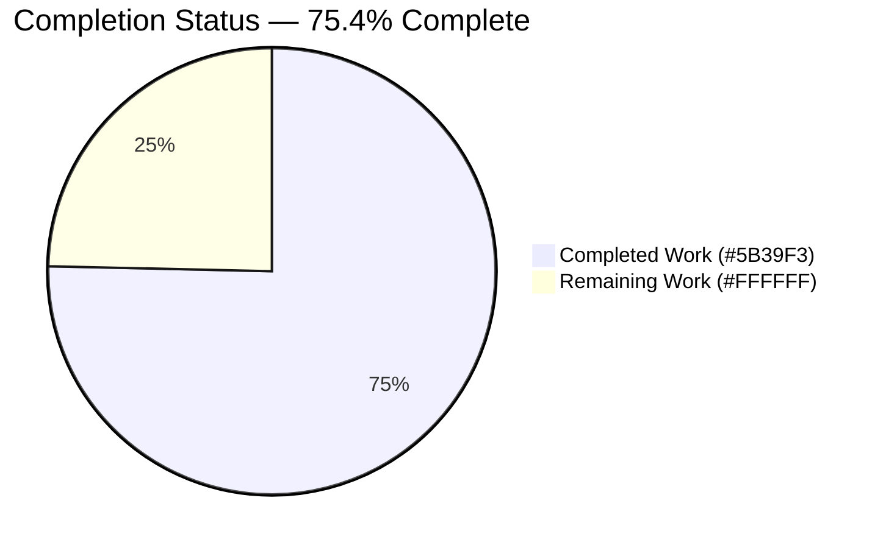
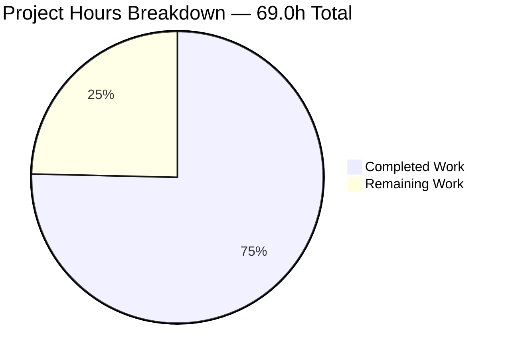
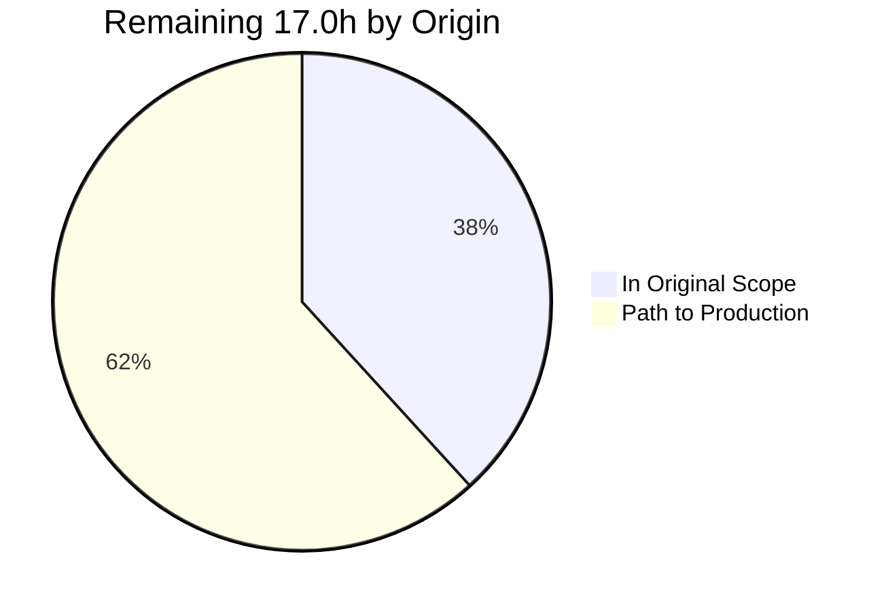
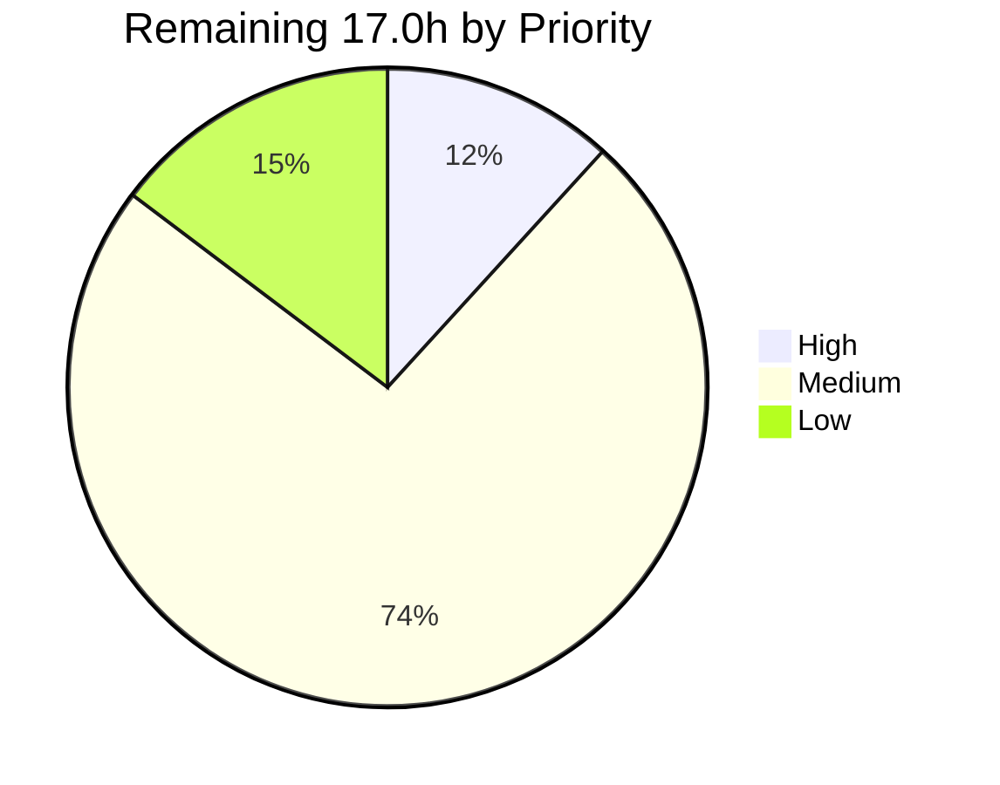

# 1. Executive Summary

## 1.1 Project Overview

This Node.js tutorial served one hard-coded greeting from a 14-line `http.createServer` handler that answered every path and method identically. Express was adopted as the request-dispatch mechanism and a second endpoint added returning `Good evening`, while the original greeting still answers byte-for-byte as before. Its audience is a learner reading the repository and running it over loopback. The project now demonstrates real routing, installs reproducibly, and verifies itself with its own documented commands — where previously neither `npm start` nor `npm test` worked. Six files were in scope.

## 1.2 Completion Status



| Metric | Value |
|--------|-------|
| **Total Hours** | **69.0** |
| Completed Hours (AI + Manual) | 52.0 (52.0 autonomous + 0.0 manual) |
| Remaining Hours | 17.0 |
| **Percent Complete** | **75.4%** (52.0 ÷ 69.0) |

Every planned deliverable is implemented and verified. The 17.0 remaining hours are 6.5 hours of contract decisions, one coverage gap and a documentation refresh, plus 10.5 hours of path-to-production work the plan placed outside this change.

## 1.3 Key Accomplishments

- ✅ Express 5.2.1 serves all traffic through an ordered route table (`server.js`)
- ✅ `GET /good-evening` returns `200` / plain text / 13 bytes `Good evening`
- ✅ `GET /` still returns `200` / 14 bytes `Hello, World!` with its original validator
- ✅ Unmatched paths and non-GET methods return a 10-byte plain-text `404`, never an HTML page
- ✅ Loopback bind, literal port and byte-exact startup log survive the migration
- ✅ A failed bind exits `1` and names the cause instead of reporting success
- ✅ `npm ci` rebuilds 67 packages from the lockfile; audit clean, all licences permissive
- ✅ Both endpoints documented in the README with its original notice byte-preserved

## 1.4 Critical Unresolved Issues

| Issue | Impact | Owner | ETA |
|-------|--------|-------|-----|
| Declared Node engine floor is `>=18.8.0` where the plan specifies `>=18` (§5.2 D1) | Metadata only — the narrower value is the measured floor for the documented test command. Needs an owner's decision before sign-off | Repository owner | 1.0h |
| `HEAD /` and `HEAD /good-evening` return `200` with an empty body where the agreed compatibility table put every non-GET method on the `404` path (§5.2 D6) | Delivered behaviour is RFC 9110-conformant and documented, but differs from what was agreed. Needs an owner's decision | Repository owner | 1.0h |
| The bind/listen block (`server.js:27-38`) is reached by no automated test | Verified by hand — an occupied port exits `1` with no false success line — but a future edit could reintroduce a silent failure unnoticed | Repository owner | 2.0h |
| A backgrounded `npm start` cannot be stopped by signalling the npm process; the server survives holding port 3000 | Accepted operational caveat, undocumented in the repository. Stop by process group or by the `node` pid | Repository owner | 0.5h |

## 1.5 Access Issues

**No access issues identified.** The public npm registry is reachable unauthenticated; there is no `.npmrc`, token, or private package. The code needs no environment variable and no secret — no `process.env` or `dotenv` reference exists. Nothing requires credentials: there is no database, queue, cache or third-party service, and the working branch is in sync with its remote.

## 1.6 Recommended Next Steps

1. **[High]** Confirm or revert the declared Node engine floor (`package.json:16`) — 1.0h
2. **[High]** Confirm the `HEAD`-on-known-routes contract, or guard it to the 404 — 1.0h
3. **[Medium]** Assert a non-zero exit on an occupied port, closing the uncovered region — 2.0h
4. **[Medium]** Run `npm ci`, `npm test` and `npm audit` in a pipeline on push — 3.0h
5. **[Medium]** Settle packaging, supervision and exposure before any deployment — 5.0h

# 2. Project Hours Breakdown

## 2.1 Completed Work Detail

Every component below traces to a specific requirement of the plan and to code in the repository.

| Component | Hours | Description |
|-----------|-------|-------------|
| Express adoption & application bootstrap | 4.0 | `require('express')` replaces `require('http')`; `app = express()` owns an ordered three-registration route table; CommonJS retained with no `type` field (`server.js:1-8`) |
| Dependency declaration, lockfile determinism & supply chain | 5.0 | `express` declared at `^5.2.1` and resolved to 5.2.1; lockfile regenerated to 68 entries at version 3; `npm ci` rebuilds 67 packages from the lockfile alone; audit clean; licences MIT ×62, ISC ×4, BSD-3-Clause ×1 |
| Preserved `GET /` greeting, byte-exact | 1.5 | `200` / `text/plain; charset=utf-8` / 14 bytes `Hello, World!`, with the same weak validator the pre-change server emitted (`server.js:11-13`) |
| New `GET /good-evening` endpoint | 1.5 | `200` / 13 bytes `Good evening` (`server.js:15-17`) |
| Terminal plain-text 404 & Express 5 route-syntax safety | 2.0 | Pathless `app.use` registered last so it never shadows the routes; avoids the bare `*` path Express 5 rejects; `404` / 10 bytes `Not Found` (`server.js:21-23`) |
| Listen semantics, loopback bind & bind-failure signalling | 3.5 | `127.0.0.1` and `3000` literals and the `(port, hostname, callback)` signature carried over; startup log reproduced character-for-character; a failed bind exits `1` with the real cause and prints no success line (`server.js:26-38`) |
| npm entry point, scripts, engine floor & repository hygiene | 3.0 | `main` corrected from a non-existent `index.js` to `server.js`; `start` added; `test` moved off a script that failed by design; engine floor declared; `.gitignore` created and proven effective for all three patterns |
| Endpoint smoke suite and its runtime hardening | 6.0 | 3 cases / 10 assertions on Node built-ins only, bound to an ephemeral port so it never collides with a running server; suite-scoped lifecycle with a listening-guarded teardown (`test/server.test.js`) |
| Tutorial documentation, append-only | 2.0 | Prerequisite, three commands, base URL, endpoint table and the exact response contract appended to `README.md`; the repository's original two-line notice preserved byte-for-byte |
| Runtime & browser verification of the measured HTTP contract | 8.0 | Status, media type, byte counts and headers verified for both endpoints and the fallback across path classes and eight methods, by command line and in a real browser |
| Cross-runtime compatibility & engine-contract verification | 3.5 | The suite exercised across every runtime line the declared floor admits, and runtimes below the floor confirmed to be excluded by npm's own engine check |
| Runtime security, resilience & hostile-input verification | 4.0 | Injection, traversal, header-injection, oversize and protocol-abuse probes; no reflection, no framework or path disclosure, no stack traces, no CORS or cookie surface |
| Multi-lens code review & full acceptance walkthrough | 8.0 | Configuration, API contract, observability, documentation, tests, completeness, security, rule compliance and comment quality reviewed across all six files; all fifteen acceptance criteria and the Definition of Done walked end to end |
| **Total** | **52.0** | |

## 2.2 Remaining Work Detail

| Category | Hours | Priority |
|----------|-------|----------|
| Confirm the declared Node engine floor (`>=18.8.0` vs the specified `>=18`) | 1.0 | High |
| Confirm the `HEAD`-on-known-routes contract (`200` vs `404`) | 1.0 | High |
| Automated coverage for the bind-failure path (`server.js:27-38`) | 2.0 | Medium |
| Document the stop procedure for a backgrounded start | 0.5 | Medium |
| Refresh the specification statements this change supersedes (zero-dependency KPI, routing exclusions, affected decision records) | 2.0 | Medium |
| Continuous verification pipeline (`npm ci` + `npm test` + `npm audit`) | 3.0 | Medium |
| Runtime packaging & process supervision (service definition, restart policy) | 3.0 | Medium |
| Deployment configuration beyond loopback (host/port externalisation, exposure review) | 2.0 | Medium |
| Move to a maintained Node LTS line and re-verify | 1.5 | Low |
| Operational observability baseline (health signal or request logging) | 1.0 | Low |
| **Total** | **17.0** | |

Split by origin: 6.5 hours are scoped in the plan (the first five rows), 10.5 hours are path-to-production activities the plan explicitly placed outside the code change. Split by priority: High 2.0h, Medium 12.5h, Low 2.5h.

## 2.3 Basis of Estimate

Total project hours are the sum of the two tables above: 52.0 completed + 17.0 remaining = **69.0**, giving **52.0 ÷ 69.0 = 75.4% complete**. Completed hours were derived per component from the delivered code and the verification actually performed against it — the hand-authored change is 147 insertions and 12 deletions across five files plus an npm-regenerated lockfile, and the majority of the effort sits in verification rather than in authoring, which is proportionate for a change whose central requirement was that existing behaviour not move. Remaining hours use conservative per-task figures: 0.5–1.0h for a decision or a one-line documentation edit, 2.0h for a test case plus the acceptance wording that moves with it, 2.0–3.0h for each piece of deployment scaffolding that does not exist yet. Confidence is high on the completed side, where every figure is anchored to code and to observed command output, and medium on the two packaging and configuration rows, whose real cost depends on a deployment target that has not been chosen.

# 3. Test Results

The suite is `test/server.test.js`, executed with the project's own `npm test` (bare `node --test`). Every figure below was observed from a run of that command on Node v24.19.0; coverage figures come from `node --test --experimental-test-coverage` against the same suite.

| Area / Category | Framework | Tests | Passed | Failed | Coverage | What This Proves |
|-----------------|-----------|-------|--------|--------|----------|------------------|
| Endpoint smoke suite (whole suite) | `node:test` + `node:assert/strict` | 3 | 3 | 0 | `server.js` 70% line / 80% branch / 75% funcs | The documented verification command succeeds from a clean install and the assertions are byte-level, not smoke-deep |
| `GET /` preserved greeting | `node:test` | 1 | 1 | 0 | routes covered | The original greeting still answers `200` with the exact 14-byte body, so the tutorial's existing behaviour did not regress |
| `GET /good-evening` new endpoint | `node:test` | 1 | 1 | 0 | routes covered | The requested endpoint answers `200` with the exact 13-byte body and a plain-text media type |
| Terminal 404 fallback | `node:test` | 1 | 1 | 0 | terminal handler covered | An unrouted path yields `404` with the exact 10-byte plain-text body rather than Express's HTML error page |
| Framework fingerprint suppression | `node:test` (assertion inside the root case) | — | pass | 0 | `app.disable` covered | `X-Powered-By` cannot silently return; deleting the hardening line fails the suite |
| Static syntax gate | `node --check` | 2 files | 2 | 0 | n/a | Both JavaScript files parse; this project has no compile or transpile step, so this is its full build surface |
| Dependency integrity | `npm ci` + `npm audit` | 68 packages | 68 | 0 | n/a | The lockfile alone reproduces the 67-package tree and the whole tree audits clean at every severity |
| Test isolation | `npm test` with port 3000 occupied | 3 | 3 | 0 | n/a | The suite binds an ephemeral port, so it never collides with a server a developer already has running |

Suite totals as reported by the runner: `tests 3 / suites 1 / pass 3 / fail 0 / cancelled 0 / skipped 0 / todo 0`, exit code 0, 10 assertions across the three cases.

**Not Covered** — delivered behaviour that no automated test exercises, and what to check before release:

- **The bind/listen block (`server.js:27-38`)** is the single uncovered region — the coverage output names exactly those lines. It contains the error branch that reports a failed bind and sets a non-zero exit code. Verified by hand (with port 3000 held, the process exits `1`, prints nothing to stdout and reports `Error: listen EADDRINUSE: address already in use 127.0.0.1:3000`), but nothing re-checks it. Test it manually after any edit to that block, or add the case costed in §2.2.
- **The declared engine floor** in `package.json` and the lockfile root has no assertion behind it. npm only enforces `engines` when `engine-strict` is set and this project has no `.npmrc`, so the declaration and the code could drift apart without failing anything.
- **README claims** — the endpoint table, the byte counts and the documented commands — are prose. They match the running server today, but no test binds them to the code.
- **The suite's own defensive branches** (rejecting on a failed bind, propagating a close error) only run when a bind actually fails, which no test forces.
- **Malformed and oversized requests** (`400` / `431`) are answered by Node's HTTP parser before Express is reached, so no test can drive them through the application. They were measured to return empty bodies with no disclosure; re-check by hand if the runtime line changes.

# 4. Runtime Validation & UI Verification

The application was started with its documented command and driven end to end, from the command line and in a real headless browser. There is no user interface: every response is `text/plain`, the pages carry no HTML, no stylesheet and no client-side script (`document.scripts.length` is 0 on every page), so "UI verification" here means confirming what a browser actually renders and that no framework error page is ever substituted.

- ✅ **Start-up** — `npm start` binds `127.0.0.1:3000` and prints exactly `Server running at http://127.0.0.1:3000/` with nothing on stderr; the line matches the pre-change server character-for-character.
- ✅ **`GET /`** — `200`, `text/plain; charset=utf-8`, `Content-Length: 14`, body `Hello, World!`; the browser renders exactly that text and the weak validator matches the value the pre-change server produced.
- ✅ **`GET /good-evening`** — `200`, `text/plain; charset=utf-8`, `Content-Length: 13`, body `Good evening`; renders exactly that text in the browser.
- ✅ **Unmatched path** — `404`, `text/plain; charset=utf-8`, 10 bytes `Not Found`. Confirmed in the browser to be a genuine plain-text response: `document.doctype` is null, the raw wire body contains no `<` or `>`, and `Cannot GET` and every stack-trace and file-path signature are absent. Express's default HTML 404 is never served.
- ✅ **Method surface** — `HEAD /` and `HEAD /good-evening` answer `200` with an empty body and the correct content length; `POST`, `PUT`, `PATCH`, `DELETE` and `OPTIONS` on every path fall through to the `404`.
- ✅ **Response headers** — the complete set on every reachable path is `connection`, `content-length`, `content-type`, `date`, `etag`, `keep-alive`. `X-Powered-By` is absent (checked case-insensitively three ways) and no `Server` header is emitted.
- ✅ **Conditional requests** — replaying the returned validator yields `304` with a zero-byte body; a cache-bypassing request returns a fresh `200` with the identical body.
- ✅ **Hostile input** — a script payload in the query string returns the fixed 14-byte greeting byte-identically, with no fragment of the payload reflected in the body or in any header; a traversal path returns the `404`. No dialog, no injected node, no console output from the application.
- ✅ **Failure path** — starting a second instance while port 3000 is held exits `1`, prints no startup line, and reports `Error: listen EADDRINUSE: address already in use 127.0.0.1:3000` on stderr.
- ✅ **Import-only lifecycle** — `require('./server.js')` returns the application, opens no listener (zero active TCP resources) and exits on its own, which is what lets the suite bind an ephemeral port.

**Not exercised at runtime.** Only two behaviours in the delivered surface were not driven live. Bind failures other than an address clash (an unavailable address, or a privileged port) share the single generic error branch and were not reproduced in this environment. And the declared engine floor was not re-validated by installing an older runtime here — the application and the suite were exercised on Node v24.19.0. Nothing else in the delivered surface is unexercised: both endpoints, the fallback, every method, the header set, the conditional-request path and the failure path were all driven directly.

# 5. Compliance & Quality Review

## 5.1 Compliance Matrix

Each row is a deliverable of the plan and its verified state in the repository as it stands now.

| # | Deliverable | Benchmark | Status | Evidence |
|---|-------------|-----------|--------|----------|
| 1 | Express declared as a runtime dependency (R1a) | Declared, resolved, actually used | ✅ Pass | `package.json:12-14` declares `^5.2.1`; `npm ls express` resolves 5.2.1; `server.js:1` requires it |
| 2 | Deterministic dependency resolution (R1b) | Lockfile alone reproduces the tree | ✅ Pass | Lockfile v3, 68 entries; `npm ci` adds 67 packages and leaves the lockfile unchanged |
| 3 | Express replaces the raw `http` bootstrap (R1c) | No `require('http')`; routes registered on the app | ✅ Pass | `server.js:1-23`; three registrations in source order |
| 4 | Listen semantics preserved (R1d) | Same bind address, port, signature and startup log | ✅ Pass | `server.js:4-5, 29, 36`; startup line matches whole-line, byte for byte |
| 5 | `Good evening` endpoint (R2) | `200` / plain text / exact body | ✅ Pass | `server.js:15-17`; measured 13 bytes; asserted in `test/server.test.js` |
| 6 | Existing greeting preserved | Byte-identical status and body | ✅ Pass | `server.js:11-13`; measured 14 bytes with the pre-change validator |
| 7 | Uniform plain-text 404 (AR-3, AR-7) | Terminal pathless handler, no HTML page, no bare `*` path | ✅ Pass | `server.js:21-23`; browser-confirmed markup-free 10-byte body |
| 8 | Framework not fingerprinted (AR-5) | `X-Powered-By` absent everywhere | ✅ Pass | `server.js:8`; header absent on all reachable paths; asserted by the suite |
| 9 | CommonJS and package identity untouched | No `type` field; `name`, `version`, `author`, `license` unchanged | ✅ Pass | `package.json`; zero `import`/`export` statements in either file |
| 10 | Project runnable and self-verifying | `npm start` and `npm test` both work | ✅ Pass | `package.json:6-9`; `main` corrected to `server.js`; suite exits 0 with 3 passes |
| 11 | Dependency tree excluded from version control | `node_modules` ignored, nothing tracked beneath it | ✅ Pass | `.gitignore:1-3`; `git check-ignore` resolves all three patterns; 0 tracked files under `node_modules` |
| 12 | Documentation and out-of-scope integrity | Both endpoints documented; the original notice and unrelated artefacts untouched | ✅ Pass | `README.md` appended only, first 73 bytes hash-identical to the original; `BaseTest.java`, `100Pages.pdf`, `sample.doc` and `shared image.jpeg` byte-identical across baseline, HEAD and working tree |

Supply chain and licensing: `npm audit` reports zero findings at every severity across the 67-package tree, and every licence in it is permissive (MIT ×62, ISC ×4, BSD-3-Clause ×1), compatible with the project's own MIT licence. No linter or formatter is configured in this repository and none was introduced, so `node --check` plus the smoke suite are the automated quality gates; both are clean. A search of all six changed files finds no `TODO`, `FIXME`, `HACK`, placeholder, stub or empty error handler.

## 5.2 AAP & Rule Divergences and Gaps

Seven divergences were established. Two need an owner's decision, one is an accepted operational caveat, and four are departures from illustrative wording that a binding requirement of the plan compelled.

| # | What the AAP/Rule Required | What Was Delivered Instead | Why It Diverged | Impact | Remediation |
|---|---------------------------|---------------------------|-----------------|--------|-------------|
| D1 | `"engines": { "node": ">=18" }` (§0.6.1, §0.7.2.2) | `">=18.8.0"` in `package.json:16`, mirrored in the lockfile root and `README.md:6` | `>=18` was the framework's floor, not this project's; the mandated test command cannot run below 18.8.0 | Metadata only; strict subset of the framework's own range | Owner decision — accept, or restore and accept a false support claim (1.0h, §2.2) |
| D2 | Test lifecycle hooks shown at file level (§0.7.2.5) | The same hooks scoped inside one `describe` suite (`test/server.test.js:14-42`) | Node only began executing *file-level* hooks in 18.19.0/20.7.0; suite hooks have worked since the hooks existed | Positive — identical coverage, runs on far more runtimes | None |
| D3 | Listen callback shown taking no arguments (§0.7.2.1 Step 7) | Callback takes the error, reports it and exits non-zero (`server.js:29-37`) | The zero-argument form turned a failed bind into a success message and exit 0, breaking R1d | Positive — success path byte-identical, failure path restored | None |
| D4 | Suite built on `node:test`, `node:assert/strict` and global `fetch` (§0.4.4) | Also imports `once` from `node:events` (`test/server.test.js:3`) | Needed so a failed bind rejects with its real cause and leaves no listener attached | None — a built-in, so the zero-extra-package rule holds | None |
| D5 | Per-file brief asked for no 404-body and no `X-Powered-By` assertion | Both asserted inside the existing cases (`test/server.test.js:53, 76`) | Both are acceptance criteria of the plan and were otherwise unguarded | None — still three cases, so the acceptance signature holds | None |
| D6 | "Any other path **or method**" returns `404` (§0.6.4) | `HEAD /` and `HEAD /good-evening` return `200` with an empty body (`server.js:11, 15`) | Express serves `HEAD` from a `GET` route, and the plan's own mandated handler shape cannot exclude it | Behavioural — differs from the agreed table, matches RFC 9110 | Owner decision (1.0h, §2.2) |
| D7 | Preserve existing observable behaviour and document every delta | `npm start` does not forward `SIGTERM`; the caveat is not documented in the repository | A code fix needs process-supervision work the plan excludes, and the README's appended content is capped at four items | Operational — a backgrounded server can be orphaned holding port 3000 | One README line (0.5h, §2.2) |

**D1 — the declared Node engine floor.** The plan specifies `"engines": { "node": ">=18" }`, describing it as the framework's own floor. The repository declares `">=18.8.0"` at `package.json:16`, mirrored in the lockfile root and `README.md:6`. The cause is a conflict inside the plan itself: it also mandates `"test": "node --test"` and a `before`/`after` lifecycle, and Node's built-in runner does not export those hooks below 18.8.0 — so `>=18` advertises runtimes on which the documented verification command cannot run. The narrower value is a strict subset of the framework's range, so no dependency contract changes. Restoring the literal text means editing the manifest, regenerating the lockfile, updating the README, and reinstating a claim the project cannot honour.

**D2 — where the test lifecycle hooks live.** The plan illustrates the suite binding an ephemeral port in a `before` hook and closing it in `after`, written at file level. The delivered suite uses those hooks, that bind and the same three assertions, but scopes them inside one `describe` block (`test/server.test.js:14-42`). The reason is a runtime fact: Node only began executing file-level hooks in 18.19.0 and 20.7.0; below those, `before` was skipped — leaving the base URL undefined — and `after` never fired, so the run hung on an open socket. Suite-scoped hooks have always worked, so the delivered form runs everywhere the declared floor admits. A comment records why it must not be flattened.

**D3 — the listen callback signature.** The plan shows the listener as `app.listen(port, hostname, () => { console.log(...) })`. The repository passes a callback that takes the error, writes `Error: <message>` to stderr, sets a non-zero exit code and returns before logging (`server.js:29-37`). Express registers the callback you hand `app.listen` as the server's error handler as well as its success handler, so the zero-argument form received the bind error, discarded it, printed the success line and exited 0 with nothing listening — contradicting R1d's requirement to preserve the existing listen semantics, since the pre-Express server exited non-zero and named the cause. The success path, argument order and startup log are unchanged.

**D4 — one additional built-in import.** The plan describes the suite as resting on `node:test`, `node:assert/strict` and the global `fetch`. The delivered suite also imports `once` from `node:events` (`test/server.test.js:3`) to await the `listening` event. It was adopted because the alternative left a one-shot error listener attached after a successful bind and could settle the readiness promise on a failure, hiding the real cause behind a null dereference in the next statement. `node:events` is part of the runtime, so the binding constraint the plan actually cares about — zero additional packages — is untouched, and the manifest still has no `devDependencies`.

**D5 — two extra assertions inside the existing cases.** The per-file brief for the suite asked that the `Not Found` body not be asserted and that no `X-Powered-By` check be added. Both are present (`test/server.test.js:53` and `:76`). They were added because both properties are acceptance criteria of the plan — the plain-text 404 body belongs to its measured response contract and the absent header is a named criterion — and without them, deleting the single hardening line or changing the fallback body would fail nothing. The constraints carrying acceptance weight hold: still exactly three cases, so the documented `3 passed / 0 failed` signature stands, and no helper, fixture or dependency was introduced.

**D6 — `HEAD` on the two known routes.** The agreed compatibility table places "any other path **or method**" on the `404` path; the repository answers `HEAD /` and `HEAD /good-evening` with `200` and an empty body. The cause is structural: Express serves `HEAD` from a `GET` route by rewriting the method, and the handler shape the plan mandates — plain `app.get` registrations — cannot exclude it without a per-handler guard that re-implements the router's own dispatch decision. RFC 9110 also expects a `HEAD` response to mirror `GET`, so the delivered behaviour is conventional, and `README.md:23` documents it precisely. Every other verb reaches the `404` as agreed.

**D7 — stopping a backgrounded server.** The plan requires that existing observable behaviour be preserved and that every delta be documented. `npm start` runs the server as a grandchild through a shell wrapper and npm does not forward `SIGTERM` to it, so signalling the npm process leaves `node server.js` alive and still holding port 3000 — reproduced in this environment. It was not fixed because a code-level solution means signal handling and graceful shutdown, which the plan excludes, and it was not documented because the appended README content is capped at four items. The verified procedures are: Ctrl-C in the foreground, or signal the process group or the `node` pid when backgrounded.

**User-specified rules.** The project's single registered rule, `qa-rules-00`, has an empty body: it states no coding standard, no architectural constraint, no protected component, no naming or formatting convention and no required artefact. There is consequently no rule divergence, and no requirement was inferred on its behalf — no file entered scope and no decision in this project is attributable to it. In its place the work was held to enterprise-standard Node and Express practice, which is observable in the delivered code: a registry-verified dependency version rather than a floating tag, lockfile-proven reproducibility, no unused dependency, framework fingerprinting suppressed, the dependency tree kept out of version control, an explicit runtime floor where none was declared, machine-checkable acceptance criteria at zero package cost, and the pre-existing response preserved byte-for-byte.

# 6. Risk Assessment

These are forward-looking exposures in the delivered codebase — what could still go wrong in operation, not anything already settled.

| Risk | Category | Severity | Probability | Mitigation | Status |
|------|----------|----------|-------------|------------|--------|
| The bind/listen block (`server.js:27-38`) is the one region no test reaches, so a future edit could silently reintroduce a false startup success | Technical | Medium | Medium | Add a case that starts against an occupied port and asserts a non-zero exit; until then, re-check that block by hand after editing it | Open — 2.0h in §2.2 |
| A backgrounded `npm start` signalled at the npm process leaves the server orphaned holding port 3000 | Operational | Medium | High | Stop with Ctrl-C in the foreground, or signal the process group or the `node` pid; document the procedure in the README | Accepted caveat — 0.5h in §2.2 |
| Host and port are literals with no environment override, so two instances on one host always collide and no deployment can relocate the port without a code edit | Operational | Medium | Medium | Correct by design for a tutorial; externalise before any multi-instance or non-localhost deployment | Open by design — 2.0h in §2.2 |
| Nothing re-runs the verification automatically, so drift between the manifest, the README and the code would not fail anything | Operational | Low | High | A three-command pipeline (`npm ci`, `npm test`, `npm audit`) on push | Open — 3.0h in §2.2 |
| The service deliberately ships no authentication, CORS policy, rate limiting or TLS; exposing it beyond loopback would publish an unauthenticated, unthrottled endpoint | Security | Medium | Low | Keep the loopback bind, or add those controls as part of an exposure review before changing the bind address | Open by design — covered by the exposure review in §2.2 |
| One direct dependency pulls a 67-package transitive tree; it audits clean today, but a future advisory in any of those packages would land unnoticed | Security | Low | Medium | Run `npm audit` periodically, ideally inside the pipeline above; the lockfile makes any change explicit | Monitored |
| The declared floor targets Node 18, which reached end of life on 2025-04-30 | Operational | Low | Medium | Raise the floor to a maintained LTS line and re-run the suite | Open — 1.5h in §2.2 |
| No linter, formatter or build step is configured, so the syntax gate and the smoke suite are the only automated checks on source quality | Technical | Low | Low | Acceptable at 40 lines of application code; revisit if the file grows beyond tutorial scope | Accepted |

**Integration risk: none.** The application makes no outbound call, holds no credential, reads no environment variable, and integrates with no database, queue, cache or third-party service — confirmed by search and by the absence of any such descriptor in the repository. The npm registry is the only external system involved, and only at install time.

# 7. Visual Project Status

Brand colours: **Completed = Dark Blue `#5B39F3`**, **Remaining = White `#FFFFFF`**.



Remaining work by origin — 6.5 hours were scoped in the plan, 10.5 hours are path-to-production:



Remaining work by priority — High 2.0h, Medium 12.5h, Low 2.5h:



| Band | Hours | Share of Total |
|------|-------|----------------|
| Completed Work (`#5B39F3`) | 52.0 | 75.4% |
| Remaining Work (`#FFFFFF`) | 17.0 | 24.6% |
| **Total** | **69.0** | **100%** |

# 8. Summary & Recommendations

The requested change is delivered. Express 5.2.1 is a declared, pinned and genuinely used dependency: the raw `http` bootstrap is gone and an Express application owns an ordered route table that answers `GET /` with the original 14-byte greeting, `GET /good-evening` with the requested 13-byte `Good evening`, and everything else with a 10-byte plain-text `404`. The network characteristics the repository depended on did not move — the same loopback address, the same literal port, the same `(port, hostname, callback)` signature and a startup log reproduced character-for-character — and the original greeting still carries the same weak validator it did before the migration, which is byte-level proof the response did not drift. Two pre-existing defects were closed on the way: the manifest pointed at an entry file that did not exist, and its only script failed by design, so neither `npm start` nor `npm test` worked. Both work now.

Verification is proportionate to the fact that the central requirement was *not changing* existing behaviour. `npm test` reports three passing cases and ten assertions with no failures; both endpoints, the fallback, eight HTTP methods, the full header set, conditional requests, hostile query and path input, the import-only lifecycle and the bind-failure path were driven live; and a real browser confirmed that the plain-text contract survives rendering and that the fallback is never Express's HTML error page. The dependency tree reproduces exactly from the lockfile, audits clean at every severity, and carries only permissive licences. Every file outside the agreed scope — the Java scaffold and the three binary assets — is byte-identical to where it started, and the repository's own "Do not touch!" notice is preserved to the byte with documentation appended beneath it.

Against the plan's scope the project is **75.4% complete — 52.0 of 69.0 hours**. Every deliverable the plan defines is implemented and verified, so the residual is not unfinished features. Of the 17.0 remaining hours, 6.5 sit inside the plan's scope and are dominated by two decisions only the owner can take: whether the declared Node engine floor should be the measured `>=18.8.0` or the literal `>=18` the plan specifies, and whether `HEAD` on the two known routes should answer `200` as it now does and as RFC 9110 expects, or `404` as the agreed compatibility table stated. Both are one-line reversals in either direction. Alongside them sit one real coverage gap — the bind/listen block is the only region no test reaches — a one-line documentation addition, and a refresh of the specification statements this change supersedes.

The other 10.5 hours are path-to-production work the plan deliberately placed outside the code change, and it is worth being explicit that the absence of a pipeline, a container, a configuration layer, a health endpoint and security middleware is a design decision rather than an oversight. What that means practically: the project is ready to be read, run and learned from today, and it is not yet ready to be *operated*. Anything beyond a developer's loopback needs a supervision story (a failed bind now correctly exits `1`, but nothing acts on that), a decision about the literal host and port, and — before the bind address changes — an exposure review, because the service ships no authentication, CORS policy, rate limiting or TLS by design.

**Production readiness: ready for local use and review; not yet ready for unattended deployment.** The recommended critical path is short. Take the two contract decisions first, since they gate sign-off and nothing else depends on them. Then add the bind-failure test and the pipeline, which together stop the one uncovered region and any future documentation drift from going unnoticed. Treat packaging, configuration and exposure as a single piece of work triggered only if this repository is ever meant to serve something other than localhost. Success metrics are already measurable and should stay green: `npm ci` reproducing 67 packages with zero audit findings, `npm test` exiting 0 with three passing cases, the startup line matching byte-for-byte, and the three response bodies holding at 14, 13 and 10 bytes.

# 9. Development Guide

Every command below was executed against this repository and the outputs shown are the ones observed. Run all of them from the repository root.

## 9.1 System Prerequisites

| Requirement | Value | Check |
|-------------|-------|-------|
| Node.js | **18.8.0 or newer** (declared in `engines.node`); verified on **v24.19.0** | `node -v` |
| npm | Bundled with Node; verified on **11.17.0** | `npm -v` |
| Operating system | Any platform Node supports; developed and verified on Linux x64 | — |
| Hardware | Negligible — a single process, ~4.3 MB of dependencies, ~72 MB resident | — |
| Network | Public npm registry reachable at install time only | `npm view express version` → `5.2.1` |

Nothing else is required. There is no database, cache, queue, container runtime or background service, no build/bundle/transpile step, and no linter or formatter configured.

```bash
node -v      # v24.19.0
npm -v       # 11.17.0
```

## 9.2 Environment Setup

There is nothing to configure. The project reads **no environment variables and no secrets** — a repository-wide search finds no `process.env` or `dotenv` reference — and the host and port are literals in `server.js`:

```bash
git clone <this-repository> && cd <repository>
grep -n "hostname\|const port" server.js
#   4: const hostname = '127.0.0.1';
#   5: const port = 3000;
```

Port **3000** must be free before starting. There is no `.npmrc`, so installs go to the public registry with no authentication.

## 9.3 Dependency Installation

```bash
npm ci
# added 67 packages, and audited 68 packages in 358ms
# found 0 vulnerabilities
```

Use `npm ci` for reproducibility — it installs strictly from `package-lock.json` and leaves the lockfile untouched. Use `npm install` only when intentionally updating a dependency; on the current tree it is idempotent and does not modify the lockfile. `node_modules/` is git-ignored, so a fresh clone always needs this step before anything else works.

## 9.4 Running the Application

```bash
npm start
# > hello_world@1.0.0 start
# > node server.js
# Server running at http://127.0.0.1:3000/
```

The process binds `127.0.0.1:3000` only — it is not reachable from another host. Stopping it:

```bash
# Foreground: Ctrl-C  (SIGINT reaches the whole process group)

# Backgrounded: npm does NOT forward SIGTERM to the server, so signal the
# process group, or the node process itself — not the npm process alone.
kill -TERM -"$(ps -o pgid= -p <npm-pid> | tr -d ' ')"
# or
kill "$(pgrep -f 'node server.js')"
```

## 9.5 Verification Steps

```bash
npm test
# ℹ tests 3   ℹ suites 1   ℹ pass 3   ℹ fail 0   ℹ cancelled 0   ℹ skipped 0   ℹ todo 0
# exit code 0

npm audit
# found 0 vulnerabilities

node --check server.js && node --check test/server.test.js   # exit 0 — the project's syntax gate

node --test --experimental-test-coverage
# ℹ server.js |  70.00 |    80.00 |   75.00 | 27-38
```

`npm test` must be the bare `node --test` form. It binds an ephemeral port, so it passes even while a server of your own is running on 3000. With the server up, verify the contract directly:

```bash
curl -sS -o /dev/null -w '%{http_code} %{size_download}\n' http://127.0.0.1:3000/              # 200 14
curl -sS -o /dev/null -w '%{http_code} %{size_download}\n' http://127.0.0.1:3000/good-evening  # 200 13
curl -sS -o /dev/null -w '%{http_code} %{size_download}\n' http://127.0.0.1:3000/nope          # 404 10
```

## 9.6 Example Usage

```bash
curl -s http://127.0.0.1:3000/              # Hello, World!
curl -s http://127.0.0.1:3000/good-evening  # Good evening
curl -s http://127.0.0.1:3000/nope          # Not Found

curl -sSI http://127.0.0.1:3000/good-evening
# HTTP/1.1 200 OK
# Content-Type: text/plain; charset=utf-8
# Content-Length: 13
# ETag: W/"d-7fFyiNLFhmJrNT+BforqesSHNow"
# Date: ...
# Connection: keep-alive
# Keep-Alive: timeout=5
#   (note: no X-Powered-By and no Server header)

# Conditional request — replay the validator and the server answers 304 with no body
curl -sS -o /dev/null -w '%{http_code} %{size_download}\n' \
  -H 'If-None-Match: W/"e-YP3pwjELDUytTauNEmsEOH77ook"' http://127.0.0.1:3000/   # 304 0
```

Importing the module instead of running it yields the application without opening a port, which is how the suite drives it:

```bash
node -e "const app = require('./server.js'); console.log(typeof app, process.getActiveResourcesInfo().filter(r => r.includes('TCP')));"
# function []
```

## 9.7 Troubleshooting

| Symptom | Cause | Resolution |
|---------|-------|------------|
| `Error: listen EADDRINUSE: address already in use 127.0.0.1:3000` and exit code 1, with no startup line | Something already holds port 3000 — the port is a literal and cannot be overridden | Stop the other listener (`kill "$(pgrep -f 'node server.js')"`), or just run `npm test`, which binds an ephemeral port |
| `npm start` "stopped" but requests still succeed | `npm start` runs the server as a grandchild and npm does not forward `SIGTERM` | Signal the process group or the `node` pid, as in §9.4 |
| `node --test test/` reports `'test failed'` and exits 1 | The directory-argument form fails on current Node; only the bare and glob forms work | Use `npm test` (bare `node --test`), or `node --test "test/**/*.test.js"` |
| `Cannot find module 'express'` | Dependencies are not installed; `node_modules/` is git-ignored | `npm ci` |
| `npm warn EBADENGINE` on install | The runtime is older than the declared floor of 18.8.0 | Install Node 18.8.0 or newer; check with `node -v` |
| An unexpected Node version in `node -v` | More than one Node can exist on `PATH`; the intended one resolves via `/usr/local/bin/node` | `which -a node`, then put the intended installation first on `PATH` |
| A request to an expected path returns `404` `Not Found` | Only `GET /` and `GET /good-evening` are routed (plus `HEAD` on both); every other path and verb reaches the terminal handler | Check the endpoint table in `README.md`; add a route in `server.js` **above** the terminal `app.use` if a new one is genuinely wanted |

# 10. Appendices

## Appendix A — Command Reference

| Command | Purpose | Observed Result |
|---------|---------|-----------------|
| `npm ci` | Deterministic install from the lockfile alone | added 67 packages, audited 68, 0 vulnerabilities |
| `npm install` | Install / update dependencies | Idempotent on the current tree; lockfile unchanged |
| `npm start` | Run the server (`node server.js`) | Logs `Server running at http://127.0.0.1:3000/` |
| `npm test` | Run the endpoint smoke suite (bare `node --test`) | tests 3 / suites 1 / pass 3 / fail 0, exit 0 |
| `npm audit` | Check the dependency tree for advisories | found 0 vulnerabilities |
| `node --check <file>` | The project's syntax gate (there is no build step) | exit 0 for both JavaScript files |
| `node --test --experimental-test-coverage` | Coverage for the suite | `server.js` 70% line / 80% branch / 75% funcs, uncovered 27-38 |
| `node --test "test/**/*.test.js"` | Alternative test invocation | tests 3 / pass 3 / fail 0 |
| `git check-ignore -v node_modules` | Prove the dependency tree is ignored | `.gitignore:1:node_modules/` |

Do **not** use `node --test test/` — the directory-argument form fails on current Node.

## Appendix B — Port Reference

| Port | Bound By | Address | Notes |
|------|----------|---------|-------|
| 3000 | `server.js` when run directly | `127.0.0.1` only | Hard-coded literal; not reachable from another host; the only shared resource this project needs |
| ephemeral (0) | `test/server.test.js` | `127.0.0.1` | The kernel picks a free port, so the suite never collides with a running server |
| 4723 | `BaseTest.java` (unrelated, out of scope) | `127.0.0.1` | An Appium scaffold with no build descriptor; shares no code path with the server |

## Appendix C — Key File Locations

| Path | Role |
|------|------|
| `server.js` | The entire application — 40 lines: Express bootstrap, `app.disable('x-powered-by')`, two `GET` routes, terminal 404 handler, guarded `listen`, `module.exports` |
| `test/server.test.js` | Endpoint smoke suite — 78 lines, 3 cases, 10 assertions, Node built-ins only |
| `package.json` | Manifest — `main`, `start`/`test` scripts, `dependencies.express`, `engines.node` |
| `package-lock.json` | Lockfile v3, 68 entries, pins the 67-package tree |
| `.gitignore` | `node_modules/`, `npm-debug.log*`, `.env` |
| `README.md` | The only documentation surface: prerequisite, commands, base URL, endpoint table, response contract |
| `BaseTest.java`, `100Pages.pdf`, `sample.doc`, `shared image.jpeg` | Unrelated pre-existing artefacts — out of scope and byte-identical to where they started |

## Appendix D — Technology Versions

| Component | Version | Source |
|-----------|---------|--------|
| Node.js | v24.19.0 (V8 13.6.233.17-node.51) | `node -v` |
| npm | 11.17.0 | `npm -v` |
| Express | 5.2.1 (declared `^5.2.1`, MIT, its own floor `>= 18`) | `npm ls express` |
| Transitive tree | 67 packages; licences MIT ×62, ISC ×4, BSD-3-Clause ×1 | Lockfile and installed tree |
| Lockfile format | `lockfileVersion` 3, 68 `packages` entries | `package-lock.json` |
| Module system | CommonJS (no `type` field) | `package.json` |
| Test framework | `node:test` + `node:assert/strict` (zero third-party packages, no `devDependencies`) | `test/server.test.js` |

## Appendix E — Environment Variable Reference

**None.** The project defines, reads and requires no environment variable and no secret; a repository-wide search finds no `process.env` or `dotenv` reference. Host and port are literals in `server.js:4-5` by design. If the service must ever bind a different address or port, that is a code change today — see the deployment-configuration item in §2.2.

## Appendix F — Developer Tools Guide

| Concern | State | Notes |
|---------|-------|-------|
| Build / bundle / transpile | None by design | `node server.js` runs the source directly; do not add a build script |
| Linting / formatting | Not configured | No ESLint, Prettier, EditorConfig or Biome configuration exists, and no `devDependencies`; `node --check` is the syntax gate |
| Type checking | Not applicable | Plain CommonJS JavaScript; no TypeScript and no type packages |
| Test runner | Node's built-in runner | Must be invoked as the bare `node --test`; the suite binds an ephemeral port and closes it in teardown |
| Coverage | Available via `node --test --experimental-test-coverage` | Not wired into any script |
| Continuous integration | None | No pipeline descriptor of any kind exists — see §2.2 |
| Git hooks | Four Git LFS shims (`post-checkout`, `post-commit`, `post-merge`, `pre-push`) | No pre-commit hook; nothing project-specific |
| Debugging | `node --inspect server.js`, then attach Chrome DevTools | The application logs one line at startup and nothing per request |

## Appendix G — Glossary

| Term | Meaning in this project |
|------|-------------------------|
| Terminal handler | The pathless `app.use` at `server.js:21`, registered last so it answers anything the two routes do not match — with plain text rather than Express's HTML error page |
| Weak validator (`ETag`) | The `W/"…"` response header Express derives from the body; identical values across runs are byte-level proof a response has not changed |
| Ephemeral port | Port `0`, which asks the kernel for any free port; the suite uses it so it never contends for 3000 |
| Import-only lifecycle | `require('./server.js')` returns the application without binding a socket, because `listen` sits behind a `require.main === module` guard |
| Engine floor | The lowest Node version the manifest declares support for; here it is set by the test runner's hook APIs, not by Express |
| Syntax gate | `node --check`, this project's stand-in for a compile step, since there is no build phase |
| Byte-exact | Verified at the level of individual bytes — the greetings are 14 and 13 bytes and the fallback 10, trailing newline included |
