# Technical Specification

# 1. Introduction

This Technical Specification documents the **hao-backprop-test** repository, a deliberately minimal Node.js server application designed to serve as a controlled test subject for Backprop integration testing. This document provides stakeholders with a comprehensive understanding of the system's purpose, technical composition, and defined boundaries.

## 1.1 Executive Summary

### 1.1.1 Project Overview

The hao-backprop-test project is a lightweight "Hello World" Node.js HTTP server created specifically for Backprop integration testing purposes. Backprop is a tool or service utilized for code analysis, refactoring, or AI-assisted development workflows. This repository provides a stable, minimal codebase that serves as a predictable test target for validating Backprop tooling capabilities.

| Attribute | Value |
|-----------|-------|
| Repository Name | hao-backprop-test |
| Package Name | hello_world |
| Version | 1.0.0 |
| License | MIT |

### 1.1.2 Core Business Problem

Integration testing of code analysis and AI-assisted development tools requires stable, well-understood codebases with predictable structures. This project addresses the need for:

- A controlled environment where Backprop integration can be validated without affecting production systems
- A minimal codebase with known behavior that enables reliable test assertions
- A diverse file composition (source code, documents, images) to test comprehensive tooling capabilities

### 1.1.3 Key Stakeholders and Users

| Stakeholder | Role | Primary Interest |
|-------------|------|------------------|
| Backprop Development Team | Primary Consumer | Integration testing and validation |
| Developer (hxu) | Author/Maintainer | Repository governance and stability |
| QA/Test Engineers | Secondary Users | Mobile automation test infrastructure |

### 1.1.4 Value Proposition

The project delivers value through:

- **Predictability**: A minimal, unchanging codebase ensures consistent test results across Backprop integration cycles
- **Simplicity**: Zero external dependencies eliminate version conflicts and environment variability
- **Multi-format Coverage**: Inclusion of diverse file types (JavaScript, Java, PDF, DOC, JPEG) enables comprehensive tooling validation
- **Governance Clarity**: Explicit "Do not touch!" directive in documentation ensures test stability

## 1.2 System Overview

### 1.2.1 Project Context

#### Business Context and Market Positioning

This repository exists within the Backprop development ecosystem as a dedicated test fixture. It is explicitly **not intended for production deployment** and carries no market positioning beyond its role as an integration testing resource.

The `README.md` file contains the directive: *"test project for backprop integration. Do not touch!"* — establishing clear governance expectations for all stakeholders.

#### Current System Limitations

As a purpose-built test project, the following characteristics are intentional design constraints rather than limitations:

| Constraint | Rationale |
|------------|-----------|
| No external dependencies | Eliminates version drift and ensures reproducibility |
| Localhost-only binding | Prevents unintended network exposure |
| No configuration externalization | Reduces complexity for testing scenarios |
| No error handling | Maintains minimal code surface for analysis |

#### Integration with Existing Enterprise Landscape

The system operates in isolation and does not integrate with enterprise infrastructure. Its sole integration point is with Backprop tooling, which consumes the repository for analysis and testing purposes.

### 1.2.2 High-Level Description

#### Primary System Capabilities

The system provides a single core capability: serving HTTP responses with "Hello, World!" content.

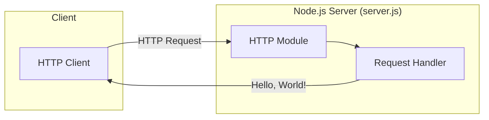

#### Major System Components

| Component | File | Technology | Description |
|-----------|------|------------|-------------|
| HTTP Server | `server.js` | Node.js http module | Serves Hello World responses on port 3000 |
| Test Infrastructure | `BaseTest.java` | Java/TestNG/Appium | Android mobile automation test base class |
| Package Configuration | `package.json` | npm | Project metadata and script definitions |
| Test Assets | Various | PDF, DOC, JPEG | Sample files for comprehensive testing |

#### Core Technical Approach

The system employs a minimalist architecture using exclusively Node.js built-in modules:

| Aspect | Implementation |
|--------|----------------|
| Server Framework | Node.js native `http` module |
| Binding Address | 127.0.0.1 (localhost) |
| Port | 3000 |
| Response Format | Plain text (text/plain) |
| HTTP Status | 200 OK |
| Response Body | "Hello, World!\n" |

The architecture deliberately avoids:
- Routing logic (all requests receive identical responses)
- Middleware patterns
- External package dependencies
- Configuration management
- Logging infrastructure

### 1.2.3 Success Criteria

#### Measurable Objectives

| Objective | Measurement | Target |
|-----------|-------------|--------|
| Server Availability | HTTP response on port 3000 | 100% when running |
| Response Correctness | Response body content | "Hello, World!\n" |
| Response Status | HTTP status code | 200 |
| Content-Type Accuracy | Response header | text/plain |

#### Critical Success Factors

1. **Stability**: Repository remains unchanged to ensure consistent Backprop test results
2. **Simplicity**: Zero-dependency architecture ensures environment-independent execution
3. **Predictability**: Deterministic behavior enables reliable integration test assertions

#### Key Performance Indicators (KPIs)

| KPI | Description | Expected Value |
|-----|-------------|----------------|
| Startup Time | Time to begin accepting requests | < 1 second |
| Response Latency | Time to serve Hello World response | < 10ms |
| Memory Footprint | Node.js process memory usage | Minimal (baseline Node.js) |
| Dependency Count | External npm packages required | 0 |

## 1.3 Scope

### 1.3.1 In-Scope

#### Core Features and Functionalities

**Must-Have Capabilities:**

| Capability | Status | Implementation |
|------------|--------|----------------|
| HTTP Server Operation | Implemented | `server.js` |
| Hello World Response | Implemented | Response body in `server.js` |
| Localhost Binding | Implemented | Hostname configuration in `server.js` |
| Port 3000 Listening | Implemented | Port configuration in `server.js` |

**Primary User Workflows:**

1. **Start Server**: Execute `node server.js` to launch HTTP server
2. **Receive Response**: Send HTTP request to `http://127.0.0.1:3000` and receive "Hello, World!" response
3. **Stop Server**: Terminate Node.js process

**Essential Integrations:**

| Integration Point | Type | Purpose |
|-------------------|------|---------|
| Backprop Tooling | External Consumer | Code analysis and testing |
| npm Package Manager | Development Tool | Package metadata management |

**Key Technical Requirements:**

- Node.js runtime environment
- Available port 3000 on localhost
- No external dependencies required

#### Implementation Boundaries

**System Boundaries:**

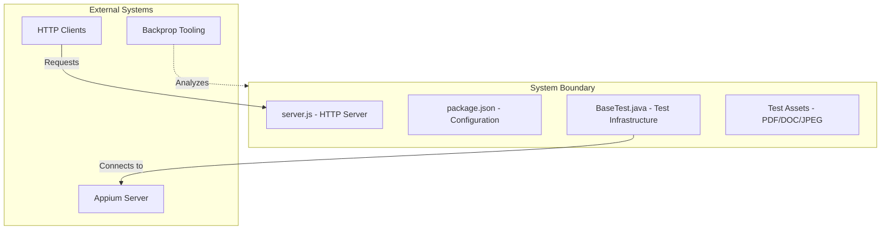

**User Groups Covered:**

| User Group | Access Level | Use Case |
|------------|--------------|----------|
| Backprop Team | Full repository access | Integration testing |
| Developers | Read access | Reference implementation |
| QA Engineers | Test infrastructure | Mobile automation setup |

**Geographic/Market Coverage:**

- Not applicable — test project with no geographic or market considerations

**Data Domains Included:**

| Domain | Files | Purpose |
|--------|-------|---------|
| Source Code | `server.js`, `BaseTest.java` | Primary test subjects |
| Configuration | `package.json`, `package-lock.json` | Package metadata |
| Documents | `100Pages.pdf`, `sample.doc` | File type diversity testing |
| Media | `shared image.jpeg` | Image processing testing |

### 1.3.2 Out-of-Scope

#### Excluded Features and Capabilities

The following capabilities are explicitly **not implemented** and are outside the scope of this project:

| Category | Excluded Items |
|----------|----------------|
| Routing | URL path handling, route parameters, query strings |
| Security | Authentication, authorization, HTTPS/SSL, input validation |
| Data Persistence | Database connections, file storage, caching |
| Configuration | Environment variables, external config files, .env support |
| Observability | Logging, metrics, health checks, tracing |
| Error Handling | Try-catch blocks, error responses, graceful degradation |
| Scalability | Load balancing, clustering, horizontal scaling |

#### Future Phase Considerations

This project is intentionally static and has no planned enhancements. Any modifications would compromise its purpose as a stable test fixture. Future considerations are explicitly excluded:

- Feature additions
- Dependency upgrades
- Architecture changes
- Performance optimizations

#### Integration Points Not Covered

| Integration | Status | Rationale |
|-------------|--------|-----------|
| External APIs | Not Supported | Maintains isolation |
| Databases | Not Supported | Unnecessary complexity |
| Message Queues | Not Supported | Outside test scope |
| Cloud Services | Not Supported | No deployment intent |
| CI/CD Pipelines | Not Supported | Static test project |
| Containerization | Not Supported | No Docker/Kubernetes |

#### Unsupported Use Cases

| Use Case | Support Status | Alternative |
|----------|----------------|-------------|
| Production Deployment | ❌ Not Supported | Use production-grade frameworks |
| Multi-user Access | ❌ Not Supported | Localhost binding only |
| API Development | ❌ Not Supported | No routing or REST patterns |
| Microservices Architecture | ❌ Not Supported | Single-purpose server |
| High Availability | ❌ Not Supported | No clustering or failover |

#### Configuration Inconsistencies

The following inconsistencies exist in the current implementation but are considered acceptable for a test project:

| Issue | Details | Impact |
|-------|---------|--------|
| Main Entry Point | `package.json` references `index.js`, but server is in `server.js` | npm start will fail; use `node server.js` directly |
| Test Script | npm test returns error (placeholder script) | No automated tests for Node.js code |
| Hardcoded Values | Hostname and port embedded in source | Configuration changes require code modification |

---

#### References

The following files and folders were examined to produce this documentation:

- `README.md` — Project name (hao-backprop-test), purpose statement, governance directive
- `package.json` — Package metadata including name (hello_world), version (1.0.0), author (hxu), license (MIT), and scripts configuration
- `package-lock.json` — Lockfile confirming zero external dependencies
- `server.js` — Complete HTTP server implementation with hostname, port, and response configuration
- `BaseTest.java` — Appium/TestNG test infrastructure with Android automation configuration
- Root folder (`/`) — Complete repository structure including test assets (100Pages.pdf, sample.doc, shared image.jpeg)

# 2. Product Requirements

## 2.1 Feature Catalog

This section provides a comprehensive catalog of all discrete, testable features identified within the hao-backprop-test repository. Each feature is documented with metadata, descriptions, dependencies, and technical context based on direct analysis of the source code.

### 2.1.1 Feature Overview Matrix

| Feature ID | Feature Name | Category | Priority | Status |
|------------|--------------|----------|----------|--------|
| F-001 | HTTP Server Operation | Core Functionality | Critical | Completed |
| F-002 | Hello World Response | Core Functionality | Critical | Completed |
| F-003 | Localhost Binding | Network Configuration | High | Completed |
| F-004 | Port 3000 Listening | Network Configuration | High | Completed |
| F-005 | Startup Console Logging | Observability | Low | Completed |

### 2.1.2 Feature F-001: HTTP Server Operation

#### Feature Metadata

| Attribute | Value |
|-----------|-------|
| Unique ID | F-001 |
| Feature Name | HTTP Server Operation |
| Feature Category | Core Functionality |
| Priority Level | Critical |
| Status | Completed |
| Implementation File | `server.js` (lines 1-14) |

#### Description

| Aspect | Details |
|--------|---------|
| Overview | Creates an HTTP server using the Node.js native `http` module, establishing the foundation for all request/response handling |
| Business Value | Provides a stable, predictable test target for Backprop integration testing and code analysis workflows |
| User Benefits | Enables immediate server startup without build steps, framework installations, or dependency management |
| Technical Context | Implements `http.createServer()` with a request handler callback that delegates to the Hello World Response feature |

#### Dependencies

| Dependency Type | Details |
|-----------------|---------|
| Prerequisite Features | None — foundational feature |
| System Dependencies | Node.js runtime with native `http` module |
| External Dependencies | None — zero npm packages required |
| Integration Requirements | Backprop tooling consumes repository for code analysis |

### 2.1.3 Feature F-002: Hello World Response

#### Feature Metadata

| Attribute | Value |
|-----------|-------|
| Unique ID | F-002 |
| Feature Name | Hello World Response |
| Feature Category | Core Functionality |
| Priority Level | Critical |
| Status | Completed |
| Implementation File | `server.js` (lines 7-9) |

#### Description

| Aspect | Details |
|--------|---------|
| Overview | Returns a plain text "Hello, World!\n" response with HTTP status 200 for all incoming requests |
| Business Value | Provides predictable, deterministic output for integration test assertions and code analysis validation |
| User Benefits | Simple, consistent response enables straightforward verification of server operation |
| Technical Context | Sets response status code, Content-Type header, and terminates response with exact string content |

#### Dependencies

| Dependency Type | Details |
|-----------------|---------|
| Prerequisite Features | F-001 (HTTP Server Operation) |
| System Dependencies | Node.js response object methods |
| External Dependencies | None |
| Integration Requirements | HTTP clients must parse text/plain content type |

### 2.1.4 Feature F-003: Localhost Binding

#### Feature Metadata

| Attribute | Value |
|-----------|-------|
| Unique ID | F-003 |
| Feature Name | Localhost Binding |
| Feature Category | Network Configuration |
| Priority Level | High |
| Status | Completed |
| Implementation File | `server.js` (line 3) |

#### Description

| Aspect | Details |
|--------|---------|
| Overview | Binds the HTTP server exclusively to the 127.0.0.1 loopback interface |
| Business Value | Prevents unintended network exposure, maintaining the project's test-only status |
| User Benefits | Ensures server is only accessible from the local machine |
| Technical Context | Hardcoded hostname constant passed to `server.listen()` method |

#### Dependencies

| Dependency Type | Details |
|-----------------|---------|
| Prerequisite Features | F-001 (HTTP Server Operation) |
| System Dependencies | Loopback network interface availability |
| External Dependencies | None |
| Integration Requirements | Clients must connect from localhost |

### 2.1.5 Feature F-004: Port 3000 Listening

#### Feature Metadata

| Attribute | Value |
|-----------|-------|
| Unique ID | F-004 |
| Feature Name | Port 3000 Listening |
| Feature Category | Network Configuration |
| Priority Level | High |
| Status | Completed |
| Implementation File | `server.js` (lines 4, 12) |

#### Description

| Aspect | Details |
|--------|---------|
| Overview | Configures the HTTP server to listen on port 3000 |
| Business Value | Provides a known, consistent endpoint for automated testing and integration validation |
| User Benefits | Predictable port assignment eliminates configuration guesswork |
| Technical Context | Hardcoded port constant used in `server.listen()` call |

#### Dependencies

| Dependency Type | Details |
|-----------------|---------|
| Prerequisite Features | F-001 (HTTP Server Operation) |
| System Dependencies | Port 3000 must be available (not in use) |
| External Dependencies | None |
| Integration Requirements | Firewall rules must permit localhost:3000 |

### 2.1.6 Feature F-005: Startup Console Logging

#### Feature Metadata

| Attribute | Value |
|-----------|-------|
| Unique ID | F-005 |
| Feature Name | Startup Console Logging |
| Feature Category | Observability |
| Priority Level | Low |
| Status | Completed |
| Implementation File | `server.js` (line 13) |

#### Description

| Aspect | Details |
|--------|---------|
| Overview | Outputs the server URL to the console when the server successfully starts |
| Business Value | Provides visual confirmation of successful server initialization |
| User Benefits | Clear feedback indicates server is operational and accessible |
| Technical Context | Uses template literal with `console.log()` in `server.listen()` callback |

#### Dependencies

| Dependency Type | Details |
|-----------------|---------|
| Prerequisite Features | F-001, F-003, F-004 (Server, Hostname, Port) |
| System Dependencies | Node.js console object |
| External Dependencies | None |
| Integration Requirements | Terminal/console for log output |

---

## 2.2 Functional Requirements Tables

This section provides detailed functional requirements for each feature, including acceptance criteria, input/output specifications, and validation rules.

### 2.2.1 Feature F-001: HTTP Server Operation

#### Requirement F-001-RQ-001: Native HTTP Module Usage

| Attribute | Specification |
|-----------|---------------|
| Requirement ID | F-001-RQ-001 |
| Description | Server must use Node.js built-in `http` module exclusively |
| Priority | Must-Have |
| Complexity | Low |

| Technical Details | Value |
|-------------------|-------|
| Input Parameters | None required |
| Output/Response | HTTP server instance |
| Performance Criteria | Server available < 1 second after start |
| Data Requirements | None |

| Acceptance Criteria |
|---------------------|
| 1. Server uses `require('http')` for module import |
| 2. No external HTTP frameworks (Express, Fastify, Koa, etc.) are used |
| 3. `http.createServer()` method initializes the server |

#### Requirement F-001-RQ-002: Zero External Dependencies

| Attribute | Specification |
|-----------|---------------|
| Requirement ID | F-001-RQ-002 |
| Description | Project must have no npm dependencies |
| Priority | Must-Have |
| Complexity | Low |

| Technical Details | Value |
|-------------------|-------|
| Input Parameters | N/A |
| Output/Response | N/A |
| Performance Criteria | N/A |
| Data Requirements | Empty dependencies in package.json |

| Acceptance Criteria |
|---------------------|
| 1. `package.json` contains no `dependencies` key |
| 2. `package.json` contains no `devDependencies` key |
| 3. `package-lock.json` has empty packages object |
| 4. `npm ls` returns no dependency tree |

### 2.2.2 Feature F-002: Hello World Response

#### Requirement F-002-RQ-001: Response Status Code

| Attribute | Specification |
|-----------|---------------|
| Requirement ID | F-002-RQ-001 |
| Description | All HTTP responses must return status 200 |
| Priority | Must-Have |
| Complexity | Low |

| Technical Details | Value |
|-------------------|-------|
| Input Parameters | Any HTTP request to server |
| Output/Response | HTTP 200 OK status |
| Performance Criteria | Response within 10ms |
| Data Requirements | None |

| Validation Rules |
|------------------|
| Business Rule: All requests receive identical status code |
| Data Validation: Status code is integer 200 |
| Security Requirements: N/A |
| Compliance Requirements: HTTP/1.1 specification |

#### Requirement F-002-RQ-002: Response Content-Type Header

| Attribute | Specification |
|-----------|---------------|
| Requirement ID | F-002-RQ-002 |
| Description | Response must include Content-Type: text/plain header |
| Priority | Must-Have |
| Complexity | Low |

| Technical Details | Value |
|-------------------|-------|
| Input Parameters | Any HTTP request |
| Output/Response | Header: `Content-Type: text/plain` |
| Performance Criteria | Included in response headers |
| Data Requirements | None |

| Acceptance Criteria |
|---------------------|
| 1. Response headers contain Content-Type key |
| 2. Content-Type value is exactly "text/plain" |
| 3. Header set via `res.setHeader()` method |

#### Requirement F-002-RQ-003: Response Body Content

| Attribute | Specification |
|-----------|---------------|
| Requirement ID | F-002-RQ-003 |
| Description | Response body must be exactly "Hello, World!\n" |
| Priority | Must-Have |
| Complexity | Low |

| Technical Details | Value |
|-------------------|-------|
| Input Parameters | Any HTTP request |
| Output/Response | String: "Hello, World!\n" (14 characters) |
| Performance Criteria | Response latency < 10ms |
| Data Requirements | Static string content |

| Validation Rules |
|------------------|
| Business Rule: Response content never changes |
| Data Validation: Exact string match including trailing newline |
| Security Requirements: No user input reflected in response |
| Compliance Requirements: UTF-8 encoding |

### 2.2.3 Feature F-003: Localhost Binding

#### Requirement F-003-RQ-001: Localhost Only Binding

| Attribute | Specification |
|-----------|---------------|
| Requirement ID | F-003-RQ-001 |
| Description | Server must bind to 127.0.0.1 only |
| Priority | Must-Have |
| Complexity | Low |

| Technical Details | Value |
|-------------------|-------|
| Input Parameters | Hostname constant |
| Output/Response | Server bound to loopback interface |
| Performance Criteria | N/A |
| Data Requirements | Hardcoded value in source |

| Validation Rules |
|------------------|
| Business Rule: Network isolation mandatory |
| Data Validation: Hostname equals "127.0.0.1" |
| Security Requirements: Prevents external network access |
| Compliance Requirements: N/A |

### 2.2.4 Feature F-004: Port 3000 Listening

#### Requirement F-004-RQ-001: Port Configuration

| Attribute | Specification |
|-----------|---------------|
| Requirement ID | F-004-RQ-001 |
| Description | Server must listen on port 3000 |
| Priority | Must-Have |
| Complexity | Low |

| Technical Details | Value |
|-------------------|-------|
| Input Parameters | Port constant |
| Output/Response | Server listening on port 3000 |
| Performance Criteria | Port bound immediately on start |
| Data Requirements | Hardcoded value in source |

| Acceptance Criteria |
|---------------------|
| 1. Port constant equals 3000 |
| 2. Server binds to specified port on startup |
| 3. HTTP requests to localhost:3000 receive responses |

---

## 2.3 Feature Relationships

This section documents the relationships, dependencies, and shared components between features identified in the repository.

### 2.3.1 Feature Dependencies Map

The following diagram illustrates the hierarchical dependency relationships between features:

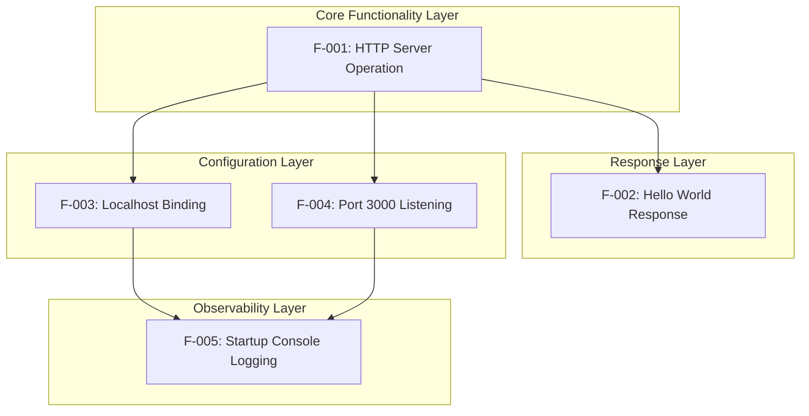

### 2.3.2 Dependency Matrix

| Feature | Depends On | Depended By |
|---------|------------|-------------|
| F-001 | None (Foundation) | F-002, F-003, F-004 |
| F-002 | F-001 | None |
| F-003 | F-001 | F-005 |
| F-004 | F-001 | F-005 |
| F-005 | F-003, F-004 | None |

### 2.3.3 Integration Points

| Integration Point | Features Involved | Description |
|-------------------|-------------------|-------------|
| Server Initialization | F-001, F-003, F-004 | `server.listen(port, hostname, callback)` combines all three |
| Request Handler | F-001, F-002 | createServer callback invokes response logic |
| Startup Callback | F-004, F-003, F-005 | listen callback uses constants for logging |

### 2.3.4 Shared Components

| Component | Location | Used By Features |
|-----------|----------|------------------|
| `http` module | `server.js` line 1 | F-001 |
| `hostname` constant | `server.js` line 3 | F-001, F-003, F-005 |
| `port` constant | `server.js` line 4 | F-001, F-004, F-005 |
| `server` object | `server.js` line 6 | F-001, F-002, F-005 |

### 2.3.5 Common Services

| Service | Implementation | Features Served |
|---------|----------------|-----------------|
| HTTP Request Handling | Node.js http module | All features |
| Console Output | Node.js console object | F-005 |
| Network Binding | Node.js net layer | F-003, F-004 |

---

## 2.4 Implementation Considerations

This section documents the technical constraints, performance requirements, and other considerations derived from the source code analysis.

### 2.4.1 Technical Constraints

#### Architectural Constraints

| Constraint | Evidence | Rationale |
|------------|----------|-----------|
| No routing logic | All requests handled by single callback in `server.js` | Maintains minimal codebase for testing |
| No error handling | No try-catch blocks in source | Reduces code complexity |
| No middleware pattern | Direct http module usage | Zero dependency requirement |
| Hardcoded configuration | hostname and port as constants | Configuration changes require code modification |

#### Configuration Constraints

| Configuration | Current Value | Modifiable |
|---------------|---------------|------------|
| Hostname | 127.0.0.1 | Requires source change |
| Port | 3000 | Requires source change |
| Response Content | "Hello, World!\n" | Requires source change |
| Content-Type | text/plain | Requires source change |

#### Known Inconsistencies

| Issue | Details | Impact |
|-------|---------|--------|
| Entry Point Mismatch | `package.json` specifies `main: "index.js"` but implementation is in `server.js` | `npm start` fails; must use `node server.js` |
| Test Script Placeholder | npm test returns error exit code | No automated test execution |

### 2.4.2 Performance Requirements

| Metric | Target | Measurement Method |
|--------|--------|--------------------|
| Startup Time | < 1 second | Time from `node server.js` to console output |
| Response Latency | < 10ms | Time from request to complete response |
| Memory Footprint | Baseline Node.js | Process memory usage |
| Concurrent Connections | Node.js default | Limited by event loop |

### 2.4.3 Scalability Considerations

| Consideration | Current Implementation | Notes |
|---------------|------------------------|-------|
| Horizontal Scaling | Not supported | Single-instance design |
| Load Balancing | Not supported | Localhost-only binding |
| Clustering | Not supported | Out of scope per Section 1.3.2 |
| Process Management | Not implemented | No PM2, forever, or similar |

### 2.4.4 Security Implications

| Security Aspect | Implementation | Assessment |
|-----------------|----------------|------------|
| Network Exposure | Localhost only (127.0.0.1) | Low risk — no external access |
| Authentication | Not implemented | Appropriate for test project |
| Authorization | Not implemented | Appropriate for test project |
| Input Validation | Not required | Static response, no user input processing |
| HTTPS/TLS | Not supported | Out of scope per Section 1.3.2 |

### 2.4.5 Maintenance Requirements

| Requirement | Details |
|-------------|---------|
| Repository Governance | "Do not touch!" directive in README.md |
| Modification Policy | Changes prohibited to maintain test stability |
| Dependency Updates | N/A — zero external dependencies |
| Version Control | Static at version 1.0.0 |

---

## 2.5 Requirements Traceability Matrix

This matrix provides traceability from business objectives through features to specific requirements.

### 2.5.1 Business Objective to Feature Mapping

| Business Objective | Related Features | Evidence |
|--------------------|------------------|----------|
| Stable test target for Backprop | All features | Section 1.1 Executive Summary |
| Predictable server behavior | F-002, F-003, F-004 | Hardcoded values in `server.js` |
| Zero-dependency execution | F-001 | Empty `package-lock.json` |
| Minimal code surface | F-001 through F-005 | Single 14-line `server.js` file |

### 2.5.2 Feature to Requirement Mapping

| Feature ID | Requirements | Priority |
|------------|--------------|----------|
| F-001 | F-001-RQ-001, F-001-RQ-002 | Critical |
| F-002 | F-002-RQ-001, F-002-RQ-002, F-002-RQ-003 | Critical |
| F-003 | F-003-RQ-001 | High |
| F-004 | F-004-RQ-001 | High |
| F-005 | Implicit (no formal requirements) | Low |

### 2.5.3 Requirements Summary by Priority

| Priority | Count | Requirements |
|----------|-------|--------------|
| Must-Have | 7 | F-001-RQ-001, F-001-RQ-002, F-002-RQ-001, F-002-RQ-002, F-002-RQ-003, F-003-RQ-001, F-004-RQ-001 |
| Should-Have | 0 | — |
| Could-Have | 0 | — |

---

## 2.6 Excluded Features

Per Section 1.3.2 (Scope), the following features are explicitly out of scope and not implemented:

### 2.6.1 Excluded by Design

| Category | Excluded Items | Rationale |
|----------|----------------|-----------|
| Routing | URL path handling, route parameters, query strings | Maintains minimal test surface |
| Security | Authentication, authorization, HTTPS/SSL, input validation | Test project, not production |
| Data Persistence | Database connections, file storage, caching | Unnecessary for test purpose |
| Configuration | Environment variables, external config files | Simplifies test environment |
| Observability | Logging frameworks, metrics, health checks | Beyond startup console.log |
| Error Handling | Try-catch blocks, error responses | Reduces code complexity |
| Scalability | Load balancing, clustering | Single-instance test target |

### 2.6.2 Unsupported Use Cases

| Use Case | Status | Reason |
|----------|--------|--------|
| Production Deployment | Not Supported | Explicit test project designation |
| Multi-user Access | Not Supported | Localhost binding only |
| API Development | Not Supported | No routing or REST patterns |
| Microservices Architecture | Not Supported | Single-purpose server |

---

## 2.7 Secondary Component: BaseTest.java

### 2.7.1 Component Overview

The repository contains a Java file (`BaseTest.java`) that is unrelated to the Node.js server functionality. This component is documented for completeness but is outside the core product requirements.

| Attribute | Value |
|-----------|-------|
| Technology | Java/TestNG/Appium |
| Purpose | Android mobile automation test base class |
| Relevance to Node.js Server | None |
| Primary Dependency | Appium server at http://127.0.0.1:4723/wd/hub |

### 2.7.2 Relationship to Core Features

| Aspect | Assessment |
|--------|------------|
| Functional Dependency | None — operates independently |
| Shared Resources | Both use localhost (127.0.0.1) but different ports |
| Integration Points | None identified |

---

## 2.8 Assumptions and Constraints

### 2.8.1 Documented Assumptions

| Assumption | Basis |
|------------|-------|
| Node.js is installed on the target system | Prerequisite for `server.js` execution |
| Port 3000 is available | Required for server binding |
| Users have terminal/console access | Required for startup and log viewing |
| Repository remains unchanged | README.md governance directive |

### 2.8.2 Documented Constraints

| Constraint | Impact |
|------------|--------|
| Zero modifications allowed | Ensures consistent Backprop test results |
| Zero dependencies required | Eliminates version conflicts |
| Localhost-only access | Limits testing to local machine |
| Static configuration | No runtime parameter changes |

---

## 2.9 References

The following files and resources were examined to produce this Product Requirements documentation:

### 2.9.1 Source Files

| File Path | Relevance |
|-----------|-----------|
| `server.js` | Complete HTTP server implementation — all feature implementations, constants, and logic |
| `package.json` | Project metadata, npm configuration, entry point inconsistency |
| `package-lock.json` | Confirmation of zero external dependencies |
| `README.md` | Project name (hao-backprop-test), purpose statement, governance directive |
| `BaseTest.java` | Secondary test infrastructure component documentation |

### 2.9.2 Technical Specification Sections

| Section | Information Used |
|---------|------------------|
| 1.1 Executive Summary | Project purpose, stakeholders, value proposition |
| 1.2 System Overview | Architecture, success criteria, KPIs, performance targets |
| 1.3 Scope | In-scope features, excluded features, integration points |

### 2.9.3 Related Process Documentation

| Document | Reference |
|----------|-----------|
| System Architecture | Section 1.2.2 High-Level Description |
| Scope Definition | Section 1.3 In-Scope and Out-of-Scope |
| Success Criteria | Section 1.2.3 Measurable Objectives |

# 3. Technology Stack

This section provides a comprehensive analysis of the technologies, frameworks, libraries, and tools employed within the hao-backprop-test repository. The technology stack reflects the project's core design philosophy: extreme minimalism with zero external dependencies to ensure reproducibility and stability for Backprop integration testing.

## 3.1 Programming Languages

### 3.1.1 Primary Language: JavaScript (Node.js)

The primary component of this system is implemented using JavaScript running on the Node.js runtime environment.

| Attribute | Value | Evidence |
|-----------|-------|----------|
| Language | JavaScript | `server.js` syntax and structure |
| Runtime | Node.js | Usage of built-in `http` module |
| Module System | CommonJS | `const http = require('http');` syntax |
| Minimum Node.js Version | 14.x+ (recommended: 20.x or 22.x LTS) | Standard `http` module compatibility |
| npm Version Indicator | 7.x+ | `package-lock.json` uses `lockfileVersion: 3` |

#### Language Selection Justification

JavaScript on Node.js was selected for the following reasons:

1. **Zero-Compilation Requirement**: JavaScript is interpreted, eliminating build steps and ensuring immediate execution from source
2. **Built-in HTTP Capabilities**: Node.js provides native HTTP server functionality without requiring external packages
3. **Widespread Runtime Availability**: Node.js is commonly available on development machines, reducing setup requirements
4. **Backprop Compatibility**: JavaScript represents a common target language for code analysis tools

#### Version Constraints

The codebase utilizes only stable, long-established Node.js APIs:

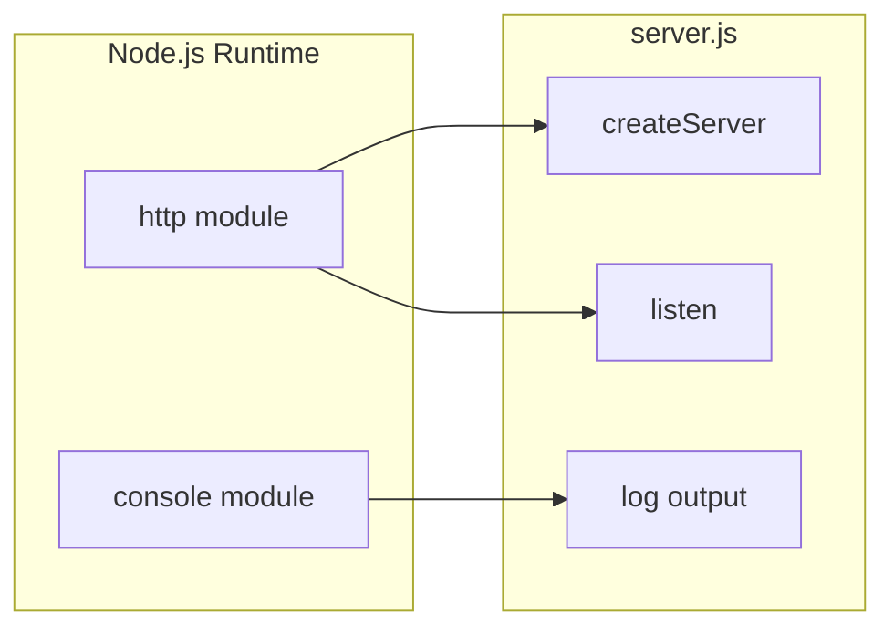

The `http.createServer()` and `server.listen()` APIs used in `server.js` have been stable since Node.js 0.1.x, ensuring compatibility across virtually all Node.js versions.

### 3.1.2 Secondary Language: Java (Test Infrastructure)

The repository contains a secondary Java component (`BaseTest.java`) that is functionally independent from the Node.js server.

| Attribute | Value | Evidence |
|-----------|-------|----------|
| Language | Java | `BaseTest.java` package declaration |
| Purpose | Mobile automation test base class | Appium/TestNG imports |
| Framework | TestNG | `@BeforeTest` annotation usage |
| Automation Library | Appium Java Client | `io.appium.java_client.android.AndroidDriver` import |
| Relationship to Core | None - operates independently | Different execution contexts |

#### Selection Criteria

Java was selected for the test infrastructure component due to:

1. **Appium Ecosystem**: Appium's most mature client library is Java-based
2. **TestNG Integration**: Enterprise-grade test lifecycle management
3. **Selenium WebDriver Compatibility**: Standard WebDriver API for device automation

### 3.1.3 Language Distribution Summary

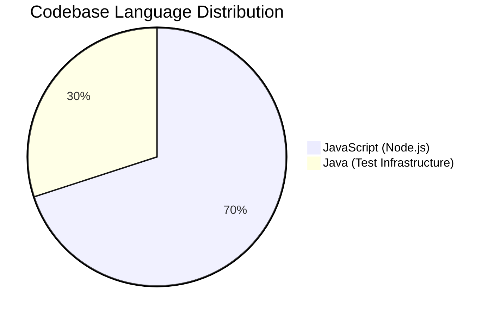

| Component | Language | Lines | Files | Purpose |
|-----------|----------|-------|-------|---------|
| HTTP Server | JavaScript | ~14 | 1 (`server.js`) | Core system functionality |
| Test Base | Java | ~25 | 1 (`BaseTest.java`) | Mobile automation setup |

## 3.2 Frameworks & Libraries

### 3.2.1 Core Framework Architecture

The system deliberately employs a **zero-framework architecture** for its primary component. This is a conscious design decision, not an oversight.

## Node.js Component: No Frameworks

| Category | Implementation | Justification |
|----------|----------------|---------------|
| HTTP Framework | **None** - Uses built-in `http` module | Zero-dependency design requirement |
| Web Framework | **None** - No Express, Koa, Hapi, or similar | Maintains minimal codebase for testing |
| Middleware | **None** | Direct http module usage, no routing needed |
| Template Engine | **None** | Static response content only |

**Design Decision Rationale** (per Section 2.4.1):

The architecture deliberately avoids frameworks to:
- Eliminate version conflicts and dependency drift
- Ensure reproducibility across testing environments
- Maintain minimal code surface for Backprop analysis
- Reduce complexity for integration testing scenarios

#### Built-in Module Usage

The only "library" used is Node.js's built-in `http` module:

| Module | Version | Type | Purpose |
|--------|---------|------|---------|
| `http` | Built-in (Node.js core) | Native | HTTP server creation and request handling |
| `console` | Built-in (Node.js core) | Native | Server startup logging |

### 3.2.2 Java Component: Framework Dependencies

The `BaseTest.java` file references external frameworks through imports, though no build configuration (Maven/Gradle) exists in the repository.

| Framework | Package | Version | Purpose |
|-----------|---------|---------|---------|
| TestNG | `org.testng.annotations` | Implied (not specified) | Test lifecycle management |
| Appium Java Client | `io.appium.java_client` | Implied (not specified) | Android automation driver |
| Selenium WebDriver | `org.openqa.selenium` | Implied (not specified) | Device capability configuration |
| Log4j | `org.apache.log4j` | Implied (not specified) | Logging configuration |

**Note**: Exact versions cannot be determined as no `pom.xml` or `build.gradle` file is present in the repository.

### 3.2.3 Framework Compatibility Matrix

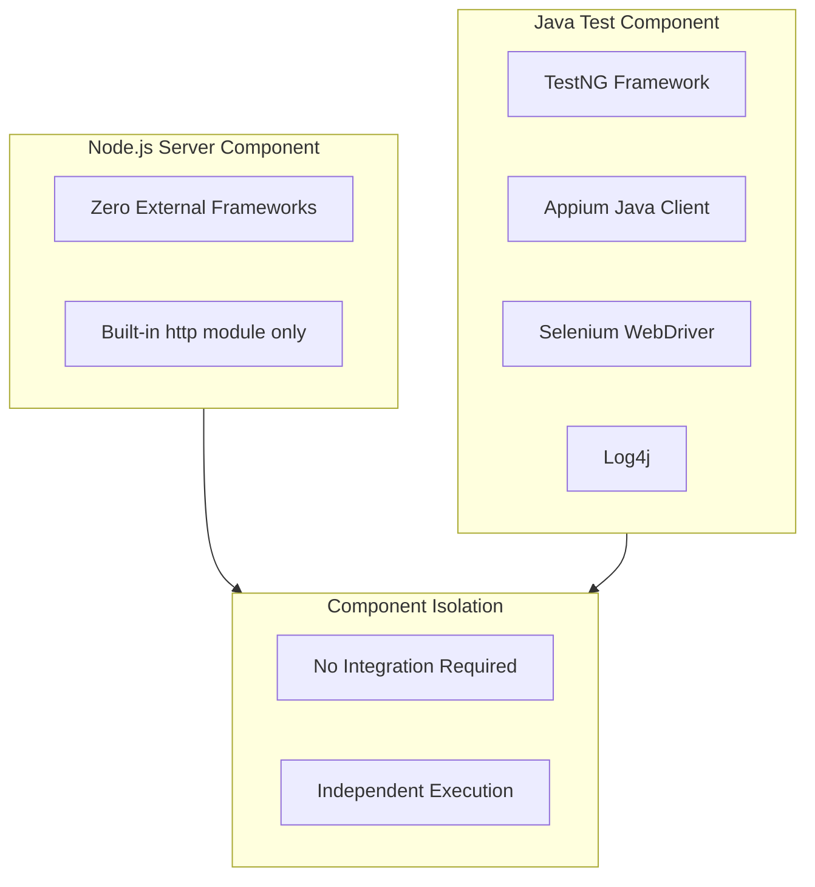

## 3.3 Open Source Dependencies

### 3.3.1 Node.js Dependencies: Zero External Packages

The Node.js component maintains a **zero-dependency architecture**. This is verified by examining both the package configuration files.

## package.json Analysis

```
{
    "name": "hello_world",
    "version": "1.0.0",
    "description": "Hello world in Node.js",
    "main": "index.js",
    "scripts": {
        "test": "echo \"Error: no test specified\" && exit 1"
    },
    "author": "hxu",
    "license": "MIT"
}
```

| Dependency Category | Count | Evidence |
|--------------------|-------|----------|
| Runtime Dependencies (`dependencies`) | **0** | No `dependencies` block in `package.json` |
| Development Dependencies (`devDependencies`) | **0** | No `devDependencies` block in `package.json` |
| Peer Dependencies (`peerDependencies`) | **0** | No `peerDependencies` block in `package.json` |
| Optional Dependencies (`optionalDependencies`) | **0** | No `optionalDependencies` block in `package.json` |

## package-lock.json Confirmation

The lockfile confirms the absence of dependencies:

| Attribute | Value | Significance |
|-----------|-------|--------------|
| `lockfileVersion` | 3 | npm 7.x+ format |
| `packages` | Root entry only | No dependency entries |
| Dependency tree | Empty | Zero external packages installed |

### 3.3.2 Java Component: Implied Dependencies

The Java component references libraries through imports but lacks explicit dependency management configuration:

| Library | Import Statement | Maven Central Group ID |
|---------|------------------|------------------------|
| Appium Java Client | `io.appium.java_client.android.AndroidDriver` | `io.appium` |
| TestNG | `org.testng.annotations.BeforeTest` | `org.testng` |
| Selenium WebDriver | `org.openqa.selenium.remote.DesiredCapabilities` | `org.seleniumhq.selenium` |
| Log4j | `org.apache.log4j.BasicConfigurator` | `org.apache.logging.log4j` |

**Version Ambiguity**: Without a Maven `pom.xml` or Gradle `build.gradle` file, specific versions cannot be determined. This represents a documentation gap in the repository.

### 3.3.3 Dependency Security Assessment

| Component | External Dependencies | Supply Chain Risk | Assessment |
|-----------|----------------------|-------------------|------------|
| Node.js Server | 0 | **None** | No third-party code executed |
| Java Test Base | ~4 implied | **Unknown** | No version pinning available |

The zero-dependency architecture of the primary Node.js component eliminates:
- Supply chain attack vectors
- Dependency vulnerability scanning requirements
- Version conflict issues
- License compliance concerns (beyond MIT license of project itself)

## 3.4 Third-Party Services

### 3.4.1 External Service Integration: None

The Node.js server component does not integrate with any external services. This is an intentional design constraint per Section 1.3.2 (Out-of-Scope).

| Service Category | Status | Evidence | Rationale |
|-----------------|--------|----------|-----------|
| External APIs | **Not Used** | No HTTP client code in `server.js` | Maintains isolation |
| Authentication Services | **Not Used** | No auth implementation | Test project scope |
| Monitoring/Observability | **Not Used** | No logging or metrics code | Reduces complexity |
| Cloud Services | **Not Used** | Localhost-only binding (`127.0.0.1`) | No deployment intent |
| CI/CD Services | **Not Used** | No workflow files present | Static test project |
| Analytics Services | **Not Used** | No tracking code | Test fixture nature |

### 3.4.2 Java Component External Dependencies

The `BaseTest.java` component references one external service:

| Service | Endpoint | Purpose | Status |
|---------|----------|---------|--------|
| Appium Server | `http://127.0.0.1:4723/wd/hub` | Mobile device automation | Localhost only |

This service dependency is local and does not involve external network communication.

### 3.4.3 Integration Context

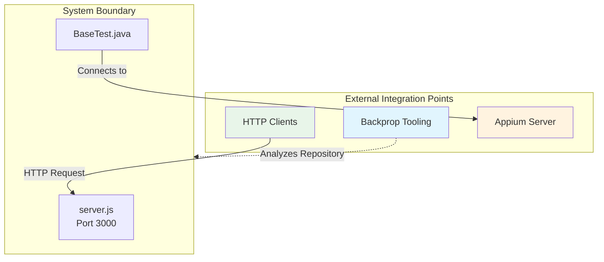

**Key Integration Relationships**:

1. **Backprop Integration** (Primary Purpose): The entire repository exists as a test fixture for Backprop integration testing. Backprop consumes the repository for code analysis purposes.

2. **HTTP Client Integration**: Any HTTP client can send requests to `http://127.0.0.1:3000` and receive the "Hello, World!" response.

3. **Appium Integration** (Secondary Component): The Java test base connects to a local Appium server for mobile automation testing.

## 3.5 Databases & Storage

### 3.5.1 Data Persistence: None Implemented

The system does not implement any data persistence mechanisms. This aligns with its design as a stateless HTTP server.

| Storage Category | Status | Evidence |
|-----------------|--------|----------|
| Primary Database | **Not Implemented** | No database drivers or connection code |
| Secondary Database | **Not Implemented** | No alternative storage mechanisms |
| File Storage | **Not Implemented** | No file read/write operations |
| Caching Layer | **Not Implemented** | No in-memory caching |
| Session Storage | **Not Implemented** | No session management |
| Object Storage | **Not Implemented** | No cloud storage integration |

### 3.5.2 Data Flow Architecture

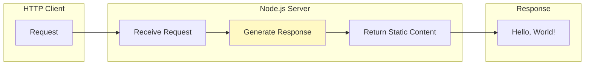

The server operates in a completely stateless manner:

1. **No Request Data Processing**: All incoming requests receive identical responses
2. **No State Retention**: No information is stored between requests
3. **No Data Transformation**: Response content is hardcoded in source

### 3.5.3 Storage Exclusion Rationale

Per Section 1.3.2 (Out-of-Scope), the following storage mechanisms are explicitly excluded:

| Mechanism | Exclusion Reason |
|-----------|-----------------|
| SQL Databases | Unnecessary complexity for test fixture |
| NoSQL Databases | Outside test scope |
| Key-Value Stores | No caching requirements |
| File System Operations | Maintains minimal code surface |
| Message Queues | No asynchronous processing needs |

## 3.6 Development & Deployment

### 3.6.1 Development Tools

#### Package Manager: npm

| Attribute | Value | Evidence |
|-----------|-------|----------|
| Package Manager | npm | `package.json` and `package-lock.json` presence |
| Lockfile Version | 3 | `lockfileVersion` field in `package-lock.json` |
| Compatible npm Version | 7.x+ | Lockfile version 3 introduced in npm 7 |

#### Project Metadata

| Field | Value | Source |
|-------|-------|--------|
| Package Name | `hello_world` | `package.json` |
| Version | `1.0.0` | `package.json` |
| Description | "Hello world in Node.js" | `package.json` |
| Author | `hxu` | `package.json` |
| License | MIT | `package.json` |
| Entry Point (declared) | `index.js` | `package.json` |
| Entry Point (actual) | `server.js` | Actual implementation file |

### 3.6.2 Build System: None Required

The system requires no build process:

| Build Aspect | Status | Rationale |
|--------------|--------|-----------|
| Compilation | Not Required | JavaScript is interpreted |
| Transpilation | Not Required | No TypeScript, Babel, or modern syntax |
| Bundling | Not Required | Single-file server |
| Minification | Not Required | Development/test use only |
| Asset Processing | Not Required | No static assets served |

### 3.6.3 Containerization: Not Supported

Per Section 1.3.2 (Out-of-Scope), containerization is explicitly excluded:

| Technology | Status | Evidence |
|------------|--------|----------|
| Docker | **Not Supported** | No `Dockerfile` present |
| Docker Compose | **Not Supported** | No `docker-compose.yml` present |
| Kubernetes | **Not Supported** | No K8s manifests present |

### 3.6.4 CI/CD: Not Implemented

The project maintains a static codebase with no continuous integration or deployment:

| CI/CD Component | Status | Evidence |
|-----------------|--------|----------|
| GitHub Actions | **Not Implemented** | No `.github/workflows/` directory |
| Jenkins | **Not Implemented** | No `Jenkinsfile` present |
| GitLab CI | **Not Implemented** | No `.gitlab-ci.yml` present |
| CircleCI | **Not Implemented** | No `.circleci/` directory |
| Travis CI | **Not Implemented** | No `.travis.yml` present |

**Rationale**: Per the README.md directive ("Do not touch!"), the repository is intended to remain unchanged. CI/CD pipelines would be counterproductive for a frozen test fixture.

### 3.6.5 Runtime Configuration

All configuration is hardcoded within `server.js`:

| Parameter | Value | Configuration Method |
|-----------|-------|---------------------|
| Hostname | `127.0.0.1` | Constant in source |
| Port | `3000` | Constant in source |
| Content-Type | `text/plain` | Hardcoded in response |
| HTTP Status | `200` | Hardcoded in response |
| Response Body | `Hello, World!\n` | Hardcoded string |

#### Configuration Architecture

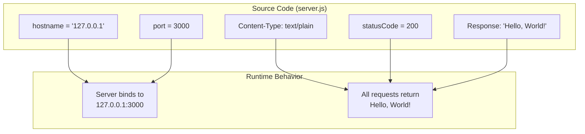

**Configuration Constraints** (per Section 2.4.1):
- No environment variable support
- No external configuration files
- No command-line argument parsing
- Configuration changes require source code modification

### 3.6.6 Known Configuration Issues

| Issue | Details | Impact | Workaround |
|-------|---------|--------|------------|
| Entry Point Mismatch | `package.json` declares `main: "index.js"` but server is in `server.js` | `npm start` fails | Use `node server.js` directly |
| Test Script Placeholder | `npm test` returns error exit code | No automated tests | Manual testing only |

### 3.6.7 Execution Requirements

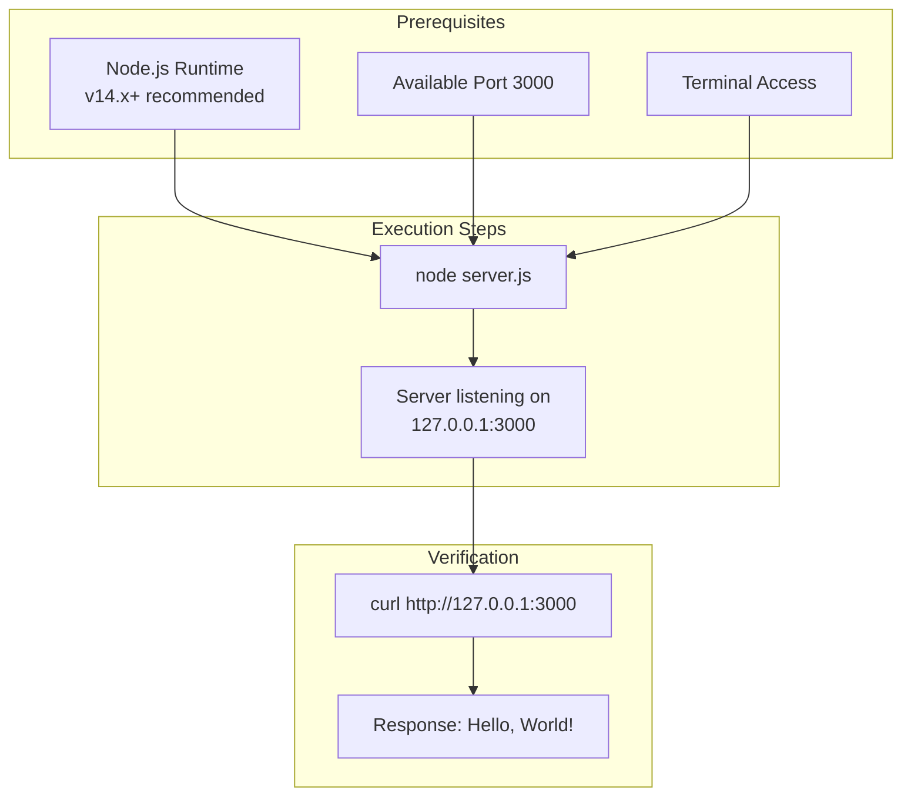

## 3.7 Technology Stack Summary

### 3.7.1 Stack Overview Diagram

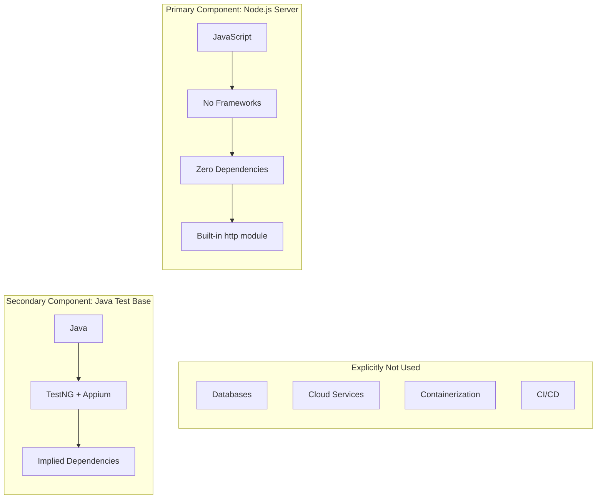

### 3.7.2 Comparison to Default Technology Stack

The repository uses **none** of the default technology stack components typically expected in production systems:

| Default Technology | Expected | Actual Implementation | Justification |
|--------------------|----------|----------------------|---------------|
| **Cloud Platform (AWS)** | Yes | Not Used | No cloud deployment intended |
| **Docker** | Yes | Not Used | Containerization out of scope |
| **Terraform** | Yes | Not Used | No infrastructure code needed |
| **GitHub Actions** | Yes | Not Used | Static test project |
| **Python/Flask** | Yes | Node.js/built-in http | JavaScript preferred for test scope |
| **Auth0** | Yes | Not Used | No authentication required |
| **MongoDB** | Yes | Not Used | No data persistence needed |
| **Langchain** | Yes | Not Used | No AI framework needed |
| **React** | Yes | Not Used | No frontend component |
| **TailwindCSS** | Yes | Not Used | No styling needed |

**Justification**: This is intentionally a minimal test project with zero external dependencies designed for Backprop integration testing. Production-grade technologies would compromise the project's purpose as a stable, reproducible test fixture.

### 3.7.3 Version Recommendation Matrix

For environments running this test server, the following versions are recommended:

| Technology | Minimum Version | Recommended Version | Notes |
|------------|-----------------|---------------------|-------|
| Node.js | 14.x | 20.x LTS (Iron) or 22.x LTS (Jod) | Any version with `http` module support |
| npm | 7.x | 10.x+ | Required for lockfileVersion 3 |
| Java (if using test component) | 8+ | 11 or 17 LTS | For BaseTest.java execution |

## 3.8 References

The following files and resources were examined to produce this documentation:

#### Repository Files

- `server.js` - Complete HTTP server implementation with runtime configuration
- `package.json` - Project metadata, scripts, and dependency declarations
- `package-lock.json` - Lockfile confirming zero external dependencies
- `BaseTest.java` - Java test infrastructure with framework imports
- `README.md` - Project purpose and governance directive

#### Technical Specification Sections

- Section 1.2 System Overview - Core technical approach and design decisions
- Section 1.3 Scope - In-scope and out-of-scope boundaries
- Section 2.4 Implementation Considerations - Technical constraints and configuration
- Section 2.7 Secondary Component - Java component details
- Section 2.8 Assumptions and Constraints - Prerequisites and limitations

#### External Resources

- Node.js Release Schedule (https://github.com/nodejs/Release) - LTS version information
- Node.js Official Releases (https://nodejs.org/en/about/previous-releases) - Version lifecycle details

# 4. Process Flowchart

This section provides comprehensive process flow documentation for the hao-backprop-test repository. Given the intentionally minimal nature of this test project—designed as a stable fixture for Backprop integration testing—the process flows are straightforward and deterministic, with no complex branching logic, error handling, or state management.

## 4.1 System Workflow Overview

### 4.1.1 Core Process Architecture

The repository implements a minimal HTTP server with a single, linear request-response workflow. All system processes are designed to be predictable and reproducible, supporting the project's primary purpose as a Backprop integration test fixture.

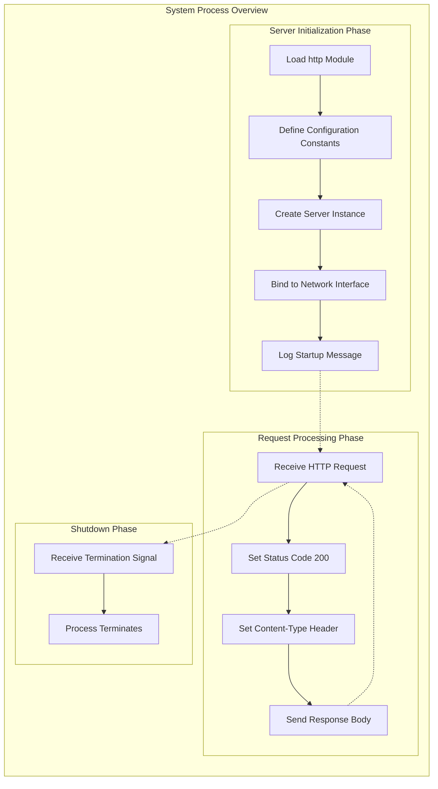

### 4.1.2 Process Characteristics Summary

| Characteristic | Implementation Status | Notes |
|----------------|----------------------|-------|
| Decision Points | Not Implemented | All requests receive identical responses |
| Error Handling Paths | Not Implemented | No try-catch blocks in source |
| State Management | Not Implemented | Purely stateless request handling |
| Retry Mechanisms | Not Implemented | No resilience patterns |
| Authorization Checkpoints | Not Implemented | No authentication required |
| Transaction Boundaries | Not Implemented | No data persistence |

## 4.2 Core Business Processes

### 4.2.1 Server Initialization Workflow

The server initialization process is a linear sequence that occurs when the Node.js runtime executes `server.js`. This workflow establishes the HTTP server and prepares it to accept incoming requests.

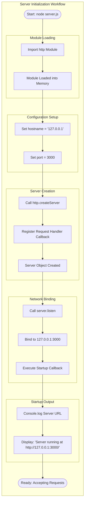

#### Initialization Process Details

| Step | Source Location | Action | Output |
|------|-----------------|--------|--------|
| 1 | `server.js` line 1 | Import `http` module | Module reference available |
| 2 | `server.js` line 3 | Define hostname constant | `hostname = '127.0.0.1'` |
| 3 | `server.js` line 4 | Define port constant | `port = 3000` |
| 4 | `server.js` line 6 | Create server with callback | Server instance created |
| 5 | `server.js` line 12 | Bind to network interface | Server listening on port |
| 6 | `server.js` line 13 | Execute startup callback | Console message displayed |

#### Timing Requirements

| Metric | Target | Measurement Point |
|--------|--------|-------------------|
| Total Startup Time | < 1 second | From process start to console output |
| Module Load Time | Negligible | Built-in module, no I/O |
| Network Binding Time | < 100ms | TCP socket binding |

### 4.2.2 HTTP Request Processing Workflow

The request processing workflow handles all incoming HTTP requests with identical behavior regardless of method, path, or content. This deterministic response pattern supports consistent test assertions.

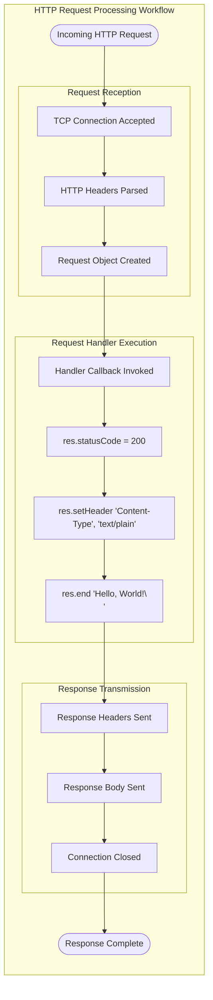

#### Request Processing Details

| Aspect | Implementation | Evidence |
|--------|----------------|----------|
| Request Method Handling | All methods identical | No method discrimination in handler |
| URL Path Handling | Ignored | No routing logic implemented |
| Query Parameters | Ignored | No parameter parsing |
| Request Body | Ignored | No body consumption |
| Request Headers | Not processed | No header inspection |

#### Response Specification

| Response Component | Value | Source |
|--------------------|-------|--------|
| HTTP Status Code | 200 | `server.js` line 7 |
| Content-Type Header | text/plain | `server.js` line 8 |
| Response Body | "Hello, World!\n" | `server.js` line 9 |

#### Performance Requirements

| Metric | Target | Rationale |
|--------|--------|-----------|
| Response Latency | < 10ms | Minimal processing, no I/O operations |
| Throughput | Node.js default | Limited by event loop capacity |
| Concurrent Connections | Node.js default | No explicit limits configured |

### 4.2.3 Server Shutdown Workflow

The server shutdown process is externally triggered and results in immediate process termination without graceful shutdown procedures.

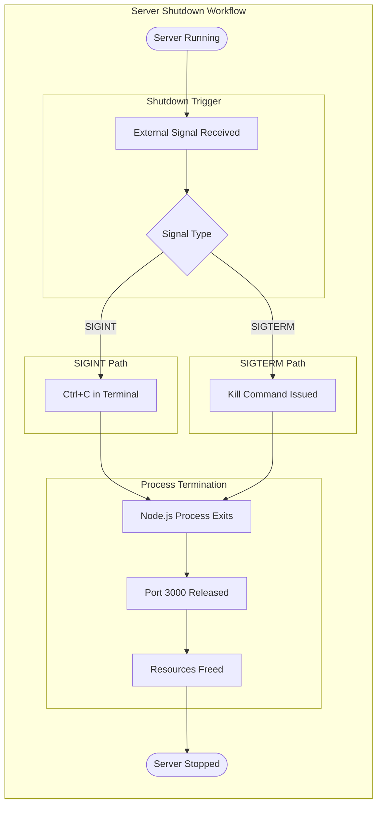

#### Shutdown Characteristics

| Characteristic | Implementation | Notes |
|----------------|----------------|-------|
| Graceful Shutdown | Not Implemented | No signal handlers registered |
| In-Flight Request Handling | Aborted | Requests in progress are terminated |
| Cleanup Procedures | None | No explicit cleanup logic |
| State Persistence | N/A | Stateless server |

## 4.3 End-to-End User Journeys

### 4.3.1 Primary User Journey: Start Server and Receive Response

This workflow represents the complete user experience from server startup through receiving an HTTP response.

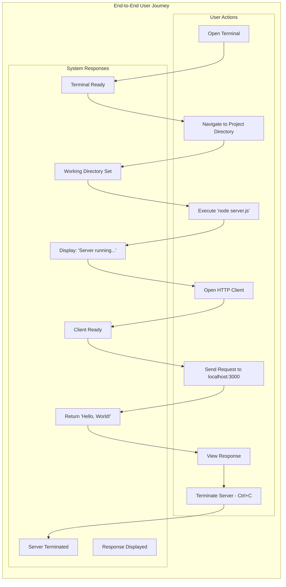

### 4.3.2 User Touchpoints

| Touchpoint | Actor | Action | Expected Result |
|------------|-------|--------|-----------------|
| Terminal Input | Developer | Execute `node server.js` | Server starts |
| Console Output | System | Display startup message | URL shown |
| HTTP Request | Developer/Tool | GET/POST to localhost:3000 | 200 response |
| Response Display | Client | Render response body | "Hello, World!" |
| Termination | Developer | Ctrl+C or kill command | Server stops |

## 4.4 Integration Workflows

### 4.4.1 Backprop Integration Workflow

The system serves as a passive analysis target for Backprop tooling. This integration is read-only with no bidirectional data flow.

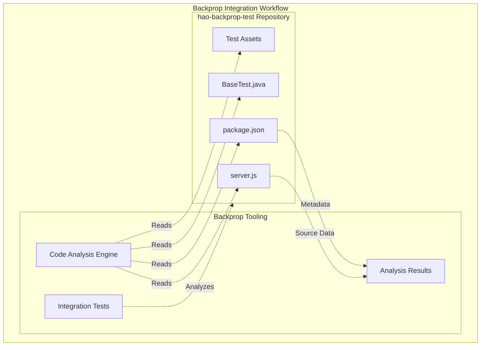

#### Integration Characteristics

| Aspect | Implementation | Notes |
|--------|----------------|-------|
| Integration Type | Read-Only | Repository is passive target |
| Data Flow Direction | Unidirectional | Backprop reads, repository doesn't respond |
| API Interactions | None | Static file analysis only |
| Event Processing | None | No webhooks or callbacks |

### 4.4.2 HTTP Client Integration Workflow

External HTTP clients interact with the server through a simple request-response cycle with no authentication or session management.

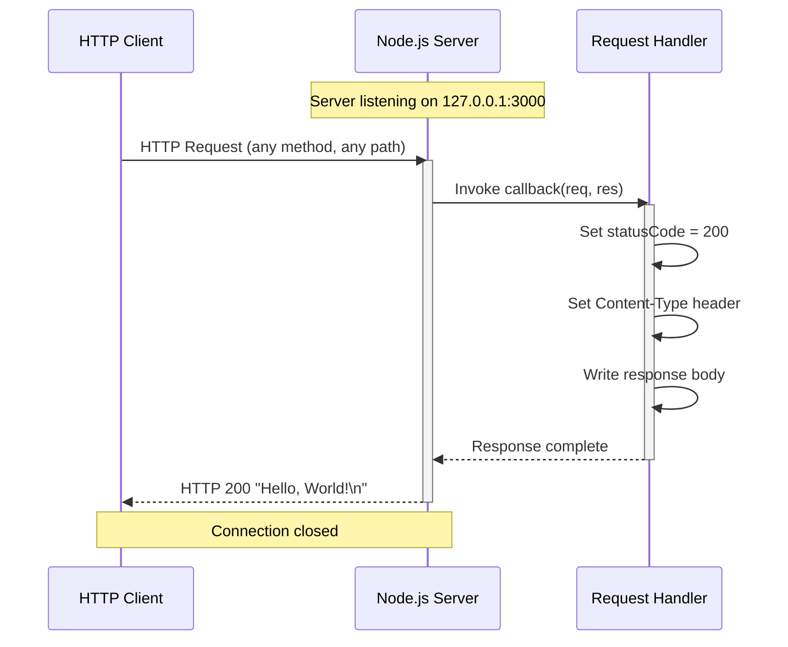

### 4.4.3 Data Flow Between Systems

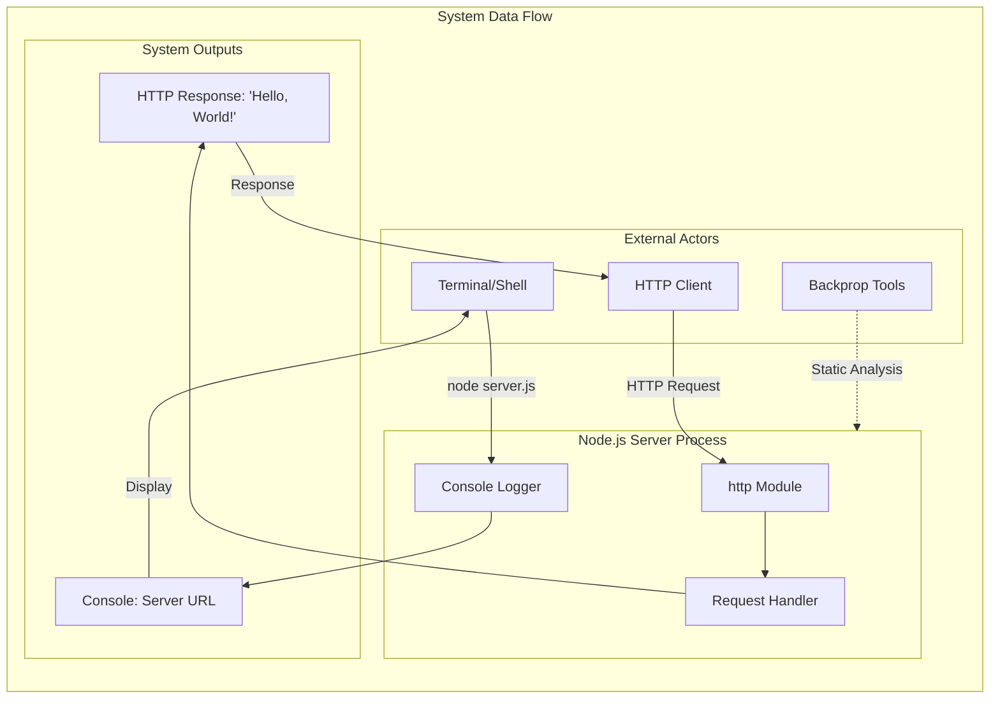

## 4.5 State Management

### 4.5.1 State Transition Diagram

Due to the stateless nature of the server, state management is minimal and exists only at the server lifecycle level.

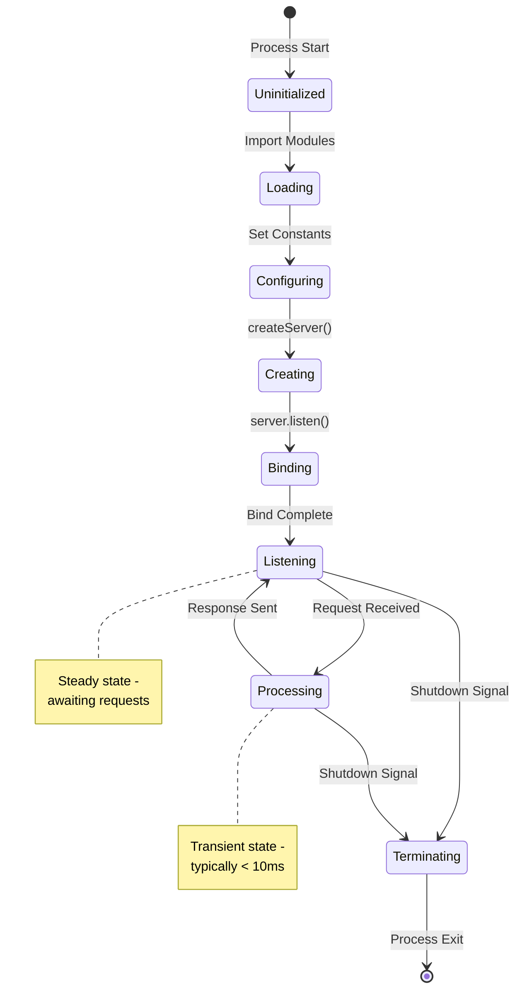

### 4.5.2 Server Lifecycle States

| State | Description | Duration | Transitions To |
|-------|-------------|----------|----------------|
| Uninitialized | Process started, no modules loaded | < 1ms | Loading |
| Loading | http module being imported | < 1ms | Configuring |
| Configuring | Constants being set | < 1ms | Creating |
| Creating | Server instance being created | < 1ms | Binding |
| Binding | Network interface binding | < 100ms | Listening |
| Listening | Ready to accept requests | Indefinite | Processing, Terminating |
| Processing | Handling an HTTP request | < 10ms | Listening |
| Terminating | Shutdown in progress | < 1ms | (terminated) |

### 4.5.3 Data Persistence Points

| Category | Implementation | Notes |
|----------|----------------|-------|
| Session Storage | Not Implemented | Stateless server |
| Request Logging | Not Implemented | No request persistence |
| Response Caching | Not Implemented | Fresh response each time |
| Configuration Persistence | Not Implemented | Hardcoded values |

## 4.6 Error Handling Flows

### 4.6.1 Error Handling Architecture

The system explicitly does not implement error handling mechanisms. This section documents the absence of error handling and potential failure scenarios.

```mermaid
flowchart TD
    subgraph ErrorArchitecture["Error Handling Architecture (Not Implemented)"]
        direction TB
        
        subgraph Expected["Expected Error Scenarios"]
            EX1[Port 3000 Already in Use]
            EX2[Network Binding Failure]
            EX3[Malformed HTTP Request]
            EX4[Out of Memory]
        end
        
        subgraph Current["Current Implementation"]
            C1[No Try-Catch Blocks]
            C2[No Error Responses]
            C3[No Retry Mechanisms]
            C4[No Graceful Degradation]
        end
        
        subgraph Outcome["Actual Outcome"]
            O1[Unhandled Exception]
            O2[Process Crash]
            O3[Manual Restart Required]
        end
        
        EX1 --> C1
        EX2 --> C1
        EX3 --> C1
        EX4 --> C1
        C1 --> O1
        C2 --> O1
        C3 --> O1
        C4 --> O1
        O1 --> O2
        O2 --> O3
    end
```

### 4.6.2 Error Scenario Analysis

| Error Scenario | Handling | Outcome | Recovery |
|----------------|----------|---------|----------|
| Port Already in Use | None | Process crashes with EADDRINUSE | Manual restart after freeing port |
| Network Interface Unavailable | None | Process crashes | Manual restart |
| Invalid Request Format | None | Handled by Node.js http module | Request rejected |
| Server Memory Exhaustion | None | Process crashes with OOM | Manual restart |
| Unexpected Exception | None | Unhandled exception | Manual restart |

### 4.6.3 Absent Error Recovery Patterns

The following error handling patterns are explicitly **not implemented** as documented in Section 2.4:

| Pattern | Status | Rationale |
|---------|--------|-----------|
| Retry Mechanisms | Not Implemented | Reduces code complexity |
| Circuit Breakers | Not Implemented | No external dependencies |
| Fallback Processes | Not Implemented | Single response pattern |
| Error Notification | Not Implemented | No observability infrastructure |
| Health Check Endpoints | Not Implemented | Out of scope per Section 1.3.2 |

## 4.7 Secondary Component: BaseTest.java Workflow

### 4.7.1 Test Initialization Flow

The `BaseTest.java` file implements a linear initialization workflow for Appium-based Android mobile automation testing. This component operates independently of the Node.js server.

```mermaid
flowchart TD
    subgraph AppiumInit["BaseTest.java Initialization Workflow"]
        direction TB
        
        START([Test Class Instantiated])
        
        subgraph Logging["Logging Configuration"]
            L1[BasicConfigurator.configure]
            L2[Log4j Initialized]
        end
        
        subgraph FileSetup["APK File Setup"]
            F1[Create File for APK Directory]
            F2[Create File for test.apk]
        end
        
        subgraph Capabilities["Desired Capabilities"]
            C1[Create DesiredCapabilities Object]
            C2["automationName = 'UiAutomator2'"]
            C3["deviceName = 'Android'"]
            C4["platformName = 'Android'"]
            C5["app = APK Absolute Path"]
        end
        
        subgraph Driver["Driver Creation"]
            D1[Create AndroidDriver Instance]
            D2[Connect to Appium Server]
            D3["URL: http://127.0.0.1:4723/wd/hub"]
        end
        
        READY([Driver Ready for Tests])
        
        START --> L1
        L1 --> L2
        L2 --> F1
        F1 --> F2
        F2 --> C1
        C1 --> C2
        C2 --> C3
        C3 --> C4
        C4 --> C5
        C5 --> D1
        D1 --> D2
        D2 --> D3
        D3 --> READY
    end
```

### 4.7.2 BaseTest.java Process Details

| Step | Line Reference | Action | Notes |
|------|----------------|--------|-------|
| 1 | Line 19 | Configure Log4j | Basic console logging |
| 2 | Line 20 | Create APK directory File | Path: "./src/" |
| 3 | Line 21 | Create APK File reference | Path: "./src/test.apk" |
| 4 | Lines 23-28 | Set Desired Capabilities | UiAutomator2 automation |
| 5 | Line 29 | Create AndroidDriver | Connects to Appium server |

### 4.7.3 BaseTest.java Limitations

| Limitation | Impact | Notes |
|------------|--------|-------|
| No Teardown Logic | Driver not properly closed | Resource leak potential |
| No Error Handling | Initialization failures crash test | No retry or recovery |
| Hardcoded Paths | Environment-specific | Not portable |
| No Timeout Configuration | Default timeouts used | May cause test flakiness |

## 4.8 Validation Rules and Checkpoints

### 4.8.1 Business Rules Implementation

```mermaid
flowchart TD
    subgraph ValidationRules["Business Rule Enforcement"]
        direction TB
        
        subgraph Request["Request Processing Rules"]
            R1["All requests → Status 200"]
            R2["All requests → Same response body"]
            R3["Content-Type always text/plain"]
            R4["No URL path discrimination"]
            R5["No HTTP method discrimination"]
        end
        
        subgraph Network["Network Configuration Rules"]
            N1["Bind to localhost only"]
            N2["Listen on port 3000"]
            N3["No external network access"]
        end
        
        subgraph Implementation["Implementation Approach"]
            I1[Hardcoded Values]
            I2[No Validation Logic]
            I3[Deterministic Behavior]
        end
        
        R1 --> I1
        R2 --> I1
        R3 --> I1
        R4 --> I2
        R5 --> I2
        N1 --> I1
        N2 --> I1
        N3 --> I3
    end
```

### 4.8.2 Validation Checkpoints

| Checkpoint Type | Implementation | Location |
|-----------------|----------------|----------|
| Input Validation | Not Implemented | N/A |
| Authorization | Not Implemented | N/A |
| Data Validation | Not Implemented | N/A |
| Regulatory Compliance | Not Applicable | Test project |
| Business Rule Validation | Implicit | Hardcoded responses |

### 4.8.3 Request Processing Rules

| Rule ID | Rule Description | Implementation |
|---------|------------------|----------------|
| VR-001 | All requests receive HTTP 200 | `res.statusCode = 200` (line 7) |
| VR-002 | Response body is "Hello, World!\n" | `res.end()` parameter (line 9) |
| VR-003 | Content-Type is text/plain | `res.setHeader()` call (line 8) |
| VR-004 | Server binds to 127.0.0.1 only | `hostname` constant (line 3) |
| VR-005 | Server listens on port 3000 | `port` constant (line 4) |

## 4.9 Timing and Performance Constraints

### 4.9.1 Timing Diagram

```mermaid
gantt
    dateFormat SSS
    axisFormat %L ms
    title Server Request/Response Timing

    section Initialization
    Module Load           :init1, 000, 1
    Configuration         :init2, after init1, 1
    Server Creation       :init3, after init2, 1
    Network Binding       :init4, after init3, 50

    section Startup Output
    Console Log           :log1, after init4, 1

    section Request Processing
    Request Reception     :req1, 100, 2
    Handler Execution     :req2, after req1, 3
    Response Transmission :req3, after req2, 2
```

### 4.9.2 Performance SLA Summary

| Operation | Target | Maximum | Notes |
|-----------|--------|---------|-------|
| Server Startup | < 500ms | 1 second | From execution to ready |
| Request Processing | < 5ms | 10ms | From receipt to response |
| Memory Footprint | ~30MB | Baseline Node.js | No external dependencies |

### 4.9.3 Timing Constraints

| Constraint | Value | Enforced By |
|------------|-------|-------------|
| Startup Timeout | Not Defined | No timeout implemented |
| Request Timeout | Not Defined | Node.js defaults |
| Connection Timeout | Not Defined | Node.js defaults |
| Keep-Alive Timeout | Node.js Default | http module |

## 4.10 System Boundary Interactions

### 4.10.1 Complete System Interaction Diagram

```mermaid
flowchart TB
    subgraph SystemBoundary["System Boundary: hao-backprop-test"]
        direction TB
        
        subgraph Core["Core Components"]
            SERVER[server.js<br/>HTTP Server]
            HANDLER[Request Handler<br/>Callback Function]
        end
        
        subgraph Config["Configuration"]
            PACKAGE[package.json<br/>Package Metadata]
            LOCK[package-lock.json<br/>Dependency Lock]
        end
        
        subgraph Secondary["Secondary Components"]
            BASETEST[BaseTest.java<br/>Test Infrastructure]
            ASSETS[Test Assets<br/>PDF/DOC/JPEG]
        end
        
        SERVER --> HANDLER
        PACKAGE -.-> SERVER
    end
    
    subgraph External["External Systems"]
        direction TB
        BACKPROP[Backprop Tooling]
        CLIENT[HTTP Clients]
        APPIUM[Appium Server<br/>Port 4723]
        TERMINAL[Terminal/Shell]
    end
    
    BACKPROP -.->|Analyzes Repository| SystemBoundary
    CLIENT -->|HTTP Request| SERVER
    SERVER -->|HTTP Response| CLIENT
    BASETEST -->|Appium Protocol| APPIUM
    TERMINAL -->|node server.js| SERVER
    SERVER -->|Console Output| TERMINAL
```

### 4.10.2 Boundary Crossing Points

| Crossing Point | Direction | Protocol | Data Exchanged |
|----------------|-----------|----------|----------------|
| HTTP Request | Inbound | HTTP/1.1 | Request headers and body |
| HTTP Response | Outbound | HTTP/1.1 | Status 200, "Hello, World!" |
| Console Output | Outbound | stdout | Server URL string |
| Process Control | Inbound | POSIX signals | SIGINT, SIGTERM |
| File System | Inbound | File I/O | Source file loading |

## 4.11 Process Flow Summary

### 4.11.1 Workflow Catalog

| Workflow ID | Workflow Name | Complexity | Error Handling |
|-------------|---------------|------------|----------------|
| WF-001 | Server Initialization | Linear | None |
| WF-002 | HTTP Request Processing | Linear | None |
| WF-003 | Server Shutdown | Linear | None |
| WF-004 | Backprop Integration | Passive | N/A |
| WF-005 | BaseTest.java Initialization | Linear | None |

### 4.11.2 Process Characteristics Matrix

| Characteristic | WF-001 | WF-002 | WF-003 | WF-004 | WF-005 |
|----------------|--------|--------|--------|--------|--------|
| Decision Points | 0 | 0 | 1 | 0 | 0 |
| Error States | 0 | 0 | 0 | 0 | 0 |
| State Changes | 5 | 2 | 2 | 0 | 5 |
| External Calls | 0 | 0 | 0 | 0 | 1 |
| Data Persistence | No | No | No | No | No |
| Retry Logic | No | No | No | N/A | No |

### 4.11.3 Implementation Constraints Summary

As documented throughout this section, the following constraints apply to all process flows:

| Constraint Category | Implementation | Rationale |
|--------------------|----------------|-----------|
| No Routing Logic | Single handler for all requests | Maintains minimal codebase |
| No Error Handling | No try-catch blocks | Reduces code complexity |
| No Middleware | Direct http module usage | Zero dependency requirement |
| Hardcoded Config | hostname/port as constants | Changes require code modification |
| Stateless Operation | No session or state storage | Simplifies testing |
| No Graceful Shutdown | Immediate termination | Not required for test fixture |

---

#### References

The following files and documentation sources were examined to produce this Process Flowchart section:

**Source Files:**
- `server.js` (lines 1-14) - Complete HTTP server implementation including request handler, configuration constants, and server initialization
- `BaseTest.java` (lines 1-32) - Java/TestNG/Appium test infrastructure with driver initialization workflow
- `package.json` - Package metadata and script definitions
- `package-lock.json` - Dependency verification confirming zero external packages

**Technical Specification Sections:**
- Section 1.2 System Overview - High-level architecture and existing flowcharts
- Section 1.3 Scope - In-scope/out-of-scope features and system boundaries
- Section 2.1 Feature Catalog - Feature descriptions and metadata
- Section 2.3 Feature Relationships - Dependency maps and integration points
- Section 2.4 Implementation Considerations - Technical constraints and performance requirements
- Section 2.7 Secondary Component: BaseTest.java - Java component documentation

**User Context:**
- Project purpose: Test fixture for Backprop integration testing
- Governance: "Do not touch!" directive indicating stable test repository

# 5. System Architecture

## 5.1 HIGH-LEVEL ARCHITECTURE

### 5.1.1 System Overview

#### Architectural Style and Rationale

The hao-backprop-test system employs a **minimalist monolithic architecture** consisting of a single-file HTTP server implementation. This architectural style was deliberately chosen to support the system's primary purpose: serving as a stable, reproducible test fixture for Backprop integration testing.

The architecture follows these core principles:

| Principle | Implementation | Rationale |
|-----------|----------------|-----------|
| Zero Dependencies | No npm packages required | Eliminates version drift and ensures environment-independent execution |
| Single Responsibility | One server, one response | Deterministic behavior for test assertions |
| Minimal Footprint | 14 lines of code | Reduces code surface for analysis |
| Isolation by Design | Localhost-only binding | Prevents unintended network exposure |

The system explicitly avoids enterprise patterns typically found in production applications:
- No microservices decomposition
- No service mesh architecture
- No event-driven patterns
- No middleware pipeline
- No configuration management system

This intentional simplicity ensures that the repository remains unchanged over time, providing consistent Backprop test results without the maintenance burden of dependency updates or infrastructure changes.

#### Key Architectural Patterns

The server implements a **synchronous request-response pattern** using Node.js's built-in event loop mechanism. Each incoming HTTP request triggers a callback function that immediately generates a static response without any asynchronous operations, database queries, or external service calls.

```mermaid
flowchart TB
    subgraph ArchPattern["Architectural Pattern: Request-Response"]
        direction LR
        
        subgraph Client["Client Layer"]
            HTTP_CLIENT[HTTP Client]
        end
        
        subgraph Server["Server Layer"]
            direction TB
            HTTP_MODULE[Node.js http Module]
            HANDLER[Request Handler Callback]
            HTTP_MODULE --> HANDLER
        end
        
        subgraph Response["Response Layer"]
            STATIC[Static Response Generator]
        end
        
        HTTP_CLIENT -->|HTTP Request| HTTP_MODULE
        HANDLER --> STATIC
        STATIC -->|"Hello, World!"| HTTP_CLIENT
    end
```

#### System Boundaries

The system boundary encompasses the following internal components:
- **Primary Component**: `server.js` HTTP server
- **Configuration**: `package.json` and `package-lock.json`
- **Secondary Component**: `BaseTest.java` (functionally independent)

External actors interacting with the system include:
- **Backprop Tooling**: Analyzes the repository for integration testing
- **HTTP Clients**: Issue requests to the server on port 3000
- **Terminal/Shell**: Executes and monitors the server process

### 5.1.2 Core Components

| Component Name | Primary Responsibility | Key Dependencies | Integration Points |
|----------------|------------------------|------------------|-------------------|
| HTTP Server (`server.js`) | Serve static "Hello, World!" responses | Node.js built-in `http` module | Port 3000 TCP, localhost interface |
| Package Configuration (`package.json`) | Define project metadata and entry points | None | npm ecosystem |
| Dependency Lock (`package-lock.json`) | Confirm zero-dependency state | npm 7.x+ (lockfileVersion 3) | npm install verification |
| BaseTest.java | Android mobile automation test base | TestNG, Appium, Selenium | Appium server at port 4723 |

#### Component Criticality Assessment

| Component | Criticality | Failure Impact |
|-----------|-------------|----------------|
| `server.js` | Critical | Complete service outage |
| `package.json` | Low | No impact on runtime functionality |
| `package-lock.json` | Low | Verification purposes only |
| `BaseTest.java` | Independent | No impact on HTTP server |

### 5.1.3 Data Flow Architecture

#### Primary Data Flow: HTTP Request Processing

The server implements a linear, unidirectional data flow with no branching, transformation, or persistence operations:

1. **Request Reception**: TCP connection accepted on port 3000, HTTP headers parsed by Node.js `http` module
2. **Handler Invocation**: Request handler callback receives `(req, res)` parameters
3. **Response Generation**: Handler sets status code (200), content-type header (text/plain), and writes response body
4. **Transmission**: Response headers and body sent to client, connection closed

```mermaid
sequenceDiagram
    participant C as HTTP Client
    participant N as Node.js HTTP Module
    participant H as Request Handler
    participant R as Response Object
    
    C->>N: TCP Connection + HTTP Request
    N->>H: Invoke callback(req, res)
    H->>R: res.statusCode = 200
    H->>R: res.setHeader('Content-Type', 'text/plain')
    H->>R: res.end('Hello, World!\n')
    R->>C: HTTP 200 Response with Body
    Note over C,R: Connection Closed
```

#### Data Flow Characteristics

| Aspect | Implementation | Evidence |
|--------|----------------|----------|
| Request Method | All methods treated identically | No method discrimination in handler |
| URL Path | Ignored entirely | No routing logic in `server.js` |
| Query Parameters | Not processed | No parameter parsing code |
| Request Body | Not consumed | No body reading operations |
| Request Headers | Not inspected | No header access in handler |

#### Data Stores and Caches

| Category | Implementation Status | Notes |
|----------|----------------------|-------|
| Primary Database | Not Implemented | Stateless architecture |
| Session Storage | Not Implemented | No user state tracking |
| Response Cache | Not Implemented | Fresh response per request |
| Configuration Store | Not Implemented | Hardcoded constants |

### 5.1.4 External Integration Points

| System Name | Integration Type | Data Exchange Pattern | Protocol/Format |
|-------------|------------------|----------------------|-----------------|
| Backprop Tooling | Repository Analysis | Passive consumption | File system access |
| HTTP Clients | Inbound Requests | Request-Response | HTTP/1.1 text/plain |
| Terminal/Shell | Process Control | Command execution | POSIX signals (SIGINT, SIGTERM) |
| Appium Server (BaseTest.java only) | Outbound Connection | WebDriver protocol | HTTP at port 4723 |

---

## 5.2 COMPONENT DETAILS

### 5.2.1 Primary Component: HTTP Server (server.js)

#### Purpose and Responsibilities

The HTTP server component serves as the core runtime element of the system with the following responsibilities:

- Accept incoming TCP connections on localhost port 3000
- Parse HTTP request headers (delegated to Node.js `http` module)
- Generate static HTTP responses with "Hello, World!" content
- Output startup confirmation message to console

#### Technology Stack

| Aspect | Technology | Version Requirement |
|--------|------------|---------------------|
| Runtime | Node.js | 14.x minimum, 20.x LTS recommended |
| HTTP Implementation | Built-in `http` module | Included with Node.js |
| External Packages | None | Zero dependencies by design |

#### Configuration Parameters

| Parameter | Value | Location | Modifiable |
|-----------|-------|----------|------------|
| Hostname | `127.0.0.1` | `server.js` line 3 | Requires source code change |
| Port | `3000` | `server.js` line 4 | Requires source code change |
| Content-Type | `text/plain` | `server.js` line 8 | Requires source code change |
| Response Body | `"Hello, World!\n"` | `server.js` line 9 | Requires source code change |
| HTTP Status | `200` | `server.js` line 7 | Requires source code change |

#### Interfaces and APIs

**Exposed Interface:**

| Endpoint | Method | Response Status | Response Body |
|----------|--------|-----------------|---------------|
| `/*` (all paths) | Any HTTP method | 200 OK | `Hello, World!\n` |

**Response Headers:**

| Header | Value |
|--------|-------|
| Content-Type | text/plain |

#### Data Persistence Requirements

The server maintains **no persistent state**. Each request is processed independently with identical outcomes regardless of previous requests or server uptime.

#### Scaling Considerations

| Dimension | Capability | Limitation |
|-----------|------------|------------|
| Horizontal Scaling | Not Supported | Localhost-only binding prevents multi-node deployment |
| Vertical Scaling | Node.js Default | Limited by single-threaded event loop |
| Clustering | Not Implemented | No cluster module usage |
| Load Balancing | Not Applicable | Single-instance design by intent |

### 5.2.2 Secondary Component: BaseTest.java

#### Purpose and Responsibilities

The `BaseTest.java` file provides a base class for Android mobile automation testing using the Appium framework. This component is **functionally independent** from the Node.js HTTP server.

| Attribute | Value |
|-----------|-------|
| Package | Not declared (default package) |
| Class | `BaseTest` |
| Framework | TestNG with Appium |
| Target Platform | Android mobile devices/emulators |

#### Technology Stack

| Technology | Purpose | Version |
|------------|---------|---------|
| Java | Runtime language | 8+ (11 or 17 LTS recommended) |
| TestNG | Test framework | Implied by annotations |
| Appium Java Client | Mobile automation | Via `AndroidDriver` |
| Selenium | WebDriver protocol | Via `DesiredCapabilities` |
| Log4j | Logging configuration | Via `BasicConfigurator` |

#### External Dependencies

| Dependency | Endpoint | Protocol |
|------------|----------|----------|
| Appium Server | `http://127.0.0.1:4723/wd/hub` | WebDriver HTTP |

#### Relationship to Core System

| Aspect | Assessment |
|--------|------------|
| Functional Dependency | None — operates independently |
| Shared Resources | Both use localhost (127.0.0.1) but different ports |
| Data Exchange | None identified |
| Execution Coordination | None required |

### 5.2.3 Component Interaction Diagrams

#### Full System Component Diagram

```mermaid
flowchart TB
    subgraph External["External Actors"]
        BACKPROP[Backprop Tooling]
        HTTPCLIENT[HTTP Clients]
        TERMINAL[Terminal/Shell]
        APPIUM[Appium Server<br/>Port 4723]
    end
    
    subgraph SystemBoundary["hao-backprop-test System Boundary"]
        subgraph Primary["Primary Component"]
            SERVER["server.js<br/>HTTP Server<br/>Port 3000"]
        end
        
        subgraph Config["Configuration"]
            PKG["package.json"]
            LOCK["package-lock.json"]
        end
        
        subgraph Secondary["Secondary Component"]
            BASETEST["BaseTest.java<br/>Mobile Test Base"]
        end
        
        PKG -.->|metadata| SERVER
    end
    
    BACKPROP -.->|"Analyzes Repository"| SystemBoundary
    HTTPCLIENT <-->|"HTTP Request/Response"| SERVER
    TERMINAL -->|"node server.js"| SERVER
    SERVER -->|"Console Output"| TERMINAL
    BASETEST -->|"WebDriver Protocol"| APPIUM
```

#### Server Lifecycle State Diagram

```mermaid
stateDiagram-v2
    [*] --> Uninitialized: Process Start
    
    Uninitialized --> Loading: Import http Module
    Loading --> Configuring: Set hostname/port Constants
    Configuring --> Creating: http.createServer()
    Creating --> Binding: server.listen()
    Binding --> Listening: Bind Complete
    
    Listening --> Processing: Request Received
    Processing --> Listening: Response Sent
    
    Listening --> Terminating: SIGINT/SIGTERM
    Processing --> Terminating: SIGINT/SIGTERM
    
    Terminating --> [*]: Process Exit
    
    note right of Listening
        Steady state - 
        awaiting requests
        Duration: Indefinite
    end note
    
    note right of Processing
        Transient state -
        typically < 10ms
    end note
```

#### Request Processing Sequence Diagram

```mermaid
sequenceDiagram
    participant Client as HTTP Client
    participant TCP as TCP Layer
    participant HTTP as http Module
    participant Handler as Request Handler
    participant Console as stdout
    
    Note over TCP,HTTP: Server Initialization
    HTTP->>TCP: Bind to 127.0.0.1:3000
    TCP-->>HTTP: Binding Complete
    HTTP->>Console: "Server running at http://127.0.0.1:3000/"
    
    Note over Client,Handler: Request Processing
    Client->>TCP: TCP Connection
    TCP->>HTTP: Connection Accepted
    Client->>HTTP: HTTP Request (any method/path)
    HTTP->>Handler: callback(req, res)
    Handler->>Handler: res.statusCode = 200
    Handler->>Handler: res.setHeader('Content-Type', 'text/plain')
    Handler->>HTTP: res.end('Hello, World!\n')
    HTTP->>Client: HTTP 200 Response
    TCP->>TCP: Connection Closed
```

---

## 5.3 TECHNICAL DECISIONS

### 5.3.1 Architecture Style Decision

#### Decision Context

The system required an architecture that would serve as a stable, reproducible test fixture for Backprop integration testing. The primary requirements were:

- **Stability**: Consistent behavior over extended time periods
- **Simplicity**: Minimal code surface for analysis
- **Reproducibility**: Identical execution across environments
- **Independence**: No external service dependencies

#### Decision Analysis

| Alternative | Advantages | Disadvantages | Fit Score |
|-------------|------------|---------------|-----------|
| Monolithic Single-File | Maximum simplicity, zero dependencies, instant startup | Limited scalability, no separation of concerns | **Optimal** |
| Express.js Application | Industry standard, middleware support, routing | External dependency, complexity overhead | Not Suitable |
| Microservices | Scalability, service isolation | Massive complexity overhead, deployment requirements | Not Suitable |
| Serverless Functions | Auto-scaling, managed infrastructure | Cloud dependency, cold start latency | Not Suitable |

**Decision**: Monolithic single-file architecture using only Node.js built-in modules.

**Rationale**: The project's explicit purpose as a test fixture for Backprop integration means that simplicity and reproducibility outweigh all other considerations. External dependencies would introduce version drift, and complex architectures would undermine the goal of having a minimal, stable codebase.

### 5.3.2 Communication Pattern Decision

#### Decision: Synchronous Request-Response

| Pattern | Considered | Decision | Rationale |
|---------|------------|----------|-----------|
| Synchronous Request-Response | Yes | **Adopted** | Simplest pattern, deterministic behavior |
| Asynchronous Messaging | No | Rejected | No message broker, unnecessary complexity |
| Event-Driven | No | Rejected | No event sources or sinks required |
| WebSocket | No | Rejected | No real-time communication needs |

### 5.3.3 Data Storage Decision

#### Decision: No Persistence Layer

| Storage Option | Considered | Decision | Rationale |
|----------------|------------|----------|-----------|
| No Storage | Yes | **Adopted** | Stateless design by intent |
| In-Memory Cache | No | Rejected | No caching benefit for static responses |
| File-Based Storage | No | Rejected | No data to persist |
| Database (SQL/NoSQL) | No | Rejected | Massive overhead for zero storage needs |

### 5.3.4 Security Mechanism Decision

#### Decision: Network Isolation via Localhost Binding

| Mechanism | Implementation | Rationale |
|-----------|----------------|-----------|
| Network Binding | `127.0.0.1` only | Prevents any external network access |
| Authentication | Not Implemented | Appropriate for local test project |
| Authorization | Not Implemented | Single static response to all requests |
| TLS/HTTPS | Not Implemented | Out of scope for test fixture |
| Input Validation | Not Required | No user input processed |

### 5.3.5 Architecture Decision Records

```mermaid
flowchart TD
    subgraph ADR["Architecture Decision Records"]
        direction TB
        
        subgraph ADR001["ADR-001: Zero Dependencies"]
            A1[Context: Test fixture for Backprop]
            A2[Decision: No npm packages]
            A3[Consequence: Maximum reproducibility]
            A1 --> A2 --> A3
        end
        
        subgraph ADR002["ADR-002: Localhost Only"]
            B1[Context: Security for test server]
            B2[Decision: Bind to 127.0.0.1]
            B3[Consequence: No external exposure]
            B1 --> B2 --> B3
        end
        
        subgraph ADR003["ADR-003: No Error Handling"]
            C1[Context: Minimal code surface]
            C2[Decision: No try-catch blocks]
            C3[Consequence: Process crashes on errors]
            C1 --> C2 --> C3
        end
        
        subgraph ADR004["ADR-004: Hardcoded Configuration"]
            D1[Context: Simplicity over flexibility]
            D2[Decision: No externalized config]
            D3[Consequence: Source changes for reconfiguration]
            D1 --> D2 --> D3
        end
    end
```

#### ADR Summary Table

| ADR ID | Title | Status | Date |
|--------|-------|--------|------|
| ADR-001 | Zero External Dependencies | Accepted | Project Inception |
| ADR-002 | Localhost-Only Network Binding | Accepted | Project Inception |
| ADR-003 | No Error Handling Implementation | Accepted | Project Inception |
| ADR-004 | Hardcoded Configuration Values | Accepted | Project Inception |

---

## 5.4 CROSS-CUTTING CONCERNS

### 5.4.1 Monitoring and Observability

#### Current Implementation Status

The system implements **minimal observability** limited to a single console output during server startup:

```
Server running at http://127.0.0.1:3000/
```

| Observability Aspect | Status | Notes |
|----------------------|--------|-------|
| Application Metrics | Not Implemented | No metric collection |
| Request Logging | Not Implemented | No request tracing |
| Health Check Endpoint | Not Implemented | Out of scope |
| Distributed Tracing | Not Implemented | Single-component system |
| Alerting | Not Implemented | No monitoring infrastructure |

#### Observability Rationale

| Aspect | Decision | Rationale |
|--------|----------|-----------|
| Logging Framework | Not Used | Would add dependencies |
| Metrics Collection | Not Implemented | Overhead exceeds benefit for test fixture |
| Health Endpoints | Not Implemented | Per project scope exclusions |

### 5.4.2 Logging and Tracing Strategy

#### Implementation Status

| Logging Aspect | Status | Evidence |
|----------------|--------|----------|
| Startup Logging | Minimal | Single `console.log` statement |
| Request Logging | None | No request logging code |
| Error Logging | None | No error handling code |
| Debug Logging | None | No debug statements |
| Structured Logging | None | No logging framework |

The single logging statement serves only to confirm successful server initialization.

### 5.4.3 Error Handling Patterns

#### Error Handling Architecture

The system **explicitly omits error handling** as a design decision to maintain minimal code surface. This section documents the absence of error handling and expected failure behaviors.

```mermaid
flowchart TD
    subgraph ErrorScenarios["Error Scenarios"]
        E1[Port 3000 Already in Use]
        E2[Network Interface Unavailable]
        E3[Memory Exhaustion]
        E4[Unexpected Exception]
    end
    
    subgraph CurrentHandling["Current Handling: None"]
        H1[No Try-Catch Blocks]
        H2[No Error Responses]
        H3[No Retry Logic]
    end
    
    subgraph Outcomes["Actual Outcomes"]
        O1[Unhandled Exception]
        O2[Process Crash]
        O3[Manual Restart Required]
    end
    
    E1 --> H1
    E2 --> H1
    E3 --> H1
    E4 --> H1
    H1 --> O1
    H2 --> O1
    H3 --> O1
    O1 --> O2
    O2 --> O3
```

#### Error Scenario Analysis

| Error Scenario | Error Code | Handling | Recovery Action |
|----------------|------------|----------|-----------------|
| Port Already in Use | EADDRINUSE | None (crash) | Free port, restart manually |
| Network Interface Unavailable | EADDRNOTAVAIL | None (crash) | Fix network, restart manually |
| Memory Exhaustion | OOM | None (crash) | Restart manually |
| Malformed HTTP Request | N/A | Node.js http module | Request rejected automatically |

#### Absent Error Handling Patterns

| Pattern | Status | Rationale |
|---------|--------|-----------|
| Retry Mechanisms | Not Implemented | No external calls to retry |
| Circuit Breakers | Not Implemented | No external dependencies |
| Fallback Processes | Not Implemented | Single response pattern |
| Graceful Degradation | Not Implemented | Maintains minimal code surface |
| Error Notification | Not Implemented | No observability infrastructure |

### 5.4.4 Authentication and Authorization

#### Security Framework Status

| Security Aspect | Implementation | Assessment |
|-----------------|----------------|------------|
| Authentication | Not Implemented | Appropriate for localhost test project |
| Authorization | Not Implemented | All requests receive same response |
| Session Management | Not Implemented | Stateless architecture |
| Token Validation | Not Implemented | No authentication layer |

#### Security by Design

The system achieves security through **network isolation** rather than authentication mechanisms:

| Control | Implementation | Effectiveness |
|---------|----------------|---------------|
| Network Binding | Localhost only (127.0.0.1) | Prevents all external access |
| Port Exposure | Port 3000 on loopback | Only local processes can connect |
| Input Handling | None required | Static response, no user input |

### 5.4.5 Performance Requirements and SLAs

#### Performance Targets

| Metric | Target | Measurement Method | Evidence |
|--------|--------|-------------------|----------|
| Startup Time | < 1 second | Time from `node server.js` to console output | `server.js` initialization sequence |
| Response Latency | < 10ms | Request to response completion | Minimal processing, no I/O |
| Memory Footprint | Baseline Node.js | Process memory usage | Zero dependencies |
| Concurrent Connections | Node.js default | Event loop capacity | Built-in http module limits |

#### Performance Characteristics

| Characteristic | Implementation | Notes |
|----------------|----------------|-------|
| Throughput | Node.js event loop limited | No explicit throttling |
| Connection Keep-Alive | HTTP/1.1 default | Standard behavior |
| Response Size | 14 bytes | `Hello, World!\n` |

### 5.4.6 Disaster Recovery

#### Recovery Procedures

| Failure Scenario | Recovery Procedure | RTO |
|------------------|-------------------|-----|
| Process Crash | Manual restart via `node server.js` | Seconds |
| Port Conflict | Identify blocking process, terminate or change port | Minutes |
| Node.js Unavailable | Install Node.js runtime | Minutes |

#### Backup and Restore

| Aspect | Status | Rationale |
|--------|--------|-----------|
| Data Backup | Not Required | Stateless system, no data |
| Configuration Backup | Source Control | `server.js` in repository |
| State Recovery | Not Required | No persistent state |

#### System Recovery Workflow

```mermaid
flowchart TD
    subgraph RecoveryFlow["Disaster Recovery Workflow"]
        START([System Failure Detected])
        
        CHECK{Failure Type?}
        
        subgraph ProcessCrash["Process Crash Recovery"]
            P1[Check Terminal for Error]
            P2[Identify Root Cause]
            P3[Execute: node server.js]
            P4[Verify Startup Message]
        end
        
        subgraph PortConflict["Port Conflict Recovery"]
            C1[Identify Process on Port 3000]
            C2[Terminate Blocking Process]
            C3[Execute: node server.js]
        end
        
        RECOVERED([System Recovered])
        
        START --> CHECK
        CHECK -->|"Crash/Exception"| P1
        CHECK -->|"EADDRINUSE"| C1
        
        P1 --> P2
        P2 --> P3
        P3 --> P4
        P4 --> RECOVERED
        
        C1 --> C2
        C2 --> C3
        C3 --> RECOVERED
    end
```

---

## 5.5 ARCHITECTURAL CONSTRAINTS AND ASSUMPTIONS

### 5.5.1 Documented Constraints

| Constraint | Description | Source |
|------------|-------------|--------|
| No External Dependencies | System must use only Node.js built-in modules | Design requirement |
| Localhost Binding | Server must bind only to 127.0.0.1 | Security requirement |
| Static Response | All requests must return identical response | Test fixture requirement |
| No Configuration Files | All values must be hardcoded | Simplicity requirement |
| Repository Immutability | "Do not touch!" governance directive | README.md |

### 5.5.2 Architectural Assumptions

| Assumption | Implication | Risk if Invalid |
|------------|-------------|-----------------|
| Node.js Available | Runtime must be pre-installed | Server cannot start |
| Port 3000 Available | No other process using port | EADDRINUSE crash |
| Localhost Network | Loopback interface functional | Binding failure |
| Single Instance | Only one server runs at a time | Port conflicts |

### 5.5.3 Known Inconsistencies

| Issue | Description | Impact | Resolution |
|-------|-------------|--------|------------|
| Entry Point Mismatch | `package.json` declares `main: "index.js"` but implementation is `server.js` | `npm start` fails | Use `node server.js` directly |
| Test Script Placeholder | `npm test` returns error exit code | No automated testing | Manual testing only |

---

## 5.6 VERSION COMPATIBILITY

### 5.6.1 Runtime Version Requirements

| Technology | Minimum Version | Recommended Version | Notes |
|------------|-----------------|---------------------|-------|
| Node.js | 14.x | 20.x LTS (Iron) or 22.x LTS | Any version with `http` module |
| npm | 7.x | 10.x+ | Required for lockfileVersion 3 |
| Java (BaseTest.java) | 8+ | 11 or 17 LTS | For secondary component only |

### 5.6.2 Compatibility Matrix

| Node.js Version | Status | Notes |
|-----------------|--------|-------|
| 14.x | Supported | Minimum LTS |
| 16.x | Supported | Previous LTS |
| 18.x | Supported | Previous LTS |
| 20.x | Recommended | Current LTS |
| 22.x | Supported | Latest LTS |

---

## 5.7 References

#### Files Examined

| File Path | Relevance to Architecture |
|-----------|--------------------------|
| `server.js` | Primary component implementation, HTTP server configuration, request handler logic |
| `package.json` | Package metadata, project version (1.0.0), entry point definition |
| `package-lock.json` | Zero-dependency confirmation, lockfileVersion 3 compatibility |
| `BaseTest.java` | Secondary component implementation, Appium integration details |
| `README.md` | Project governance directive, Backprop integration context |

#### Technical Specification Sections Referenced

- Section 1.2 System Overview — Project context and major components
- Section 2.4 Implementation Considerations — Constraints and performance requirements
- Section 2.7 Secondary Component: BaseTest.java — Java component details
- Section 3.7 Technology Stack Summary — Stack comparison and version recommendations
- Section 4.2 Core Business Processes — Request processing workflows
- Section 4.5 State Management — Server lifecycle states
- Section 4.6 Error Handling Flows — Error scenario analysis
- Section 4.10 System Boundary Interactions — External integration points

# 6. SYSTEM COMPONENTS DESIGN

## 6.1 Core Services Architecture

#### INFRASTRUCTURE AND DEPLOYMENT

## 6.1 Core Services Architecture

### 6.1.1 Applicability Assessment

**Core Services Architecture is not applicable for this system.**

The hao-backprop-test repository is a minimal, single-file HTTP server designed exclusively as a test fixture for Backprop integration testing. The system's intentional simplicity and isolation-by-design philosophy fundamentally exclude the need for distributed services, microservices patterns, or enterprise-scale infrastructure.

#### Determination Summary

| Core Services Requirement | Applicability | Rationale |
|---------------------------|---------------|-----------|
| Service Components | ❌ Not Applicable | Single 14-line component with no service boundaries |
| Inter-Service Communication | ❌ Not Applicable | No services to communicate |
| Scalability Design | ❌ Not Applicable | Localhost-only binding prevents scaling |
| Resilience Patterns | ❌ Not Applicable | Zero external dependencies to protect |

#### Architectural Decision Context

The rejection of Core Services Architecture stems from explicit architectural decisions documented in ADR-001 through ADR-004, which prioritize stability and reproducibility over scalability and resilience. The system's purpose as a static test fixture means that traditional enterprise patterns would undermine its core objectives.

---

### 6.1.2 Architecture Classification

#### 6.1.2.1 System Architecture Style

The system employs a **minimalist monolithic architecture** consisting of a single-file HTTP server implementation. This architectural style was deliberately chosen to serve as a stable, reproducible test fixture.

| Architectural Characteristic | Implementation Status |
|------------------------------|----------------------|
| Architecture Pattern | Monolithic Single-File |
| Total Components | 1 Primary (server.js) |
| Total Lines of Code | 14 lines |
| External Dependencies | Zero |
| Network Binding | Localhost only (127.0.0.1) |

#### 6.1.2.2 Architectural Decision Analysis

The following architectural alternatives were explicitly evaluated and rejected during project inception:

| Alternative Architecture | Evaluation | Decision |
|--------------------------|------------|----------|
| Monolithic Single-File | Maximum simplicity, zero dependencies, instant startup | **Adopted** |
| Express.js Application | Industry standard, middleware support | Rejected - adds external dependency |
| Microservices | Scalability, service isolation | Rejected - massive complexity overhead |
| Serverless Functions | Auto-scaling, managed infrastructure | Rejected - cloud dependency |

**Decision Rationale**: The project's explicit purpose as a test fixture for Backprop integration means that simplicity and reproducibility outweigh all other considerations. External dependencies would introduce version drift, and complex architectures would undermine the goal of having a minimal, stable codebase.

#### 6.1.2.3 Architectural Principles

| Principle | Implementation | Rationale |
|-----------|----------------|-----------|
| Zero Dependencies | No npm packages required | Eliminates version drift and ensures environment-independent execution |
| Single Responsibility | One server, one response | Deterministic behavior for test assertions |
| Minimal Footprint | 14 lines of code | Reduces code surface for analysis |
| Isolation by Design | Localhost-only binding | Prevents unintended network exposure |

---

### 6.1.3 Service Components Analysis

#### 6.1.3.1 Component Inventory

The system contains only one active runtime component with no service boundaries to define:

| Component | Type | Responsibility | Lines of Code |
|-----------|------|----------------|---------------|
| server.js | HTTP Server | Serve static "Hello, World!" responses | 14 |
| BaseTest.java | Test Infrastructure | Android mobile automation (independent) | ~50 |

The `BaseTest.java` component operates completely independently from the HTTP server, connecting to an external Appium server on port 4723 rather than integrating with `server.js`.

#### 6.1.3.2 Service Boundaries Assessment

| Service Boundary Concept | Applicability | Evidence |
|--------------------------|---------------|----------|
| Domain Boundaries | ❌ Not Applicable | Single domain: HTTP response generation |
| Data Boundaries | ❌ Not Applicable | Stateless system with no data stores |
| Team Boundaries | ❌ Not Applicable | Test fixture, no team ownership model |
| Deployment Boundaries | ❌ Not Applicable | Single process, single file |

#### 6.1.3.3 Inter-Service Communication Patterns

Inter-service communication is not implemented because no services exist to communicate:

| Communication Pattern | Status | Rationale |
|-----------------------|--------|-----------|
| Synchronous REST | ❌ Not Implemented | No external API calls |
| Asynchronous Messaging | ❌ Not Implemented | No message broker required |
| Event-Driven | ❌ Not Implemented | No event sources or sinks |
| gRPC | ❌ Not Implemented | No inter-service contracts |
| WebSocket | ❌ Not Implemented | No real-time communication needs |

#### 6.1.3.4 Service Discovery and Load Balancing

| Pattern | Status | Explanation |
|---------|--------|-------------|
| Service Discovery | ❌ Not Applicable | Single known endpoint (127.0.0.1:3000) |
| Service Registry | ❌ Not Applicable | No services to register |
| Client-Side Discovery | ❌ Not Applicable | No client service lookups |
| Server-Side Discovery | ❌ Not Applicable | No discovery infrastructure |
| Load Balancing | ❌ Not Applicable | Single-instance design by intent |
| Health Check Endpoints | ❌ Not Implemented | Out of project scope |

---

### 6.1.4 Scalability Design Analysis

#### 6.1.4.1 Scaling Capability Assessment

The system explicitly does not support scaling, as documented in the component specifications:

| Scaling Dimension | Capability | Limitation |
|-------------------|------------|------------|
| Horizontal Scaling | ❌ Not Supported | Localhost-only binding prevents multi-node deployment |
| Vertical Scaling | Node.js Default | Limited by single-threaded event loop |
| Clustering | ❌ Not Implemented | No cluster module usage |
| Load Balancing | ❌ Not Applicable | Single-instance design by intent |

#### 6.1.4.2 Horizontal Scaling Constraints

Horizontal scaling is architecturally impossible due to the following constraints:

| Constraint | Technical Barrier |
|------------|-------------------|
| Network Binding | Server binds to `127.0.0.1` (loopback only) |
| Configuration | Hardcoded hostname/port with no external configuration |
| State Management | N/A - stateless, but no shared state mechanism |
| Service Discovery | No registration or discovery mechanism |

#### 6.1.4.3 Auto-Scaling Configuration

| Auto-Scaling Aspect | Status | Rationale |
|---------------------|--------|-----------|
| Auto-Scaling Triggers | ❌ Not Configured | No cloud deployment |
| Scaling Rules | ❌ Not Defined | Single-instance design |
| Resource Allocation | Node.js Defaults | No custom memory/CPU limits |
| Capacity Planning | ❌ Not Applicable | Test fixture with minimal load |

#### 6.1.4.4 Performance Characteristics

Despite lacking scalability infrastructure, the system maintains acceptable performance for its test fixture purpose:

| Metric | Target | Measurement Basis |
|--------|--------|-------------------|
| Startup Time | < 1 second | Time from `node server.js` to console output |
| Response Latency | < 10ms | Minimal processing, no I/O operations |
| Memory Footprint | Baseline Node.js | Zero external dependencies |
| Response Size | 14 bytes | `Hello, World!\n` static response |

---

### 6.1.5 Resilience Patterns Analysis

#### 6.1.5.1 Fault Tolerance Status

The system explicitly omits fault tolerance mechanisms as a design decision to maintain minimal code surface:

| Resilience Pattern | Status | Rationale |
|--------------------|--------|-----------|
| Retry Mechanisms | ❌ Not Implemented | No external calls to retry |
| Circuit Breakers | ❌ Not Implemented | No external dependencies to protect |
| Fallback Processes | ❌ Not Implemented | Single response pattern |
| Graceful Degradation | ❌ Not Implemented | Maintains minimal code surface |
| Error Notification | ❌ Not Implemented | No observability infrastructure |
| Bulkhead Pattern | ❌ Not Implemented | Single resource pool |
| Rate Limiting | ❌ Not Implemented | No throttling requirements |

#### 6.1.5.2 Error Handling Architecture

The system follows ADR-003 which explicitly rejects error handling implementation:

| Error Scenario | Error Code | Handling | Recovery Action |
|----------------|------------|----------|-----------------|
| Port Already in Use | EADDRINUSE | None (crash) | Free port, restart manually |
| Network Interface Unavailable | EADDRNOTAVAIL | None (crash) | Fix network, restart manually |
| Memory Exhaustion | OOM | None (crash) | Restart manually |
| Malformed HTTP Request | N/A | Node.js http module | Request rejected automatically |

```mermaid
flowchart TD
    subgraph ErrorHandling["Error Handling Architecture"]
        subgraph ErrorScenarios["Error Scenarios"]
            E1[Port Already in Use]
            E2[Network Interface Unavailable]
            E3[Memory Exhaustion]
            E4[Unexpected Exception]
        end
        
        subgraph CurrentHandling["Current Handling: None"]
            H1[No Try-Catch Blocks]
            H2[No Error Responses]
            H3[No Retry Logic]
        end
        
        subgraph Outcomes["Actual Outcomes"]
            O1[Unhandled Exception]
            O2[Process Crash]
            O3[Manual Restart Required]
        end
        
        E1 --> H1
        E2 --> H1
        E3 --> H1
        E4 --> H1
        H1 --> O1
        H2 --> O1
        H3 --> O1
        O1 --> O2
        O2 --> O3
    end
```

#### 6.1.5.3 Disaster Recovery Procedures

| Aspect | Status | Implementation |
|--------|--------|----------------|
| Data Backup | Not Required | Stateless system, no data to backup |
| Configuration Backup | Source Control | `server.js` stored in repository |
| State Recovery | Not Required | No persistent state exists |
| Failover Configuration | ❌ Not Implemented | Single-instance design |
| Recovery Time Objective | Seconds | Manual restart via `node server.js` |

```mermaid
flowchart TD
    subgraph DisasterRecovery["Disaster Recovery Workflow"]
        START([System Failure Detected])
        CHECK{Failure Type?}
        
        subgraph ProcessCrash["Process Crash Recovery"]
            P1[Check Terminal for Error]
            P2[Identify Root Cause]
            P3["Execute: node server.js"]
            P4[Verify Startup Message]
        end
        
        subgraph PortConflict["Port Conflict Recovery"]
            C1[Identify Process on Port 3000]
            C2[Terminate Blocking Process]
            C3["Execute: node server.js"]
        end
        
        RECOVERED([System Recovered])
        
        START --> CHECK
        CHECK -->|"Crash/Exception"| P1
        CHECK -->|"EADDRINUSE"| C1
        
        P1 --> P2
        P2 --> P3
        P3 --> P4
        P4 --> RECOVERED
        
        C1 --> C2
        C2 --> C3
        C3 --> RECOVERED
    end
```

#### 6.1.5.4 Service Degradation Policies

| Degradation Scenario | Policy | Implementation |
|----------------------|--------|----------------|
| High Load | None | No throttling or queue management |
| Partial Failure | None | All-or-nothing availability |
| Dependency Failure | N/A | No external dependencies |
| Resource Exhaustion | Process Crash | No graceful degradation |

---

### 6.1.6 Architectural Diagrams

#### 6.1.6.1 Actual System Architecture

The following diagram illustrates the actual minimal architecture of the system, contrasting with what would typically be documented in a Core Services Architecture section:

```mermaid
flowchart TB
    subgraph External["External Actors"]
        BACKPROP[Backprop Tooling]
        HTTPCLIENT[HTTP Clients]
        TERMINAL[Terminal/Shell]
    end
    
    subgraph SystemBoundary["hao-backprop-test System Boundary"]
        subgraph Primary["Single Component Architecture"]
            SERVER["server.js<br/>14 Lines of Code<br/>Port 3000 Localhost Only"]
        end
        
        subgraph Config["Configuration Files"]
            PKG["package.json"]
            LOCK["package-lock.json"]
        end
    end
    
    BACKPROP -.->|"Repository Analysis"| SystemBoundary
    HTTPCLIENT <-->|"HTTP Request/Response"| SERVER
    TERMINAL -->|"node server.js"| SERVER
    SERVER -->|"Console Output"| TERMINAL
```

#### 6.1.6.2 Request-Response Pattern

The system implements the simplest possible request-response pattern with no middleware, routing, or processing pipeline:

```mermaid
sequenceDiagram
    participant C as HTTP Client
    participant N as Node.js HTTP Module
    participant H as Request Handler
    participant R as Response Object
    
    C->>N: TCP Connection + HTTP Request
    N->>H: Invoke callback(req, res)
    H->>R: res.statusCode = 200
    H->>R: res.setHeader('Content-Type', 'text/plain')
    H->>R: res.end('Hello, World!\n')
    R->>C: HTTP 200 Response with Body
    Note over C,R: Connection Closed
```

#### 6.1.6.3 Comparison: Expected vs. Actual Architecture

The following diagram contrasts what a typical Core Services Architecture would include versus what this system actually implements:

```mermaid
flowchart LR
    subgraph Expected["Typical Core Services Architecture"]
        direction TB
        LB[Load Balancer]
        GW[API Gateway]
        SD[Service Discovery]
        S1[Service A]
        S2[Service B]
        S3[Service C]
        MQ[Message Queue]
        DB[(Database)]
        CACHE[(Cache)]
        
        LB --> GW
        GW --> SD
        SD --> S1
        SD --> S2
        SD --> S3
        S1 <--> MQ
        S2 <--> MQ
        S3 <--> MQ
        S1 --> DB
        S2 --> CACHE
    end
    
    subgraph Actual["This System's Architecture"]
        direction TB
        SINGLE["server.js<br/>(14 lines)"]
        RESP["Static Response:<br/>Hello, World!"]
        SINGLE --> RESP
    end
    
    Expected ~~~ Actual
```

---

### 6.1.7 Justification Summary

#### 6.1.7.1 Why Core Services Architecture Does Not Apply

| Reason | Evidence | Section Reference |
|--------|----------|-------------------|
| Single Component Design | System consists of one 14-line HTTP server | Section 5.2.1 |
| Explicit Architecture Decision | Microservices pattern rejected as "Not Suitable" | Section 5.3.1 |
| Test Fixture Purpose | Designed for Backprop integration testing only | README.md |
| Localhost Binding | Server binds to 127.0.0.1, preventing distribution | server.js line 3 |
| Zero Dependencies | No external packages or services to coordinate | package.json |
| Intentional Simplicity | All enterprise patterns deliberately excluded | Section 5.1.1 |

#### 6.1.7.2 Explicit Scope Exclusions

The following capabilities are documented as out-of-scope for this project:

| Category | Excluded Capabilities |
|----------|----------------------|
| Scalability | Load balancing, clustering, horizontal scaling |
| Architecture | Microservices, service mesh, event-driven patterns |
| Integration | External APIs, databases, message queues, cloud services |
| Infrastructure | CI/CD pipelines, containerization, orchestration |
| Resilience | Circuit breakers, retry mechanisms, failover |

#### 6.1.7.3 Unsupported Use Cases

| Use Case | Support Status | Alternative Recommendation |
|----------|----------------|---------------------------|
| Production Deployment | ❌ Not Supported | Use production-grade frameworks |
| Multi-user Access | ❌ Not Supported | Localhost binding only |
| API Development | ❌ Not Supported | No routing or REST patterns |
| Microservices Architecture | ❌ Not Supported | Single-purpose server |
| High Availability | ❌ Not Supported | No clustering or failover |

---

### 6.1.8 References

The following files and technical specification sections were examined to produce this documentation:

#### Files Examined

| File Path | Relevance |
|-----------|-----------|
| `server.js` | Primary component implementation (14 lines, localhost binding, static response) |
| `package.json` | Zero dependencies confirmation, project metadata |
| `package-lock.json` | Dependency lock verification (confirms zero packages) |
| `README.md` | Project purpose documentation ("test project for backprop integration") |

#### Technical Specification Sections Referenced

| Section | Information Utilized |
|---------|---------------------|
| 5.1 HIGH-LEVEL ARCHITECTURE | Architecture style classification, component inventory, design principles |
| 5.2 COMPONENT DETAILS | Scaling considerations, component interfaces, lifecycle management |
| 5.3 TECHNICAL DECISIONS | ADR documentation, architecture decision analysis, pattern rejections |
| 5.4 CROSS-CUTTING CONCERNS | Error handling status, resilience patterns, disaster recovery procedures |
| 1.3 Scope | Out-of-scope features, unsupported use cases, explicit exclusions |

## 6.2 Database Design

### 6.2.1 Applicability Assessment

**Database Design is not applicable to this system.**

The hao-backprop-test repository is a minimal, stateless HTTP server designed exclusively as a test fixture for Backprop integration testing. The system's intentional simplicity and zero-dependency philosophy fundamentally exclude the need for any data persistence mechanisms, database connections, or storage infrastructure.

#### 6.2.1.1 Determination Summary

| Database Design Requirement | Applicability | Rationale |
|----------------------------|---------------|-----------|
| Schema Design | ❌ Not Applicable | No data entities or relationships exist |
| Data Management | ❌ Not Applicable | Stateless operation with no data lifecycle |
| Compliance Considerations | ❌ Not Applicable | No data stored, transmitted, or processed |
| Performance Optimization | ❌ Not Applicable | No database queries to optimize |

#### 6.2.1.2 Architectural Decision Context

The exclusion of database design stems from explicit architectural decisions that prioritize stability and reproducibility over functionality. The system's purpose as a static test fixture means that data persistence would introduce unnecessary complexity and undermine its core objectives.

| Architectural Principle | Impact on Database Design |
|------------------------|---------------------------|
| Zero Dependencies | No database drivers or ORM libraries included |
| Single Responsibility | Server responds with static content only |
| Minimal Footprint | 14 lines of code with no data operations |
| Isolation by Design | No external service connections required |

---

### 6.2.2 Data Persistence Analysis

#### 6.2.2.1 Storage Category Assessment

The following table documents the explicit absence of all data persistence mechanisms in the system:

| Storage Category | Status | Evidence |
|-----------------|--------|----------|
| Primary Database | **Not Implemented** | No database drivers or connection code in `server.js` |
| Secondary Database | **Not Implemented** | No alternative storage mechanisms in codebase |
| File Storage | **Not Implemented** | No file read/write operations |
| Caching Layer | **Not Implemented** | No in-memory caching implementation |
| Session Storage | **Not Implemented** | No session management code |
| Object Storage | **Not Implemented** | No cloud storage integration |

#### 6.2.2.2 Database Technology Exclusions

The following database technologies and storage mechanisms were explicitly evaluated and excluded from this project:

| Technology Category | Specific Technologies | Exclusion Rationale |
|--------------------|----------------------|---------------------|
| SQL Databases | PostgreSQL, MySQL, SQLite | Unnecessary complexity for test fixture |
| NoSQL Databases | MongoDB, DynamoDB, CouchDB | Outside test scope |
| Key-Value Stores | Redis, Memcached | No caching requirements |
| Document Stores | Elasticsearch, Firebase | No search or sync needs |
| Message Queues | RabbitMQ, Kafka | No asynchronous processing needs |
| File Systems | Local FS, S3, Azure Blob | Maintains minimal code surface |

#### 6.2.2.3 Dependency Verification

The `package.json` file confirms zero external dependencies, including the absence of any database-related packages:

| Package Category | Expected Packages | Actual Count |
|------------------|-------------------|--------------|
| Database Drivers | `pg`, `mysql2`, `mongodb`, `sqlite3` | 0 |
| ORM Libraries | `sequelize`, `typeorm`, `prisma`, `mongoose` | 0 |
| Connection Pools | `pg-pool`, `mysql2/promise` | 0 |
| Caching Clients | `redis`, `ioredis`, `memcached` | 0 |
| Query Builders | `knex`, `objection` | 0 |
| **Total Dependencies** | — | **0** |

---

### 6.2.3 Data Flow Architecture

#### 6.2.3.1 Stateless Request-Response Pattern

The system implements a completely stateless data flow with no persistence, transformation, or storage operations:

```mermaid
flowchart LR
    subgraph Client["HTTP Client"]
        A[Request]
    end
    
    subgraph Server["Node.js Server"]
        B[Receive Request]
        C[Generate Response]
        D[Return Static Content]
    end
    
    subgraph Response["Response"]
        E["Hello, World!"]
    end
    
    A --> B
    B --> C
    C --> D
    D --> E
```

#### 6.2.3.2 Data Flow Characteristics

The server's data handling is characterized by complete absence of persistence:

| Data Flow Aspect | Implementation | Evidence |
|------------------|----------------|----------|
| Request Data Processing | All methods treated identically | No method discrimination in handler |
| URL Path Handling | Ignored entirely | No routing logic in `server.js` |
| Query Parameters | Not processed | No parameter parsing code |
| Request Body | Not consumed | No body reading operations |
| Request Headers | Not inspected | No header access in handler |
| Response Data | Hardcoded static string | `'Hello, World!\n'` literal |
| State Between Requests | None maintained | No variables persist between calls |

#### 6.2.3.3 Absence of Data Stores

The following diagram contrasts what a typical database architecture would include versus what this system implements:

```mermaid
flowchart TB
    subgraph Expected["Typical Application Data Architecture"]
        direction TB
        APP1[Application Layer]
        CACHE1[(Cache Layer)]
        DB1[(Primary Database)]
        DB2[(Read Replica)]
        BACKUP[(Backup Storage)]
        
        APP1 --> CACHE1
        CACHE1 --> DB1
        DB1 --> DB2
        DB1 --> BACKUP
    end
    
    subgraph Actual["This System's Data Architecture"]
        direction TB
        SERVER["server.js"]
        STATIC["Static String:<br/>'Hello, World!'"]
        NONE["No Persistence"]
        
        SERVER --> STATIC
        STATIC --> NONE
    end
```

---

### 6.2.4 Schema Design: Not Applicable

#### 6.2.4.1 Entity Relationships

No database entities exist in this system. The complete absence of data models eliminates the need for entity-relationship documentation.

| Schema Component | Status | Explanation |
|-----------------|--------|-------------|
| Entities/Tables | ❌ None | No database schema defined |
| Primary Keys | ❌ None | No entity identification needed |
| Foreign Keys | ❌ None | No relationships to model |
| Indexes | ❌ None | No query optimization required |
| Constraints | ❌ None | No data integrity rules |

#### 6.2.4.2 Data Models and Structures

The system contains no data models because it does not process, store, or transform any data:

```mermaid
erDiagram
    NO_ENTITIES {
        string status "Not Applicable"
        string reason "Stateless HTTP Server"
        string evidence "Zero database dependencies"
    }
```

#### 6.2.4.3 Indexing Strategy

| Indexing Aspect | Status | Rationale |
|-----------------|--------|-----------|
| Primary Indexes | ❌ Not Applicable | No tables to index |
| Secondary Indexes | ❌ Not Applicable | No query patterns to optimize |
| Composite Indexes | ❌ Not Applicable | No multi-column queries |
| Full-Text Indexes | ❌ Not Applicable | No text search requirements |

#### 6.2.4.4 Partitioning Approach

| Partitioning Type | Status | Rationale |
|-------------------|--------|-----------|
| Horizontal Partitioning | ❌ Not Applicable | No data volume to partition |
| Vertical Partitioning | ❌ Not Applicable | No tables with column groups |
| Range Partitioning | ❌ Not Applicable | No time-series or range data |
| Hash Partitioning | ❌ Not Applicable | No distribution requirements |

#### 6.2.4.5 Replication Configuration

| Replication Aspect | Status | Rationale |
|--------------------|--------|-----------|
| Primary-Replica Setup | ❌ Not Applicable | No database to replicate |
| Synchronous Replication | ❌ Not Applicable | No write consistency needs |
| Asynchronous Replication | ❌ Not Applicable | No read scaling requirements |
| Multi-Region Replication | ❌ Not Applicable | Localhost-only design |

#### 6.2.4.6 Backup Architecture

| Backup Component | Status | Implementation |
|------------------|--------|----------------|
| Data Backup | Not Required | Stateless system, no data to backup |
| Configuration Backup | Source Control | `server.js` stored in Git repository |
| State Recovery | Not Required | No persistent state exists |
| Point-in-Time Recovery | ❌ Not Applicable | No transaction history |

---

### 6.2.5 Data Management: Not Applicable

#### 6.2.5.1 Migration Procedures

Database migrations are not applicable because no schema exists to evolve:

| Migration Aspect | Status | Evidence |
|------------------|--------|----------|
| Schema Migrations | ❌ Not Applicable | No database schema |
| Data Migrations | ❌ Not Applicable | No data to migrate |
| Migration Tools | ❌ Not Implemented | No migration dependencies |
| Version Control | Source Code Only | `server.js` is the only versioned artifact |

#### 6.2.5.2 Versioning Strategy

| Versioning Component | Status | Implementation |
|---------------------|--------|----------------|
| Schema Versioning | ❌ Not Applicable | No schema to version |
| Data Versioning | ❌ Not Applicable | No data entities |
| API Versioning | ❌ Not Implemented | Single static endpoint |
| Code Versioning | Git | Repository tracks `server.js` changes |

#### 6.2.5.3 Archival Policies

| Archival Aspect | Status | Rationale |
|-----------------|--------|-----------|
| Data Archival | ❌ Not Applicable | No data to archive |
| Log Archival | ❌ Not Implemented | Console output only |
| Audit Trail Archival | ❌ Not Applicable | No audit logging |
| Retention Policies | ❌ Not Applicable | No data retention needs |

#### 6.2.5.4 Data Storage and Retrieval Mechanisms

The system implements no data storage or retrieval mechanisms:

| Mechanism | Status | Alternative |
|-----------|--------|-------------|
| Persistent Storage | ❌ Not Implemented | Response hardcoded in source |
| Configuration Files | ❌ Not Implemented | Constants in `server.js` |
| Environment Variables | ❌ Not Implemented | Hardcoded values |
| Runtime Configuration | ❌ Not Implemented | No dynamic config |

#### 6.2.5.5 Caching Policies

| Caching Aspect | Status | Rationale |
|----------------|--------|-----------|
| Response Caching | ❌ Not Implemented | Fresh response per request |
| Application Caching | ❌ Not Implemented | No computation to cache |
| CDN Caching | ❌ Not Applicable | Localhost-only binding |
| Cache Invalidation | ❌ Not Applicable | No cache to invalidate |

---

### 6.2.6 Compliance Considerations: Not Applicable

#### 6.2.6.1 Data Retention Rules

| Retention Aspect | Status | Rationale |
|------------------|--------|-----------|
| Retention Policies | ❌ Not Applicable | No data stored |
| Deletion Procedures | ❌ Not Applicable | No data to delete |
| Legal Holds | ❌ Not Applicable | No regulated data |
| Retention Periods | ❌ Not Applicable | Test fixture with no data lifecycle |

#### 6.2.6.2 Backup and Fault Tolerance Policies

| Policy Component | Status | Implementation |
|------------------|--------|----------------|
| Backup Frequency | ❌ Not Applicable | No data to backup |
| Recovery Point Objective | ❌ Not Applicable | Stateless system |
| Recovery Time Objective | Seconds | Manual restart via `node server.js` |
| Failover Procedures | ❌ Not Implemented | Single-instance design |

#### 6.2.6.3 Privacy Controls

| Privacy Aspect | Status | Rationale |
|----------------|--------|-----------|
| Data Classification | ❌ Not Applicable | No data processed |
| Encryption at Rest | ❌ Not Applicable | No data stored |
| Encryption in Transit | ❌ Not Implemented | HTTP only, no TLS |
| Data Masking | ❌ Not Applicable | No sensitive data |
| PII Handling | ❌ Not Applicable | No personal data collected |

#### 6.2.6.4 Audit Mechanisms

| Audit Component | Status | Rationale |
|-----------------|--------|-----------|
| Audit Logging | ❌ Not Implemented | Out of project scope |
| Change Tracking | ❌ Not Applicable | No data modifications |
| Access Logging | ❌ Not Implemented | No request logging |
| Compliance Reporting | ❌ Not Applicable | Test fixture only |

#### 6.2.6.5 Access Controls

| Access Control Aspect | Status | Rationale |
|-----------------------|--------|-----------|
| Database User Management | ❌ Not Applicable | No database |
| Role-Based Access | ❌ Not Implemented | No authorization |
| Row-Level Security | ❌ Not Applicable | No data tables |
| API Authentication | ❌ Not Implemented | Open endpoint |

---

### 6.2.7 Performance Optimization: Not Applicable

#### 6.2.7.1 Query Optimization Patterns

| Optimization Technique | Status | Rationale |
|-----------------------|--------|-----------|
| Query Analysis | ❌ Not Applicable | No database queries |
| Execution Plans | ❌ Not Applicable | No query engine |
| Index Utilization | ❌ Not Applicable | No indexes |
| Query Caching | ❌ Not Applicable | No queries to cache |

#### 6.2.7.2 Caching Strategy

| Caching Layer | Status | Rationale |
|---------------|--------|-----------|
| Application Cache | ❌ Not Implemented | No data to cache |
| Distributed Cache | ❌ Not Applicable | Single-instance design |
| Query Result Cache | ❌ Not Applicable | No queries |
| Object Cache | ❌ Not Applicable | No objects to cache |

#### 6.2.7.3 Connection Pooling

| Pooling Aspect | Status | Rationale |
|----------------|--------|-----------|
| Connection Pool | ❌ Not Applicable | No database connections |
| Pool Size Configuration | ❌ Not Applicable | No pool to configure |
| Connection Lifetime | ❌ Not Applicable | No connections to manage |
| Pool Monitoring | ❌ Not Applicable | No pool metrics |

#### 6.2.7.4 Read/Write Splitting

| Splitting Aspect | Status | Rationale |
|------------------|--------|-----------|
| Read Replicas | ❌ Not Applicable | No database to replicate |
| Write Primary | ❌ Not Applicable | No write operations |
| Connection Routing | ❌ Not Applicable | No connections to route |
| Consistency Model | ❌ Not Applicable | No data consistency needs |

#### 6.2.7.5 Batch Processing Approach

| Batch Processing Aspect | Status | Rationale |
|------------------------|--------|-----------|
| Bulk Operations | ❌ Not Applicable | No data operations |
| Batch Jobs | ❌ Not Implemented | No scheduled tasks |
| ETL Pipelines | ❌ Not Applicable | No data transformation |
| Stream Processing | ❌ Not Applicable | No data streams |

---

### 6.2.8 System Comparison Diagrams

#### 6.2.8.1 Expected Database Architecture vs. Actual Implementation

```mermaid
flowchart TB
    subgraph ExpectedDB["Typical Database Architecture"]
        direction TB
        subgraph AppLayer["Application Layer"]
            APP[Application Server]
            ORM[ORM/Query Layer]
        end
        
        subgraph CacheLayer["Cache Layer"]
            REDIS[(Redis Cache)]
        end
        
        subgraph DataLayer["Data Layer"]
            PRIMARY[(Primary DB)]
            REPLICA[(Read Replica)]
        end
        
        subgraph BackupLayer["Backup Layer"]
            BACKUP[(Backup Storage)]
        end
        
        APP --> ORM
        ORM --> REDIS
        REDIS --> PRIMARY
        PRIMARY --> REPLICA
        PRIMARY --> BACKUP
    end
    
    subgraph ActualDB["This System: No Database"]
        direction TB
        SERVERJS["server.js<br/>(14 lines)"]
        RESPONSE["'Hello, World!'"]
        NODEP["No Database<br/>No Cache<br/>No Backup"]
        
        SERVERJS --> RESPONSE
        RESPONSE --> NODEP
    end
```

#### 6.2.8.2 Data Lifecycle Comparison

```mermaid
flowchart LR
    subgraph ExpectedLifecycle["Typical Data Lifecycle"]
        CREATE[Create] --> READ[Read]
        READ --> UPDATE[Update]
        UPDATE --> DELETE[Delete]
        DELETE --> ARCHIVE[Archive]
    end
    
    subgraph ActualLifecycle["This System: No Data Lifecycle"]
        STATIC["Static Response"] --> NONE["No Persistence"]
    end
```

---

### 6.2.9 Justification Summary

#### 6.2.9.1 Why Database Design Does Not Apply

| Reason | Evidence | Source Reference |
|--------|----------|------------------|
| Stateless Architecture | Server returns identical response for all requests | `server.js` lines 6-10 |
| Zero Dependencies | No database drivers in package manifest | `package.json` |
| Explicit Design Decision | Storage explicitly listed as out-of-scope | Technical Spec Section 1.3.2 |
| Test Fixture Purpose | Project exists for Backprop integration testing only | `README.md` |
| Localhost Binding | Server binds to 127.0.0.1 only | `server.js` line 3 |
| Minimal Code Surface | Only 14 lines of code, no data operations | `server.js` |

#### 6.2.9.2 Explicit Scope Exclusions

The following database-related capabilities are documented as permanently out-of-scope:

| Excluded Category | Specific Exclusions |
|-------------------|---------------------|
| Data Persistence | Database connections, file storage, caching |
| Configuration | Environment variables, external config files |
| Integration | External APIs, databases, message queues, cloud services |
| Infrastructure | ORM libraries, migration tools, backup systems |

#### 6.2.9.3 Unsupported Use Cases Involving Data

| Use Case | Support Status | Recommendation |
|----------|----------------|----------------|
| Data Storage | ❌ Not Supported | Use production-grade frameworks |
| User Management | ❌ Not Supported | Implement authentication system |
| Session Persistence | ❌ Not Supported | Add session middleware |
| Content Management | ❌ Not Supported | Use CMS platform |
| Analytics Collection | ❌ Not Supported | Integrate analytics service |

---

### 6.2.10 References

#### Files Examined

| File Path | Relevance |
|-----------|-----------|
| `server.js` | Primary component implementation confirming no database imports or data operations |
| `package.json` | Zero dependencies verification, confirming absence of database packages |
| `package-lock.json` | Dependency lock confirmation (empty dependencies object) |
| `README.md` | Project purpose documentation ("test project for backprop integration") |

#### Technical Specification Sections Referenced

| Section | Information Utilized |
|---------|---------------------|
| 3.5 Databases & Storage | Data persistence status, storage exclusion rationale, data flow architecture |
| 5.1 HIGH-LEVEL ARCHITECTURE | Architectural principles, data stores assessment, stateless design confirmation |
| 6.1 Core Services Architecture | Architecture classification, component inventory, resilience patterns |
| 1.3 Scope | Out-of-scope features, unsupported use cases, explicit exclusions |

## 6.3 Integration Architecture

### 6.3.1 Applicability Assessment

**Integration Architecture is not applicable for this system.**

The hao-backprop-test repository is a minimal, single-file HTTP server consisting of 14 lines of code, designed exclusively as a test fixture for Backprop integration testing. The system explicitly and intentionally excludes all integration capabilities as a fundamental design decision to maintain stability, reproducibility, and minimal code surface.

#### 6.3.1.1 Non-Applicability Determination

| Integration Domain | Applicability | Evidence | File Reference |
|-------------------|---------------|----------|----------------|
| API Design | ❌ Not Applicable | No routing, authentication, or API versioning | `server.js` |
| Message Processing | ❌ Not Applicable | No message queues, event streams, or batch processing | `package.json` |
| External Systems | ❌ Not Applicable | No external API calls, legacy integrations, or gateways | `server.js` |
| Third-Party Services | ❌ Not Applicable | Zero external dependencies | `package-lock.json` |

#### 6.3.1.2 Architecture Decision Context

The rejection of integration architecture stems from explicit Architecture Decision Records (ADRs) that prioritize simplicity over extensibility:

| ADR ID | Decision | Impact on Integration |
|--------|----------|----------------------|
| ADR-001 | Zero External Dependencies | No npm packages, no integration libraries |
| ADR-002 | Localhost-Only Network Binding | Binds to 127.0.0.1, preventing external connectivity |
| ADR-003 | No Error Handling Implementation | No retry logic or fault tolerance |
| ADR-004 | Hardcoded Configuration Values | No externalized configuration for integration endpoints |

#### 6.3.1.3 Integration-Related Scope Exclusions

Per Section 1.3.2 (Out-of-Scope), the following integration capabilities are explicitly excluded:

| Category | Excluded Capabilities |
|----------|----------------------|
| API Design | URL path handling, route parameters, query strings, REST patterns |
| Security | Authentication, authorization, HTTPS/SSL, API keys, OAuth |
| Data Integration | Database connections, file storage, caching layers |
| Configuration | Environment variables, external config files, .env support |
| Messaging | Message queues, event processing, stream processing |
| Observability | Logging services, metrics platforms, distributed tracing |
| Infrastructure | API gateways, load balancers, service mesh |

---

### 6.3.2 API Design Analysis

#### 6.3.2.1 Protocol Specifications

The system does not implement API protocols beyond basic HTTP/1.1 request-response handling provided natively by Node.js:

| Protocol Aspect | Expected Implementation | Actual Implementation |
|-----------------|------------------------|----------------------|
| HTTP Methods | Method-specific routing | All methods return identical response |
| URL Paths | Path-based resource routing | All paths return identical response |
| Query Parameters | Parameter parsing and validation | Not processed |
| Request Body | Content parsing (JSON, XML, form) | Not consumed |
| Response Format | Structured API responses | Static text: "Hello, World!" |

#### 6.3.2.2 Authentication Methods

**Authentication is not implemented.** The system accepts all incoming requests without identity verification:

| Authentication Method | Status | Rationale |
|----------------------|--------|-----------|
| API Key Authentication | ❌ Not Implemented | No protected resources |
| OAuth 2.0 / OIDC | ❌ Not Implemented | No authorization server integration |
| JWT Bearer Tokens | ❌ Not Implemented | No token validation logic |
| Basic Authentication | ❌ Not Implemented | No credential verification |
| mTLS | ❌ Not Implemented | No TLS/HTTPS support |

#### 6.3.2.3 Authorization Framework

**Authorization is not implemented.** All requests receive identical treatment:

| Authorization Aspect | Status | Evidence |
|---------------------|--------|----------|
| Role-Based Access Control | ❌ Not Implemented | No user roles defined |
| Permission Checks | ❌ Not Implemented | No protected operations |
| Resource-Level Authorization | ❌ Not Implemented | Single static resource |
| Policy Enforcement | ❌ Not Implemented | No policy engine |

#### 6.3.2.4 Rate Limiting Strategy

**Rate limiting is not implemented.** The server accepts unlimited requests:

| Rate Limiting Aspect | Status | Consequence |
|---------------------|--------|-------------|
| Request Throttling | ❌ Not Implemented | No protection against DoS |
| Per-Client Limits | ❌ Not Implemented | No client identification |
| Sliding Window | ❌ Not Implemented | No request counting |
| Response Headers | ❌ Not Implemented | No rate limit headers returned |

#### 6.3.2.5 Versioning Approach

**API versioning is not applicable** due to the absence of a versioned API surface:

| Versioning Strategy | Status | Rationale |
|--------------------|--------|-----------|
| URI Versioning | ❌ Not Applicable | No route handling |
| Header Versioning | ❌ Not Applicable | No header processing |
| Query Parameter Versioning | ❌ Not Applicable | No parameter parsing |
| Content Negotiation | ❌ Not Applicable | Fixed content type |

#### 6.3.2.6 Documentation Standards

**API documentation is not applicable** as no API surface exists beyond the static response:

| Documentation Standard | Status | Rationale |
|-----------------------|--------|-----------|
| OpenAPI/Swagger | ❌ Not Applicable | No API endpoints to document |
| AsyncAPI | ❌ Not Applicable | No async APIs |
| API Blueprint | ❌ Not Applicable | No API specification needed |
| GraphQL Schema | ❌ Not Applicable | No GraphQL implementation |

---

### 6.3.3 Message Processing Analysis

#### 6.3.3.1 Event Processing Patterns

**Event processing is not implemented.** The system operates in a purely synchronous request-response model:

| Event Processing Pattern | Status | Rationale |
|-------------------------|--------|-----------|
| Event Sourcing | ❌ Not Implemented | No events to source |
| Event-Driven Architecture | ❌ Not Implemented | No event producers or consumers |
| Publish-Subscribe | ❌ Not Implemented | No message broker |
| CQRS | ❌ Not Implemented | No commands or queries to separate |

#### 6.3.3.2 Message Queue Architecture

**Message queuing is not implemented.** No asynchronous communication patterns exist:

| Message Queue Aspect | Status | Evidence |
|---------------------|--------|----------|
| Queue Provider | ❌ Not Configured | No RabbitMQ, SQS, Kafka dependencies |
| Message Producers | ❌ Not Implemented | No message publishing code |
| Message Consumers | ❌ Not Implemented | No message subscription code |
| Dead Letter Queues | ❌ Not Applicable | No queue infrastructure |
| Message Serialization | ❌ Not Applicable | No messages to serialize |

#### 6.3.3.3 Stream Processing Design

**Stream processing is not implemented.** No data streams are produced or consumed:

| Stream Processing Aspect | Status | Rationale |
|-------------------------|--------|-----------|
| Stream Sources | ❌ Not Implemented | No data ingestion |
| Stream Transformations | ❌ Not Implemented | No processing pipelines |
| Stream Sinks | ❌ Not Implemented | No output destinations |
| Windowing | ❌ Not Applicable | No temporal aggregation |

#### 6.3.3.4 Batch Processing Flows

**Batch processing is not implemented.** The system operates statelessly per-request:

| Batch Processing Aspect | Status | Rationale |
|------------------------|--------|-----------|
| Batch Jobs | ❌ Not Implemented | No scheduled processing |
| Bulk Operations | ❌ Not Implemented | No bulk data handling |
| Job Scheduling | ❌ Not Implemented | No scheduler infrastructure |
| Progress Tracking | ❌ Not Applicable | No long-running operations |

#### 6.3.3.5 Error Handling Strategy

**Error handling for message processing is not applicable** as no message processing exists. The overall system error handling follows ADR-003 (No Error Handling Implementation):

| Error Handling Aspect | Status | Consequence |
|----------------------|--------|-------------|
| Try-Catch Blocks | ❌ Not Implemented | Unhandled exceptions crash process |
| Retry Logic | ❌ Not Implemented | Failed operations are not retried |
| Circuit Breakers | ❌ Not Implemented | No dependency protection |
| Dead Letter Processing | ❌ Not Applicable | No message infrastructure |
| Error Logging | ❌ Not Implemented | Errors to stdout only |

---

### 6.3.4 External Systems Analysis

#### 6.3.4.1 Third-Party Integration Patterns

**No third-party integrations exist.** The system operates in complete isolation:

| Integration Pattern | Status | Evidence |
|--------------------|--------|----------|
| Outbound HTTP Calls | ❌ Not Implemented | No HTTP client code in `server.js` |
| SDK Integrations | ❌ Not Implemented | Zero npm dependencies |
| Webhook Receivers | ❌ Not Implemented | No webhook endpoints |
| Webhook Publishers | ❌ Not Implemented | No external notifications |
| OAuth Providers | ❌ Not Implemented | No authentication services |

#### 6.3.4.2 Legacy System Interfaces

**No legacy system interfaces exist.** The system has no external data sources or destinations:

| Legacy Interface Type | Status | Rationale |
|----------------------|--------|-----------|
| SOAP Web Services | ❌ Not Implemented | Modern test fixture |
| FTP/SFTP | ❌ Not Implemented | No file transfers |
| Database Links | ❌ Not Implemented | No database connectivity |
| Mainframe Integration | ❌ Not Implemented | No enterprise backend |
| EDI Processing | ❌ Not Implemented | No B2B data exchange |

#### 6.3.4.3 API Gateway Configuration

**No API gateway is configured.** The system exposes a single direct endpoint:

| Gateway Feature | Status | Rationale |
|----------------|--------|-----------|
| Request Routing | ❌ Not Applicable | Single endpoint, no routing needed |
| Rate Limiting | ❌ Not Implemented | No gateway layer |
| Authentication Proxy | ❌ Not Implemented | No auth requirements |
| Response Caching | ❌ Not Implemented | Static response, no benefit |
| SSL Termination | ❌ Not Implemented | HTTP only, no TLS |

#### 6.3.4.4 External Service Contracts

**No external service contracts exist.** The system neither provides nor consumes contracted APIs:

| Contract Aspect | Status | Rationale |
|-----------------|--------|-----------|
| Provider Contracts | ❌ Not Defined | No formal API surface |
| Consumer Contracts | ❌ Not Defined | No external API consumption |
| Contract Testing | ❌ Not Applicable | No contracts to test |
| SLA Definitions | ❌ Not Applicable | Test fixture, no SLA requirements |

---

### 6.3.5 System Integration Points

While formal integration architecture is not applicable, the system does have minimal interaction points with external actors. These do not constitute integration architecture but represent the system boundary.

#### 6.3.5.1 Boundary Interaction Summary

| Interaction Point | Direction | Nature | Integration Level |
|-------------------|-----------|--------|-------------------|
| HTTP Clients | Bidirectional | Simple request-response | Minimal (no contract) |
| Backprop Tooling | Inbound (passive) | Read-only file analysis | None (static analysis) |
| Terminal/Shell | Bidirectional | Process control | OS-level only |
| Appium Server (Java component) | Outbound (independent) | Local automation | Separate component |

#### 6.3.5.2 HTTP Client Interaction

The only runtime integration is with HTTP clients, operating at the most basic level:

```mermaid
sequenceDiagram
    participant Client as HTTP Client
    participant Server as Node.js Server<br/>(127.0.0.1:3000)
    
    Note over Server: No integration middleware
    Note over Server: No authentication
    Note over Server: No routing
    
    Client->>Server: HTTP Request<br/>(Any Method, Any Path)
    activate Server
    Server->>Server: Set Status 200
    Server->>Server: Set Content-Type: text/plain
    Server-->>Client: HTTP 200 OK<br/>"Hello, World!"
    deactivate Server
    
    Note over Client,Server: Connection closed immediately
```

#### 6.3.5.3 Backprop Integration Context

The repository serves as a passive analysis target for Backprop tooling. This is not a runtime integration but a static file relationship:

```mermaid
flowchart LR
    subgraph BackpropTooling["Backprop Tooling"]
        A1[Code Analysis Engine]
        A2[Integration Tests]
    end
    
    subgraph Repository["hao-backprop-test Repository"]
        B1[server.js]
        B2[package.json]
        B3[README.md]
    end
    
    A1 -.->|Static Analysis| B1
    A1 -.->|Metadata Read| B2
    A2 -.->|Test Fixture| Repository
    
    style BackpropTooling fill:#e3f2fd
    style Repository fill:#f5f5f5
```

---

### 6.3.6 Integration Architecture Comparison

#### 6.3.6.1 Expected vs. Actual Architecture

The following diagram contrasts what a typical Integration Architecture would include versus what this system actually implements:

```mermaid
flowchart TB
    subgraph Expected["Typical Integration Architecture"]
        direction TB
        
        subgraph APILayer["API Layer"]
            GW[API Gateway]
            AUTH[Auth Service]
            RATE[Rate Limiter]
        end
        
        subgraph Messaging["Message Processing"]
            MQ[Message Queue]
            ES[Event Stream]
            BP[Batch Processor]
        end
        
        subgraph External["External Systems"]
            EXT1[Third-Party APIs]
            EXT2[Legacy Systems]
            EXT3[Cloud Services]
        end
        
        GW --> AUTH
        AUTH --> RATE
        MQ <--> ES
        ES --> BP
        APILayer --> Messaging
        Messaging --> External
    end
    
    subgraph Actual["This System's Architecture"]
        direction TB
        
        SINGLE["server.js"]
        RESPONSE["Static Response: Hello, World!"]
        
        SINGLE --> RESPONSE
        
        NOTE1["No API Gateway"]
        NOTE2["No Message Queue"]
        NOTE3["No External Systems"]
        
        style NOTE1 fill:#ffebee
        style NOTE2 fill:#ffebee
        style NOTE3 fill:#ffebee
    end
```

#### 6.3.6.2 Integration Capability Gap Analysis

| Integration Capability | Enterprise Standard | This System | Gap Reason |
|-----------------------|---------------------|-------------|------------|
| API Gateway | Kong, AWS API Gateway | None | Test fixture scope |
| Service Mesh | Istio, Linkerd | None | Single component |
| Message Broker | RabbitMQ, Kafka | None | No async processing needs |
| Event Bus | AWS EventBridge | None | No event-driven patterns |
| Integration Platform | MuleSoft, Dell Boomi | None | No integration requirements |
| Database Connectivity | Connection pooling | None | Stateless design |

---

### 6.3.7 Data Flow Architecture

#### 6.3.7.1 Complete Data Flow Diagram

Despite the absence of integration architecture, the system has a minimal data flow pattern:

```mermaid
flowchart TD
    subgraph ExternalActors["External Actors"]
        HTTP[HTTP Client]
        SHELL[Terminal/Shell]
        BACKPROP[Backprop Tooling]
    end
    
    subgraph SystemBoundary["System Boundary: hao-backprop-test"]
        subgraph Server["Node.js Process"]
            HTTPMOD[http Module]
            HANDLER[Request Handler]
            CONSOLE[Console Logger]
        end
        
        subgraph Files["Static Files"]
            SERVERJS[server.js]
            PKG[package.json]
        end
    end
    
    subgraph Outputs["System Outputs"]
        RESP["HTTP Response<br>Hello, World!"]
        LOG["Console Output<br>Server URL"]
    end
    
    HTTP -->|"HTTP Request"| HTTPMOD
    HTTPMOD --> HANDLER
    HANDLER --> RESP
    RESP -->|"HTTP Response"| HTTP
    
    SHELL -->|"node server.js"| Server
    CONSOLE --> LOG
    LOG -->|"Display"| SHELL
    
    BACKPROP -.->|"Static Analysis"| Files
    
    style SystemBoundary fill:#e8f5e9
```

#### 6.3.7.2 Request-Response Flow

| Flow Stage | Component | Data | Transformation |
|------------|-----------|------|----------------|
| 1. Request Arrival | http module | HTTP headers + body | None - not processed |
| 2. Handler Invocation | Request Handler | req, res objects | None - ignored |
| 3. Response Generation | Request Handler | Static string | None - hardcoded |
| 4. Response Delivery | http module | HTTP 200 + body | Standard HTTP framing |

---

### 6.3.8 Justification Summary

#### 6.3.8.1 Why Integration Architecture Does Not Apply

| Justification Criterion | Evidence | Specification Reference |
|------------------------|----------|------------------------|
| Zero External Dependencies | No npm packages installed | `package.json`, `package-lock.json` |
| Single Component Design | 14-line HTTP server, no services | `server.js` |
| Localhost-Only Binding | Server binds to 127.0.0.1 | `server.js` line 3 |
| No Outbound Communication | No HTTP client or API calls | `server.js` (no outbound code) |
| Explicit Scope Exclusion | Integration listed as out-of-scope | Section 1.3.2 |
| Test Fixture Purpose | Static codebase for Backprop testing | `README.md` |
| Architecture Decision | Zero dependencies mandated | ADR-001 |

#### 6.3.8.2 Implications of Non-Applicability

| Aspect | Implication | Acceptable For |
|--------|-------------|----------------|
| No API versioning | Breaking changes affect all clients | Test fixture usage only |
| No authentication | Any client can access | Localhost-bound server |
| No rate limiting | Potential DoS vulnerability | Local development only |
| No message queuing | No asynchronous processing | Synchronous request-response sufficient |
| No external integrations | Cannot consume external data | Self-contained test fixture |

#### 6.3.8.3 When Integration Architecture Would Apply

Integration Architecture documentation would be applicable if the system were to:

| Condition | Required Integration Elements |
|-----------|------------------------------|
| Expose public APIs | API gateway, authentication, rate limiting, versioning |
| Consume external APIs | HTTP clients, retry logic, circuit breakers |
| Process asynchronous events | Message queues, event handlers, dead letter processing |
| Store or retrieve data | Database connections, caching layers |
| Integrate with third parties | OAuth providers, payment gateways, notification services |

None of these conditions apply to the current system design.

---

### 6.3.9 Secondary Component: BaseTest.java Integration

#### 6.3.9.1 Independent Integration Context

The `BaseTest.java` component operates completely independently from the HTTP server and has its own minimal integration:

| Integration Aspect | Implementation | Independence |
|-------------------|----------------|--------------|
| Target Service | Appium Server (localhost:4723) | Does not interact with server.js |
| Protocol | Appium WebDriver Protocol | Separate from HTTP server |
| Network | Localhost only | Same isolation principle |
| Purpose | Mobile automation testing | Unrelated to HTTP server function |

#### 6.3.9.2 BaseTest.java Integration Diagram

```mermaid
flowchart LR
    subgraph JavaComponent ["BaseTest.java"]
        TEST[Test Class]
        DRIVER[RemoteWebDriver]
    end
    
    subgraph LocalServices ["Local Services"]
        APPIUM["Appium Server\nlocalhost:4723"]
        ANDROID["Android Emulator/Device"]
    end
    
    TEST --> DRIVER
    DRIVER -->|"WebDriver Protocol"| APPIUM
    APPIUM -->|"ADB"| ANDROID
    
    style JavaComponent fill:#fff3e0
    style LocalServices fill:#e3f2fd
```

This integration is:
- **Localhost-only**: Connects to `http://127.0.0.1:4723/wd/hub`
- **Independent**: No relationship to the Node.js HTTP server
- **Local development**: Intended for local test automation only

---

### 6.3.10 References

#### 6.3.10.1 Files Examined

| File Path | Relevance to Integration Architecture |
|-----------|--------------------------------------|
| `server.js` | Confirms no HTTP client code, no external API calls, localhost binding |
| `package.json` | Confirms zero dependencies, no integration libraries |
| `package-lock.json` | Confirms zero packages installed |
| `README.md` | Documents test fixture purpose for Backprop integration |
| `BaseTest.java` | Documents independent component with local Appium integration |

#### 6.3.10.2 Technical Specification Sections Referenced

| Section | Information Utilized |
|---------|---------------------|
| 1.3 Scope | Out-of-scope features, integration exclusions, unsupported use cases |
| 3.3 Open Source Dependencies | Zero-dependency architecture confirmation |
| 3.4 Third-Party Services | External service integration status (none) |
| 4.4 Integration Workflows | Backprop integration workflow, HTTP client interaction |
| 4.10 System Boundary Interactions | Boundary crossing points, external actors |
| 5.3 TECHNICAL DECISIONS | ADRs for zero dependencies, localhost binding |
| 6.1 Core Services Architecture | Non-applicability analysis, architecture classification |

## 6.4 Security Architecture

### 6.4.1 Applicability Assessment

**Detailed Security Architecture is not applicable for this system.**

The hao-backprop-test repository is a minimal, single-file HTTP server (14 lines of code) designed exclusively as a test fixture for Backprop integration testing. The system explicitly and intentionally excludes formal security mechanisms including authentication, authorization, TLS/HTTPS, and input validation. Instead, security is achieved through **network isolation** via localhost-only binding—a deliberate architectural decision documented in ADR-002.

#### 6.4.1.1 Non-Applicability Determination

| Security Domain | Applicability | Evidence | File Reference |
|-----------------|---------------|----------|----------------|
| Authentication Framework | ❌ Not Applicable | No identity management, no credentials | `server.js` |
| Authorization System | ❌ Not Applicable | All requests receive identical response | `server.js` |
| Data Protection | ❌ Not Applicable | Stateless design, no data storage | `package.json` |
| Encryption Standards | ❌ Not Applicable | HTTP only, no TLS implementation | `server.js` |

#### 6.4.1.2 Explicit Scope Exclusions

Per Section 1.3.2 (Out-of-Scope), the following security capabilities are explicitly excluded from this project:

| Category | Excluded Items |
|----------|----------------|
| Security | Authentication, authorization, HTTPS/SSL, input validation |
| Data Persistence | Database connections, file storage, caching |
| Configuration | Environment variables, external config files, .env support |
| Observability | Logging, metrics, health checks, tracing |

#### 6.4.1.3 Security Decision Context

The rejection of formal security architecture stems from explicit Architecture Decision Records (ADRs) that prioritize stability and reproducibility over enterprise security patterns:

| ADR ID | Decision | Security Impact |
|--------|----------|-----------------|
| ADR-001 | Zero External Dependencies | No security libraries or middleware available |
| ADR-002 | Localhost-Only Network Binding | Primary security control through network isolation |
| ADR-003 | No Error Handling Implementation | No security-specific error handling or logging |
| ADR-004 | Hardcoded Configuration Values | No externalized security configuration |

---

### 6.4.2 Security Model Overview

#### 6.4.2.1 Security Through Network Isolation

Rather than implementing traditional authentication and authorization mechanisms, the system achieves security through **physical network isolation**. This approach is appropriate given the system's sole purpose as a local test fixture.

```mermaid
flowchart TB
    subgraph ExternalNetwork["External Network (Inaccessible)"]
        EXT1[External HTTP Clients]
        EXT2[Remote Systems]
        EXT3[Internet Traffic]
    end
    
    subgraph NetworkBoundary["Network Security Boundary"]
        FIREWALL["Network Interface Binding<br/>127.0.0.1 (Loopback Only)"]
    end
    
    subgraph LocalSystem["Local System (Accessible)"]
        LOCAL1[Local HTTP Clients]
        LOCAL2[Terminal/Shell]
        LOCAL3[Backprop Tooling]
        
        subgraph Server["Node.js Server"]
            SERVERJS["server.js<br/>Port 3000"]
        end
    end
    
    EXT1 -.->|"❌ Blocked"| FIREWALL
    EXT2 -.->|"❌ Blocked"| FIREWALL
    EXT3 -.->|"❌ Blocked"| FIREWALL
    
    LOCAL1 -->|"✅ Allowed"| SERVERJS
    LOCAL2 -->|"✅ Allowed"| SERVERJS
    LOCAL3 -.->|"Repository Analysis"| Server
    
    style FIREWALL fill:#ffcdd2,stroke:#c62828
    style Server fill:#c8e6c9,stroke:#2e7d32
    style ExternalNetwork fill:#ffebee
    style LocalSystem fill:#e8f5e9
```

#### 6.4.2.2 Security Control Implementation

| Control | Implementation | Effectiveness |
|---------|----------------|---------------|
| Network Binding | Localhost only (`127.0.0.1`) | Prevents all external network access |
| Port Exposure | Port 3000 on loopback interface | Only local processes can connect |
| Input Handling | None required | Static response eliminates injection vectors |
| Attack Surface | 14 lines of code, zero dependencies | Minimal code surface reduces vulnerability exposure |

#### 6.4.2.3 Security Zone Architecture

```mermaid
flowchart LR
    subgraph UntrustedZone["Untrusted Zone"]
        INTERNET[Internet]
        EXTERNAL[External Networks]
    end
    
    subgraph DMZ["DMZ (Not Applicable)"]
        PLACEHOLDER1["No API Gateway"]
        PLACEHOLDER2["No Load Balancer"]
        PLACEHOLDER3["No Reverse Proxy"]
    end
    
    subgraph TrustedZone["Trusted Zone: Localhost"]
        subgraph SystemBoundary["System Boundary"]
            SERVER["server.js<br/>127.0.0.1:3000"]
        end
        
        LOCALCLIENT[Local Clients]
    end
    
    INTERNET -.->|"No Route"| DMZ
    EXTERNAL -.->|"No Route"| DMZ
    DMZ -.->|"Not Configured"| TrustedZone
    
    LOCALCLIENT <-->|"HTTP"| SERVER
    
    style UntrustedZone fill:#ffebee
    style DMZ fill:#fff3e0
    style TrustedZone fill:#e8f5e9
    style PLACEHOLDER1 fill:#eeeeee,stroke-dasharray: 5 5
    style PLACEHOLDER2 fill:#eeeeee,stroke-dasharray: 5 5
    style PLACEHOLDER3 fill:#eeeeee,stroke-dasharray: 5 5
```

---

### 6.4.3 Authentication Framework

#### 6.4.3.1 Implementation Status

**Authentication is not implemented.** The system accepts all incoming requests from localhost without identity verification. This is appropriate given the system's exclusive use as a local test fixture.

| Authentication Aspect | Status | Assessment |
|-----------------------|--------|------------|
| Identity Management | ❌ Not Implemented | No user identities managed |
| Multi-Factor Authentication | ❌ Not Implemented | No authentication layer exists |
| Session Management | ❌ Not Implemented | Stateless architecture |
| Token Handling | ❌ Not Implemented | No token validation logic |
| Password Policies | ❌ Not Applicable | No credentials stored or verified |

#### 6.4.3.2 Authentication Method Analysis

The following authentication methods were evaluated and explicitly excluded:

| Authentication Method | Status | Rationale |
|----------------------|--------|-----------|
| API Key Authentication | ❌ Not Implemented | No protected resources requiring API keys |
| OAuth 2.0 / OIDC | ❌ Not Implemented | No authorization server integration |
| JWT Bearer Tokens | ❌ Not Implemented | No token validation or verification logic |
| Basic Authentication | ❌ Not Implemented | No credential verification mechanism |
| mTLS (Mutual TLS) | ❌ Not Implemented | No TLS/HTTPS support |
| SAML | ❌ Not Implemented | No enterprise SSO requirements |

#### 6.4.3.3 Authentication Flow (Not Applicable)

Since authentication is not implemented, all requests follow an unauthenticated flow:

```mermaid
sequenceDiagram
    participant Client as Local HTTP Client
    participant Server as Node.js Server<br/>(127.0.0.1:3000)
    
    Note over Server: No Authentication Layer
    Note over Server: No Identity Verification
    Note over Server: No Session Management
    
    Client->>Server: HTTP Request<br/>(Any Method, Any Path)
    activate Server
    Server->>Server: Set Status 200
    Server->>Server: Set Content-Type: text/plain
    Server-->>Client: HTTP 200 OK<br/>"Hello, World!"
    deactivate Server
    
    Note over Client,Server: No credentials required<br/>No tokens validated<br/>All requests accepted
```

---

### 6.4.4 Authorization System

#### 6.4.4.1 Implementation Status

**Authorization is not implemented.** All requests receive identical treatment regardless of origin, method, or path. There are no protected resources, operations, or data requiring access control.

| Authorization Aspect | Status | Evidence |
|----------------------|--------|----------|
| Role-Based Access Control (RBAC) | ❌ Not Implemented | No user roles defined |
| Permission Management | ❌ Not Implemented | No permissions to manage |
| Resource Authorization | ❌ Not Implemented | Single static resource accessible to all |
| Policy Enforcement Points | ❌ Not Implemented | No policy engine |
| Audit Logging | ❌ Not Implemented | No request logging infrastructure |

#### 6.4.4.2 Authorization Policy Matrix

Since no authorization is implemented, all access is implicitly granted:

| Resource | Operation | Required Role | Actual Enforcement |
|----------|-----------|---------------|-------------------|
| `/` (Root) | GET | None | No enforcement |
| `/*` (Any Path) | Any Method | None | No enforcement |
| Static Response | Read | None | Universally accessible |

#### 6.4.4.3 Authorization Flow (Not Applicable)

```mermaid
flowchart TD
    subgraph AuthorizationFlow["Authorization Flow: Not Implemented"]
        REQUEST[Incoming HTTP Request]
        
        subgraph MissingControls["Missing Authorization Controls"]
            AUTH_CHECK["❌ No Authentication Check"]
            ROLE_CHECK["❌ No Role Verification"]
            PERM_CHECK["❌ No Permission Check"]
            POLICY_CHECK["❌ No Policy Enforcement"]
        end
        
        RESPONSE["Static Response:<br/>Hello, World!"]
        
        REQUEST --> AUTH_CHECK
        AUTH_CHECK -.->|"Bypassed"| ROLE_CHECK
        ROLE_CHECK -.->|"Bypassed"| PERM_CHECK
        PERM_CHECK -.->|"Bypassed"| POLICY_CHECK
        POLICY_CHECK -.->|"Bypassed"| RESPONSE
    end
    
    style AUTH_CHECK fill:#ffcdd2
    style ROLE_CHECK fill:#ffcdd2
    style PERM_CHECK fill:#ffcdd2
    style POLICY_CHECK fill:#ffcdd2
    style RESPONSE fill:#c8e6c9
```

#### 6.4.4.4 Absent Authorization Patterns

| Authorization Pattern | Status | Rationale |
|----------------------|--------|-----------|
| Attribute-Based Access Control (ABAC) | ❌ Not Implemented | No user attributes to evaluate |
| Claims-Based Authorization | ❌ Not Implemented | No claims or tokens present |
| Resource-Based Authorization | ❌ Not Implemented | Single static resource |
| Hierarchical Roles | ❌ Not Implemented | No role hierarchy defined |
| Dynamic Authorization | ❌ Not Implemented | No policy decision point |

---

### 6.4.5 Data Protection

#### 6.4.5.1 Implementation Status

**Data protection mechanisms are not applicable.** The system is stateless, stores no data, and processes no user input. There is no sensitive information requiring encryption, masking, or compliance controls.

| Data Protection Aspect | Status | Rationale |
|------------------------|--------|-----------|
| Data at Rest Encryption | ❌ Not Applicable | No data storage |
| Data in Transit Encryption | ❌ Not Implemented | HTTP only, no TLS |
| Key Management | ❌ Not Applicable | No encryption keys required |
| Data Masking | ❌ Not Applicable | No sensitive data handled |
| Compliance Controls | ❌ Not Applicable | Test fixture with no compliance requirements |

#### 6.4.5.2 Encryption Standards (Not Implemented)

| Encryption Domain | Expected Implementation | Actual Implementation |
|-------------------|------------------------|----------------------|
| Transport Layer Security | TLS 1.2+ | HTTP only (unencrypted) |
| Symmetric Encryption | AES-256 | Not implemented |
| Asymmetric Encryption | RSA-2048 / ECDSA | Not implemented |
| Hashing | SHA-256 / bcrypt | Not implemented |
| Certificate Management | X.509 certificates | Not implemented |

#### 6.4.5.3 Data Classification

| Data Type | Classification | Protection Level | Status |
|-----------|----------------|------------------|--------|
| HTTP Response | Public | None Required | Static "Hello, World!" |
| Configuration | Internal | Source Control | Hardcoded in `server.js` |
| User Data | N/A | N/A | No user data collected |
| Credentials | N/A | N/A | No credentials stored |
| Session Data | N/A | N/A | Stateless architecture |

#### 6.4.5.4 Secure Communication Analysis

| Communication Aspect | Expected | Actual | Gap Rationale |
|----------------------|----------|--------|---------------|
| HTTPS Support | TLS termination | Not implemented | Test fixture, localhost only |
| Certificate Validation | X.509 chain verification | Not implemented | No TLS infrastructure |
| Cipher Suites | Modern secure suites | Not applicable | HTTP only |
| HSTS Headers | Strict-Transport-Security | Not implemented | No HTTPS |
| Content Security Policy | CSP headers | Not implemented | Static text response |

---

### 6.4.6 Standard Security Practices Followed

Despite the absence of formal security architecture, the system adheres to several standard security practices appropriate for its purpose as a local test fixture.

#### 6.4.6.1 Network Isolation (Primary Security Control)

| Practice | Implementation | Evidence |
|----------|----------------|----------|
| Localhost Binding | Server binds exclusively to `127.0.0.1` | `server.js` line 2: `const hostname = '127.0.0.1';` |
| Loopback Interface | All traffic restricted to loopback | Cannot accept external connections |
| Port Restriction | Single port exposure (3000) | `server.js` line 3: `const port = 3000;` |

#### 6.4.6.2 Minimal Attack Surface

| Practice | Implementation | Evidence |
|----------|----------------|----------|
| Zero Dependencies | No npm packages installed | `package.json` contains no dependencies |
| Minimal Code | 14 lines of source code | `server.js` complete implementation |
| No Input Processing | User input not consumed | Request body and parameters ignored |
| Static Response | Deterministic output | No dynamic content generation |

#### 6.4.6.3 Stateless Design

| Practice | Implementation | Evidence |
|----------|----------------|----------|
| No Session State | No user sessions maintained | No session management code |
| No Data Persistence | No database or file storage | No storage dependencies |
| No Sensitive Data | No credentials or secrets | No sensitive data in codebase |
| Idempotent Responses | Every request returns identical response | Static "Hello, World!" output |

#### 6.4.6.4 Source Control Security

| Practice | Implementation | Evidence |
|----------|----------------|----------|
| Version Control | Git repository management | Repository tracked in version control |
| Change Tracking | All modifications auditable | Git history preserves changes |
| Access Governance | Repository access controls | Per `README.md`: "Do not touch!" |

---

### 6.4.7 Security Risk Assessment

#### 6.4.7.1 Threat Analysis for Test Fixture

| Threat Vector | Risk Level | Mitigation | Residual Risk |
|---------------|------------|------------|---------------|
| External Network Attack | **None** | Localhost binding prevents all external access | None |
| Local Unauthorized Access | **Low** | OS-level access controls | Acceptable for test fixture |
| Denial of Service | **Low** | Single-user local development | Acceptable |
| Data Breach | **None** | No data stored or processed | None |
| Injection Attacks | **None** | No user input processed | None |
| Dependency Vulnerabilities | **None** | Zero external dependencies | None |

#### 6.4.7.2 Security Implications of Design Decisions

| Design Decision | Security Implication | Acceptability |
|-----------------|---------------------|---------------|
| No Authentication | Any local client can access | ✅ Acceptable - localhost only |
| No Authorization | All requests treated identically | ✅ Acceptable - static response |
| No TLS/HTTPS | Traffic unencrypted | ✅ Acceptable - loopback traffic |
| No Rate Limiting | Unlimited requests accepted | ✅ Acceptable - local development |
| No Input Validation | Input ignored entirely | ✅ Acceptable - no input processing |
| No Audit Logging | No security event logging | ✅ Acceptable - test fixture |

#### 6.4.7.3 Security Boundaries

```mermaid
flowchart TB
    subgraph ThreatLandscape["Threat Landscape"]
        T1["External Attackers"]
        T2["Network-Based Attacks"]
        T3["Remote Exploitation"]
    end
    
    subgraph SecurityBoundary["Security Boundary: Network Isolation"]
        LOOPBACK["127.0.0.1 Binding<br/>(Loopback Interface)"]
    end
    
    subgraph ProtectedSystem["Protected System"]
        SERVER["server.js"]
        RESPONSE["Static Response"]
    end
    
    T1 -.->|"❌ No Network Path"| LOOPBACK
    T2 -.->|"❌ No Network Path"| LOOPBACK
    T3 -.->|"❌ No Network Path"| LOOPBACK
    
    LOOPBACK -->|"Local Traffic Only"| SERVER
    SERVER --> RESPONSE
    
    style ThreatLandscape fill:#ffebee
    style SecurityBoundary fill:#fff3e0
    style ProtectedSystem fill:#e8f5e9
```

---

### 6.4.8 Security Control Matrix

#### 6.4.8.1 Control Implementation Status

| Control Category | Control | Status | Implementation |
|------------------|---------|--------|----------------|
| **Access Control** | Authentication | ❌ Not Implemented | Network isolation only |
| **Access Control** | Authorization | ❌ Not Implemented | All access permitted |
| **Access Control** | Session Management | ❌ Not Implemented | Stateless design |
| **Network Security** | Firewall Rules | ✅ Implicit | Localhost binding |
| **Network Security** | TLS Encryption | ❌ Not Implemented | HTTP only |
| **Network Security** | Network Segmentation | ✅ Implemented | Loopback interface |
| **Data Security** | Encryption at Rest | ❌ Not Applicable | No data stored |
| **Data Security** | Encryption in Transit | ❌ Not Implemented | Localhost traffic |
| **Data Security** | Data Masking | ❌ Not Applicable | No sensitive data |
| **Monitoring** | Security Logging | ❌ Not Implemented | Console output only |
| **Monitoring** | Intrusion Detection | ❌ Not Implemented | Out of scope |
| **Monitoring** | Audit Trail | ❌ Not Implemented | No audit requirements |

#### 6.4.8.2 Compliance Requirements

| Compliance Framework | Applicability | Rationale |
|----------------------|---------------|-----------|
| PCI-DSS | ❌ Not Applicable | No payment data processing |
| HIPAA | ❌ Not Applicable | No health information |
| GDPR | ❌ Not Applicable | No personal data collection |
| SOC 2 | ❌ Not Applicable | Test fixture, not production service |
| ISO 27001 | ❌ Not Applicable | No formal security management required |

---

### 6.4.9 Secondary Component: BaseTest.java Security

#### 6.4.9.1 Independent Security Context

The `BaseTest.java` component operates independently from the HTTP server with its own minimal security model:

| Security Aspect | Implementation | Notes |
|-----------------|----------------|-------|
| Network Binding | Connects to `http://127.0.0.1:4723/wd/hub` | Localhost Appium server |
| Authentication | None configured | Local development automation |
| Authorization | None implemented | Direct Appium control |
| Data Protection | None required | Test automation only |

#### 6.4.9.2 BaseTest.java Security Diagram

```mermaid
flowchart LR
    subgraph JavaComponent["BaseTest.java Security Context"]
        TEST["Test Class"]
        DRIVER["RemoteWebDriver"]
    end
    
    subgraph LocalServices["Local Services (Localhost Only)"]
        APPIUM["Appium Server<br/>127.0.0.1:4723"]
        ANDROID["Android Device/Emulator"]
    end
    
    TEST --> DRIVER
    DRIVER -->|"WebDriver Protocol<br/>(Localhost)"| APPIUM
    APPIUM -->|"ADB"| ANDROID
    
    style JavaComponent fill:#fff3e0
    style LocalServices fill:#e3f2fd
```

This component follows the same network isolation security model as the primary HTTP server, binding exclusively to localhost for all communications.

---

### 6.4.10 Justification Summary

#### 6.4.10.1 Why Formal Security Architecture Does Not Apply

| Justification | Evidence | Reference |
|---------------|----------|-----------|
| Test Fixture Purpose | Static codebase for Backprop integration testing | `README.md` |
| Explicit Scope Exclusion | Security listed as out-of-scope | Section 1.3.2 |
| Network Isolation Security | Server binds to 127.0.0.1 only | `server.js` line 2 |
| Zero Dependencies | No security libraries available | `package.json` |
| Stateless Design | No data requiring protection | `server.js` |
| Architecture Decision | ADR-002 mandates localhost-only binding | Section 5.3.5 |

#### 6.4.10.2 When Security Architecture Would Apply

Formal Security Architecture documentation would be required if the system were to:

| Condition | Required Security Elements |
|-----------|---------------------------|
| Accept External Connections | TLS/HTTPS, authentication, rate limiting |
| Store User Data | Encryption at rest, access controls, compliance |
| Process Credentials | Secure storage, hashing, key management |
| Handle Sensitive Operations | Authorization, audit logging, policy enforcement |
| Deploy to Production | Full security stack, monitoring, incident response |

None of these conditions apply to the current system design.

---

### 6.4.11 References

#### 6.4.11.1 Files Examined

| File Path | Relevance to Security Architecture |
|-----------|-----------------------------------|
| `server.js` | Confirms localhost binding (127.0.0.1:3000), no authentication code, no TLS implementation |
| `package.json` | Confirms zero dependencies, no security packages |
| `package-lock.json` | Confirms zero packages installed |
| `README.md` | Documents test fixture purpose, governance directive |
| `BaseTest.java` | Documents independent component with localhost Appium connection |

#### 6.4.11.2 Technical Specification Sections Referenced

| Section | Information Utilized |
|---------|---------------------|
| 1.2 System Overview | Project context, design constraints, success criteria |
| 1.3 Scope | Out-of-scope security features, explicit exclusions |
| 5.3 TECHNICAL DECISIONS | ADR documentation, security mechanism decisions |
| 5.4 CROSS-CUTTING CONCERNS | Authentication/authorization status, security by design approach |
| 6.1 Core Services Architecture | Architecture classification, resilience patterns |
| 6.3 INTEGRATION ARCHITECTURE | Authentication method analysis, authorization framework status |

## 6.5 Monitoring and Observability

### 6.5.1 Applicability Assessment

**Detailed Monitoring Architecture is not applicable for this system.**

The hao-backprop-test repository is a minimal, 14-line HTTP server designed exclusively as a test fixture for Backprop integration testing. The system explicitly and intentionally excludes comprehensive monitoring and observability infrastructure. Instead, basic monitoring is achieved through minimal console output and manual observation.

#### 6.5.1.1 Non-Applicability Determination

| Monitoring Domain | Applicability | Evidence | File Reference |
|-------------------|---------------|----------|----------------|
| Metrics Collection | ❌ Not Applicable | No metrics library installed | `package.json` |
| Log Aggregation | ❌ Not Applicable | Single console.log only | `server.js` |
| Distributed Tracing | ❌ Not Applicable | Single-component system | `server.js` |
| Alert Management | ❌ Not Applicable | No alerting infrastructure | Repository root |

#### 6.5.1.2 Explicit Scope Exclusions

Per Section 1.3.2 (Out-of-Scope), the following observability capabilities are explicitly excluded from this project:

| Category | Excluded Items | Rationale |
|----------|----------------|-----------|
| Observability | Logging frameworks, metrics, health checks, tracing | Beyond startup console.log |
| Error Handling | Try-catch blocks, error responses, graceful degradation | Reduces code complexity |
| Scalability | Load balancing, clustering | Single-instance test target |

#### 6.5.1.3 Monitoring Decision Context

The rejection of formal monitoring architecture stems from explicit Architecture Decision Records (ADRs) that prioritize stability and reproducibility over enterprise observability patterns:

| ADR ID | Decision | Monitoring Impact |
|--------|----------|-------------------|
| ADR-001 | Zero External Dependencies | No monitoring libraries available |
| ADR-002 | Localhost-Only Network Binding | No external monitoring agents |
| ADR-003 | No Error Handling Implementation | No error metrics to collect |
| ADR-004 | Hardcoded Configuration Values | No externalized monitoring config |

---

### 6.5.2 Current Observability Implementation

#### 6.5.2.1 Implementation Status Overview

The system implements **minimal observability** limited to a single console output during server startup:

```
Server running at http://127.0.0.1:3000/
```

| Observability Aspect | Status | Implementation | Notes |
|----------------------|--------|----------------|-------|
| Application Metrics | Not Implemented | None | No metric collection |
| Request Logging | Not Implemented | None | No request tracing |
| Health Check Endpoint | Not Implemented | None | Out of scope |
| Distributed Tracing | Not Implemented | None | Single-component system |
| Alerting | Not Implemented | None | No monitoring infrastructure |

#### 6.5.2.2 Logging Implementation Details

| Logging Aspect | Status | Evidence |
|----------------|--------|----------|
| Startup Logging | Minimal | Single `console.log` statement in `server.js` |
| Request Logging | None | No request logging code |
| Error Logging | None | No error handling code |
| Debug Logging | None | No debug statements |
| Structured Logging | None | No logging framework |

#### 6.5.2.3 Observability Rationale

| Aspect | Decision | Rationale |
|--------|----------|-----------|
| Logging Framework | Not Used | Would add external dependencies |
| Metrics Collection | Not Implemented | Overhead exceeds benefit for test fixture |
| Health Endpoints | Not Implemented | Per project scope exclusions |
| Tracing Infrastructure | Not Implemented | Single-component, single-process architecture |

---

### 6.5.3 Basic Monitoring Practices

Despite the absence of formal monitoring infrastructure, the following basic practices are followed for this test fixture.

#### 6.5.3.1 Manual Observation Model

```mermaid
flowchart TB
    subgraph MonitoringReality["Current Monitoring Model"]
        subgraph Observation["Manual Observation Only"]
            TERMINAL["Terminal Window<br/>(Process Output)"]
            MANUAL["Manual HTTP Testing<br/>(curl, browser)"]
        end
        
        subgraph ServerComponent["Server Component"]
            SERVER["server.js<br/>Port 3000"]
            CONSOLE["console.log<br/>(Startup Only)"]
        end
        
        subgraph MissingInfrastructure["Not Implemented"]
            METRICS["❌ Metrics Agent"]
            LOGS["❌ Log Aggregator"]
            TRACES["❌ Trace Collector"]
            ALERTS["❌ Alert Manager"]
            DASHBOARD["❌ Monitoring Dashboard"]
        end
    end
    
    SERVER --> CONSOLE
    CONSOLE --> TERMINAL
    MANUAL --> SERVER
    
    style MissingInfrastructure fill:#ffebee,stroke:#c62828
    style Observation fill:#e8f5e9,stroke:#2e7d32
    style ServerComponent fill:#e3f2fd,stroke:#1565c0
```

#### 6.5.3.2 Server Status Verification

| Verification Method | Implementation | Frequency |
|---------------------|----------------|-----------|
| Startup Confirmation | Check for console output message | On each server start |
| HTTP Response Check | Manual curl or browser request | As needed |
| Process Status | Check terminal for Node.js process | Manual inspection |
| Port Availability | Verify port 3000 is listening | Manual verification |

#### 6.5.3.3 Observable System States

| System State | Observable Indicator | Detection Method |
|--------------|---------------------|------------------|
| Server Running | `Server running at http://127.0.0.1:3000/` | Console output visible |
| Server Responding | HTTP 200 with "Hello, World!" | Manual HTTP request |
| Server Crashed | Process terminated, no output | Terminal examination |
| Port Conflict | EADDRINUSE error message | Error output in terminal |

---

### 6.5.4 Monitoring Infrastructure Gap Analysis

#### 6.5.4.1 Expected vs. Actual Implementation

The following diagram contrasts what a typical monitoring architecture would include versus what this system actually implements:

```mermaid
flowchart LR
    subgraph Expected["Typical Monitoring Architecture"]
        direction TB
        PROM[Prometheus]
        GRAF[Grafana]
        ELK[ELK Stack]
        JAEGER[Jaeger]
        PD[PagerDuty]
        
        APP1[Application] --> PROM
        APP1 --> ELK
        APP1 --> JAEGER
        PROM --> GRAF
        PROM --> PD
    end
    
    subgraph Actual["This System's Monitoring"]
        direction TB
        SINGLE["server.js"]
        LOG["console.log<br/>(startup only)"]
        TERM["Terminal Output"]
        SINGLE --> LOG
        LOG --> TERM
    end
    
    Expected ~~~ Actual
```

#### 6.5.4.2 Metrics Collection Analysis

| Metrics Category | Expected Implementation | Actual Implementation |
|------------------|------------------------|----------------------|
| System Metrics | CPU, memory, disk usage | ❌ Not collected |
| Application Metrics | Request count, latency | ❌ Not collected |
| Business Metrics | Transaction volume | ❌ Not applicable |
| Custom Metrics | Application-specific KPIs | ❌ Not implemented |

#### 6.5.4.3 Log Aggregation Analysis

| Logging Component | Expected Implementation | Actual Implementation |
|-------------------|------------------------|----------------------|
| Log Transport | Fluentd, Logstash, or Vector | ❌ None |
| Log Storage | Elasticsearch, Loki, or S3 | ❌ None |
| Log Search | Kibana, Grafana | ❌ None |
| Log Retention | Defined retention policies | ❌ None |

#### 6.5.4.4 Tracing Analysis

| Tracing Aspect | Expected Implementation | Actual Implementation |
|----------------|------------------------|----------------------|
| Trace Context | OpenTelemetry, Jaeger | ❌ Not implemented |
| Span Creation | Automatic instrumentation | ❌ Not implemented |
| Trace Storage | Jaeger, Zipkin backend | ❌ Not implemented |
| Trace Visualization | Jaeger UI, Grafana Tempo | ❌ Not implemented |

---

### 6.5.5 Health Check Implementation

#### 6.5.5.1 Health Check Status

Health check endpoints are explicitly **not implemented** as documented in the project scope exclusions.

| Health Check Type | Status | Rationale |
|-------------------|--------|-----------|
| Liveness Probe | ❌ Not Implemented | Out of project scope |
| Readiness Probe | ❌ Not Implemented | No orchestration requirements |
| Startup Probe | ❌ Not Implemented | Manual startup verification |
| Deep Health Check | ❌ Not Implemented | No dependencies to check |

#### 6.5.5.2 Alternative Health Verification

In lieu of formal health check endpoints, system health is verified through:

| Verification Method | Implementation | Indicator |
|--------------------|----------------|-----------|
| Console Output | Check for startup message | Server process started |
| HTTP Request | `curl http://127.0.0.1:3000` | Returns "Hello, World!" |
| Process Check | `ps aux \| grep node` | Node.js process running |
| Port Check | `netstat -an \| grep 3000` | Port 3000 listening |

#### 6.5.5.3 Health Check Flow (Not Applicable)

```mermaid
flowchart TD
    subgraph HealthCheckFlow["Health Check Architecture: Not Implemented"]
        REQUEST[Health Check Request]
        
        subgraph MissingEndpoints["Missing Health Endpoints"]
            LIVE["❌ /health/live"]
            READY["❌ /health/ready"]
            STARTUP["❌ /health/startup"]
        end
        
        subgraph ActualBehavior["Actual Behavior"]
            ANY["Any HTTP Request"]
            RESPONSE["HTTP 200<br/>Hello, World!"]
        end
        
        REQUEST -.->|"Not Available"| MissingEndpoints
        ANY --> RESPONSE
    end
    
    style MissingEndpoints fill:#ffcdd2,stroke:#c62828
    style ActualBehavior fill:#c8e6c9,stroke:#2e7d32
```

---

### 6.5.6 Performance Metrics and SLA

#### 6.5.6.1 Performance Targets (Unmonitored)

Performance targets exist for documentation purposes but are not actively monitored:

| Metric | Target | Maximum | Measurement Method |
|--------|--------|---------|-------------------|
| Server Startup | < 500ms | 1 second | Manual observation |
| Request Processing | < 5ms | 10ms | Not measured |
| Memory Footprint | ~30MB | Baseline Node.js | Not tracked |
| Response Size | 14 bytes | 14 bytes | Static response |

#### 6.5.6.2 SLA Requirements

| SLA Aspect | Requirement | Monitoring Status |
|------------|-------------|-------------------|
| Availability | Not Defined | Not monitored |
| Response Time | < 10ms target | Not measured |
| Error Rate | Not Defined | Not tracked |
| Throughput | Not Defined | Not measured |

#### 6.5.6.3 Timing Constraints

| Constraint | Value | Enforced By |
|------------|-------|-------------|
| Startup Timeout | Not Defined | No timeout implemented |
| Request Timeout | Not Defined | Node.js defaults |
| Connection Timeout | Not Defined | Node.js defaults |
| Keep-Alive Timeout | Node.js Default | http module |

---

### 6.5.7 Alert Management

#### 6.5.7.1 Alerting Status

**Alert management is not implemented.** The system has no infrastructure for automated alerting, notification routing, or escalation procedures.

| Alerting Component | Status | Rationale |
|--------------------|--------|-----------|
| Alert Rules | ❌ Not Defined | No metrics to alert on |
| Alert Routing | ❌ Not Implemented | No notification infrastructure |
| Escalation Policies | ❌ Not Implemented | Test fixture, manual recovery |
| On-Call Schedules | ❌ Not Applicable | No production deployment |

#### 6.5.7.2 Alert Flow (Not Applicable)

```mermaid
flowchart TD
    subgraph AlertFlow["Alert Flow: Not Implemented"]
        subgraph Sources["Alert Sources"]
            METRICS["❌ Metrics Alerts"]
            LOGS["❌ Log Alerts"]
            HEALTH["❌ Health Check Alerts"]
        end
        
        subgraph Processing["Alert Processing"]
            RULES["❌ Alert Rules Engine"]
            DEDUP["❌ Deduplication"]
            ROUTE["❌ Routing"]
        end
        
        subgraph Notification["Notification Channels"]
            EMAIL["❌ Email"]
            SLACK["❌ Slack"]
            PAGER["❌ PagerDuty"]
        end
        
        METRICS -.->|"Not Configured"| RULES
        LOGS -.->|"Not Configured"| RULES
        HEALTH -.->|"Not Configured"| RULES
        RULES -.->|"Not Configured"| DEDUP
        DEDUP -.->|"Not Configured"| ROUTE
        ROUTE -.->|"Not Configured"| Notification
    end
    
    style Sources fill:#ffebee
    style Processing fill:#fff3e0
    style Notification fill:#ffebee
```

#### 6.5.7.3 Manual Issue Detection

In the absence of automated alerting, issues are detected through:

| Detection Method | Trigger | Response |
|------------------|---------|----------|
| Manual Testing | HTTP request failure | Investigate terminal output |
| Visual Inspection | Console output examination | Check for error messages |
| Process Observation | Node.js process not running | Manual restart |

---

### 6.5.8 Incident Response

#### 6.5.8.1 Incident Response Model

Given the test fixture nature of this system, incident response follows a simplified manual model:

| Incident Phase | Standard Practice | This System |
|----------------|-------------------|-------------|
| Detection | Automated monitoring | Manual observation |
| Triage | Severity classification | Single severity: restart |
| Resolution | Runbook execution | Manual restart |
| Post-mortem | Root cause analysis | Not applicable |

#### 6.5.8.2 Recovery Procedures

| Failure Scenario | Recovery Procedure | RTO |
|------------------|-------------------|-----|
| Process Crash | Execute `node server.js` | Seconds |
| Port Conflict | Kill blocking process, restart | Minutes |
| Node.js Unavailable | Install Node.js runtime | Minutes |
| Network Issue | Verify localhost interface | Minutes |

#### 6.5.8.3 Disaster Recovery Workflow

```mermaid
flowchart TD
    subgraph DisasterRecovery["Manual Recovery Workflow"]
        START([System Failure Detected])
        
        CHECK{Failure Type?}
        
        subgraph ProcessCrash["Process Crash Recovery"]
            P1[Check Terminal for Error]
            P2[Identify Root Cause]
            P3["Execute: node server.js"]
            P4[Verify Startup Message]
        end
        
        subgraph PortConflict["Port Conflict Recovery"]
            C1[Identify Process on Port 3000]
            C2[Terminate Blocking Process]
            C3["Execute: node server.js"]
        end
        
        RECOVERED([System Recovered])
        
        START --> CHECK
        CHECK -->|"Crash/Exception"| P1
        CHECK -->|"EADDRINUSE"| C1
        
        P1 --> P2
        P2 --> P3
        P3 --> P4
        P4 --> RECOVERED
        
        C1 --> C2
        C2 --> C3
        C3 --> RECOVERED
    end
```

#### 6.5.8.4 Runbook Status

| Runbook Category | Status | Rationale |
|------------------|--------|-----------|
| Startup Procedures | Basic | `node server.js` command |
| Shutdown Procedures | Basic | Ctrl+C or process termination |
| Recovery Procedures | Basic | Restart process |
| Troubleshooting Guides | Not Documented | Minimal failure modes |
| Escalation Procedures | Not Applicable | Test fixture |

---

### 6.5.9 Dashboard Design

#### 6.5.9.1 Dashboard Status

**Dashboards are not implemented.** The system has no visualization infrastructure, monitoring dashboards, or status pages.

| Dashboard Type | Status | Rationale |
|----------------|--------|-----------|
| Operations Dashboard | ❌ Not Implemented | No metrics to visualize |
| Service Status Page | ❌ Not Implemented | No public service |
| Performance Dashboard | ❌ Not Implemented | No performance data |
| Business Dashboard | ❌ Not Implemented | No business metrics |

#### 6.5.9.2 Conceptual Dashboard Layout (Not Implemented)

The following represents what would be displayed if monitoring were implemented:

```mermaid
flowchart TB
    subgraph DashboardLayout["Conceptual Dashboard: Not Implemented"]
        subgraph Row1["System Overview"]
            STATUS["❌ Server Status"]
            UPTIME["❌ Uptime"]
            VERSION["❌ Version Info"]
        end
        
        subgraph Row2["Request Metrics"]
            RPS["❌ Requests/Second"]
            LATENCY["❌ Response Latency"]
            ERRORS["❌ Error Rate"]
        end
        
        subgraph Row3["Resource Utilization"]
            CPU["❌ CPU Usage"]
            MEMORY["❌ Memory Usage"]
            CONNECTIONS["❌ Active Connections"]
        end
    end
    
    style DashboardLayout fill:#f5f5f5
    style Row1 fill:#ffebee
    style Row2 fill:#ffebee
    style Row3 fill:#ffebee
```

---

### 6.5.10 Security Monitoring

#### 6.5.10.1 Security Monitoring Status

Security monitoring is explicitly **not implemented** as documented in Section 6.4.8:

| Security Monitoring Aspect | Status | Notes |
|---------------------------|--------|-------|
| Security Logging | ❌ Not Implemented | Console output only |
| Intrusion Detection | ❌ Not Implemented | Out of scope |
| Audit Trail | ❌ Not Implemented | No audit requirements |
| Access Logging | ❌ Not Implemented | No authentication |

#### 6.5.10.2 Security by Network Isolation

Rather than implementing security monitoring, the system achieves security through network isolation:

| Security Control | Implementation | Monitoring Required |
|------------------|----------------|---------------------|
| Localhost Binding | Server binds to 127.0.0.1 only | None |
| Single Port | Port 3000 only | None |
| No Authentication | All local requests accepted | None |

---

### 6.5.11 Monitoring Control Matrix

#### 6.5.11.1 Implementation Status Summary

| Control Category | Control | Status | Implementation |
|------------------|---------|--------|----------------|
| **Metrics** | Collection | ❌ Not Implemented | No metrics agent |
| **Metrics** | Storage | ❌ Not Implemented | No time-series DB |
| **Metrics** | Visualization | ❌ Not Implemented | No dashboards |
| **Logging** | Collection | ⚠️ Minimal | Single console.log |
| **Logging** | Aggregation | ❌ Not Implemented | No log transport |
| **Logging** | Search | ❌ Not Implemented | No log indexing |
| **Tracing** | Instrumentation | ❌ Not Implemented | No trace context |
| **Tracing** | Collection | ❌ Not Implemented | No trace backend |
| **Alerting** | Rules | ❌ Not Implemented | No alert definitions |
| **Alerting** | Routing | ❌ Not Implemented | No notification channels |
| **Health** | Endpoints | ❌ Not Implemented | No health routes |
| **Health** | Probes | ❌ Not Implemented | No orchestration |

#### 6.5.11.2 When Monitoring Architecture Would Apply

Comprehensive Monitoring Architecture documentation would be required if the system were to:

| Condition | Required Monitoring Elements |
|-----------|------------------------------|
| Production Deployment | Full metrics, logging, tracing, alerting |
| External Accessibility | Security monitoring, access logging |
| SLA Commitments | Performance monitoring, availability tracking |
| Multi-Component Architecture | Distributed tracing, service mesh observability |
| Regulatory Compliance | Audit logging, retention policies |

None of these conditions apply to the current system design.

---

### 6.5.12 Justification Summary

#### 6.5.12.1 Why Detailed Monitoring Architecture Does Not Apply

| Justification | Evidence | Reference |
|---------------|----------|-----------|
| Test Fixture Purpose | Static codebase for Backprop integration testing | `README.md` |
| Explicit Scope Exclusion | Observability listed as out-of-scope | Section 1.3.2 |
| Zero Dependencies | No monitoring libraries available | `package.json` |
| Single Component | No distributed system to trace | `server.js` |
| Localhost-Only | No external access to monitor | `server.js` line 2 |
| Manual Operation | Designed for developer manual control | Section 5.4.6 |

#### 6.5.12.2 Basic Monitoring Summary

The following basic monitoring practices are followed for this test fixture:

| Practice | Implementation | Frequency |
|----------|----------------|-----------|
| Startup Verification | Console output observation | Each start |
| Functionality Check | Manual HTTP request | As needed |
| Process Monitoring | Terminal observation | During use |
| Manual Recovery | Process restart | On failure |

---

### 6.5.13 References

#### 6.5.13.1 Files Examined

| File Path | Relevance to Monitoring Documentation |
|-----------|--------------------------------------|
| `server.js` | Confirms single console.log as only observability mechanism, line 11: startup message |
| `package.json` | Confirms zero dependencies, no monitoring libraries installed |
| `package-lock.json` | Confirms zero packages installed |
| `README.md` | Documents test fixture purpose, governance directive |

#### 6.5.13.2 Technical Specification Sections Referenced

| Section | Information Utilized |
|---------|---------------------|
| 1.2 System Overview | Project context, design constraints, success criteria |
| 1.3 Scope | Out-of-scope observability features, explicit exclusions |
| 2.6 Excluded Features | Observability explicitly excluded by design |
| 4.9 Timing and Performance Constraints | Performance SLA targets, timing constraints |
| 5.4 CROSS-CUTTING CONCERNS | Observability status, logging strategy, error handling, disaster recovery |
| 6.1 Core Services Architecture | Architecture classification, resilience patterns |
| 6.4 Security Architecture | Security monitoring status, control matrix |

## 6.6 Testing Strategy

### 6.6.1 Applicability Assessment

**Detailed Testing Strategy is not applicable for this system.**

The hao-backprop-test repository is a minimal, 14-line HTTP server designed exclusively as a test fixture for Backprop integration testing. The system explicitly and intentionally excludes automated testing infrastructure by design. Instead, functionality verification is achieved through manual HTTP request testing using standard command-line tools.

#### 6.6.1.1 Non-Applicability Determination

| Testing Domain | Applicability | Evidence | File Reference |
|----------------|---------------|----------|----------------|
| Unit Testing Framework | ❌ Not Applicable | No test frameworks installed; placeholder test script fails | `package.json` |
| Integration Testing | ❌ Not Applicable | No external integrations to test | `server.js` |
| End-to-End Testing | ❌ Not Applicable | Single endpoint with static response | `server.js` |
| Test Automation | ❌ Not Applicable | No CI/CD infrastructure present | Repository root |

#### 6.6.1.2 Explicit Scope Exclusions

Per Section 1.3.2 (Out-of-Scope), the following testing capabilities are explicitly excluded from this project:

| Category | Excluded Items | Rationale |
|----------|----------------|-----------|
| Testing Infrastructure | Unit test frameworks, integration test suites | Test fixture — not a testable product |
| Test Automation | CI/CD pipelines, automated test execution | Static codebase governance directive |
| Quality Metrics | Code coverage, test success rates | No tests to measure |
| Test Environments | Staging, QA environments | Localhost-only development |

#### 6.6.1.3 Testing Decision Context

The rejection of formal testing architecture stems from explicit Architecture Decision Records (ADRs) that prioritize stability and reproducibility over enterprise testing patterns:

| ADR ID | Decision | Testing Impact |
|--------|----------|----------------|
| ADR-001 | Zero External Dependencies | No testing libraries available (Jest, Mocha, etc.) |
| ADR-002 | Localhost-Only Network Binding | Testing limited to local machine verification |
| ADR-003 | No Error Handling Implementation | No error scenarios to unit test |
| ADR-004 | Hardcoded Configuration Values | No configuration variations to test |

#### 6.6.1.4 Why Automated Testing Does Not Apply

| Justification | Evidence | Reference |
|---------------|----------|-----------|
| Test Fixture Purpose | Repository serves as Backprop's test target, not a testable product | `README.md`: "test project for backprop integration" |
| Static Codebase Policy | "Do not touch!" directive prevents test suite additions | `README.md` |
| Zero Dependencies | No testing libraries available without violating ADR-001 | `package.json`, `package-lock.json` |
| Minimal Code Surface | 14 lines of code — visual inspection sufficient | `server.js` |
| Deterministic Output | Single static response eliminates test variability | `server.js` |
| Placeholder Test Script | `npm test` returns exit code 1 by design | `package.json` lines 6-8 |

---

### 6.6.2 Current Testing Implementation Status

#### 6.6.2.1 Implementation Status Overview

The system contains no automated testing infrastructure. The placeholder test script in `package.json` explicitly fails:

```json
"scripts": {
    "test": "echo \"Error: no test specified\" && exit 1"
}
```

| Testing Aspect | Status | Implementation | Notes |
|----------------|--------|----------------|-------|
| Test Framework | ❌ Not Installed | None | No Jest, Mocha, Jasmine, etc. |
| Test Files | ❌ Not Present | None | No `*.test.js` or `*.spec.js` files |
| Test Script | ⚠️ Placeholder | Fails by design | Returns error exit code 1 |
| Test Dependencies | ❌ None | Zero packages | `package-lock.json` confirms |
| Test Configuration | ❌ Not Present | None | No jest.config.js, mocha.config.js, etc. |

#### 6.6.2.2 CI/CD Integration Status

| CI/CD Component | Status | Evidence |
|-----------------|--------|----------|
| GitHub Actions | ❌ Not Implemented | No `.github/workflows/` directory |
| Jenkins | ❌ Not Implemented | No `Jenkinsfile` present |
| GitLab CI | ❌ Not Implemented | No `.gitlab-ci.yml` present |
| CircleCI | ❌ Not Implemented | No `.circleci/` directory |
| Travis CI | ❌ Not Implemented | No `.travis.yml` present |

**Rationale**: Per the `README.md` directive ("Do not touch!"), the repository is intended to remain unchanged. CI/CD pipelines would be counterproductive for a frozen test fixture.

#### 6.6.2.3 Test Environment Status

```mermaid
flowchart TB
    subgraph TestingReality["Current Testing Implementation"]
        subgraph NotImplemented["Not Implemented"]
            UNIT["❌ Unit Tests"]
            INTEGRATION["❌ Integration Tests"]
            E2E["❌ E2E Tests"]
            PERF["❌ Performance Tests"]
            CICD["❌ CI/CD Pipeline"]
        end
        
        subgraph Implemented["Manual Verification Only"]
            MANUAL["Manual HTTP Testing"]
            VISUAL["Visual Code Inspection"]
            STARTUP["Startup Confirmation"]
        end
    end
    
    style NotImplemented fill:#ffebee,stroke:#c62828
    style Implemented fill:#e8f5e9,stroke:#2e7d32
```

---

### 6.6.3 Manual Verification Approach

#### 6.6.3.1 Verification Strategy Overview

In lieu of automated testing, the system relies on manual verification procedures appropriate for a minimal test fixture:

```mermaid
flowchart TD
    subgraph ManualTestFlow["Manual Verification Flow"]
        START([Begin Verification])
        
        subgraph StartupPhase["1. Server Startup Verification"]
            S1["Execute: node server.js"]
            S2{Console Output?}
            S3["✅ 'Server running at<br/>http://127.0.0.1:3000/'"]
            S4["❌ Error Message"]
        end
        
        subgraph ResponsePhase["2. HTTP Response Verification"]
            R1["Execute: curl http://127.0.0.1:3000"]
            R2{Response Content?}
            R3["✅ 'Hello, World!'"]
            R4["❌ Connection Failed"]
        end
        
        subgraph StatusPhase["3. Status Code Verification"]
            ST1["Execute: curl -I http://127.0.0.1:3000"]
            ST2{Status Code?}
            ST3["✅ HTTP 200 OK"]
            ST4["❌ Other Status"]
        end
        
        PASS([Verification Passed])
        FAIL([Verification Failed])
        
        START --> S1
        S1 --> S2
        S2 -->|Success| S3
        S2 -->|Failure| S4
        S3 --> R1
        S4 --> FAIL
        R1 --> R2
        R2 -->|Expected| R3
        R2 -->|Failure| R4
        R3 --> ST1
        R4 --> FAIL
        ST1 --> ST2
        ST2 -->|200| ST3
        ST2 -->|Other| ST4
        ST3 --> PASS
        ST4 --> FAIL
    end
```

#### 6.6.3.2 Verification Procedures

| Verification Step | Command | Expected Result | Success Criteria |
|-------------------|---------|-----------------|------------------|
| Server Startup | `node server.js` | Console output | Message: "Server running at http://127.0.0.1:3000/" |
| HTTP Response | `curl http://127.0.0.1:3000` | Response body | Content: "Hello, World!" |
| Status Code | `curl -I http://127.0.0.1:3000` | HTTP headers | Status: HTTP/1.1 200 OK |
| Content-Type | `curl -I http://127.0.0.1:3000` | HTTP headers | Header: Content-Type: text/plain |
| Port Listening | `netstat -an \| grep 3000` | Port status | Port 3000 LISTENING |
| Process Status | `ps aux \| grep node` | Process list | Node.js process running |

#### 6.6.3.3 Verification Checklist Matrix

| Test Case ID | Test Description | Verification Method | Pass Criteria |
|--------------|------------------|---------------------|---------------|
| TC-001 | Server initializes successfully | Terminal observation | Startup message displayed |
| TC-002 | HTTP endpoint responds | curl command | HTTP 200 response received |
| TC-003 | Response body correct | curl command | "Hello, World!\n" returned |
| TC-004 | Content-Type header set | curl -I command | "text/plain" header present |
| TC-005 | Server binds to localhost | netstat verification | 127.0.0.1:3000 listening |

#### 6.6.3.4 Manual Test Execution Flow

```mermaid
sequenceDiagram
    participant T as Tester
    participant TERM as Terminal
    participant NODE as Node.js
    participant SRV as server.js
    participant CURL as curl
    
    T->>TERM: node server.js
    TERM->>NODE: Execute
    NODE->>SRV: Load and Run
    SRV-->>TERM: "Server running at http://127.0.0.1:3000/"
    T->>T: ✓ Verify startup message
    
    T->>CURL: curl http://127.0.0.1:3000
    CURL->>SRV: HTTP GET /
    SRV-->>CURL: 200 OK, "Hello, World!"
    CURL-->>TERM: Display response
    T->>T: ✓ Verify response content
    
    T->>CURL: curl -I http://127.0.0.1:3000
    CURL->>SRV: HTTP HEAD /
    SRV-->>CURL: 200 OK, Headers
    CURL-->>TERM: Display headers
    T->>T: ✓ Verify status code and headers
    
    T->>TERM: Ctrl+C
    TERM->>NODE: SIGINT
    NODE->>SRV: Terminate
    T->>T: ✓ Verify graceful shutdown
```

---

### 6.6.4 Testing Architecture Gap Analysis

#### 6.6.4.1 Expected vs. Actual Implementation

The following diagram contrasts what a typical testing architecture would include versus what this system actually implements:

```mermaid
flowchart LR
    subgraph Expected["Typical Testing Architecture"]
        direction TB
        UNIT[Unit Tests]
        INT[Integration Tests]
        E2E[E2E Tests]
        PERF[Performance Tests]
        SEC[Security Tests]
        
        subgraph Framework["Testing Frameworks"]
            JEST[Jest/Mocha]
            SUPER[Supertest]
            CYP[Cypress]
        end
        
        subgraph CICD["CI/CD Integration"]
            GHA[GitHub Actions]
            COV[Code Coverage]
            REP[Test Reports]
        end
        
        UNIT --> JEST
        INT --> SUPER
        E2E --> CYP
        JEST --> GHA
        SUPER --> GHA
        GHA --> COV
        GHA --> REP
    end
    
    subgraph Actual["This System's Testing"]
        direction TB
        MANUAL_ONLY["Manual curl commands"]
        VISUAL_ONLY["Visual inspection"]
        MANUAL_ONLY --> VISUAL_ONLY
    end
    
    Expected ~~~ Actual
```

#### 6.6.4.2 Unit Testing Framework Analysis

| Unit Testing Aspect | Expected Implementation | Actual Implementation |
|---------------------|------------------------|----------------------|
| Framework | Jest, Mocha, or Jasmine | ❌ Not installed |
| Test Runner | npm test script | ❌ Placeholder (fails) |
| Assertions | Expect/Assert libraries | ❌ Not available |
| Mocking | Jest mocks, Sinon | ❌ Not available |
| Coverage | Istanbul/nyc | ❌ Not configured |

#### 6.6.4.3 Integration Testing Analysis

| Integration Testing Aspect | Expected Implementation | Actual Implementation |
|---------------------------|------------------------|----------------------|
| HTTP Testing | Supertest, Axios | ❌ Not implemented |
| API Testing | Postman, Newman | ❌ Not implemented |
| Contract Testing | Pact | ❌ Not applicable |
| Database Testing | N/A | ❌ No database |
| External Service Mocking | Nock, MSW | ❌ No external services |

#### 6.6.4.4 End-to-End Testing Analysis

| E2E Testing Aspect | Expected Implementation | Actual Implementation |
|--------------------|------------------------|----------------------|
| Browser Automation | Cypress, Playwright | ❌ Not implemented |
| UI Testing | Selenium | ❌ Not applicable (no UI) |
| Scenario Testing | Cucumber/Gherkin | ❌ Not implemented |
| Cross-Browser Testing | BrowserStack | ❌ Not applicable |
| Mobile Testing | Appium | ⚠️ BaseTest.java (independent) |

---

### 6.6.5 Test Automation Analysis

#### 6.6.5.1 Automation Status Summary

| Automation Category | Status | Rationale |
|--------------------|--------|-----------|
| CI/CD Integration | ❌ Not Implemented | Static test fixture, no deployment pipeline |
| Automated Test Triggers | ❌ Not Configured | No tests to trigger |
| Parallel Test Execution | ❌ Not Applicable | No test suite exists |
| Test Reporting | ❌ Not Implemented | No test results to report |
| Failed Test Handling | ❌ Not Applicable | No automated tests |
| Flaky Test Management | ❌ Not Applicable | No test stability concerns |

#### 6.6.5.2 Automation Architecture (Not Applicable)

```mermaid
flowchart TD
    subgraph TestAutomation["Test Automation: Not Implemented"]
        subgraph Triggers["Automated Triggers"]
            PR["❌ Pull Request"]
            PUSH["❌ Push to Main"]
            SCHED["❌ Scheduled"]
        end
        
        subgraph Execution["Test Execution"]
            UNIT_RUN["❌ Unit Test Suite"]
            INT_RUN["❌ Integration Suite"]
            E2E_RUN["❌ E2E Suite"]
        end
        
        subgraph Reporting["Test Reporting"]
            RESULTS["❌ Test Results"]
            COVERAGE["❌ Coverage Report"]
            ARTIFACTS["❌ Test Artifacts"]
        end
        
        Triggers -.->|"Not Configured"| Execution
        Execution -.->|"Not Configured"| Reporting
    end
    
    style Triggers fill:#ffebee
    style Execution fill:#ffebee
    style Reporting fill:#ffebee
```

---

### 6.6.6 Quality Metrics

#### 6.6.6.1 Metrics Implementation Status

**Quality metrics are not defined or tracked.** The system has no testing infrastructure to measure:

| Quality Metric | Status | Target | Actual |
|----------------|--------|--------|--------|
| Code Coverage | ❌ Not Measured | N/A | N/A |
| Test Success Rate | ❌ Not Applicable | N/A | N/A |
| Test Execution Time | ❌ Not Applicable | N/A | N/A |
| Defect Density | ❌ Not Tracked | N/A | N/A |

#### 6.6.6.2 Quality Gates (Not Implemented)

| Quality Gate | Requirement | Enforcement | Status |
|--------------|-------------|-------------|--------|
| Code Coverage Threshold | Typically 80%+ | CI/CD Pipeline | ❌ Not Implemented |
| All Tests Pass | 100% pass rate | Pre-merge check | ❌ Not Implemented |
| No Critical Bugs | Zero critical defects | Release gate | ❌ Not Implemented |
| Documentation Complete | All APIs documented | Review process | ❌ Not Applicable |

#### 6.6.6.3 Performance Test Requirements (Not Applicable)

| Performance Metric | Threshold | Measurement | Status |
|--------------------|-----------|-------------|--------|
| Response Time | < 10ms target | Not measured | ❌ No performance tests |
| Throughput | Node.js default | Not measured | ❌ No load tests |
| Concurrency | Event loop limited | Not measured | ❌ No stress tests |
| Memory Usage | Baseline Node.js | Not measured | ❌ No memory profiling |

---

### 6.6.7 Secondary Component: BaseTest.java Testing Infrastructure

#### 6.6.7.1 Component Overview

The repository contains an independent Java-based test infrastructure component that is unrelated to the Node.js HTTP server:

| Attribute | Value |
|-----------|-------|
| File | `BaseTest.java` |
| Framework | TestNG with Appium |
| Purpose | Android mobile automation test base class |
| Relationship to server.js | None — operates independently |
| Target | Local Appium server (127.0.0.1:4723) |

#### 6.6.7.2 BaseTest.java Architecture

```mermaid
flowchart LR
    subgraph JavaComponent["BaseTest.java (Independent)"]
        BASETEST["BaseTest Class"]
        SETUP["@BeforeTest<br/>setUp() Method"]
        DRIVER["RemoteWebDriver Instance"]
    end
    
    subgraph LocalInfra["Local Test Infrastructure"]
        APPIUM["Appium Server<br/>127.0.0.1:4723"]
        ANDROID["Android Device/<br/>Emulator"]
    end
    
    subgraph NodeServer["Node.js Server (Separate)"]
        SERVERJS["server.js<br/>127.0.0.1:3000"]
    end
    
    BASETEST --> SETUP
    SETUP --> DRIVER
    DRIVER -->|"WebDriver Protocol"| APPIUM
    APPIUM -->|"ADB"| ANDROID
    
    NodeServer -.->|"No Connection"| JavaComponent
    
    style JavaComponent fill:#fff3e0
    style LocalInfra fill:#e3f2fd
    style NodeServer fill:#e8f5e9
```

#### 6.6.7.3 BaseTest.java Characteristics

| Aspect | Implementation | Notes |
|--------|----------------|-------|
| Framework | TestNG | `@BeforeTest` annotation for setup |
| Driver Type | RemoteWebDriver | Connects to Appium server |
| Platform | Android | Android DesiredCapabilities |
| Connection | Localhost only | `http://127.0.0.1:4723/wd/hub` |
| Teardown | Not Implemented | No `@AfterTest` method |
| Error Handling | Not Implemented | No exception handling |

#### 6.6.7.4 BaseTest.java Limitations

| Limitation | Details | Impact |
|------------|---------|--------|
| Hardcoded Paths | APK and device paths embedded in source | Environment-specific failures |
| No Teardown | Driver never explicitly closed | Resource leaks in test execution |
| No Error Handling | Exceptions unhandled | Silent failures possible |
| No Assertions | No test assertions present | Not a complete test class |

---

### 6.6.8 Theoretical Testing Approach

#### 6.6.8.1 If Testing Were Required

If automated testing were to be added to this system (which would contradict the "Do not touch!" governance directive), the following minimal approach would be appropriate:

| Aspect | Recommended Implementation |
|--------|---------------------------|
| Framework | Jest (Node.js native, minimal config) |
| Test Type | HTTP response verification only |
| Test Count | 3-5 test cases maximum |
| Coverage Target | Not applicable (14 lines of trivial code) |

#### 6.6.8.2 Theoretical Test Cases

| Test ID | Test Case | Expected Result |
|---------|-----------|-----------------|
| T-001 | Server starts without error | Process running, port 3000 listening |
| T-002 | HTTP GET returns 200 OK | Status code equals 200 |
| T-003 | Response body is "Hello, World!" | Body matches expected string |
| T-004 | Content-Type is text/plain | Header matches expected value |
| T-005 | Server handles concurrent requests | Multiple requests succeed |

#### 6.6.8.3 Theoretical Test Architecture

```mermaid
flowchart TD
    subgraph TheoreticalTesting["Theoretical Testing Architecture"]
        subgraph Setup["Test Setup"]
            SPAWN["Spawn server process"]
            WAIT["Wait for ready"]
        end
        
        subgraph Execute["Test Execution"]
            HTTP["HTTP request to localhost:3000"]
            VALIDATE["Validate response"]
        end
        
        subgraph Teardown["Test Teardown"]
            KILL["Kill server process"]
            CLEANUP["Cleanup resources"]
        end
        
        Setup --> Execute
        Execute --> Teardown
    end
    
    style TheoreticalTesting fill:#f5f5f5,stroke-dasharray: 5 5
```

#### 6.6.8.4 Theoretical Test Pattern Example

The following represents a conceptual test pattern that would verify server functionality:

| Test Phase | Action | Verification |
|------------|--------|--------------|
| Arrange | Start server process | Process spawned successfully |
| Act | Send HTTP GET to localhost:3000 | Request completes |
| Assert | Check response status | Equals 200 |
| Assert | Check response body | Equals "Hello, World!\n" |
| Assert | Check Content-Type header | Equals "text/plain" |
| Cleanup | Terminate server process | Process exits cleanly |

---

### 6.6.9 Test Data Management

#### 6.6.9.1 Test Data Status

**Test data management is not applicable.** The system is stateless and returns a hardcoded response regardless of input:

| Test Data Aspect | Status | Rationale |
|------------------|--------|-----------|
| Test Fixtures | ❌ Not Required | Static response, no data dependencies |
| Test Database | ❌ Not Applicable | No database in system |
| Mock Data | ❌ Not Required | No external services to mock |
| Data Seeding | ❌ Not Applicable | Stateless architecture |
| Data Cleanup | ❌ Not Required | No persistent state |

#### 6.6.9.2 Test Assets in Repository

The repository contains sample test assets unrelated to the HTTP server testing:

| Asset | Type | Purpose |
|-------|------|---------|
| `100Pages.pdf` | PDF Document | File type diversity for Backprop testing |
| `sample.doc` | Word Document | File type diversity for Backprop testing |
| `shared image.jpeg` | Image File | Image processing for Backprop testing |

These assets are consumed by Backprop tooling, not by any testing infrastructure within this repository.

---

### 6.6.10 Security Testing

#### 6.6.10.1 Security Testing Status

**Security testing is not implemented.** Per Section 6.4 (Security Architecture), the system achieves security through network isolation rather than security controls:

| Security Testing Domain | Status | Rationale |
|------------------------|--------|-----------|
| Vulnerability Scanning | ❌ Not Implemented | Zero dependencies eliminate supply chain risks |
| Penetration Testing | ❌ Not Applicable | Localhost-only binding prevents external access |
| Authentication Testing | ❌ Not Applicable | No authentication implemented |
| Authorization Testing | ❌ Not Applicable | No authorization implemented |
| SAST (Static Analysis) | ❌ Not Configured | 14 lines of code, visual inspection sufficient |
| DAST (Dynamic Analysis) | ❌ Not Applicable | No attack surface beyond localhost |

#### 6.6.10.2 Security Testing Decision Matrix

| Security Test | Required? | Decision Rationale |
|---------------|-----------|-------------------|
| Dependency Audit | No | Zero npm dependencies |
| SQL Injection Testing | No | No database, no user input |
| XSS Testing | No | Plain text response, no HTML rendering |
| CSRF Testing | No | No state-changing operations |
| Authentication Bypass | No | No authentication to bypass |

---

### 6.6.11 Testing Control Matrix

#### 6.6.11.1 Implementation Status Summary

| Control Category | Control | Status | Implementation |
|------------------|---------|--------|----------------|
| **Unit Testing** | Framework | ❌ Not Implemented | No test runner installed |
| **Unit Testing** | Test Files | ❌ Not Present | No test files in repository |
| **Unit Testing** | Assertions | ❌ Not Available | No assertion library |
| **Integration Testing** | HTTP Tests | ❌ Not Implemented | Manual curl only |
| **Integration Testing** | API Tests | ❌ Not Implemented | No API test suite |
| **E2E Testing** | Scenarios | ❌ Not Implemented | No E2E framework |
| **E2E Testing** | Automation | ⚠️ Independent | BaseTest.java (Appium) |
| **Automation** | CI/CD | ❌ Not Implemented | No pipeline configured |
| **Automation** | Triggers | ❌ Not Configured | No automated triggers |
| **Quality** | Coverage | ❌ Not Measured | No coverage tooling |
| **Quality** | Reports | ❌ Not Generated | No test results |
| **Security** | Scanning | ❌ Not Configured | Zero dependencies |

#### 6.6.11.2 When Testing Strategy Would Apply

Comprehensive Testing Strategy documentation would be required if the system were to:

| Condition | Required Testing Elements |
|-----------|--------------------------|
| Production Deployment | Full test suite, CI/CD integration, quality gates |
| External API Exposure | Contract testing, integration tests, security tests |
| Multiple Components | Unit tests per component, integration tests |
| Database Integration | Database integration tests, data management |
| User Authentication | Security testing, authentication flow tests |
| Continuous Development | Regression testing, automated pipelines |

None of these conditions apply to the current system design.

---

### 6.6.12 Justification Summary

#### 6.6.12.1 Why Detailed Testing Strategy Does Not Apply

| Justification | Evidence | Reference |
|---------------|----------|-----------|
| Test Fixture Purpose | Repository is Backprop's test target, not a testable product | `README.md` |
| Static Codebase Policy | "Do not touch!" governance prevents adding tests | `README.md` |
| Zero Dependencies | No testing libraries without violating ADR-001 | `package.json` |
| Minimal Code Surface | 14 lines — visual inspection is sufficient | `server.js` |
| Deterministic Output | Static response eliminates test variability | `server.js` |
| Localhost-Only | No external integration points to test | `server.js` |
| Placeholder Test Script | `npm test` explicitly returns error by design | `package.json` |

#### 6.6.12.2 Basic Testing Summary

The following basic verification practices are followed for this test fixture:

| Practice | Implementation | Frequency |
|----------|----------------|-----------|
| Server Startup Verification | `node server.js` + console observation | Each start |
| HTTP Response Check | `curl http://127.0.0.1:3000` | As needed |
| Status Code Verification | `curl -I http://127.0.0.1:3000` | As needed |
| Visual Code Inspection | Review 14 lines of `server.js` | On modification |

---

### 6.6.13 References

#### 6.6.13.1 Files Examined

| File Path | Relevance to Testing Strategy |
|-----------|------------------------------|
| `server.js` | Primary component (14 lines), confirms minimal testable surface |
| `package.json` | Confirms placeholder test script, zero test dependencies |
| `package-lock.json` | Confirms zero packages installed, no testing frameworks |
| `README.md` | Documents test fixture purpose, "Do not touch!" governance |
| `BaseTest.java` | Documents independent Appium/TestNG test infrastructure |

#### 6.6.13.2 Technical Specification Sections Referenced

| Section | Information Utilized |
|---------|---------------------|
| 1.2 System Overview | Project context, design constraints, success criteria |
| 1.3 Scope | Out-of-scope testing features, explicit exclusions |
| 2.6 Excluded Features | Testing infrastructure exclusions by design |
| 2.7 Secondary Component: BaseTest.java | Independent Java test class documentation |
| 3.6 Development & Deployment | CI/CD status, test script configuration |
| 5.4 CROSS-CUTTING CONCERNS | Error handling status, quality requirements |
| 6.1 Core Services Architecture | Architecture classification, resilience patterns |
| 6.4 Security Architecture | Security testing requirements, control matrix |
| 6.5 Monitoring and Observability | Quality metrics, monitoring status |

# 7. User Interface Design

## 7.1 Applicability Assessment

### 7.1.1 User Interface Determination

**No user interface required.**

The hao-backprop-test repository is a minimal Node.js HTTP server test fixture designed exclusively for Backprop integration testing. The system returns plain text responses only and contains no visual interface components, web pages, or frontend technologies.

### 7.1.2 Evidence-Based Justification

The determination that no user interface exists is supported by comprehensive analysis of the repository:

| Evidence Category | Finding | File Reference |
|-------------------|---------|----------------|
| Response Format | `text/plain` Content-Type header | `server.js` (line 8) |
| Response Content | Static string: `"Hello, World!\n"` | `server.js` (line 9) |
| Template Engine | None implemented | `package.json` |
| Frontend Framework | None present | `package.json` |
| HTML Generation | Not implemented | `server.js` |
| CSS/Styling | Not present | Repository root |
| JavaScript (Client-side) | Not present | Repository root |

### 7.1.3 Architecture Classification

```mermaid
flowchart TB
    subgraph Classification["UI Architecture Classification"]
        direction TB
        
        subgraph NotApplicable["NOT APPLICABLE ✓"]
            A1["Single-Page Application (SPA)"]
            A2["Multi-Page Application (MPA)"]
            A3["Server-Side Rendering (SSR)"]
            A4["Static Site Generation (SSG)"]
            A5["Progressive Web App (PWA)"]
        end
        
        subgraph Actual["ACTUAL IMPLEMENTATION"]
            B1["Plain Text HTTP Response"]
            B2["No Visual Components"]
            B3["CLI-Only Interaction"]
        end
    end
    
    style NotApplicable fill:#ffebee
    style Actual fill:#e8f5e9
```

---

## 7.2 Response Analysis

### 7.2.1 Server Response Characteristics

The HTTP server implemented in `server.js` produces responses with the following characteristics that explicitly exclude user interface functionality:

| Response Attribute | Value | UI Implication |
|-------------------|-------|----------------|
| HTTP Status Code | 200 OK | Standard success response |
| Content-Type | `text/plain` | No HTML rendering possible |
| Response Body | `Hello, World!\n` | Static string, no markup |
| Response Length | 14 bytes | Minimal payload |

### 7.2.2 Response Handler Implementation

The request handler in `server.js` performs three sequential operations, none of which involve UI generation:

```mermaid
flowchart LR
    subgraph Handler["Request Handler (server.js lines 7-9)"]
        direction LR
        A["Set Status: 200"] --> B["Set Header: text/plain"]
        B --> C["Write Body: Hello, World!"]
    end
    
    REQ["HTTP Request"] --> Handler
    Handler --> RESP["Plain Text Response"]
    
    style Handler fill:#e3f2fd
```

| Step | Operation | Code Reference | UI Component Generated |
|------|-----------|----------------|------------------------|
| 1 | Set status code | `res.statusCode = 200` | None |
| 2 | Set content type | `res.setHeader('Content-Type', 'text/plain')` | None |
| 3 | Send response | `res.end('Hello, World!\n')` | None |

### 7.2.3 Content-Type Comparison

| Content-Type | Browser Behavior | This System |
|--------------|------------------|-------------|
| `text/html` | Renders as webpage | ❌ Not used |
| `text/plain` | Displays raw text | ✓ Implemented |
| `application/json` | Parses as data | ❌ Not used |
| `text/css` | Applies styling | ❌ Not used |
| `application/javascript` | Executes code | ❌ Not used |

---

## 7.3 Framework and Technology Analysis

### 7.3.1 Dependency Assessment

Analysis of `package.json` and `package-lock.json` confirms zero external dependencies, including no UI-related packages:

| Package Category | Expected for UI | Present in Repository |
|-----------------|-----------------|----------------------|
| Frontend Frameworks | React, Vue, Angular, Svelte | ❌ None |
| CSS Frameworks | Bootstrap, Tailwind, Material UI | ❌ None |
| Template Engines | EJS, Handlebars, Pug, Mustache | ❌ None |
| Build Tools | Webpack, Vite, Parcel, Rollup | ❌ None |
| UI Component Libraries | Ant Design, Chakra UI, MUI | ❌ None |
| Static Assets | Images, CSS files, JS bundles | ❌ None (except test assets) |

### 7.3.2 Repository File Structure

| File | Type | UI Component |
|------|------|--------------|
| `server.js` | Server-side JavaScript | ❌ No UI |
| `package.json` | npm configuration | ❌ No UI |
| `package-lock.json` | Dependency lock | ❌ No UI |
| `README.md` | Documentation | ❌ No UI |
| `BaseTest.java` | Test infrastructure | ❌ No UI |
| `100Pages.pdf` | Test asset | ❌ No UI |
| `sample.doc` | Test asset | ❌ No UI |
| `shared image.jpeg` | Test asset | ❌ No UI |

### 7.3.3 UI Technology Stack Comparison

```mermaid
flowchart TB
    subgraph Expected["Typical Web UI Stack"]
        direction TB
        FE["Frontend Framework<br/>(React/Vue/Angular)"]
        CSS["CSS Framework<br/>(Tailwind/Bootstrap)"]
        BUILD["Build Tools<br/>(Webpack/Vite)"]
        STATE["State Management<br/>(Redux/Vuex)"]
        FE --> CSS
        CSS --> BUILD
        BUILD --> STATE
    end
    
    subgraph Actual["This System's Stack"]
        direction TB
        HTTP["Node.js http module"]
        PLAIN["Plain Text Response"]
        HTTP --> PLAIN
        NONE1["No CSS"]
        NONE2["No Build"]
        NONE3["No State"]
        
        style NONE1 fill:#ffebee
        style NONE2 fill:#ffebee
        style NONE3 fill:#ffebee
    end
    
    style Expected fill:#e3f2fd
    style Actual fill:#e8f5e9
```

---

## 7.4 Interaction Model

### 7.4.1 System Interaction Points

The system provides only non-visual interaction methods:

| Interaction Type | Implementation | Visual UI |
|------------------|----------------|-----------|
| Server Startup | `node server.js` (CLI) | ❌ None |
| HTTP Requests | HTTP client to localhost:3000 | ❌ None |
| Server Shutdown | Process termination (Ctrl+C) | ❌ None |
| Console Output | Startup message to terminal | ❌ None |

### 7.4.2 User Interaction Flow

```mermaid
sequenceDiagram
    participant User as Developer
    participant Terminal as Terminal/CLI
    participant Server as Node.js Server
    participant Client as HTTP Client
    
    Note over User,Client: No Visual UI in Any Step
    
    User->>Terminal: node server.js
    Terminal->>Server: Start Process
    Server->>Terminal: "Server running at http://127.0.0.1:3000/"
    Terminal->>User: Display Message (text)
    
    User->>Client: Send HTTP Request
    Client->>Server: GET http://127.0.0.1:3000/
    Server->>Client: 200 OK "Hello, World!"
    Client->>User: Display Response (text)
```

### 7.4.3 Interaction Method Comparison

| User Interaction | Requires UI | This System |
|------------------|-------------|-------------|
| Web Browser Navigation | Yes | ❌ Not supported |
| Form Submission | Yes | ❌ Not supported |
| Button Clicks | Yes | ❌ Not supported |
| Dropdown Selection | Yes | ❌ Not supported |
| Modal Dialogs | Yes | ❌ Not supported |
| Command Line Execution | No | ✓ Supported |
| HTTP Request Tools (curl, Postman) | No | ✓ Supported |

---

## 7.5 Scope Exclusions

### 7.5.1 Explicitly Excluded UI Capabilities

Per the system scope documented in Section 1.3.2, the following UI-related capabilities are explicitly out of scope:

| UI Capability | Status | Rationale |
|---------------|--------|-----------|
| Web Pages | ❌ Excluded | Plain text responses only |
| HTML Templates | ❌ Excluded | No template engine |
| CSS Styling | ❌ Excluded | No style assets |
| Client-side JavaScript | ❌ Excluded | No frontend code |
| Responsive Design | ❌ Excluded | No visual layout |
| Accessibility (WCAG) | ❌ Excluded | No UI to make accessible |
| Internationalization (i18n) | ❌ Excluded | Static English response |
| Theming | ❌ Excluded | No visual presentation |

### 7.5.2 Unsupported Use Cases

| Use Case | Support Status | Alternative |
|----------|----------------|-------------|
| Browser-based Access | ⚠️ Partial | Browser displays raw text only |
| Visual Dashboard | ❌ Not Supported | Use dedicated monitoring tools |
| User Authentication UI | ❌ Not Supported | No authentication implemented |
| Form-based Input | ❌ Not Supported | No input processing |
| Interactive Features | ❌ Not Supported | Static response only |

### 7.5.3 Architecture Decision Impact

The absence of a user interface aligns with explicit Architecture Decision Records:

| ADR | Decision | UI Impact |
|-----|----------|-----------|
| ADR-001 | Zero External Dependencies | No UI frameworks possible |
| ADR-002 | Localhost-Only Binding | Limited to local access |
| ADR-003 | No Error Handling | No error UI pages |
| ADR-004 | Hardcoded Configuration | No configuration UI |

---

## 7.6 Secondary Component: BaseTest.java

### 7.6.1 Mobile UI Testing Context

The `BaseTest.java` file is an independent component that configures Appium for Android mobile application testing. While it interacts with mobile UIs, it does not define or create any user interface:

| Aspect | Details |
|--------|---------|
| Purpose | Appium test infrastructure setup |
| Target | External Android application UI |
| Relationship to server.js | None - completely independent |
| UI Generation | ❌ None - tests external UI |

### 7.6.2 BaseTest.java UI Interaction Model

```mermaid
flowchart LR
    subgraph TestInfra["BaseTest.java"]
        TEST["Test Configuration"]
        DRIVER["RemoteWebDriver Setup"]
    end
    
    subgraph External["External Systems"]
        APPIUM["Appium Server"]
        ANDROID["Android App UI<br/>(Not Part of Repository)"]
    end
    
    TEST --> DRIVER
    DRIVER -->|"WebDriver Protocol"| APPIUM
    APPIUM -->|"ADB Commands"| ANDROID
    
    NOTE["BaseTest.java tests external UI<br/>Does not create UI"]
    
    style TestInfra fill:#fff3e0
    style External fill:#e3f2fd
```

---

## 7.7 Browser Behavior Analysis

### 7.7.1 Browser Access Behavior

When accessed via a web browser, the system displays raw text rather than a rendered webpage:

| Browser Action | Expected for Web App | Actual Behavior |
|----------------|---------------------|-----------------|
| Navigate to URL | Render HTML page | Display plain text |
| View Page Source | Show HTML markup | Show "Hello, World!" |
| Inspect Elements | DOM tree | Single text node |
| Apply Styles | CSS rendering | No styles applied |
| Execute Scripts | JavaScript execution | No scripts to execute |

### 7.7.2 Visual Representation

```mermaid
flowchart TB
    subgraph Browser["Browser Window"]
        direction TB
        URL["Address Bar: http://127.0.0.1:3000/"]
        CONTENT["Page Content:<br/><br/>Hello, World!<br/><br/>(Plain text, no formatting)"]
    end
    
    style Browser fill:#f5f5f5
    style CONTENT fill:#ffffff
```

---

## 7.8 Summary

### 7.8.1 Final Determination

| Assessment Criteria | Finding |
|---------------------|---------|
| User Interface Required | **No** |
| Visual Components Present | **None** |
| Frontend Technologies Used | **None** |
| HTML Generation | **Not Implemented** |
| CSS/Styling | **Not Present** |
| Client-side JavaScript | **Not Present** |

### 7.8.2 Rationale Summary

The hao-backprop-test repository is a test fixture designed for Backprop integration testing. Its purpose is to provide a minimal, stable, predictable HTTP endpoint for code analysis—not to serve as a user-facing application. The deliberate choice to return `text/plain` content rather than `text/html` explicitly excludes user interface functionality from the system scope.

---

## 7.9 References

### 7.9.1 Files Examined

| File Path | Relevance to UI Assessment |
|-----------|---------------------------|
| `server.js` | Confirmed plain text response (Content-Type: text/plain), no HTML generation |
| `package.json` | Confirmed zero dependencies, no frontend frameworks |
| `package-lock.json` | Confirmed no npm packages installed |
| `README.md` | Confirmed test project purpose for Backprop integration |
| `BaseTest.java` | Confirmed independent mobile test component, no UI generation |

### 7.9.2 Technical Specification Sections Referenced

| Section | Information Utilized |
|---------|---------------------|
| 1.2 System Overview | Response format (text/plain), system capabilities |
| 1.3 Scope | Out-of-scope features, unsupported use cases |
| 2.1 Feature Catalog | Feature implementations, response characteristics |
| 6.3 Integration Architecture | Request-response patterns, data flow |

### 7.9.3 Repository Structure Verified

| Location | Contents | UI Components |
|----------|----------|---------------|
| Root directory (`/`) | 8 files total | None contain UI code |
| No subdirectories | Flat structure | No `public/`, `static/`, `views/`, or `src/` folders |

# 8. Infrastructure

## 8.1 APPLICABILITY ASSESSMENT

### 8.1.1 Non-Applicability Determination

**Detailed Infrastructure Architecture is not applicable for this system.**

The hao-backprop-test repository is a minimal, 14-line "Hello World" HTTP server designed exclusively as a test fixture for Backprop integration testing. The system explicitly and intentionally excludes comprehensive infrastructure components including deployment environments, cloud services, containerization, orchestration, and CI/CD pipelines. This section documents the non-applicability determination and provides the minimal build and distribution requirements that are relevant.

#### 8.1.1.1 Infrastructure Component Status

| Infrastructure Component | Status | Evidence | File Reference |
|--------------------------|--------|----------|----------------|
| Deployment Environment | ❌ NOT APPLICABLE | Localhost-only test fixture | `server.js` line 3 |
| Cloud Services | ❌ NOT APPLICABLE | No cloud deployment intent | `package.json` |
| Containerization | ❌ NOT APPLICABLE | No Dockerfile or container configs | Repository root |
| Orchestration | ❌ NOT APPLICABLE | Single-instance design | `server.js` |
| CI/CD Pipeline | ❌ NOT APPLICABLE | Static test fixture | Repository root |
| Infrastructure Monitoring | ❌ NOT APPLICABLE | Manual observation only | `server.js` line 11 |

#### 8.1.1.2 Explicit Scope Exclusions

Per Section 1.3.2 (Out-of-Scope), the following infrastructure capabilities are explicitly excluded from this project:

| Category | Excluded Items | Rationale |
|----------|----------------|-----------|
| Cloud Services | AWS, Azure, GCP deployment | No deployment intent |
| CI/CD Pipelines | GitHub Actions, Jenkins, GitLab CI | Static test project |
| Containerization | Docker, Kubernetes, container registries | No isolation requirements |
| Scalability | Load balancing, clustering, horizontal scaling | Single-instance design |
| Configuration Management | Environment variables, external config files | Hardcoded values by design |

### 8.1.2 Justification for Non-Applicability

#### 8.1.2.1 Architecture Decision Records Impact

| ADR ID | Decision | Infrastructure Impact |
|--------|----------|----------------------|
| ADR-001 | Zero External Dependencies | No infrastructure libraries available |
| ADR-002 | Localhost-Only Network Binding | No external deployment possible |
| ADR-003 | No Error Handling Implementation | No health check infrastructure required |
| ADR-004 | Hardcoded Configuration Values | No external config management needed |

#### 8.1.2.2 Project Governance Directive

The `README.md` file contains the explicit governance directive:

> *"test project for backprop integration. Do not touch!"*

This directive prohibits:
- Infrastructure additions
- CI/CD pipeline implementations
- Containerization efforts
- Cloud deployment configurations
- Dependency additions

#### 8.1.2.3 Comparison to Default Technology Stack

| Default Technology | Expected | Actual in This System | Justification |
|--------------------|----------|----------------------|---------------|
| **AWS Cloud Platform** | Yes | ❌ Not Used | No cloud deployment intended |
| **Docker** | Yes | ❌ Not Used | Containerization out of scope |
| **Terraform** | Yes | ❌ Not Used | No infrastructure code needed |
| **GitHub Actions** | Yes | ❌ Not Used | Static test project |
| **Kubernetes** | Yes | ❌ Not Used | No orchestration required |

---

## 8.2 MINIMAL BUILD AND DISTRIBUTION REQUIREMENTS

### 8.2.1 Runtime Environment Requirements

Since this is a standalone test fixture with zero dependencies, only minimal execution requirements exist.

#### 8.2.1.1 Node.js Runtime Requirements

| Requirement | Minimum Version | Recommended Version | Notes |
|-------------|-----------------|---------------------|-------|
| Node.js | 14.x | 20.x LTS (Iron) or 22.x LTS (Jod) | Any version with `http` module support |
| npm | 7.x | 10.x+ | Required for lockfileVersion 3 in `package-lock.json` |

#### 8.2.1.2 System Prerequisites

| Prerequisite | Requirement | Verification Command |
|--------------|-------------|---------------------|
| Node.js Runtime | Installed and accessible in PATH | `node --version` |
| Available Port | Port 3000 not in use | `netstat -an | grep 3000` |
| Network Interface | Localhost (127.0.0.1) available | Implicit on all systems |
| Terminal Access | Shell access for execution | System-dependent |

#### 8.2.1.3 Resource Requirements

| Resource | Requirement | Notes |
|----------|-------------|-------|
| CPU | Minimal (single core sufficient) | Event-loop based, no parallel processing |
| Memory | ~30MB baseline | Node.js process overhead only |
| Disk Space | < 1MB | Source files only, zero dependencies |
| Network | Loopback interface only | No external network required |

### 8.2.2 Build Process Status

The system requires **no build process** due to its minimal nature.

#### 8.2.2.1 Build Aspect Analysis

| Build Aspect | Status | Rationale |
|--------------|--------|-----------|
| Compilation | ❌ Not Required | JavaScript is interpreted |
| Transpilation | ❌ Not Required | No TypeScript, Babel, or modern syntax |
| Bundling | ❌ Not Required | Single-file server |
| Minification | ❌ Not Required | Development/test use only |
| Asset Processing | ❌ Not Required | No static assets served |
| Dependency Installation | ❌ Not Required | Zero external dependencies |

#### 8.2.2.2 Project Metadata

| Field | Value | Source |
|-------|-------|--------|
| Package Name | `hello_world` | `package.json` |
| Version | `1.0.0` | `package.json` |
| Description | "Hello world in Node.js" | `package.json` |
| Author | `hxu` | `package.json` |
| License | MIT | `package.json` |
| Entry Point (declared) | `index.js` | `package.json` |
| Entry Point (actual) | `server.js` | Implementation file |

### 8.2.3 Execution Workflow

#### 8.2.3.1 Execution Process Overview

```mermaid
flowchart TD
    subgraph Prerequisites["Prerequisites Verification"]
        P1["Check Node.js Installation<br/>node --version"]
        P2["Verify Port 3000 Available"]
        P3["Navigate to Project Directory"]
    end
    
    subgraph Execution["Server Execution"]
        E1["Execute: node server.js"]
        E2["Server Binds to 127.0.0.1:3000"]
        E3["Console Output: Server running..."]
    end
    
    subgraph Verification["Functionality Verification"]
        V1["curl http://127.0.0.1:3000"]
        V2["Response: Hello, World!"]
    end
    
    subgraph Shutdown["Server Shutdown"]
        S1["Press Ctrl+C in Terminal"]
        S2["SIGINT Signal Sent"]
        S3["Process Terminated"]
    end
    
    P1 --> P2
    P2 --> P3
    P3 --> E1
    E1 --> E2
    E2 --> E3
    E3 --> V1
    V1 --> V2
    V2 --> S1
    S1 --> S2
    S2 --> S3
```

#### 8.2.3.2 Execution Commands

| Operation | Command | Expected Result |
|-----------|---------|-----------------|
| Start Server | `node server.js` | Console: "Server running at http://127.0.0.1:3000/" |
| Verify Response | `curl http://127.0.0.1:3000` | Output: "Hello, World!" |
| Check Headers | `curl -I http://127.0.0.1:3000` | Status: HTTP/1.1 200 OK |
| Stop Server | `Ctrl+C` | Process terminated |

### 8.2.4 Configuration Architecture

All configuration is hardcoded within the `server.js` source file.

#### 8.2.4.1 Hardcoded Configuration Values

| Parameter | Value | Location |
|-----------|-------|----------|
| Hostname | `127.0.0.1` | `server.js` line 3 |
| Port | `3000` | `server.js` line 4 |
| Content-Type | `text/plain` | `server.js` line 8 |
| HTTP Status | `200` | `server.js` line 7 |
| Response Body | `Hello, World!\n` | `server.js` line 9 |

#### 8.2.4.2 Configuration Architecture Diagram

```mermaid
flowchart TB
    subgraph SourceCode["Source Code (server.js)"]
        HOSTNAME["hostname = '127.0.0.1'"]
        PORT["port = 3000"]
        CONTENT["Content-Type: text/plain"]
        STATUS["statusCode = 200"]
        BODY["Response: 'Hello, World!'"]
    end
    
    subgraph RuntimeBehavior["Runtime Behavior"]
        BIND["Server binds to<br/>127.0.0.1:3000"]
        RESPOND["All requests return<br/>Hello, World!"]
    end
    
    HOSTNAME --> BIND
    PORT --> BIND
    CONTENT --> RESPOND
    STATUS --> RESPOND
    BODY --> RESPOND
```

#### 8.2.4.3 Configuration Constraints

| Constraint | Description | Impact |
|------------|-------------|--------|
| No Environment Variables | Configuration cannot be overridden via env vars | Requires code change |
| No External Config Files | No `.env`, `config.json`, or YAML support | Hardcoded only |
| No Command-Line Arguments | No CLI parameter parsing | Fixed behavior |
| Single Configuration Profile | No dev/staging/prod profiles | Single mode only |

---

## 8.3 INFRASTRUCTURE FILE VERIFICATION

### 8.3.1 Verified Absent Files

The following infrastructure files were searched and confirmed **NOT PRESENT** in the repository:

#### 8.3.1.1 Containerization Files

| File/Directory | Purpose | Status |
|----------------|---------|--------|
| `Dockerfile` | Docker container definition | ❌ Not Present |
| `docker-compose.yml` | Multi-container orchestration | ❌ Not Present |
| `.dockerignore` | Docker build exclusions | ❌ Not Present |

#### 8.3.1.2 CI/CD Pipeline Files

| File/Directory | Purpose | Status |
|----------------|---------|--------|
| `.github/workflows/` | GitHub Actions workflows | ❌ Not Present |
| `Jenkinsfile` | Jenkins pipeline definition | ❌ Not Present |
| `.gitlab-ci.yml` | GitLab CI configuration | ❌ Not Present |
| `.circleci/` | CircleCI configuration | ❌ Not Present |
| `.travis.yml` | Travis CI configuration | ❌ Not Present |
| `azure-pipelines.yml` | Azure DevOps pipelines | ❌ Not Present |

#### 8.3.1.3 Infrastructure as Code Files

| File/Directory | Purpose | Status |
|----------------|---------|--------|
| `*.tf` | Terraform configurations | ❌ Not Present |
| `terraform/` | Terraform module directory | ❌ Not Present |
| `cloudformation/` | AWS CloudFormation templates | ❌ Not Present |
| `ansible/` | Ansible playbooks | ❌ Not Present |
| `pulumi/` | Pulumi configurations | ❌ Not Present |

#### 8.3.1.4 Orchestration Files

| File/Directory | Purpose | Status |
|----------------|---------|--------|
| `kubernetes/` | Kubernetes manifests | ❌ Not Present |
| `k8s/` | Kubernetes manifests (alternate) | ❌ Not Present |
| `helm/` | Helm charts | ❌ Not Present |
| `kustomize/` | Kustomize overlays | ❌ Not Present |
| `docker-compose.yaml` | Docker Compose (alternate extension) | ❌ Not Present |

### 8.3.2 Actual Repository Contents

```mermaid
flowchart TB
    subgraph RepositoryStructure["Repository Structure"]
        ROOT["Root Directory<br/>(hao-backprop-test)"]
        
        subgraph SourceFiles["Source Files"]
            SERVERJS["server.js<br/>(14 lines - HTTP Server)"]
            BASEJAVA["BaseTest.java<br/>(Independent Java Test)"]
        end
        
        subgraph PackageFiles["Package Configuration"]
            PKGJSON["package.json<br/>(Zero Dependencies)"]
            PKGLOCK["package-lock.json<br/>(lockfileVersion 3)"]
        end
        
        subgraph Documentation["Documentation"]
            README["README.md<br/>(Project Purpose)"]
        end
        
        subgraph TestAssets["Test Assets (for Backprop)"]
            PDF["100Pages.pdf"]
            DOC["sample.doc"]
            IMG["shared image.jpeg"]
        end
        
        subgraph NotPresent["Infrastructure Files: NOT PRESENT"]
            DOCKER["❌ Dockerfile"]
            CICD["❌ CI/CD Configs"]
            IAC["❌ IaC Files"]
            K8S["❌ K8s Manifests"]
        end
    end
    
    ROOT --> SourceFiles
    ROOT --> PackageFiles
    ROOT --> Documentation
    ROOT --> TestAssets
    ROOT -.->|"Verified Absent"| NotPresent
    
    style NotPresent fill:#ffebee,stroke:#c62828
```

---

## 8.4 DISASTER RECOVERY

### 8.4.1 Recovery Procedures

Given the stateless nature and simplicity of this system, disaster recovery is straightforward.

#### 8.4.1.1 Failure Scenario Recovery Matrix

| Failure Scenario | Error Indication | Recovery Procedure | RTO |
|------------------|------------------|-------------------|-----|
| Process Crash | Process terminated unexpectedly | Execute `node server.js` | Seconds |
| Port Conflict | EADDRINUSE error | Kill blocking process, restart | Minutes |
| Node.js Unavailable | 'node' command not found | Install Node.js runtime | Minutes |
| Network Interface Error | EADDRNOTAVAIL error | Verify localhost interface | Minutes |

#### 8.4.1.2 Backup and Restore Requirements

| Aspect | Status | Rationale |
|--------|--------|-----------|
| Data Backup | ❌ Not Required | Stateless system, no persistent data |
| Configuration Backup | ✅ Source Control | `server.js` contains all configuration |
| State Recovery | ❌ Not Required | No persistent state to recover |
| Database Backup | ❌ Not Applicable | No database in system |

#### 8.4.1.3 Recovery Workflow Diagram

```mermaid
flowchart TD
    START([System Failure Detected])
    
    CHECK{"Failure Type?"}
    
    subgraph ProcessCrash["Process Crash Recovery"]
        P1["Check Terminal for Error Message"]
        P2["Identify Root Cause"]
        P3["Execute: node server.js"]
        P4["Verify Startup Message"]
    end
    
    subgraph PortConflict["Port Conflict Recovery"]
        C1["Identify Process on Port 3000<br/>lsof -i :3000"]
        C2["Terminate Blocking Process<br/>kill -9 PID"]
        C3["Execute: node server.js"]
    end
    
    subgraph NodeMissing["Node.js Missing Recovery"]
        N1["Download Node.js from nodejs.org"]
        N2["Install Node.js Runtime"]
        N3["Verify: node --version"]
        N4["Execute: node server.js"]
    end
    
    RECOVERED([System Recovered])
    
    START --> CHECK
    CHECK -->|"Crash/Exception"| P1
    CHECK -->|"EADDRINUSE"| C1
    CHECK -->|"Command Not Found"| N1
    
    P1 --> P2 --> P3 --> P4 --> RECOVERED
    C1 --> C2 --> C3 --> RECOVERED
    N1 --> N2 --> N3 --> N4 --> RECOVERED
```

### 8.4.2 Service Level Objectives (Informal)

Given the test fixture nature, formal SLAs are not defined. However, the following informal objectives apply:

| Metric | Informal Target | Enforcement |
|--------|-----------------|-------------|
| Availability | When manually started | Not monitored |
| Recovery Time | < 1 minute | Manual recovery |
| Response Time | < 10ms | Not measured |
| Data Durability | N/A (stateless) | Not applicable |

---

## 8.5 DEPLOYMENT ENVIRONMENT (NOT APPLICABLE)

### 8.5.1 Non-Applicability Statement

**Deployment Environment configuration is not applicable for this system.**

The system is designed exclusively for local development and testing purposes. There is no target deployment environment beyond the developer's local machine.

#### 8.5.1.1 Environment Characteristics

| Environment Aspect | Status | Rationale |
|--------------------|--------|-----------|
| Target Environment Type | Localhost Only | `127.0.0.1` binding prevents external access |
| Geographic Distribution | ❌ Not Applicable | No deployment infrastructure |
| Environment Promotion | ❌ Not Applicable | No dev/staging/prod pipeline |
| IaC Approach | ❌ Not Applicable | No infrastructure to codify |

#### 8.5.1.2 Why Deployment Environment Doesn't Apply

| Justification | Evidence |
|---------------|----------|
| Localhost-only binding | Server binds to `127.0.0.1` exclusively |
| No external accessibility | Cannot be accessed from other machines |
| Test fixture purpose | Designed for Backprop integration testing only |
| Governance directive | "Do not touch!" prohibits deployment changes |

---

## 8.6 CLOUD SERVICES (NOT APPLICABLE)

### 8.6.1 Non-Applicability Statement

**Cloud Services are not applicable for this system.**

The system does not utilize any cloud services and has no cloud deployment intent.

#### 8.6.1.1 Cloud Services Status

| Cloud Service Category | Status | Rationale |
|------------------------|--------|-----------|
| Compute Services (EC2, ECS) | ❌ Not Used | No cloud deployment |
| Storage Services (S3, EBS) | ❌ Not Used | Stateless system |
| Database Services (RDS, DynamoDB) | ❌ Not Used | No data persistence |
| Networking (VPC, Load Balancers) | ❌ Not Used | Localhost only |
| Monitoring (CloudWatch) | ❌ Not Used | No cloud infrastructure |

#### 8.6.1.2 Why Cloud Services Don't Apply

| Justification | Evidence |
|---------------|----------|
| No deployment intent | Explicit scope exclusion (Section 1.3.2) |
| Zero dependencies | No cloud SDKs or clients installed |
| Localhost binding | Cannot serve external traffic |
| Test fixture purpose | Not designed for production use |

---

## 8.7 CONTAINERIZATION (NOT APPLICABLE)

### 8.7.1 Non-Applicability Statement

**Containerization is not applicable for this system.**

Per Section 1.3.2 (Out-of-Scope), containerization is explicitly excluded from this project.

#### 8.7.1.1 Containerization Status

| Container Technology | Status | Evidence |
|---------------------|--------|----------|
| Docker | ❌ Not Supported | No `Dockerfile` present |
| Docker Compose | ❌ Not Supported | No `docker-compose.yml` present |
| Kubernetes | ❌ Not Supported | No K8s manifests present |
| Container Registry | ❌ Not Applicable | No images to publish |

#### 8.7.1.2 Why Containerization Doesn't Apply

| Justification | Evidence |
|---------------|----------|
| Explicit scope exclusion | Listed in Section 1.3.2 as out-of-scope |
| No isolation requirements | Single-user, localhost execution |
| Zero dependencies | No complex environment to encapsulate |
| Governance directive | "Do not touch!" prohibits additions |

---

## 8.8 ORCHESTRATION (NOT APPLICABLE)

### 8.8.1 Non-Applicability Statement

**Orchestration is not applicable for this system.**

The system is a single-instance, single-file server with no orchestration requirements.

#### 8.8.1.1 Orchestration Status

| Orchestration Aspect | Status | Rationale |
|---------------------|--------|-----------|
| Kubernetes | ❌ Not Used | No containerization |
| Docker Swarm | ❌ Not Used | No container cluster |
| Service Mesh | ❌ Not Used | Single component |
| Auto-scaling | ❌ Not Applicable | Single instance by design |

#### 8.8.1.2 Why Orchestration Doesn't Apply

| Justification | Evidence |
|---------------|----------|
| Single-instance design | One server process only |
| No containerization | No containers to orchestrate |
| No scaling requirements | Test fixture, not production |
| Localhost binding | Cannot serve distributed traffic |

---

## 8.9 CI/CD PIPELINE (NOT APPLICABLE)

### 8.9.1 Non-Applicability Statement

**CI/CD Pipeline is not applicable for this system.**

The project maintains a static codebase with no continuous integration or deployment requirements.

#### 8.9.1.1 CI/CD Component Status

| CI/CD Component | Status | Evidence |
|-----------------|--------|----------|
| GitHub Actions | ❌ Not Implemented | No `.github/workflows/` directory |
| Jenkins | ❌ Not Implemented | No `Jenkinsfile` present |
| GitLab CI | ❌ Not Implemented | No `.gitlab-ci.yml` present |
| CircleCI | ❌ Not Implemented | No `.circleci/` directory |
| Travis CI | ❌ Not Implemented | No `.travis.yml` present |

#### 8.9.1.2 Why CI/CD Doesn't Apply

| Justification | Evidence |
|---------------|----------|
| Static codebase | "Do not touch!" governance directive |
| No automated tests | Placeholder test script fails by design |
| No deployment target | Localhost-only execution |
| Test fixture stability | Changes would compromise Backprop testing |

#### 8.9.1.3 CI/CD Non-Implementation Diagram

```mermaid
flowchart TD
    subgraph CICDStatus["CI/CD Pipeline: Not Implemented"]
        subgraph BuildPipeline["Build Pipeline"]
            B1["❌ Source Control Triggers"]
            B2["❌ Build Environment"]
            B3["❌ Dependency Management"]
            B4["❌ Artifact Generation"]
            B5["❌ Quality Gates"]
        end
        
        subgraph DeployPipeline["Deployment Pipeline"]
            D1["❌ Deployment Strategy"]
            D2["❌ Environment Promotion"]
            D3["❌ Rollback Procedures"]
            D4["❌ Post-deploy Validation"]
        end
        
        subgraph AlternativeProcess["Actual Process: Manual"]
            M1["Developer runs<br/>node server.js"]
            M2["Manual verification<br/>via curl"]
        end
    end
    
    B1 -.->|"Not Configured"| B2
    B2 -.->|"Not Configured"| B3
    B3 -.->|"Not Configured"| B4
    B4 -.->|"Not Configured"| B5
    B5 -.->|"Not Configured"| D1
    D1 -.->|"Not Configured"| D2
    
    style BuildPipeline fill:#ffebee,stroke:#c62828
    style DeployPipeline fill:#ffebee,stroke:#c62828
    style AlternativeProcess fill:#e8f5e9,stroke:#2e7d32
```

---

## 8.10 INFRASTRUCTURE MONITORING (NOT APPLICABLE)

### 8.10.1 Non-Applicability Statement

**Infrastructure Monitoring is not applicable for this system.**

The system has no infrastructure to monitor. Observability is limited to a single console.log statement during server startup.

#### 8.10.1.1 Monitoring Status

| Monitoring Domain | Status | Implementation |
|-------------------|--------|----------------|
| Resource Monitoring | ❌ Not Implemented | No metrics agents |
| Performance Metrics | ❌ Not Implemented | No collection infrastructure |
| Cost Monitoring | ❌ Not Applicable | No cloud resources |
| Security Monitoring | ❌ Not Implemented | Localhost isolation only |
| Compliance Auditing | ❌ Not Applicable | No compliance requirements |

#### 8.10.1.2 Current Observability Implementation

The system implements **minimal observability** limited to a single console output:

```
Server running at http://127.0.0.1:3000/
```

#### 8.10.1.3 Monitoring Architecture Comparison

```mermaid
flowchart LR
    subgraph Expected["Typical Monitoring Architecture"]
        PROM["Prometheus"]
        GRAF["Grafana"]
        ELK["ELK Stack"]
        PD["PagerDuty"]
        
        APP["Application"] --> PROM
        APP --> ELK
        PROM --> GRAF
        PROM --> PD
    end
    
    subgraph Actual["This System's Monitoring"]
        SERVER["server.js"]
        CONSOLE["console.log<br/>(startup only)"]
        TERM["Terminal Output"]
        
        SERVER --> CONSOLE
        CONSOLE --> TERM
    end
    
    Expected ~~~ Actual
    
    style Expected fill:#e3f2fd
    style Actual fill:#fff3e0
```

#### 8.10.1.4 Manual Observation Model

| Verification Method | Implementation | Frequency |
|---------------------|----------------|-----------|
| Startup Confirmation | Console output observation | Each server start |
| HTTP Response Check | Manual curl request | As needed |
| Process Status | Terminal observation | During use |
| Port Status | `netstat` verification | On startup issues |

---

## 8.11 INFRASTRUCTURE COST ANALYSIS

### 8.11.1 Cost Summary

**Infrastructure costs are effectively zero** due to the absence of any deployed infrastructure.

#### 8.11.1.1 Cost Breakdown

| Cost Category | Monthly Estimate | Notes |
|---------------|------------------|-------|
| Cloud Compute | $0.00 | No cloud deployment |
| Cloud Storage | $0.00 | No cloud storage |
| Database Services | $0.00 | No database |
| Networking | $0.00 | Localhost only |
| Monitoring/Logging | $0.00 | No monitoring services |
| CI/CD Pipeline | $0.00 | No pipeline |
| Container Registry | $0.00 | No containers |
| **Total Monthly Cost** | **$0.00** | **Local execution only** |

#### 8.11.1.2 Resource Sizing (Development Machine)

| Resource | Minimum | Recommended | Notes |
|----------|---------|-------------|-------|
| CPU | 1 core | 1 core | Single-threaded event loop |
| Memory | 50MB | 100MB | Node.js baseline overhead |
| Disk | 10MB | 10MB | Source files only |
| Network | Loopback | Loopback | No external bandwidth |

---

## 8.12 EXTERNAL DEPENDENCIES

### 8.12.1 Runtime Dependencies

| Dependency | Type | Version | Source |
|------------|------|---------|--------|
| Node.js | Runtime | 14.x+ (recommended 20.x LTS) | [nodejs.org](https://nodejs.org) |
| npm | Package Manager | 7.x+ | Included with Node.js |

### 8.12.2 Build Dependencies

| Dependency | Type | Status |
|------------|------|--------|
| Transpiler | Build | ❌ Not Required |
| Bundler | Build | ❌ Not Required |
| Package Dependencies | npm | **Zero** |

### 8.12.3 Infrastructure Dependencies

| Dependency | Type | Status |
|------------|------|--------|
| Cloud Provider | Infrastructure | ❌ Not Required |
| Container Platform | Infrastructure | ❌ Not Required |
| CI/CD Platform | Infrastructure | ❌ Not Required |
| Monitoring Platform | Infrastructure | ❌ Not Required |

---

## 8.13 INFRASTRUCTURE ARCHITECTURE SUMMARY DIAGRAM

```mermaid
flowchart TB
    subgraph InfrastructureOverview["Infrastructure Architecture: Minimal Test Fixture"]
        subgraph LocalExecution["Local Execution Environment"]
            DEV["Developer Machine"]
            NODEJS["Node.js Runtime<br/>v14.x+ / v20.x LTS"]
            SERVER["server.js<br/>127.0.0.1:3000"]
            
            DEV --> NODEJS
            NODEJS --> SERVER
        end
        
        subgraph NotImplemented["Infrastructure Components: NOT IMPLEMENTED"]
            direction TB
            CLOUD["❌ Cloud Services"]
            DOCKER["❌ Containerization"]
            K8S["❌ Orchestration"]
            CICD["❌ CI/CD Pipeline"]
            MONITOR["❌ Monitoring"]
        end
        
        subgraph Manual["Manual Operations"]
            START["node server.js"]
            VERIFY["curl localhost:3000"]
            STOP["Ctrl+C"]
        end
        
        LocalExecution --> Manual
        LocalExecution -.->|"By Design"| NotImplemented
    end
    
    style NotImplemented fill:#ffebee,stroke:#c62828
    style LocalExecution fill:#e8f5e9,stroke:#2e7d32
    style Manual fill:#e3f2fd,stroke:#1565c0
```

---

## 8.14 WHEN INFRASTRUCTURE DOCUMENTATION WOULD APPLY

Comprehensive Infrastructure documentation would be required if the system were to meet any of the following conditions:

| Condition | Required Infrastructure Elements |
|-----------|----------------------------------|
| Production Deployment | Cloud services, IaC, monitoring, alerting |
| External Accessibility | Networking, load balancing, security groups |
| High Availability | Multi-region deployment, auto-scaling, failover |
| Multiple Environments | Environment promotion, configuration management |
| Continuous Delivery | CI/CD pipelines, deployment automation |
| Container Deployment | Docker, Kubernetes, container registries |
| Regulatory Compliance | Audit logging, compliance monitoring, encryption |

**None of these conditions apply to the current system design.**

---

## 8.15 REFERENCES

### 8.15.1 Files Examined

| File Path | Relevance to Infrastructure Documentation |
|-----------|------------------------------------------|
| `server.js` | Confirms localhost-only binding (127.0.0.1), port 3000, single-file architecture |
| `package.json` | Confirms zero dependencies, no build scripts, placeholder test script |
| `package-lock.json` | Confirms lockfileVersion 3, zero packages installed |
| `README.md` | Documents test fixture purpose, "Do not touch!" governance directive |
| Repository root | Verified absence of Dockerfile, CI/CD configs, IaC files, K8s manifests |

### 8.15.2 Technical Specification Sections Referenced

| Section | Information Utilized |
|---------|---------------------|
| 1.1 Executive Summary | Project overview, stakeholders, value proposition |
| 1.2 System Overview | Project context, constraints, success criteria |
| 1.3 Scope | In-scope/out-of-scope items, explicit infrastructure exclusions |
| 3.6 Development & Deployment | Build system status, CI/CD status, runtime configuration |
| 3.7 Technology Stack Summary | Stack comparison, version recommendations |
| 5.4 CROSS-CUTTING CONCERNS | Disaster recovery, error handling, performance requirements |
| 6.5 Monitoring and Observability | Monitoring non-applicability, observability status |
| 6.6 Testing Strategy | CI/CD integration status, automation status |

### 8.15.3 Infrastructure Verification Summary

| Verification Area | Files/Patterns Searched | Result |
|-------------------|------------------------|--------|
| Containerization | `Dockerfile`, `docker-compose.yml`, `.dockerignore` | Not Present |
| CI/CD Pipelines | `.github/workflows/`, `Jenkinsfile`, `.gitlab-ci.yml`, `.circleci/`, `.travis.yml` | Not Present |
| Infrastructure as Code | `*.tf`, `cloudformation/`, `ansible/`, `pulumi/` | Not Present |
| Orchestration | `kubernetes/`, `k8s/`, `helm/`, `kustomize/` | Not Present |
| Configuration | `.env`, `config.json`, `*.yaml`, `*.yml` | Not Present |

# 9. Appendices

## 9.1 ADDITIONAL TECHNICAL INFORMATION

### 9.1.1 Configuration Reference

The hao-backprop-test repository utilizes hardcoded configuration values within the source code. This section provides a complete reference of all configurable parameters.

#### 9.1.1.1 Server Configuration Parameters

| Parameter | Value | Location | Modifiable |
|-----------|-------|----------|------------|
| Hostname | `127.0.0.1` | `server.js` line 2 | Source code only |
| Port | `3000` | `server.js` line 3 | Source code only |
| HTTP Status Code | `200` | `server.js` line 6 | Source code only |
| Content-Type | `text/plain` | `server.js` line 7 | Source code only |
| Response Body | `Hello, World!\n` | `server.js` line 9 | Source code only |

#### 9.1.1.2 Package Metadata

| Field | Value | Notes |
|-------|-------|-------|
| name | `hello_world` | npm package identifier |
| version | `1.0.0` | Semantic versioning |
| description | "Hello world in Node.js" | Package description |
| main | `index.js` | Entry point (see Note 1) |
| author | `hxu` | Package author |
| license | MIT | Open source license |

> **Note 1**: The `main` field references `index.js`, but the actual server implementation is in `server.js`. This inconsistency is documented in Section 9.1.4 (Known Configuration Issues).

---

### 9.1.2 Architecture Decision Records (ADRs)

The following Architecture Decision Records document key technical decisions made during the design of this test fixture.

```mermaid
flowchart TB
    subgraph ADRSummary["Architecture Decision Records"]
        direction TB
        
        subgraph ADR001["ADR-001: Zero Dependencies"]
            A1["Context: Test fixture for Backprop integration"]
            A2["Decision: No npm packages installed"]
            A3["Consequence: Maximum reproducibility, zero version drift"]
        end
        
        subgraph ADR002["ADR-002: Localhost Only"]
            B1["Context: Security for test server"]
            B2["Decision: Bind exclusively to 127.0.0.1"]
            B3["Consequence: Complete external network isolation"]
        end
        
        subgraph ADR003["ADR-003: No Error Handling"]
            C1["Context: Minimal code surface requirement"]
            C2["Decision: No try-catch blocks implemented"]
            C3["Consequence: Process crashes on unhandled errors"]
        end
        
        subgraph ADR004["ADR-004: Hardcoded Configuration"]
            D1["Context: Simplicity over flexibility"]
            D2["Decision: All config embedded in source"]
            D3["Consequence: Source changes required for reconfiguration"]
        end
    end
```

#### 9.1.2.1 ADR Summary Table

| ADR ID | Title | Status | Key Decision | Impact |
|--------|-------|--------|--------------|--------|
| ADR-001 | Zero External Dependencies | Accepted | No npm packages | Maximum reproducibility |
| ADR-002 | Localhost-Only Network Binding | Accepted | Bind to 127.0.0.1 | Network isolation security |
| ADR-003 | No Error Handling Implementation | Accepted | No try-catch blocks | Manual restart on errors |
| ADR-004 | Hardcoded Configuration Values | Accepted | No externalized config | Source code changes required |

---

### 9.1.3 Version Compatibility Matrix

This section documents compatible runtime versions for executing the test server and secondary component.

#### 9.1.3.1 Primary Component: Node.js Server

| Technology | Minimum | Recommended | Maximum Tested | Notes |
|------------|---------|-------------|----------------|-------|
| Node.js | 14.x | 20.x LTS (Iron) | 22.x LTS (Jod) | Any version with `http` module |
| npm | 7.x | 10.x+ | Latest | Required for lockfileVersion 3 |

#### 9.1.3.2 Secondary Component: BaseTest.java

| Technology | Minimum | Recommended | Notes |
|------------|---------|-------------|-------|
| Java | 8+ | 11 or 17 LTS | OpenJDK or Oracle JDK |
| TestNG | 6.x | 7.x | Test framework |
| Appium | 1.x | 2.x | Mobile automation server |

#### 9.1.3.3 Development Environment

| Tool | Purpose | Version Requirement |
|------|---------|---------------------|
| Git | Version control | Any modern version |
| Terminal | Command execution | POSIX-compliant or Windows CMD/PowerShell |
| Text Editor | Source viewing | Any |
| curl | HTTP testing | Any version |

---

### 9.1.4 Known Configuration Issues

The following documented issues exist within the repository and are considered acceptable for a test fixture project.

| Issue ID | Category | Description | Impact | Workaround |
|----------|----------|-------------|--------|------------|
| CFG-001 | Entry Point Mismatch | `package.json` declares `main: "index.js"` but server implementation is in `server.js` | `npm start` will fail | Execute `node server.js` directly |
| CFG-002 | Test Script Placeholder | `npm test` returns error exit code 1 | No automated tests available | Manual verification only |
| CFG-003 | Hardcoded Values | Hostname and port embedded in source code | Configuration changes require code modification | Modify `server.js` directly |

---

### 9.1.5 Manual Verification Commands

Complete reference for manually verifying server operation.

#### 9.1.5.1 Server Startup and Verification

| Step | Command | Expected Result |
|------|---------|-----------------|
| Start Server | `node server.js` | Console output: `Server running at http://127.0.0.1:3000/` |
| Test Response | `curl http://127.0.0.1:3000` | Response body: `Hello, World!` |
| Check HTTP Status | `curl -I http://127.0.0.1:3000` | Status: `HTTP/1.1 200 OK` |
| Check Content Type | `curl -I http://127.0.0.1:3000` | Header: `Content-Type: text/plain` |
| Verify Port Binding | `netstat -an \| grep 3000` | Port 3000 in LISTENING state |
| Stop Server | `Ctrl+C` in terminal | Server process terminates |

#### 9.1.5.2 Verification Flow Diagram

```mermaid
flowchart LR
    subgraph VerificationProcess["Manual Verification Process"]
        START([Start])
        STARTUP["Execute: node server.js"]
        VERIFY_CONSOLE["Verify console output"]
        SEND_REQUEST["Execute: curl http://127.0.0.1:3000"]
        VERIFY_RESPONSE["Verify 'Hello, World!' response"]
        CHECK_HEADERS["Execute: curl -I http://127.0.0.1:3000"]
        VERIFY_STATUS["Verify HTTP 200 OK"]
        STOP["Terminate with Ctrl+C"]
        COMPLETE([Complete])
    end
    
    START --> STARTUP
    STARTUP --> VERIFY_CONSOLE
    VERIFY_CONSOLE --> SEND_REQUEST
    SEND_REQUEST --> VERIFY_RESPONSE
    VERIFY_RESPONSE --> CHECK_HEADERS
    CHECK_HEADERS --> VERIFY_STATUS
    VERIFY_STATUS --> STOP
    STOP --> COMPLETE
```

---

### 9.1.6 Secondary Component Dependencies

The `BaseTest.java` component has the following implied dependencies for execution.

#### 9.1.6.1 Java Package Dependencies

| Package | Import Statement | Purpose |
|---------|------------------|---------|
| io.appium.java_client.android | `AndroidDriver` | Android automation driver |
| org.openqa.selenium.remote | `DesiredCapabilities` | WebDriver session configuration |
| org.apache.log4j | `BasicConfigurator` | Log4j logging configuration |
| org.testng.annotations | `Test`, `BeforeTest` | TestNG test framework |

#### 9.1.6.2 External Service Dependencies

| Service | Endpoint | Port | Purpose |
|---------|----------|------|---------|
| Appium Server | http://127.0.0.1:4723/wd/hub | 4723 | WebDriver protocol server |
| Android Device/Emulator | Via ADB | — | Test target device |

---

### 9.1.7 Repository File Manifest

Complete listing of all files in the repository with their purposes.

| File | Type | Purpose | Lines |
|------|------|---------|-------|
| `server.js` | JavaScript | Primary HTTP server implementation | 14 |
| `package.json` | JSON | npm package metadata | ~15 |
| `package-lock.json` | JSON | Dependency lock file (empty dependencies) | ~10 |
| `README.md` | Markdown | Project name and governance directive | ~3 |
| `BaseTest.java` | Java | Secondary test automation component | ~50 |
| `100Pages.pdf` | PDF | Test asset for file type diversity | — |
| `sample.doc` | DOC | Test asset for document processing | — |
| `shared image.jpeg` | JPEG | Test asset for image processing | — |

---

### 9.1.8 Error Code Reference

Error codes that may be encountered during server operation.

| Error Code | Origin | Description | Recovery Action |
|------------|--------|-------------|-----------------|
| EADDRINUSE | Node.js | Port 3000 already in use | Identify and terminate blocking process, then restart |
| EADDRNOTAVAIL | Node.js | Network interface unavailable | Verify network configuration, restart |
| OOM | OS/Node.js | Out of memory | Increase system memory, restart process |
| SIGINT | OS | Interrupt signal (Ctrl+C) | Normal termination, restart if needed |
| SIGTERM | OS | Termination signal | Normal termination, restart if needed |

---

## 9.2 GLOSSARY

### 9.2.1 Technical Terms

This glossary provides definitions for technical terms used throughout this Technical Specification document.

| Term | Definition |
|------|------------|
| **Appium** | Open-source mobile application testing automation framework that enables testing of native, mobile web, and hybrid applications across iOS and Android platforms. |
| **Architecture Decision Record (ADR)** | A document that captures an important architectural decision made during system development, including the context, decision, and consequences. |
| **Backprop** | A tool or service for code analysis, refactoring, or AI-assisted development; the primary consumer of this test repository for integration testing. |
| **Circuit Breaker** | Design pattern that prevents cascading failures by stopping calls to failing services after a threshold of failures is reached. |
| **CommonJS** | JavaScript module format using `require()` and `module.exports` syntax, as opposed to ES Modules which use `import`/`export`. |
| **DesiredCapabilities** | Key-value pairs used in Selenium and Appium to configure the test session, specifying browser type, platform, device, and other settings. |
| **Event Loop** | Node.js concurrency mechanism that handles asynchronous operations through callbacks, enabling non-blocking I/O operations. |
| **Idempotent** | Property of operations that produce the same result regardless of how many times they are executed, ensuring predictable behavior. |
| **Localhost** | Network address (127.0.0.1) referring to the current machine's loopback interface, used for local-only communication. |
| **lockfileVersion** | Version number indicating the npm `package-lock.json` format; version 3 was introduced in npm 7 and provides improved dependency resolution. |
| **Loopback Interface** | Virtual network interface (127.0.0.1) that routes traffic back to the local machine without reaching external networks. |
| **Middleware** | Software layer that provides common services and capabilities between applications and the underlying operating system or framework. |
| **Monolithic Architecture** | Software architecture pattern where all components are combined into a single unified codebase deployed as one unit. |
| **Node.js** | JavaScript runtime environment built on Chrome's V8 JavaScript engine, designed for server-side execution of JavaScript code. |
| **Quality Gate** | Predefined criteria that must be met before code can proceed to the next development stage or be deployed. |
| **Request Handler** | Function or callback that processes incoming HTTP requests and generates appropriate responses. |
| **Stateless** | Design principle where no client session information is stored on the server between requests, each request being independent. |
| **Test Fixture** | Stable baseline environment used for testing purposes, providing consistent and reproducible test conditions. |
| **TestNG** | Java testing framework providing annotations, parallel execution, test configuration, and reporting capabilities. |
| **UiAutomator2** | Android UI automation framework used by Appium for testing Android applications through the Android instrumentation API. |
| **WebDriver** | Browser automation protocol standardized by W3C, used by Selenium and Appium for controlling browsers and mobile applications. |
| **Zero-Dependency Architecture** | System design philosophy requiring no external packages or libraries beyond the core runtime environment. |

### 9.2.2 Domain-Specific Terms

| Term | Definition |
|------|------------|
| **Integration Testing** | Testing phase where individual modules are combined and tested as a group to verify inter-module interactions. |
| **Test Project** | A software project designed primarily for testing tools, integrations, or development processes rather than production use. |
| **Governance Directive** | Explicit instruction or policy governing how a codebase should be managed, such as "Do not touch!" in this repository. |
| **Stable Test Fixture** | A test environment that remains unchanged over time to provide consistent baseline for repeated testing. |

---

## 9.3 ACRONYMS

### 9.3.1 Technology Acronyms

| Acronym | Expansion | Context |
|---------|-----------|---------|
| ADB | Android Debug Bridge | Android development tool for device communication |
| API | Application Programming Interface | Software interface for component interaction |
| APK | Android Package Kit | Android application package format |
| CSS | Cascading Style Sheets | Web styling language |
| DOM | Document Object Model | HTML/XML document representation |
| HTML | Hypertext Markup Language | Web page markup language |
| HTTP | Hypertext Transfer Protocol | Web communication protocol |
| HTTPS | Hypertext Transfer Protocol Secure | Encrypted HTTP communication |
| JSON | JavaScript Object Notation | Data interchange format |
| JWT | JSON Web Token | Authentication token format |
| K8s | Kubernetes | Container orchestration platform |
| LTS | Long Term Support | Extended maintenance version |
| npm | Node Package Manager | JavaScript package manager |
| REST | Representational State Transfer | API architectural style |
| SSL | Secure Sockets Layer | Cryptographic protocol (predecessor to TLS) |
| TCP | Transmission Control Protocol | Network transport protocol |
| TLS | Transport Layer Security | Cryptographic communication protocol |
| UI | User Interface | Visual interaction layer |
| URL | Uniform Resource Locator | Web address format |

### 9.3.2 Security Acronyms

| Acronym | Expansion | Context |
|---------|-----------|---------|
| ABAC | Attribute-Based Access Control | Authorization model based on attributes |
| CSP | Content Security Policy | Web security standard |
| DAST | Dynamic Application Security Testing | Runtime security testing |
| DMZ | Demilitarized Zone | Network security perimeter |
| HSTS | HTTP Strict Transport Security | HTTPS enforcement mechanism |
| mTLS | Mutual Transport Layer Security | Two-way TLS authentication |
| OAuth | Open Authorization | Authorization framework |
| OIDC | OpenID Connect | Identity layer on OAuth 2.0 |
| RBAC | Role-Based Access Control | Authorization model based on roles |
| SAML | Security Assertion Markup Language | Single sign-on standard |
| SAST | Static Application Security Testing | Source code security analysis |
| SSO | Single Sign-On | Unified authentication mechanism |

### 9.3.3 Compliance Acronyms

| Acronym | Expansion | Context |
|---------|-----------|---------|
| GDPR | General Data Protection Regulation | EU data privacy regulation |
| HIPAA | Health Insurance Portability and Accountability Act | US healthcare data regulation |
| ISO | International Organization for Standardization | Standards body |
| MIT | Massachusetts Institute of Technology | License type used by this project |
| PCI-DSS | Payment Card Industry Data Security Standard | Payment data security standard |
| SOC | System and Organization Controls | Audit framework |

### 9.3.4 Development and Operations Acronyms

| Acronym | Expansion | Context |
|---------|-----------|---------|
| ADR | Architecture Decision Record | Documentation format for decisions |
| CI/CD | Continuous Integration / Continuous Deployment | Automation pipeline |
| E2E | End-to-End | Complete workflow testing |
| KPI | Key Performance Indicator | Performance measurement metric |
| OOM | Out Of Memory | Memory exhaustion error |
| QA | Quality Assurance | Testing discipline |
| RTO | Recovery Time Objective | Disaster recovery metric |
| SLA | Service Level Agreement | Performance commitment |

### 9.3.5 Signal Acronyms

| Acronym | Expansion | Context |
|---------|-----------|---------|
| SIGINT | Signal Interrupt | Process interrupt signal (Ctrl+C) |
| SIGTERM | Signal Terminate | Process termination signal |

---

## 9.4 QUICK REFERENCE CARDS

### 9.4.1 Server Operation Quick Reference

```
┌─────────────────────────────────────────────────────────────┐
│                SERVER OPERATION QUICK REFERENCE             │
├─────────────────────────────────────────────────────────────┤
│  START SERVER:     node server.js                           │
│  SERVER URL:       http://127.0.0.1:3000                    │
│  TEST RESPONSE:    curl http://127.0.0.1:3000               │
│  EXPECTED OUTPUT:  Hello, World!                            │
│  STOP SERVER:      Ctrl+C                                   │
├─────────────────────────────────────────────────────────────┤
│  REQUIREMENTS:     Node.js 14.x+ (recommended 20.x LTS)     │
│  DEPENDENCIES:     None (zero-dependency architecture)      │
│  NETWORK:          Localhost only (127.0.0.1)               │
└─────────────────────────────────────────────────────────────┘
```

### 9.4.2 File Structure Quick Reference

```
┌─────────────────────────────────────────────────────────────┐
│                 REPOSITORY FILE STRUCTURE                   │
├─────────────────────────────────────────────────────────────┤
│  hao-backprop-test/                                         │
│  ├── server.js           # Primary HTTP server (14 lines)   │
│  ├── package.json        # npm package metadata             │
│  ├── package-lock.json   # Dependency lock (zero deps)      │
│  ├── README.md           # Project governance directive     │
│  ├── BaseTest.java       # Secondary test component         │
│  ├── 100Pages.pdf        # Test asset                       │
│  ├── sample.doc          # Test asset                       │
│  └── shared image.jpeg   # Test asset                       │
└─────────────────────────────────────────────────────────────┘
```

---

## 9.5 DOCUMENT REVISION HISTORY

### 9.5.1 Version Information

| Version | Date | Author | Description |
|---------|------|--------|-------------|
| 1.0 | Initial | — | Initial Technical Specification document |

### 9.5.2 Change Log

This document reflects the current state of the hao-backprop-test repository. As per the governance directive in `README.md` ("Do not touch!"), the codebase is intentionally frozen and no changes are expected.

---

## 9.6 REFERENCES

### 9.6.1 Files Examined

| File Path | Relevance |
|-----------|-----------|
| `server.js` | Primary HTTP server implementation, configuration parameters, response handling |
| `package.json` | Package metadata, version information, script configuration, entry point definition |
| `package-lock.json` | Dependency confirmation, npm lockfile version |
| `README.md` | Project purpose, governance directive |
| `BaseTest.java` | Secondary component, Java dependencies, Appium configuration |

### 9.6.2 Technical Specification Sections Referenced

| Section | Information Utilized |
|---------|---------------------|
| 1.3 Scope | In-scope/out-of-scope features, configuration inconsistencies |
| 2.7 Secondary Component: BaseTest.java | Java component relationship, technology stack |
| 3.7 Technology Stack Summary | Version recommendations, stack comparison |
| 5.3 TECHNICAL DECISIONS | Architecture Decision Records (ADRs), design rationale |
| 5.4 CROSS-CUTTING CONCERNS | Error handling, observability, authentication status |
| 6.4 Security Architecture | Security model, threat analysis, control matrix |
| 8.12 EXTERNAL DEPENDENCIES | Runtime dependencies, build requirements |

### 9.6.3 External References

| Resource | URL | Purpose |
|----------|-----|---------|
| Node.js Official Documentation | https://nodejs.org/docs | Node.js runtime reference |
| npm Documentation | https://docs.npmjs.com | Package manager reference |
| Appium Documentation | https://appium.io/docs | Mobile automation framework |
| TestNG Documentation | https://testng.org/doc | Java test framework |